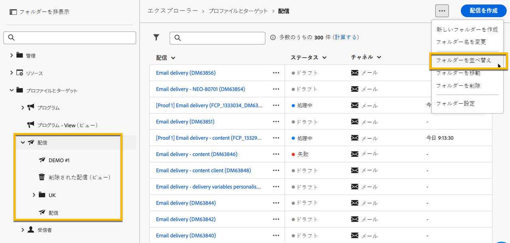
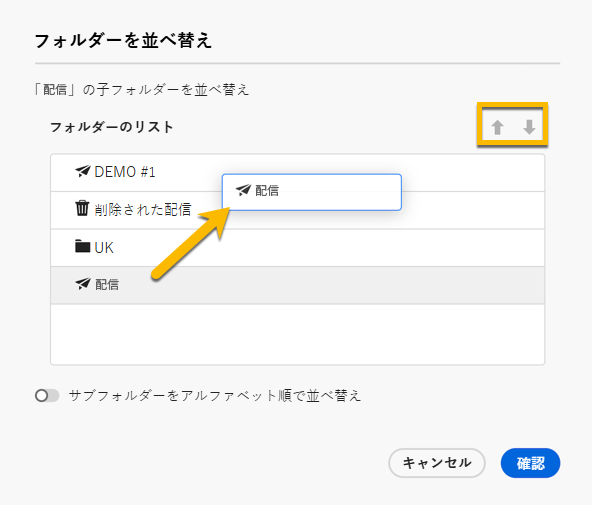

# フォルダーの操作 {#folders}

>[!CONTEXTUALHELP]
>id="acw_folder_properties"
>title="フォルダーのプロパティ"
>abstract="フォルダーのプロパティ"

>[!CONTEXTUALHELP]
>id="acw_folder_security"
>title="フォルダーのセキュリティ"
>abstract="フォルダーのセキュリティ"

>[!CONTEXTUALHELP]
>id="acw_folder_restrictions"
>title="フォルダーの制限"
>abstract="フォルダーの制限"

>[!CONTEXTUALHELP]
>id="acw_folder_schedule"
>title="フォルダーのスケジュール"
>abstract="フォルダーのスケジュール"

## フォルダーについて {#about-folders}

フォルダーは、コンポーネントとデータを整理できる Adobe Campaign のオブジェクトです。

ナビゲーションツリーで、フォルダーの作成、名前変更、並べ替え、移動を行うことができます。また、権限に基づいて削除することもできます。

{zoomable="yes"}

フォルダータイプを設定できます。例えば、配信のフォルダーなどです。 フォルダーアイコンは、タイプに応じて変わります。

## 新しいフォルダーの作成 {#create-a-folder}

Adobe Campaign web UI で新しいフォルダーを作成するには、次の手順に従います。

1. **[!UICONTROL エクスプローラー]** で、新規フォルダーを作成するフォルダーに移動します。 **[!UICONTROL ...]** メニューで、「**[!UICONTROL 新規フォルダーを作成]**」を選択します。

{zoomable="yes"}

新しいフォルダーを作成すると、フォルダータイプはデフォルトで親フォルダーのタイプになります。 この例では、**[!UICONTROL 配信]** フォルダーにフォルダーを作成します。

{zoomable="yes"}

1. 必要に応じてフォルダータイプアイコンをクリックしてフォルダータイプを変更し、表示されるリストから目的のタイプを選択します（下図を参照）。

{zoomable="yes"}

「**[!UICONTROL 確認]**」ボタンをクリックして、フォルダータイプを設定します。

特定のタイプのないフォルダーを作成する場合は、「**[!UICONTROL 汎用フォルダー]**」タイプを選択します。

また、[Adobe Campaign コンソールでフォルダーを作成および管理](https://experienceleague.adobe.com/ja/docs/campaign/campaign-v8/config/configuration/folders-and-views)することもできます。

## フォルダーを並べ替え {#reorder-folders}

必要に応じて、フォルダーを並べ替えることができます。 これを行うには、以下に示すように、「**[!UICONTROL フォルダーの並べ替え]**」をクリックします。

この例では、「**配信** フォルダーには 4 つのサブフォルダーが含まれています。

{zoomable="yes"}

フォルダーの順序は、**ドラッグ&amp;ドロップ** または **上下の矢印** を使用して変更できます。

{zoomable="yes"}

## フォルダーの削除 {#delete-a-folder}

>[!CAUTION]
>
>フォルダーを削除すると、そのフォルダーに保存されているすべてのデータも削除されます。

フォルダーを削除するには、**[!UICONTROL エクスプローラー]** ツリーでそのフォルダーを選択し、「**[!UICONTROL ...]**」メニューをクリックします。 「**[!UICONTROL フォルダーを削除]**」を選択します。

{zoomable="yes"}

## フォルダー内の値の配分 {#distribution-values-folder}

値の配分は、テーブル内の列内の値の割合を理解するのに役立ちます。

フォルダー内の値の配分を表示するには、以下の説明に従って操作を進めます。

例えば、配信の中の「**チャネル**」列の値の分布を知りたいとします。

この情報を取得するには、**[!UICONTROL 配信]** フォルダーに移動し、「**[!UICONTROL 列を設定]**」アイコンをクリックします。

**[!UICONTROL 列を設定]** ウィンドウで、分析する列に関連する **[!UICONTROL 情報]** アイコンをクリックします。 次に、「**[!UICONTROL 値の配分]**」ボタンをクリックします。

{zoomable="yes"}

**[!UICONTROL チャネル]** 列に値の割合が表示されます。

{zoomable="yes"}

>[!NOTE]
>
>多数の値を持つ列の場合は、最初の 20 個の値のみが表示されます。 通知 **[!UICONTROL 部分読み込み]** が表示されます。

また、リンクの値の配分を表示することもできます。

属性リストで、以下に示すように、目的のリンクの横にある「**+**」ボタンをクリックします。これにより、リンクが&#x200B;**[!UICONTROL 出力列]**&#x200B;に追加されます。**[!UICONTROL 情報]** アイコンにアクセスして、値の分布を確認できるようになりました。 **[!UICONTROL 出力列]** にリンクを保持しない場合は、「**[!UICONTROL キャンセル]**」ボタンをクリックします。

{zoomable="yes"}

また、クエリモデラーで値の分布を表示することもできます。 [詳しくは、こちらを参照してください](../query/build-query.md#distribution-of-values-in-a-query)。

### 値のフィルタリング {#filter-values}

「値の配分」ウィンドウで **[!UICONTROL 詳細フィルター]** を使用すると、指定した条件に基づいて結果をフィルタリングできます。

上記の配信リストの例では、チャネルごとの配信を表示していますが、これをフィルタリングして、ステータスが **完了** の配信のみを表示することができます。

{zoomable="yes"}