<?xml version="1.0" encoding="UTF-8"?>
<xliff xmlns="urn:oasis:names:tc:xliff:document:1.2" xmlns:okp="okapi-framework:xliff-extensions" xmlns:its="http://www.w3.org/2005/11/its" xmlns:itsxlf="http://www.w3.org/ns/its-xliff/" version="1.2" its:version="2.0">
<file original="help/v8/get-started/work-with-folders.md.mdsc" source-language="en-US" target-language="en-XX" datatype="x-text/markdown">
<body>
<trans-unit id="tu22" xml:space="preserve">
<source xml:lang="en-US">https://experienceleague.adobe.com/docs/campaign/campaign-v8/permissions/manage-permissions.html?lang=ja#use-named-rights</source>
<target xml:lang="en-XX">https://experienceleague.adobe.com/docs/campaign/campaign-v8/permissions/manage-permissions.html?lang=ja#use-named-rights</target>
</trans-unit>
<trans-unit id="tu34" xml:space="preserve">
<source xml:lang="en-US">https://experienceleague.adobe.com/en/docs/campaign/campaign-v8/config/configuration/folders-and-views</source>
<target xml:lang="en-XX">https://experienceleague.adobe.com/ja/docs/campaign/campaign-v8/config/configuration/folders-and-views</target>
</trans-unit>
<trans-unit id="tu1" restype="x-YAML_METADATA_HEADER_VALUE" xml:space="preserve">
<source xml:lang="en-US">Work with Folders</source>
<target xml:lang="en-XX">フォルダーの操作</target>
</trans-unit>
<trans-unit id="tu2" restype="x-YAML_METADATA_HEADER_VALUE" xml:space="preserve">
<source xml:lang="en-US">Learn how to manage a folder in Adobe Campaign</source>
<target xml:lang="en-XX">Adobe Campaign でフォルダーを管理する方法について説明します</target>
</trans-unit>
<trans-unit id="tu3" xml:space="preserve">
<source xml:lang="en-US">Work with folders</source>
<target xml:lang="en-XX">フォルダーの操作</target>
</trans-unit>
<trans-unit id="tu4" xml:space="preserve">
<source xml:lang="en-US">Folder properties</source>
<target xml:lang="en-XX">フォルダーのプロパティ</target>
</trans-unit>
<trans-unit id="tu5" xml:space="preserve">
<source xml:lang="en-US">Folder properties</source>
<target xml:lang="en-XX">フォルダーのプロパティ</target>
</trans-unit>
<trans-unit id="tu6" xml:space="preserve">
<source xml:lang="en-US">Folder security</source>
<target xml:lang="en-XX">フォルダーのセキュリティ</target>
</trans-unit>
<trans-unit id="tu7" xml:space="preserve">
<source xml:lang="en-US">Folder security</source>
<target xml:lang="en-XX">フォルダーのセキュリティ</target>
</trans-unit>
<trans-unit id="tu8" xml:space="preserve">
<source xml:lang="en-US">Folder schedule</source>
<target xml:lang="en-XX">フォルダーのスケジュール</target>
</trans-unit>
<trans-unit id="tu9" xml:space="preserve">
<source xml:lang="en-US">Folder schedule</source>
<target xml:lang="en-XX">フォルダーのスケジュール</target>
</trans-unit>
<trans-unit id="tu10" xml:space="preserve">
<source xml:lang="en-US">About folders</source>
<target xml:lang="en-XX">フォルダーについて</target>
</trans-unit>
<trans-unit id="tu11" xml:space="preserve">
<source xml:lang="en-US">Folders are objects in Adobe Campaign that allow you to organize your components and data.</source>
<target xml:lang="en-XX">フォルダーは、コンポーネントとデータを整理できる Adobe Campaign のオブジェクトです。</target>
</trans-unit>
<trans-unit id="tu12" xml:space="preserve">
<source xml:lang="en-US">You can create, rename, reorder, and move folders in the navigation tree. You can also delete them based on your rights.</source>
<target xml:lang="en-XX">ナビゲーションツリーで、フォルダーの作成、名前変更、並べ替え、移動を行うことができます。 また、権限に基づいて削除することもできます。</target>
</trans-unit>
<trans-unit id="tu13" xml:space="preserve">
<source xml:lang="en-US"><ph id="1" ctype="x-IMAGE">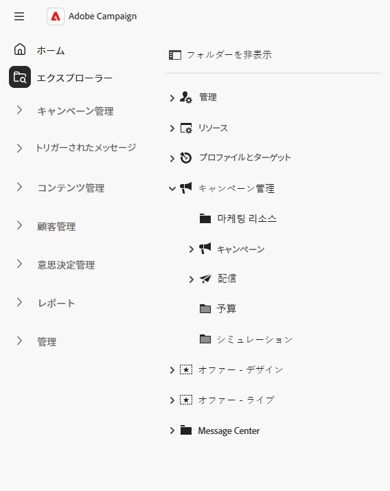{zoomable="yes"}</ph></source>
<target xml:lang="en-XX"><ph id="1" ctype="x-IMAGE">{zoomable="yes"}</ph></target>
</trans-unit>
<trans-unit id="tu14" xml:space="preserve">
<source xml:lang="en-US">You can set up a folder type. For example, a folder of deliveries. The folder icon changes according to its type.</source>
<target xml:lang="en-XX">フォルダータイプを設定できます。 例：配信のフォルダー。 フォルダーのアイコンは、タイプに応じて変わります。</target>
</trans-unit>
<trans-unit id="tu15" xml:space="preserve">
<source xml:lang="en-US">Folder restrictions</source>
<target xml:lang="en-XX">フォルダーの制限</target>
</trans-unit>
<trans-unit id="tu16" xml:space="preserve">
<source xml:lang="en-US">The folders Objects created automatically and Technical workflows are restricted, and cannot be viewed on the left side panel.</source>
<target xml:lang="en-XX">自動的に作成されたオブジェクトフォルダーとテクニカルワークフローフォルダーは制限され、左側のサイドパネルには表示できません。</target>
</trans-unit>
<trans-unit id="tu17" xml:space="preserve">
<source xml:lang="en-US"><ph id="1" ctype="x-regxph" equiv-text="&lbrack;!IMPORTANT">[!IMPORTANT]</ph></source>
<target xml:lang="en-XX"><ph id="1" ctype="x-regxph" equiv-text="&lbrack;!IMPORTANT">[!IMPORTANT]</ph></target>
</trans-unit>
<trans-unit id="tu18" xml:space="preserve">
<source xml:lang="en-US">The folders <ph id="1" ctype="x-STRONG_EMPHASIS">**[!UICONTROL </ph>Objects created automatically<ph id="3" ctype="x-LINK_REF">]**</ph> and <ph id="5" ctype="x-STRONG_EMPHASIS">**[!UICONTROL </ph>Technical workflows<ph id="7" ctype="x-LINK_REF">]**</ph> are restricted, and cannot be viewed on the left side panel.</source>
<target xml:lang="en-XX"><ph id="1" ctype="x-STRONG_EMPHASIS">**[!UICONTROL </ph>自動的に作成されたオブジェクト<ph id="3" ctype="x-LINK_REF">]**</ph>フォルダーと<ph id="5" ctype="x-STRONG_EMPHASIS">**[!UICONTROL </ph>テクニカルワークフロー<ph id="7" ctype="x-LINK_REF">]**</ph>フォルダーは制限され、左側のサイドパネルには表示できません。</target>
</trans-unit>
<trans-unit id="tu19" xml:space="preserve">
<source xml:lang="en-US">The actions available to you on a folder depend on the rights you have been granted on it. The <ph id="1" ctype="x-STRONG_EMPHASIS">**[!UICONTROL </ph>Folder settings<ph id="3" ctype="x-LINK_REF">]**</ph> dialog may open in <ph id="5" ctype="x-STRONG_EMPHASIS">**</ph>read-only mode<ph id="6" ctype="x-STRONG_EMPHASIS">**</ph>, and some actions or sections may not be available, depending on your rights.</source>
<target xml:lang="en-XX">フォルダーに対して実行できるアクションは、そのフォルダーに対して付与されている権限によって異なります。保有している権限によっては、<ph id="1" ctype="x-STRONG_EMPHASIS">**[!UICONTROL </ph>フォルダー設定<ph id="3" ctype="x-LINK_REF">]**</ph>ダイアログが<ph id="5" ctype="x-STRONG_EMPHASIS">**</ph>読み取り専用モード<ph id="6" ctype="x-STRONG_EMPHASIS">**</ph>で開き、一部のアクションや項目が使用できない場合があります。</target>
</trans-unit>
<trans-unit id="tu20" xml:space="preserve">
<source xml:lang="en-US">Contact your administrator if you are missing rights on a folder. Refer to this <ph id="1" ctype="x-LINK">[</ph>section<ph id="2" ctype="x-LINK">](permissions.md#folder-permissions)</ph> to learn how folder permissions are managed.</source>
<target xml:lang="en-XX">フォルダーに対する権限が不足している場合は、管理者にお問い合わせください。フォルダー権限の管理方法について詳しくは、この<ph id="1" ctype="x-LINK">[</ph>節<ph id="2" ctype="x-LINK">](permissions.md#folder-permissions)</ph>を参照してください。</target>
</trans-unit>
<trans-unit id="tu21" xml:space="preserve">
<source xml:lang="en-US">Named rights such as <ph id="1" ctype="x-STRONG_EMPHASIS">**[!UICONTROL </ph>Insert Folders<ph id="3" ctype="x-LINK_REF">]**</ph>, <ph id="5" ctype="x-STRONG_EMPHASIS">**[!UICONTROL </ph>Edit Folders<ph id="7" ctype="x-LINK_REF">]**</ph>, and <ph id="9" ctype="x-STRONG_EMPHASIS">**[!UICONTROL </ph>Delete Folder<ph id="11" ctype="x-LINK_REF">]**</ph> also determine which folder actions are available to an operator. Refer to the <ph id="13" ctype="x-LINK">&lbrack;</ph>Campaign v8 documentation<ph id="14" ctype="x-LINK">[#$tu22]{target="_blank"}</ph>.</source>
<target xml:lang="en-XX"><ph id="1" ctype="x-STRONG_EMPHASIS">**[!UICONTROL </ph>フォルダーを挿入<ph id="3" ctype="x-LINK_REF">]**</ph>、<ph id="5" ctype="x-STRONG_EMPHASIS">**[!UICONTROL </ph>フォルダーを編集<ph id="7" ctype="x-LINK_REF">]**</ph>、<ph id="9" ctype="x-STRONG_EMPHASIS">**[!UICONTROL </ph>フォルダーを削除<ph id="11" ctype="x-LINK_REF">]**</ph>などのネームド権限も、オペレーターが使用できるフォルダーアクションを決定します。<ph id="13" ctype="x-LINK">&lbrack;</ph>Campaign v8 ドキュメント<ph id="14" ctype="x-LINK">[#$tu22]{target="_blank"}</ph>を参照してください。</target>
</trans-unit>
<trans-unit id="tu23" xml:space="preserve">
<source xml:lang="en-US">Create a new folder</source>
<target xml:lang="en-XX">新しいフォルダーの作成</target>
</trans-unit>
<trans-unit id="tu24" xml:space="preserve">
<source xml:lang="en-US">To create a new folder in Adobe Campaign Web UI, follow these steps:</source>
<target xml:lang="en-XX">Adobe Campaign web UI で新しいフォルダーを作成するには、次の手順に従います。</target>
</trans-unit>
<trans-unit id="tu25" xml:space="preserve">
<source xml:lang="en-US">In <ph id="1" ctype="x-STRONG_EMPHASIS">**[!UICONTROL </ph>Explorer<ph id="3" ctype="x-LINK_REF">]**</ph>, go to the folder where you want to create your new folder. Under the <ph id="5" ctype="x-STRONG_EMPHASIS">**[!UICONTROL </ph>...<ph id="7" ctype="x-LINK_REF">]**</ph> menu, select <ph id="9" ctype="x-STRONG_EMPHASIS">**[!UICONTROL </ph>Create new folder<ph id="11" ctype="x-LINK_REF">]**</ph>.</source>
<target xml:lang="en-XX"><ph id="1" ctype="x-STRONG_EMPHASIS">**[!UICONTROL </ph>エクスプローラー<ph id="3" ctype="x-LINK_REF">]**</ph>で、新しいフォルダーを作成するフォルダーに移動します。 <ph id="5" ctype="x-STRONG_EMPHASIS">**[!UICONTROL </ph>…<ph id="7" ctype="x-LINK_REF">]**</ph> メニューの下で、「<ph id="9" ctype="x-STRONG_EMPHASIS">**[!UICONTROL </ph>新しいフォルダーを作成<ph id="11" ctype="x-LINK_REF">]**</ph>」を選択します。</target>
</trans-unit>
<trans-unit id="tu26" xml:space="preserve">
<source xml:lang="en-US"><ph id="1" ctype="x-IMAGE">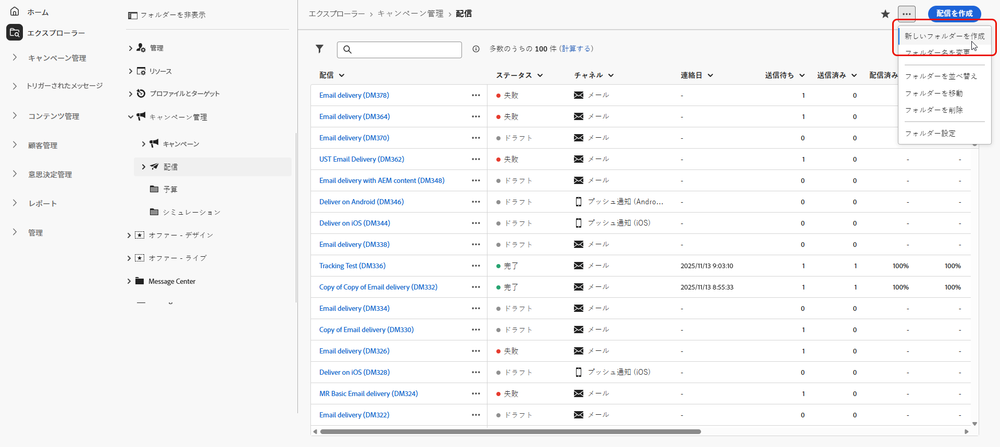{zoomable="yes"}</ph></source>
<target xml:lang="en-XX"><ph id="1" ctype="x-IMAGE">{zoomable="yes"}</ph></target>
</trans-unit>
<trans-unit id="tu27" xml:space="preserve">
<source xml:lang="en-US">When you create a new folder, the folder type defaults to the type of the parent folder. In this example, a folder is created in the <ph id="1" ctype="x-STRONG_EMPHASIS">**[!UICONTROL </ph>Deliveries<ph id="3" ctype="x-LINK_REF">]**</ph> folder.</source>
<target xml:lang="en-XX">新しいフォルダーを作成すると、フォルダータイプはデフォルトで親フォルダーのタイプになります。 この例では、<ph id="1" ctype="x-STRONG_EMPHASIS">**[!UICONTROL </ph>配信<ph id="3" ctype="x-LINK_REF">]**</ph>フォルダーにフォルダーを作成します。</target>
</trans-unit>
<trans-unit id="tu28" xml:space="preserve">
<source xml:lang="en-US"><ph id="1" ctype="x-IMAGE">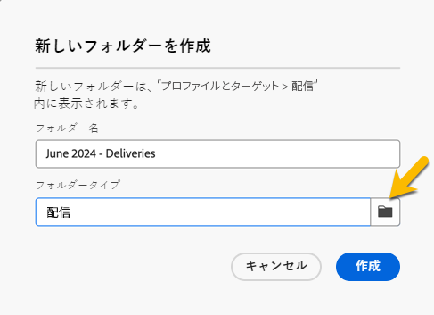{zoomable="yes"}</ph></source>
<target xml:lang="en-XX"><ph id="1" ctype="x-IMAGE">{zoomable="yes"}</ph></target>
</trans-unit>
<trans-unit id="tu29" xml:space="preserve">
<source xml:lang="en-US">Change the folder type by clicking on the folder type icon if needed, and select the desired type from the list presented, as shown below:</source>
<target xml:lang="en-XX">必要に応じてフォルダータイプアイコンをクリックしてフォルダータイプを変更し、以下に示すように、表示されるリストから目的のタイプを選択します。</target>
</trans-unit>
<trans-unit id="tu30" xml:space="preserve">
<source xml:lang="en-US"><ph id="1" ctype="x-IMAGE">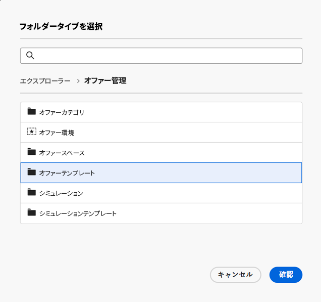{zoomable="yes"}</ph></source>
<target xml:lang="en-XX"><ph id="1" ctype="x-IMAGE">{zoomable="yes"}</ph></target>
</trans-unit>
<trans-unit id="tu31" xml:space="preserve">
<source xml:lang="en-US">Set up the folder type by clicking the <ph id="1" ctype="x-STRONG_EMPHASIS">**[!UICONTROL </ph>Confirm<ph id="3" ctype="x-LINK_REF">]**</ph> button.</source>
<target xml:lang="en-XX">「<ph id="1" ctype="x-STRONG_EMPHASIS">**[!UICONTROL </ph>確認<ph id="3" ctype="x-LINK_REF">]**</ph>」ボタンをクリックして、フォルダータイプを設定します。</target>
</trans-unit>
<trans-unit id="tu32" xml:space="preserve">
<source xml:lang="en-US">If you want to create a folder with no specific type, select the <ph id="1" ctype="x-STRONG_EMPHASIS">**[!UICONTROL </ph>Generic Folder<ph id="3" ctype="x-LINK_REF">]**</ph> type.</source>
<target xml:lang="en-XX">特定のタイプのないフォルダーを作成する場合は、「<ph id="1" ctype="x-STRONG_EMPHASIS">**[!UICONTROL </ph>汎用フォルダー<ph id="3" ctype="x-LINK_REF">]**</ph>」タイプを選択します。</target>
</trans-unit>
<trans-unit id="tu33" xml:space="preserve">
<source xml:lang="en-US">You can also <ph id="1" ctype="x-LINK">&lbrack;</ph>create and manage folders in Adobe Campaign console<ph id="2" ctype="x-LINK">[#$tu34]</ph>.</source>
<target xml:lang="en-XX">また、<ph id="1" ctype="x-LINK">&lbrack;</ph>Adobe Campaign コンソールでフォルダーを作成および管理<ph id="2" ctype="x-LINK">[#$tu34]</ph>することもできます。</target>
</trans-unit>
<trans-unit id="tu35" xml:space="preserve">
<source xml:lang="en-US">Reorder folders</source>
<target xml:lang="en-XX">フォルダーを並べ替え</target>
</trans-unit>
<trans-unit id="tu36" xml:space="preserve">
<source xml:lang="en-US">You can reorder folders based on your needs. To do so, click on <ph id="1" ctype="x-STRONG_EMPHASIS">**[!UICONTROL </ph>Reorder folders<ph id="3" ctype="x-LINK_REF">]**</ph>, as shown below.</source>
<target xml:lang="en-XX">必要に応じて、フォルダーを並べ替えることができます。 これを行うには、次に示すように、「<ph id="1" ctype="x-STRONG_EMPHASIS">**[!UICONTROL </ph>フォルダーを並べ替え<ph id="3" ctype="x-LINK_REF">]**</ph>」をクリックします。</target>
</trans-unit>
<trans-unit id="tu37" xml:space="preserve">
<source xml:lang="en-US">In this example, the <ph id="1" ctype="x-STRONG_EMPHASIS">**</ph>Deliveries<ph id="2" ctype="x-STRONG_EMPHASIS">**</ph> folder contains four subfolders.</source>
<target xml:lang="en-XX">この例では、<ph id="1" ctype="x-STRONG_EMPHASIS">**</ph>配信<ph id="2" ctype="x-STRONG_EMPHASIS">**</ph>フォルダーに 4 つのサブフォルダーが含まれています。</target>
</trans-unit>
<trans-unit id="tu38" xml:space="preserve">
<source xml:lang="en-US"><ph id="1" ctype="x-IMAGE">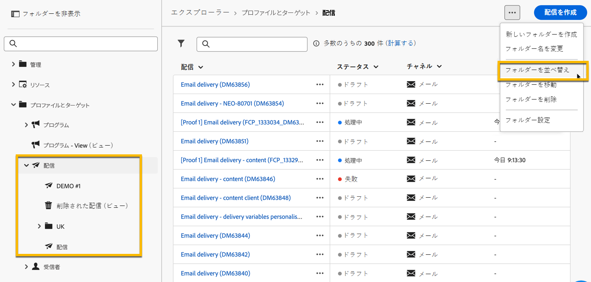{zoomable="yes"}</ph></source>
<target xml:lang="en-XX"><ph id="1" ctype="x-IMAGE">{zoomable="yes"}</ph></target>
</trans-unit>
<trans-unit id="tu39" xml:space="preserve">
<source xml:lang="en-US">You can change the order of folders either by <ph id="1" ctype="x-STRONG_EMPHASIS">**</ph>drag and drop<ph id="2" ctype="x-STRONG_EMPHASIS">**</ph> or by using <ph id="3" ctype="x-STRONG_EMPHASIS">**</ph>up and down arrows<ph id="4" ctype="x-STRONG_EMPHASIS">**</ph>.</source>
<target xml:lang="en-XX">フォルダーの順序は、<ph id="1" ctype="x-STRONG_EMPHASIS">**</ph>ドラッグ＆ドロップ<ph id="2" ctype="x-STRONG_EMPHASIS">**</ph>または<ph id="3" ctype="x-STRONG_EMPHASIS">**</ph>上下の矢印<ph id="4" ctype="x-STRONG_EMPHASIS">**</ph>を使用して変更できます。</target>
</trans-unit>
<trans-unit id="tu40" xml:space="preserve">
<source xml:lang="en-US"><ph id="1" ctype="x-IMAGE">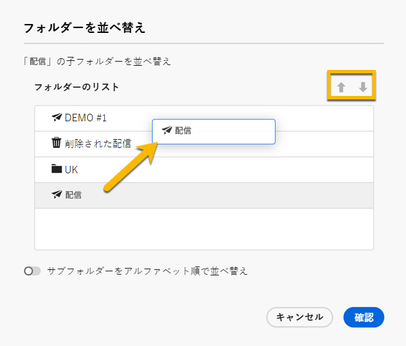{zoomable="yes"}</ph></source>
<target xml:lang="en-XX"><ph id="1" ctype="x-IMAGE">{zoomable="yes"}</ph></target>
</trans-unit>
<trans-unit id="tu41" xml:space="preserve">
<source xml:lang="en-US">Favorite folders</source>
<target xml:lang="en-XX">お気に入りフォルダー</target>
</trans-unit>
<trans-unit id="tu42" xml:space="preserve">
<source xml:lang="en-US">Favorites</source>
<target xml:lang="en-XX">お気に入り</target>
</trans-unit>
<trans-unit id="tu43" xml:space="preserve">
<source xml:lang="en-US">Your favorite folders will be displayed at the top of the left tab.</source>
<target xml:lang="en-XX">お気に入りフォルダーは、左側のタブの上部に表示されます。</target>
</trans-unit>
<trans-unit id="tu44" xml:space="preserve">
<source xml:lang="en-US">The folders that have been marked as "Favorite" will always be shown at the top of the left tab.</source>
<target xml:lang="en-XX">「お気に入り」としてマークされたフォルダーは、常に左側のタブの上部に表示されます。</target>
</trans-unit>
<trans-unit id="tu45" xml:space="preserve">
<source xml:lang="en-US">You can add folders as favorite by clicking on the star button at the top-right corner when viewing a folder.</source>
<target xml:lang="en-XX">フォルダーを表示する際に、右上隅にある星形ボタンをクリックすると、フォルダーをお気に入りとして追加できます。</target>
</trans-unit>
<trans-unit id="tu46" xml:space="preserve">
<source xml:lang="en-US"><ph id="1" ctype="x-IMAGE">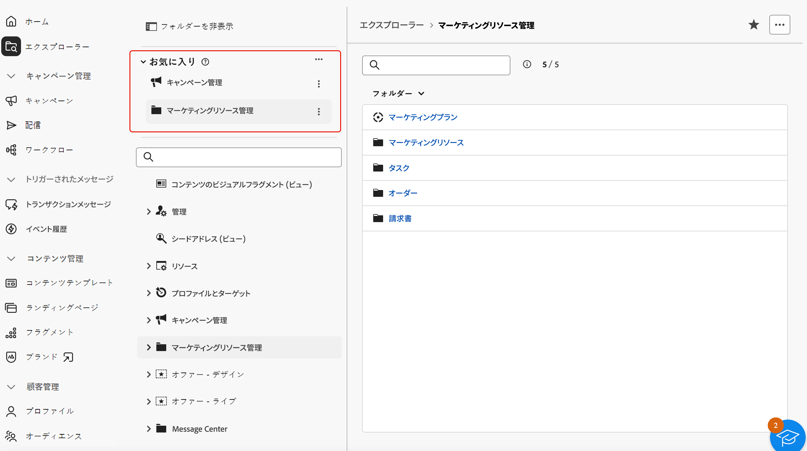{zoomable="yes"}</ph></source>
<target xml:lang="en-XX"><ph id="1" ctype="x-IMAGE">{zoomable="yes"}</ph></target>
</trans-unit>
<trans-unit id="tu47" xml:space="preserve">
<source xml:lang="en-US">Delete a folder</source>
<target xml:lang="en-XX">フォルダーの削除</target>
</trans-unit>
<trans-unit id="tu48" xml:space="preserve">
<source xml:lang="en-US"><ph id="1" ctype="x-regxph" equiv-text="&lbrack;!CAUTION">[!CAUTION]</ph></source>
<target xml:lang="en-XX"><ph id="1" ctype="x-regxph" equiv-text="&lbrack;!CAUTION">[!CAUTION]</ph></target>
</trans-unit>
<trans-unit id="tu49" xml:space="preserve">
<source xml:lang="en-US">When deleting a folder, all data stored in the folder is also deleted.</source>
<target xml:lang="en-XX">フォルダーを削除すると、そのフォルダーに保存されているすべてのデータも削除されます。</target>
</trans-unit>
<trans-unit id="tu50" xml:space="preserve">
<source xml:lang="en-US">To delete a folder, select it in your <ph id="1" ctype="x-STRONG_EMPHASIS">**[!UICONTROL </ph>Explorer<ph id="3" ctype="x-LINK_REF">]**</ph> tree, and click on the <ph id="5" ctype="x-STRONG_EMPHASIS">**[!UICONTROL </ph>...<ph id="7" ctype="x-LINK_REF">]**</ph> menu. Choose <ph id="9" ctype="x-STRONG_EMPHASIS">**[!UICONTROL </ph>Delete folder<ph id="11" ctype="x-LINK_REF">]**</ph>.</source>
<target xml:lang="en-XX">フォルダーを削除するには、<ph id="1" ctype="x-STRONG_EMPHASIS">**[!UICONTROL </ph>エクスプローラー<ph id="3" ctype="x-LINK_REF">]**</ph>ツリーでそのフォルダーを選択し、<ph id="5" ctype="x-STRONG_EMPHASIS">**[!UICONTROL </ph>...<ph id="7" ctype="x-LINK_REF">]**</ph> メニューをクリックします。 「<ph id="9" ctype="x-STRONG_EMPHASIS">**[!UICONTROL </ph>フォルダーを削除<ph id="11" ctype="x-LINK_REF">]**</ph>」を選択します。</target>
</trans-unit>
<trans-unit id="tu51" xml:space="preserve">
<source xml:lang="en-US"><ph id="1" ctype="x-IMAGE">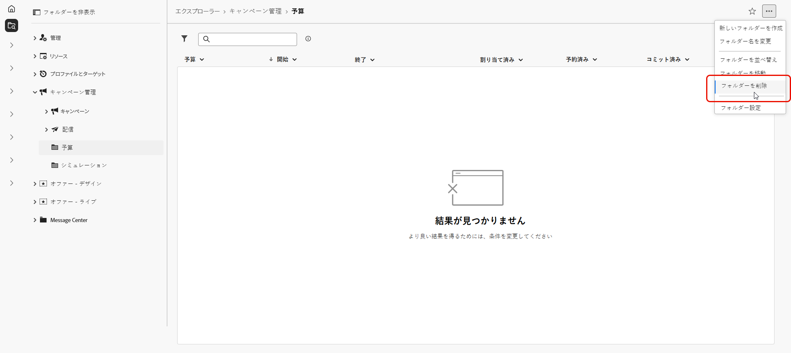{zoomable="yes"}</ph></source>
<target xml:lang="en-XX"><ph id="1" ctype="x-IMAGE">{zoomable="yes"}</ph></target>
</trans-unit>
<trans-unit id="tu52" xml:space="preserve">
<source xml:lang="en-US">Distribution of values in a folder</source>
<target xml:lang="en-XX">フォルダー内の値の配分</target>
</trans-unit>
<trans-unit id="tu53" xml:space="preserve">
<source xml:lang="en-US">The distribution of values helps you understand the percentage of a value in a column within a table.</source>
<target xml:lang="en-XX">値の配分は、テーブル内の列の値の割合を把握するのに役立ちます。</target>
</trans-unit>
<trans-unit id="tu54" xml:space="preserve">
<source xml:lang="en-US">To view the distribution of values in a folder, proceed as explained below.</source>
<target xml:lang="en-XX">フォルダー内の値の配分を把握するには、次の手順に従います。</target>
</trans-unit>
<trans-unit id="tu55" xml:space="preserve">
<source xml:lang="en-US">For example, among the deliveries, you may want to know the distribution of values in the <ph id="1" ctype="x-STRONG_EMPHASIS">**</ph>Channel<ph id="2" ctype="x-STRONG_EMPHASIS">**</ph> column.</source>
<target xml:lang="en-XX">例えば、配信間で、<ph id="1" ctype="x-STRONG_EMPHASIS">**</ph>チャネル<ph id="2" ctype="x-STRONG_EMPHASIS">**</ph>列の値の配分を把握するとします。</target>
</trans-unit>
<trans-unit id="tu56" xml:space="preserve">
<source xml:lang="en-US">To get this information, go to the <ph id="1" ctype="x-STRONG_EMPHASIS">**[!UICONTROL </ph>Deliveries<ph id="3" ctype="x-LINK_REF">]**</ph> folder and click the <ph id="5" ctype="x-STRONG_EMPHASIS">**[!UICONTROL </ph>Configure columns<ph id="7" ctype="x-LINK_REF">]**</ph> icon.</source>
<target xml:lang="en-XX">この情報を取得するには、<ph id="1" ctype="x-STRONG_EMPHASIS">**[!UICONTROL </ph>配信<ph id="3" ctype="x-LINK_REF">]**</ph>フォルダーに移動し、<ph id="5" ctype="x-STRONG_EMPHASIS">**[!UICONTROL </ph>列を設定<ph id="7" ctype="x-LINK_REF">]**</ph>アイコンをクリックします。</target>
</trans-unit>
<trans-unit id="tu57" xml:space="preserve">
<source xml:lang="en-US">In the <ph id="1" ctype="x-STRONG_EMPHASIS">**[!UICONTROL </ph>Configure columns<ph id="3" ctype="x-LINK_REF">]**</ph> window, click the <ph id="5" ctype="x-STRONG_EMPHASIS">**[!UICONTROL </ph>Information<ph id="7" ctype="x-LINK_REF">]**</ph> icon related to the column you want to analyze. Then, click on the <ph id="9" ctype="x-STRONG_EMPHASIS">**[!UICONTROL </ph>Distribution of values<ph id="11" ctype="x-LINK_REF">]**</ph> button.</source>
<target xml:lang="en-XX"><ph id="1" ctype="x-STRONG_EMPHASIS">**[!UICONTROL </ph>列を設定<ph id="3" ctype="x-LINK_REF">]**</ph>ウィンドウで、分析する列に関する<ph id="5" ctype="x-STRONG_EMPHASIS">**[!UICONTROL </ph>情報<ph id="7" ctype="x-LINK_REF">]**</ph>アイコンをクリックします。 次に、「<ph id="9" ctype="x-STRONG_EMPHASIS">**[!UICONTROL </ph>値の配分<ph id="11" ctype="x-LINK_REF">]**</ph>」ボタンをクリックします。</target>
</trans-unit>
<trans-unit id="tu58" xml:space="preserve">
<source xml:lang="en-US"><ph id="1" ctype="x-IMAGE">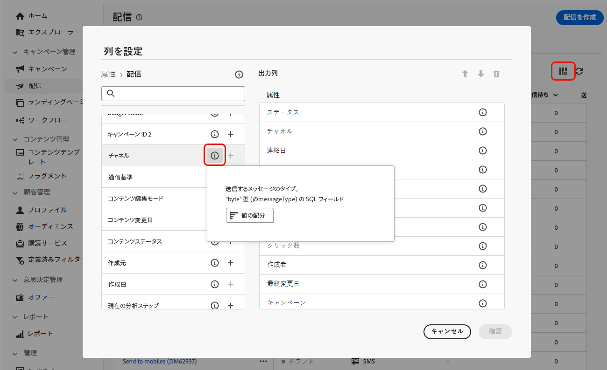{zoomable="yes"}</ph></source>
<target xml:lang="en-XX"><ph id="1" ctype="x-IMAGE">{zoomable="yes"}</ph></target>
</trans-unit>
<trans-unit id="tu59" xml:space="preserve">
<source xml:lang="en-US">You will see the percentage of values in the <ph id="1" ctype="x-STRONG_EMPHASIS">**[!UICONTROL </ph>Channel<ph id="3" ctype="x-LINK_REF">]**</ph> column.</source>
<target xml:lang="en-XX"><ph id="1" ctype="x-STRONG_EMPHASIS">**[!UICONTROL </ph>チャネル<ph id="3" ctype="x-LINK_REF">]**</ph>列の値の割合が表示されます。</target>
</trans-unit>
<trans-unit id="tu60" xml:space="preserve">
<source xml:lang="en-US"><ph id="1" ctype="x-IMAGE">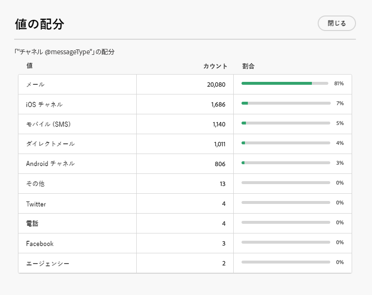{zoomable="yes"}</ph></source>
<target xml:lang="en-XX"><ph id="1" ctype="x-IMAGE">{zoomable="yes"}</ph></target>
</trans-unit>
<trans-unit id="tu61" xml:space="preserve">
<source xml:lang="en-US"><ph id="1" ctype="x-regxph" equiv-text="&lbrack;!NOTE">[!NOTE]</ph></source>
<target xml:lang="en-XX"><ph id="1" ctype="x-regxph" equiv-text="&lbrack;!NOTE">[!NOTE]</ph></target>
</trans-unit>
<trans-unit id="tu62" xml:space="preserve">
<source xml:lang="en-US">For columns with many values, only the first twenty values are displayed. A notification <ph id="1" ctype="x-STRONG_EMPHASIS">**[!UICONTROL </ph>Partial load<ph id="3" ctype="x-LINK_REF">]**</ph> warns you.</source>
<target xml:lang="en-XX">多くの値を持つ列の場合、最初の 20 個の値のみが表示されます。 <ph id="1" ctype="x-STRONG_EMPHASIS">**[!UICONTROL </ph>部分読み込み<ph id="3" ctype="x-LINK_REF">]**</ph>という警告通知が表示されます。</target>
</trans-unit>
<trans-unit id="tu63" xml:space="preserve">
<source xml:lang="en-US">You can also view the distribution of values for a link.</source>
<target xml:lang="en-XX">また、リンクの値の配分を表示することもできます。</target>
</trans-unit>
<trans-unit id="tu64" xml:space="preserve">
<source xml:lang="en-US">In the attributes list, click the <ph id="1" ctype="x-STRONG_EMPHASIS">**</ph>+<ph id="2" ctype="x-STRONG_EMPHASIS">**</ph> button next to the desired link, as shown below. This adds the link to the <ph id="3" ctype="x-STRONG_EMPHASIS">**[!UICONTROL </ph>Output columns<ph id="5" ctype="x-LINK_REF">]**</ph>. You can now access the <ph id="7" ctype="x-STRONG_EMPHASIS">**[!UICONTROL </ph>Information<ph id="9" ctype="x-LINK_REF">]**</ph> icon, allowing you to view the distribution of its values. If you do not want to keep the link in the <ph id="11" ctype="x-STRONG_EMPHASIS">**[!UICONTROL </ph>Output columns<ph id="13" ctype="x-LINK_REF">]**</ph>, click the <ph id="15" ctype="x-STRONG_EMPHASIS">**[!UICONTROL </ph>Cancel<ph id="17" ctype="x-LINK_REF">]**</ph> button.</source>
<target xml:lang="en-XX">属性リストで、以下に示すように、目的のリンクの横にある「<ph id="1" ctype="x-STRONG_EMPHASIS">**</ph>+<ph id="2" ctype="x-STRONG_EMPHASIS">**</ph>」ボタンをクリックします。 これにより、リンクが<ph id="3" ctype="x-STRONG_EMPHASIS">**[!UICONTROL </ph>出力列<ph id="5" ctype="x-LINK_REF">]**</ph>に追加されます。 <ph id="7" ctype="x-STRONG_EMPHASIS">**[!UICONTROL </ph>情報<ph id="9" ctype="x-LINK_REF">]**</ph>アイコンにアクセスして、値の配分を表示できるようになりました。 <ph id="11" ctype="x-STRONG_EMPHASIS">**[!UICONTROL </ph>出力列<ph id="13" ctype="x-LINK_REF">]**</ph>にリンクを保持しない場合は、「<ph id="15" ctype="x-STRONG_EMPHASIS">**[!UICONTROL </ph>キャンセル<ph id="17" ctype="x-LINK_REF">]**</ph>」ボタンをクリックします。</target>
</trans-unit>
<trans-unit id="tu65" xml:space="preserve">
<source xml:lang="en-US"><ph id="1" ctype="x-IMAGE">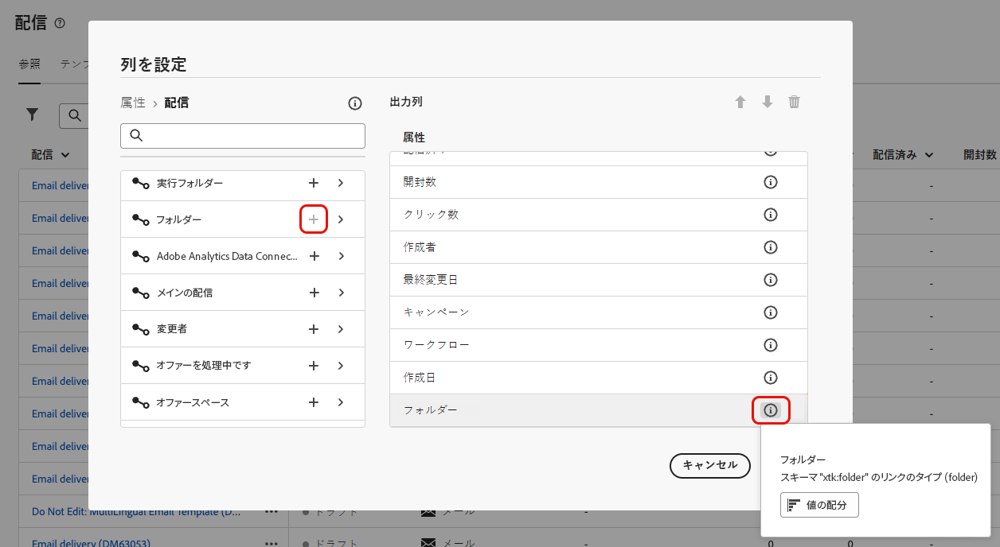{zoomable="yes"}</ph></source>
<target xml:lang="en-XX"><ph id="1" ctype="x-IMAGE">{zoomable="yes"}</ph></target>
</trans-unit>
<trans-unit id="tu66" xml:space="preserve">
<source xml:lang="en-US">It is also possible to view the distribution of values in a query modeler. <ph id="1" ctype="x-LINK">[</ph>Learn more here<ph id="2" ctype="x-LINK">](../query/build-query.md#distribution-of-values-in-a-query)</ph>.</source>
<target xml:lang="en-XX">クエリモデラーで値の配分を表示することもできます。 <ph id="1" ctype="x-LINK">[</ph>詳しくは、こちらを参照してください<ph id="2" ctype="x-LINK">](../query/build-query.md#distribution-of-values-in-a-query)</ph>。</target>
</trans-unit>
<trans-unit id="tu67" xml:space="preserve">
<source xml:lang="en-US">Filter the values</source>
<target xml:lang="en-XX">値のフィルタリング</target>
</trans-unit>
<trans-unit id="tu68" xml:space="preserve">
<source xml:lang="en-US">By using the <ph id="1" ctype="x-STRONG_EMPHASIS">**[!UICONTROL </ph>Advanced filters<ph id="3" ctype="x-LINK_REF">]**</ph> in the distribution of values window, you can filter results based on specified conditions.</source>
<target xml:lang="en-XX">値の配分ウィンドウの<ph id="1" ctype="x-STRONG_EMPHASIS">**[!UICONTROL </ph>詳細フィルター<ph id="3" ctype="x-LINK_REF">]**</ph>を使用すると、指定した条件に基づいて結果をフィルタリングできます。</target>
</trans-unit>
<trans-unit id="tu69" xml:space="preserve">
<source xml:lang="en-US">In the example of the delivery list above, which shows the distribution per channel, you can filter it to display only deliveries with a status of <ph id="1" ctype="x-STRONG_EMPHASIS">**</ph>Finished<ph id="2" ctype="x-STRONG_EMPHASIS">**</ph>.</source>
<target xml:lang="en-XX">チャネルごとの配分を示す上記の配信リストの例では、フィルタリングして、ステータスが<ph id="1" ctype="x-STRONG_EMPHASIS">**</ph>完了<ph id="2" ctype="x-STRONG_EMPHASIS">**</ph>の配信のみを表示できます。</target>
</trans-unit>
<trans-unit id="tu70" xml:space="preserve">
<source xml:lang="en-US"><ph id="1" ctype="x-IMAGE">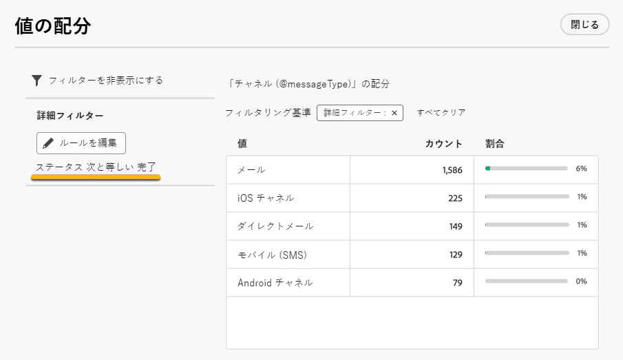{zoomable="yes"}</ph></source>
<target xml:lang="en-XX"><ph id="1" ctype="x-IMAGE">{zoomable="yes"}</ph></target>
</trans-unit>
</body>
</file>
</xliff>