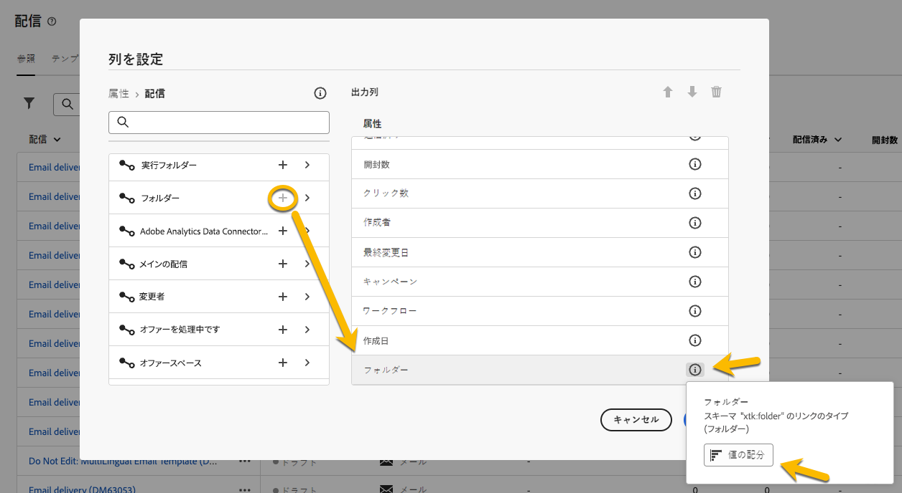

# フォルダーの操作 {#folders}

>[!CONTEXTUALHELP]
>id="acw_folder_properties"
>title="フォルダーのプロパティ"
>abstract="フォルダーのプロパティ"

>[!CONTEXTUALHELP]
>id="acw_folder_security"
>title="フォルダーのセキュリティ"
>abstract="フォルダーのセキュリティ"

>[!CONTEXTUALHELP]
>id="acw_folder_restrictions"
>title="フォルダーの制限"
>abstract="フォルダーの制限"

>[!CONTEXTUALHELP]
>id="acw_folder_schedule"
>title="フォルダーのスケジュール"
>abstract="フォルダーのスケジュール"

## フォルダーについて

フォルダーは、コンポーネントとデータを整理できる Adobe Campaign のオブジェクトです。

ナビゲーションツリーで、フォルダーの作成、名前変更、並べ替え、移動を行うことができます。また、権限に応じて削除することもできます。

{zoomable="yes"}

フォルダータイプを設定できます。例：配信のフォルダー。
フォルダーのアイコンは、このタイプに応じて変わります。

## 新しいフォルダーの作成

Adobe Campaign web UI で新しいフォルダーを作成するには、次の手順に従います。

1. **[!UICONTROL エクスプローラー]**で、新しいフォルダーを作成するフォルダーに移動します。
**[!UICONTROL …]** メニューの下に、**[!UICONTROL 新しいフォルダーを作成]**&#x200B;があります。

{zoomable="yes"}

新しいフォルダーを作成すると、デフォルトでは、フォルダータイプはフォルダーの親のタイプになります。
この例では、**[!UICONTROL 配信]**&#x200B;フォルダー内にフォルダーを作成します。

{zoomable="yes"}

1. 必要に応じて、フォルダータイプのアイコンをクリックしてフォルダーのタイプを変更し、以下のように表示されるリストで選択します。

{zoomable="yes"}

「**[!UICONTROL 確認]**」ボタンをクリックして、フォルダータイプを設定します。

特定のタイプのないフォルダーを作成する場合は、「**[!UICONTROL 汎用フォルダー]**」タイプを選択します。

また、[Adobe Campaign コンソールでフォルダーを作成および管理](https://experienceleague.adobe.com/ja/docs/campaign/campaign-v8/config/configuration/folders-and-views)することもできます。

## フォルダーの削除

>[!CAUTION]
>
>フォルダーを削除すると、そのフォルダーに保存されているすべてのデータも削除されます。

フォルダーを削除するには、**[!UICONTROL エクスプローラー]**&#x200B;ツリーでそのフォルダーを選択し、**[!UICONTROL ...]** メニューをクリックします。
「**[!UICONTROL フォルダーを削除]**」を選択します。

{zoomable="yes"}

## フォルダー内の値の配分 {#distribution-values-folder}

値の配分は、テーブル内の列内の値の割合を知るのに役立ちます。

フォルダー内の値の分布を調べるには、次の手順を実行します。

例えば、配信の中の **チャネル** 列の値の分布を知りたいとします。

この情報を取得するには、**[!UICONTROL 配信]** フォルダーに移動し、「**[!UICONTROL 列を設定]**」アイコンをクリックします。

**[!UICONTROL 列を設定]** ウィンドウで、確認したい列の **[!UICONTROL 情報]** アイコンをクリックします。 次に、「**[!UICONTROL 値の配分]** ボタンをクリックします。

{zoomable="yes"}

**[!UICONTROL チャネル]** 列の値のパーセンテージを取得します。

{zoomable="yes"}

>[!NOTE]
>
> 多数の値を持つ列の場合は、最初の 20 個の値のみが表示されます。 通知 **[!UICONTROL 部分読み込み]** が警告を表示します。

また、リンクの値を配分することもできます。

属性リストで、目的のリンクの横にある「**+**」ボタンをクリックします（下図を参照）。 これにより、リンクが **[!UICONTROL 出力列]** に追加されます。 **[!UICONTROL 情報]** アイコンが表示され、値の分布を確認できるようになりました。 **[!UICONTROL 出力列]** にリンクを保持しない場合は、必ず「**[!UICONTROL キャンセル]**」ボタンをクリックします。

{zoomable="yes"}

クエリモデラーで値の配分を行うこともできます。 [ 詳細はこちら ](../query/build-query.md#distribution-of-values-in-a-query)。
