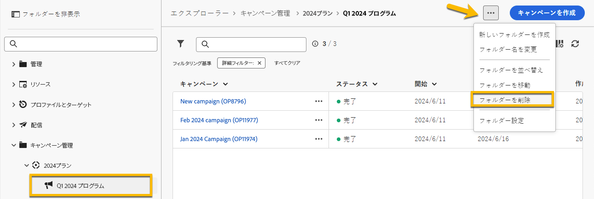
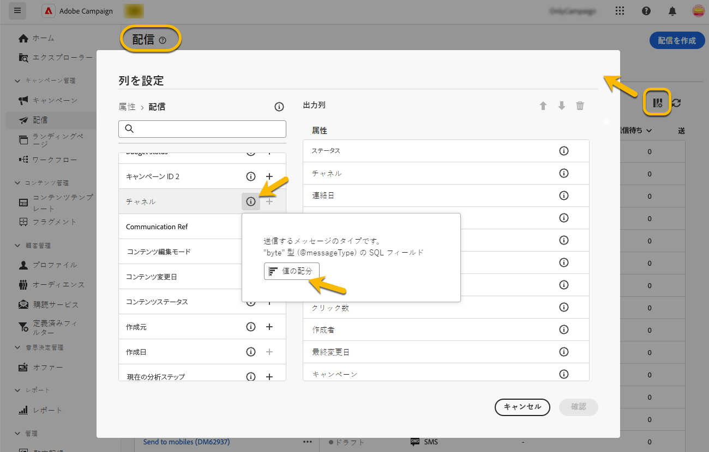
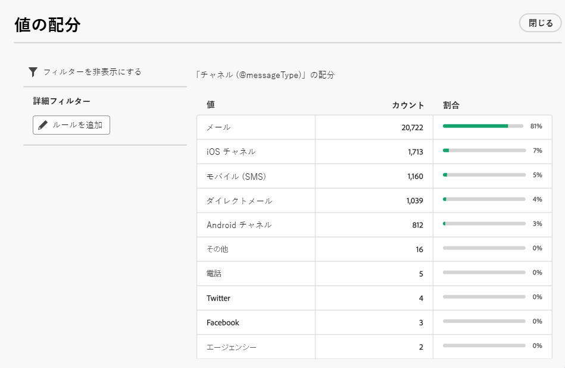

# フォルダーの操作 {#folders}

>[!CONTEXTUALHELP]
>id="acw_folder_properties"
>title="フォルダーのプロパティ"
>abstract="フォルダーのプロパティ"

>[!CONTEXTUALHELP]
>id="acw_folder_security"
>title="フォルダーのセキュリティ"
>abstract="フォルダーのセキュリティ"

>[!CONTEXTUALHELP]
>id="acw_folder_restrictions"
>title="フォルダーの制限"
>abstract="フォルダーの制限"

>[!CONTEXTUALHELP]
>id="acw_folder_schedule"
>title="フォルダーのスケジュール"
>abstract="フォルダーのスケジュール"

## フォルダーについて {#about-folders}

フォルダーは、コンポーネントとデータを整理できる Adobe Campaign のオブジェクトです。

ナビゲーションツリーで、フォルダーの作成、名前変更、並べ替え、移動を行うことができます。また、権限に応じて削除することもできます。

{zoomable="yes"}

フォルダータイプを設定できます。例：配信のフォルダー。
フォルダーのアイコンは、このタイプに応じて変わります。

## 新しいフォルダーの作成 {#create-a-folder}

Adobe Campaign web UI で新しいフォルダーを作成するには、次の手順に従います。

1. **[!UICONTROL エクスプローラー]**で、新しいフォルダーを作成するフォルダーに移動します。
**[!UICONTROL …]** メニューの下に、**[!UICONTROL 新しいフォルダーを作成]**&#x200B;があります。

{zoomable="yes"}

新しいフォルダーを作成する場合、デフォルトでは、フォルダータイプはフォルダーの親のタイプになります。 この例では、**[!UICONTROL 配信]**&#x200B;フォルダー内にフォルダーを作成します。

{zoomable="yes"}

1. 必要に応じて、フォルダータイプのアイコンをクリックしてフォルダーのタイプを変更し、以下のように表示されるリストで選択します。

{zoomable="yes"}

「**[!UICONTROL 確認]**」ボタンをクリックして、フォルダータイプを設定します。

特定のタイプのないフォルダーを作成する場合は、「**[!UICONTROL 汎用フォルダー]**」タイプを選択します。

また、[Adobe Campaign コンソールでフォルダーを作成および管理](https://experienceleague.adobe.com/ja/docs/campaign/campaign-v8/config/configuration/folders-and-views)することもできます。

## フォルダーの削除 {#delete-a-folder}

>[!CAUTION]
>
>フォルダーを削除すると、そのフォルダーに保存されているすべてのデータも削除されます。

フォルダーを削除するには、**[!UICONTROL エクスプローラー]**&#x200B;ツリーでそのフォルダーを選択し、**[!UICONTROL ...]** メニューをクリックします。
「**[!UICONTROL フォルダーを削除]**」を選択します。

{zoomable="yes"}

## フォルダー内の値の配分 {#distribution-values-folder}

値の配分は、テーブル内の列の値の割合を把握するのに役立ちます。

フォルダー内の値の配分を把握するには、次の手順に従います。

例えば、配信間で、**チャネル**&#x200B;列の値の配分を把握するとします。

この情報を取得するには、**[!UICONTROL 配信]**&#x200B;フォルダーに移動し、**[!UICONTROL 列を設定]**&#x200B;アイコンをクリックします。

**[!UICONTROL 列を設定]**&#x200B;ウィンドウで、把握する列の&#x200B;**[!UICONTROL 情報]**&#x200B;アイコンをクリックします。次に、「**[!UICONTROL 値の配分]**」ボタンをクリックします。

{zoomable="yes"}

**[!UICONTROL チャネル]**&#x200B;列の値の割合が表示されます。

{zoomable="yes"}

>[!NOTE]
>
> 多くの値を持つ列の場合、最初の 20 個の値のみが表示されます。**[!UICONTROL 部分読み込み]**&#x200B;という警告通知が表示されます。

また、リンクの値の配分を表示することもできます。

属性リストで、以下に示すように、目的のリンクの横にある「**+**」ボタンをクリックします。これにより、リンクが&#x200B;**[!UICONTROL 出力列]**&#x200B;に追加されます。**[!UICONTROL 情報]**&#x200B;アイコンが表示され、値の配分を確認できるようになりました。**[!UICONTROL 出力列]**&#x200B;にリンクを保持しない場合は、「**[!UICONTROL キャンセル]**」ボタンをクリックする必要があります。

{zoomable="yes"}

クエリモデラーで値の配分を表示することもできます。[詳しくは、こちらを参照してください](../query/build-query.md#distribution-of-values-in-a-query)。

### 値のフィルタリング {#filter-values}

「値の配分」ウィンドウで **[!UICONTROL 詳細フィルター]** を使用すると、指定した条件に基づいて結果をフィルタリングできます。

上記の配信リストの例では、チャネルごとの配信数を表示していますが、例えば、これをフィルタリングして、ステータスが **完了** の配信のみを表示することができます。

{zoomable="yes"}
