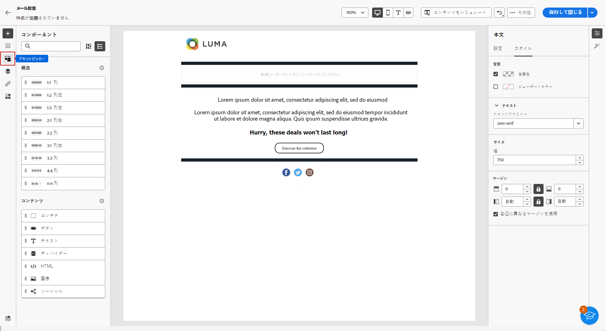

# [!DNL Adobe Experience Manager Assets as a Cloud Service] を使用したアセットの管理{#aem-assets}

## [!DNL Adobe Experience Manager Assets as a Cloud Service] の基本を学ぶ {#get-started-assets-essentials}

[!DNL Adobe Experience Manager Assets as a Cloud Service] は、クリエイティブワークフローを合理化し、デジタルアセットを一元管理してシームレスなエクスペリエンス配信を実現する、統合された共同プラットフォームです。これにより、承認された実稼動アセットの整理、タグ付け、取得が簡単になり、チーム間でのブランドの一貫性が確保されます。使いやすいインターフェイスを備えた [!DNL Assets as Cloud Service] を使用すると、アドビのクリエイティブアプリケーションと Experience Cloud アプリケーション内のアセットに即座にアクセスして共有できます。

詳しくは、[Adobe Experience Manager Assets as a Cloud Serviceドキュメント](https://experienceleague.adobe.com/docs/experience-manager-cloud-service/content/assets/home.html?lang=ja){target="_blank"}を参照してください。

## アセットのアップロードと挿入{#add-asset}

ファイルを [!DNL Assets as Cloud Service] にインポートするには、ファイルが格納されるフォルダーを参照するか作成します。 次に、メールコンテンツに挿入します。

アセットのアップロード方法について詳しくは、[Adobe Experience Manager Assets as a Cloud Service ドキュメント](https://experienceleague.adobe.com/docs/experience-manager-cloud-service/content/assets/assets-view/add-delete-assets-view.html?lang=ja){target="_blank"}を参照してください。

1. ホームページから詳細メニューにアクセスし、「[!DNL Experience Manager Assets]」を選択します。

   {zoomable="yes"}

1. **Assets管理** で **Assets** をクリックし、Adobe Campaignのアセットのリポジトリーを選択します。

1. 中央のセクションまたはツリービューでフォルダーをクリックして開きます。

   また、「**[!UICONTROL フォルダーを作成]**」をクリックして新規フォルダーを作成します。

1. 選択または作成したフォルダーで、「**[!UICONTROL Assetsを追加]**」をクリックして、新しいアセットをフォルダーにアップロードします。

   {zoomable="yes"}

1. **[!UICONTROL ファイルをアップロード]** メニューから「**[!UICONTROL 参照]** をクリックし、**[!UICONTROL ファイルを参照]** または **[!UICONTROL フォルダーを参照]** を選択します。

1. アップロードするファイルを選択します。完了したら、「**[!UICONTROL アップロード]**」をクリックします。

   {zoomable="yes"}

1. アセット管理詳細設定メニューにアクセスするには、アップロードしたアセットを選択します。

   アセットの管理について詳しくは、この [ ページ ](https://experienceleague.adobe.com/docs/experience-manager-cloud-service/content/assets/assets-view/manage-organize-assets-view.html?lang=ja) を参照してください。

   {zoomable="yes"}

1. Adobe Photoshop Expressでアセットをさらに編集するには、アセットをダブルクリックします。 次に、右側のメニューから、**[!UICONTROL 編集モード]**&#x200B;アイコンを選択します。[詳細情報](https://experienceleague.adobe.com/docs/experience-manager-cloud-service/content/assets/assets-view/edit-images-assets-view.html?lang=ja#edit-using-express){target="_blank"}.

1. [!DNL Adobe Campaign] から、メールデザイナーの左側のペインから&#x200B;**[!UICONTROL アセットピッカー]**&#x200B;メニューを選択します。

   {zoomable="yes"}

1. 以前に作成した&#x200B;**[!UICONTROL アセット]**&#x200B;フォルダーを選択します。検索バーでアセットやフォルダーを検索することもできます。

   必要に応じて、「**[!UICONTROL アセットを管理]** をクリックして、[!DNL Adobe Experience Manager Assets] Workspace に直接アクセスします。

1. アセットをメールコンテンツにドラッグ&amp;ドロップします。

   {zoomable="yes"}

1. 「**[!UICONTROL 設定]**」タブと「**[!UICONTROL スタイル]** タブを使用して、外部リンクやテキストを追加するなど、アセットをさらにカスタマイズします。 [ コンポーネント設定の詳細情報 ](../email/content-components.md)。

   {zoomable="yes"}