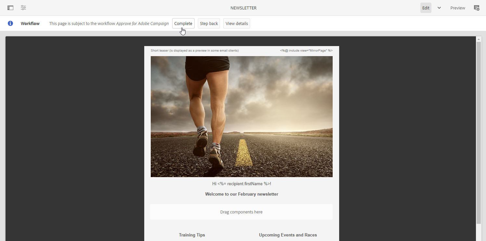
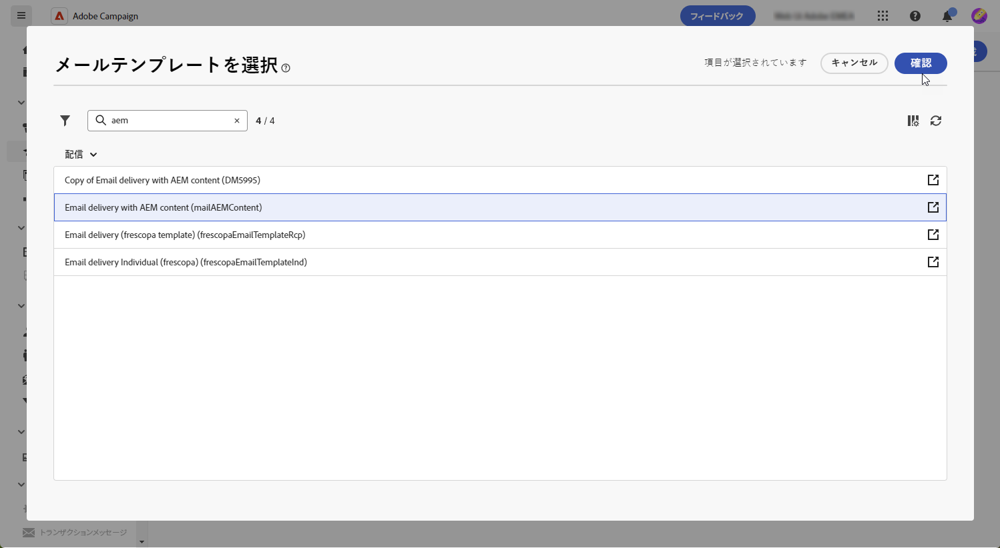

# [!DNL Adobe Experience Manager as a Cloud service] でのテンプレートを管理する{#aem-assets}

## [!DNL Adobe Experience Manager as a Cloud service] の基本を学ぶ{#create-aem}

Adobe Campaign Web インターフェイスと Adobe Experience Manager の統合により、Adobe Experience Manager プラットフォーム内で直接メール配信コンテンツとフォームを効率的に管理できます。

[詳しくは、Adobe Experience Manager as a Cloud Service を参照してください](https://experienceleague.adobe.com/docs/experience-manager-cloud-service/content/sites/authoring/getting-started/quick-start.html?lang=ja)

## [!DNL Adobe Experience Manager as a Cloud service] でテンプレートを作成する{#create-aem-template}

1. [!DNL Adobe Experience Manager] オーサーインスタンスに移動し、ページの左上隅にある「Adobe Experience」をクリックします。メニューから「**[!UICONTROL Sites]**」を選択します。

1. **[!UICONTROL キャンペーン／ブランド名／メイン領域／ページ名]**&#x200B;にアクセスします。

1. 「**[!UICONTROL 作成]**」をクリックし、ドロップダウンメニューから「**[!UICONTROL ページ]**」を選択します。

   

1. 「**[!UICONTROL Adobe Campaign メール]**」テンプレートを選択し、ニュースレターに名前を付けます。

   

1. Adobe Campaign のパーソナライゼーションフィールドなどのコンポーネントを追加してメールコンテンツをカスタマイズします。[詳細情報](https://experienceleague.adobe.com/docs/experience-manager-65/content/sites/authoring/aem-adobe-campaign/campaign.html?lang=ja#editing-email-content)

1. メールの準備が整ったら、**[!UICONTROL ページ情報]**&#x200B;メニューに移動し、「**[!UICONTROL ワークフローを開始]**」をクリックします。

   

1. 最初のドロップダウンから、ワークフローモデルとして「**[!UICONTROL Adobe Campaign を承認]**」を選択し、「**[!UICONTROL ワークフローを開始]**」をクリックします。

1. ページの上部に `This page is subject to the workflow Approve for Adobe Campaign` という免責事項が表示されます。免責事項の横にある「**[!UICONTROL 完了]**」をクリックしてレビューを確認し、「**[!UICONTROL OK]**」をクリックします。

   

1. もう一度「**[!UICONTROL 完了]**」をクリックし、**[!UICONTROL 次のステップ]**&#x200B;ドロップダウンで「**[!UICONTROL ニュースレターの承認]**」を選択します。

これでニュースレターが準備でき、Adobe Campaign で同期されました。

## Adobe Experience Manager as a Cloud Service テンプレートを読み込む{#aem-templates-perso}

Experience Manager テンプレートが Adobe Campaign Web でコンテンツテンプレートとして使用可能になると、パーソナライゼーションを含むメールに必要なコンテンツを特定して組み込むことができます。

1. Campaign Web で、**[!UICONTROL 配信]**&#x200B;メニューから、「**[!UICONTROL 配信を作成]**」をクリックします。

1. メールテンプレートウィンドウで、組み込みの「**[!UICONTROL AEM コンテンツでメール配信]**」テンプレートを選択します。

   

1. 配信の&#x200B;**[!UICONTROL ラベル]**&#x200B;を入力し、必要に応じて追加のオプションを設定します。

   * **[!UICONTROL 内部名]**：配信に一意の ID を割り当てます。

   * **[!UICONTROL フォルダー]**：配信を特定のフォルダーに保存します。

   * **[!UICONTROL 配信コード]**：このフィールドを使用すると、独自の命名規則に基づいて配信を整理できます。

   * **[!UICONTROL 説明]**：配信の説明を指定します。

   * **[!UICONTROL 特性]**：分類目的でメールの特性を指定します。

1. メールに&#x200B;**[!UICONTROL オーディエンス]**&#x200B;を定義します。[詳細情報](../email/create-email.md#define-audience)

1. 「**[!UICONTROL コンテンツを編集]**」をクリックします。

1. **[!UICONTROL コンテンツを編集]**&#x200B;メニューから、「**[!UICONTROL AEM コンテンツを選択]**」をクリックします。

   

1. AEM テンプレートを参照し、Campaign Web に読み込むテンプレートを選択します。

   

1. コンテンツは自動的には同期されません。 Adobe Experience Manager でテンプレートに直接変更を行った場合は、「**[!UICONTROL AEM コンテンツを更新]**」を選択するだけでテンプレートが最新バージョンになります。

1. Experience Manager と Campaign の間のリンクを削除するか、メールデザイナーで Experience Manager テンプレートをさらにカスタマイズするには、「**[!UICONTROL AEM コンテンツをリンク解除]**」をクリックします。

   

1. パーソナライズされたコンテンツを Experience Manager テンプレートに追加した場合は、「**[!UICONTROL コンテンツをシミュレート]**」をクリックして、テストプロファイルを使用してメッセージでの表示をプレビューします。

[詳しくは、プレビューとテストプロファイルを参照してください](../preview-test/preview-content.md)

1. メッセージプレビューを表示する際、パーソナライズされた要素は、選択したテストプロファイルからの対応するデータに自動的に置き換えられます。

   必要に応じて、「**[!UICONTROL テストプロファイルを管理]**」ボタンを使用して追加のテストプロファイルを追加できます。

配信の送信準備が整いました。
