# Adobe Experience Manager での多言語メールの作成 {#aem-multilingual}

Adobe Experience Managerとの連携により、Adobe Experience Managerの言語コピーを使用して、多言語メール配信を作成できます。 これにより、様々な言語でコンテンツのバリエーションを管理し、受信者の言語の好みにもとづいてパーソナライズされたメールを配信することができます。

## 前提条件 {#prerequisites}

多言語メール配信を作成する前に、次のことを確認してください。

* Adobe Campaign Web インターフェイス統合用に設定されたAdobe Experience Manager インスタンスへのアクセス。
* Adobe Experience Managerのコンテンツと、すでに作成および承認されている言語コピー。 言語コピーウィザードについて詳しくは、[Adobe Experience Manager ドキュメント ](https://experienceleague.adobe.com/en/docs/experience-manager-cloud-service/content/sites/administering/reusing-content/translation/wizard)を参照してください
* Adobe Experience Manager コンテンツを受信するように設定されたメール配信テンプレート。 [多言語モードを有効にする](#enable-multilingual) セクションで詳しく説明されている手順を参照してください。

## 多言語配信の作成

多言語メール配信を作成するには、まず配信設定で多言語オプションを有効にする必要があります。 使用可能な言語コピーが自動的に検出され、追加する言語コピーを選択できます。

### 多言語モードを有効にする {#enable-multilingual}

新しい配信を作成し、詳細設定で多言語オプションを有効にします。

1. **[!UICONTROL 配信]** メニューから、**[!UICONTROL 配信の作成]**&#x200B;をクリックします。

   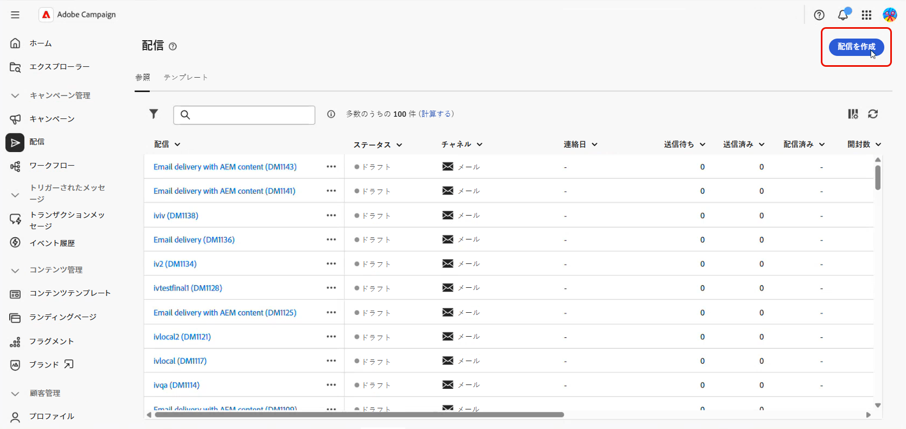

1. 「**[!UICONTROL AEM コンテンツを使用したメール配信]**」テンプレートを選択し、「**[!UICONTROL 配信を作成]**」をクリックします。

   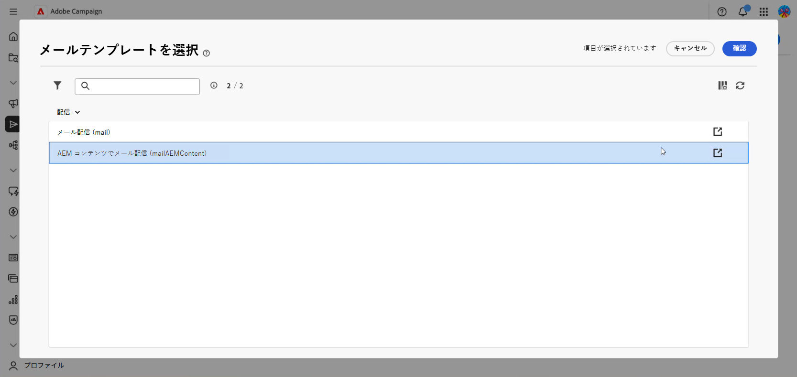

1. 配信のラベルを入力し、オーディエンスを設定します。 [詳細情報](../email/create-email.md)

1. 配信&#x200B;**[!UICONTROL 設定]**&#x200B;にアクセスし、**[!UICONTROL 詳細]** セクションに移動します。

1. **[!UICONTROL AEM多言語を有効にする]** オプションを有効にします。

   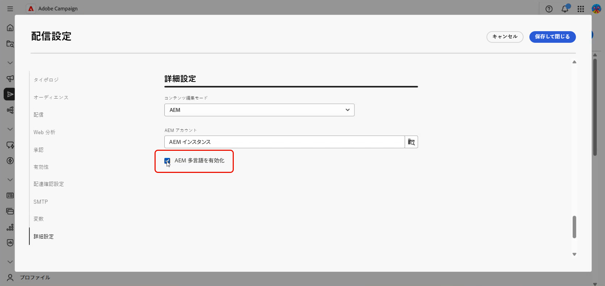

1. 次のことを確認します。

   * **[!UICONTROL コンテンツ編集モード]**&#x200B;は&#x200B;**[!UICONTROL AEM]**&#x200B;に設定されています。
   * 正しいAdobe Experience Manager **[!UICONTROL 外部アカウント]**&#x200B;が選択されています。

1. **[!UICONTROL 保存して閉じる]**&#x200B;をクリックします。

### コンテンツバリアントを作成 {#create-variants}

Adobe Experience Managerのコンテンツを選択し、配信に含める言語のバリエーションを選択します。

1. 「**[!UICONTROL コンテンツを編集]**」をクリックします。

1. 「**[!UICONTROL コンテンツバリアントを作成]**」を選択します。

   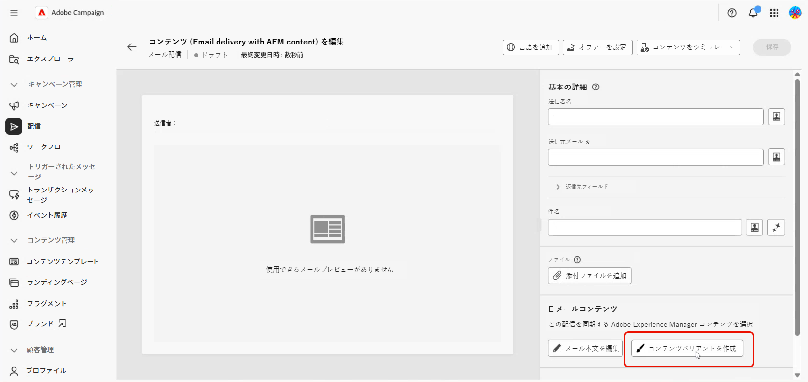

1. リストからAdobe Experience Manager コンテンツを選択します。

   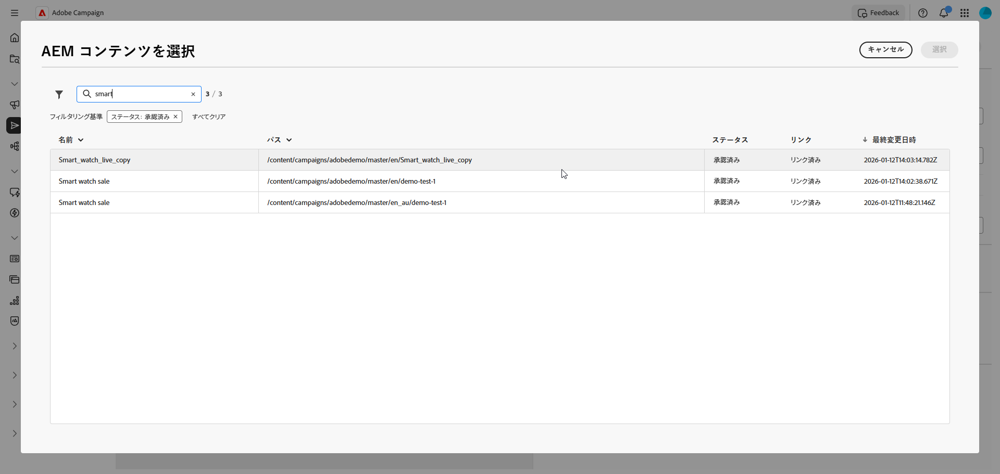

1. 選択したコンテンツ（親子関係）に関連付けられたすべての言語コピーが検出されます。例えば、Adobe Experience Manager コンテンツにフランス語、ドイツ語、イタリア語のバリエーションがある場合、すべてのバリエーションを選択できます。

   配信に含める言語のバリエーションを選択します。

   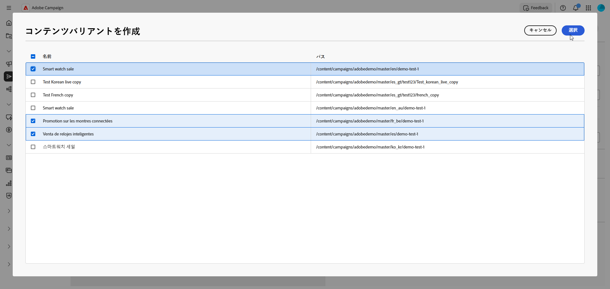

1. 「**[!UICONTROL 保存]**」をクリックします。

1. コンテンツエディターで言語のバリエーションを確認します。 各バリエーションを[個別に管理](#manage-variants)するか、[配信の送信](../monitor/prepare-send.md)に進むことができます。

   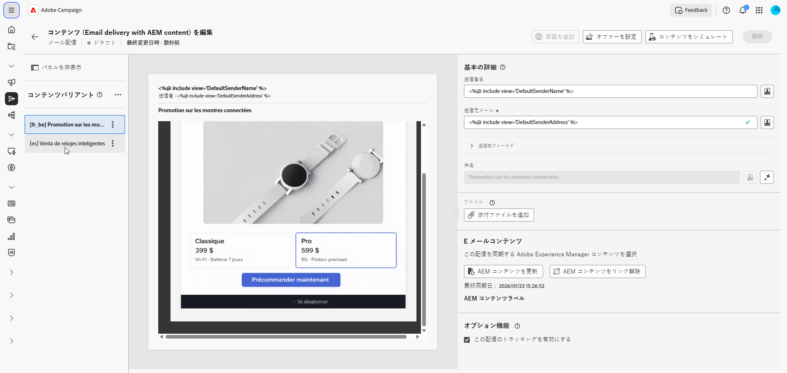

## 言語バリアントの管理 {#manage-variants}

コンテンツのバリエーションを作成したら、配信で直接管理できます。

1. デフォルトの言語を設定するには、選択したバリエーションの詳細メニューにアクセスし、**[!UICONTROL デフォルトとして設定]**&#x200B;を選択します。 デフォルトの言語は、プロファイルの言語設定が設定されていないか、使用可能なバリアントと一致しない場合に使用されます。

   「**[!UICONTROL 削除]**」をクリックして、配信からバリアントを削除します。

   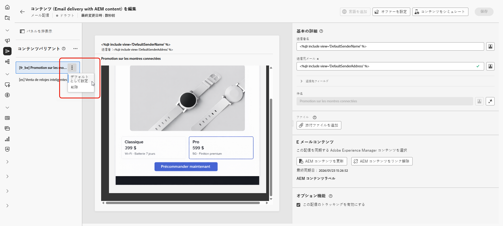

1. コンテンツバリアントの詳細メニューで、**[!UICONTROL ロケールの管理]**&#x200B;をクリックして、配信に他のロケールを追加します。

   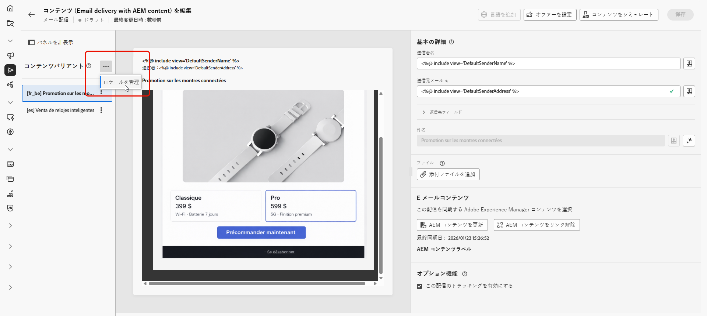

1. 言語コピーを追加してバリエーションを追加し、**[!UICONTROL 保存]**&#x200B;をクリックします。

   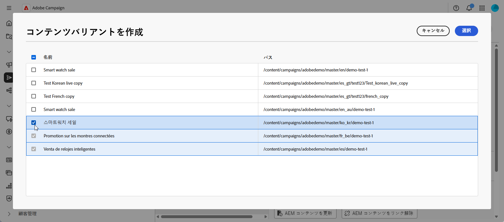

1. Adobe Experience Managerでコンテンツが更新された場合は、**[!UICONTROL AEM コンテンツを更新]**&#x200B;をクリックして、すべてのバリエーションを最新バージョンと同期します。

   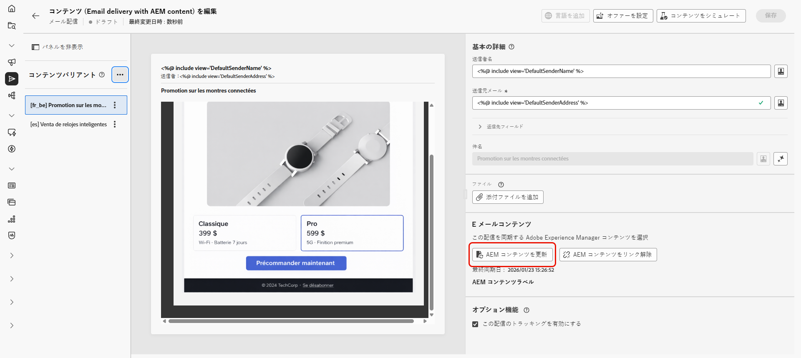

1. Campaignで直接コンテンツを編集する場合や、Adobe Experience Managerとのリンクを解除する場合は、**[!UICONTROL AEM コンテンツのリンクを解除]**&#x200B;をクリックします。

   >[!CAUTION]
   >
   >リンクを解除すると、Adobe Experience Managerからコンテンツを更新したり、新しいバリエーションを作成したりすることはできません。 コンテンツはAdobe Experience Managerから独立します。
