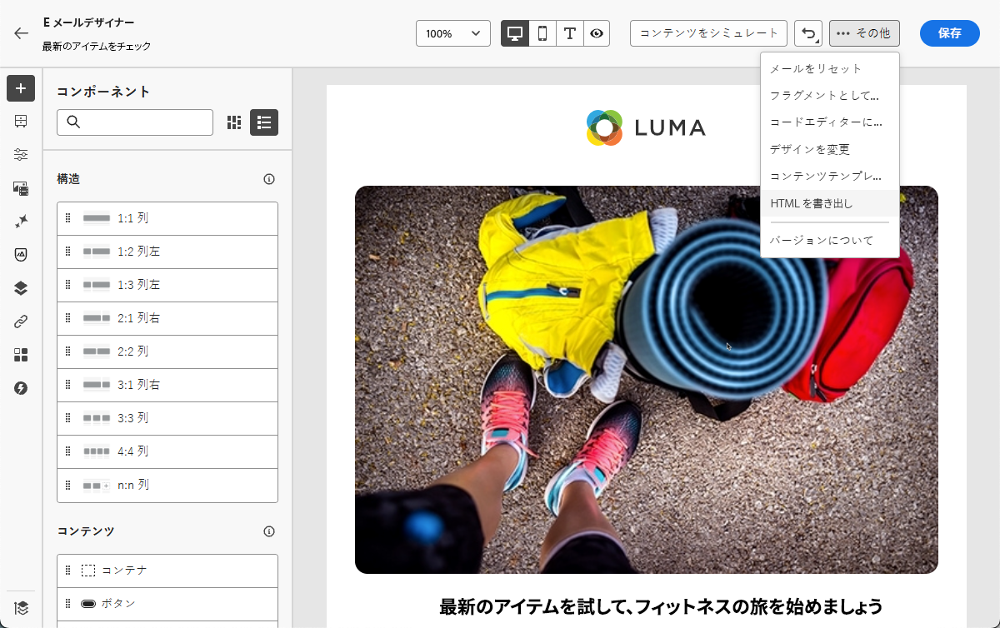
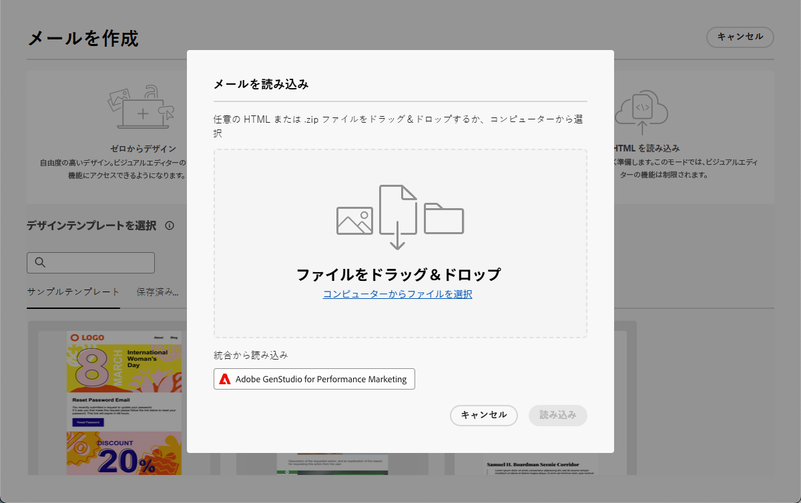
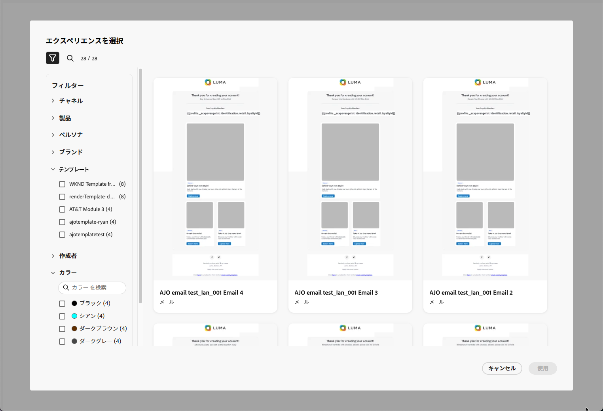
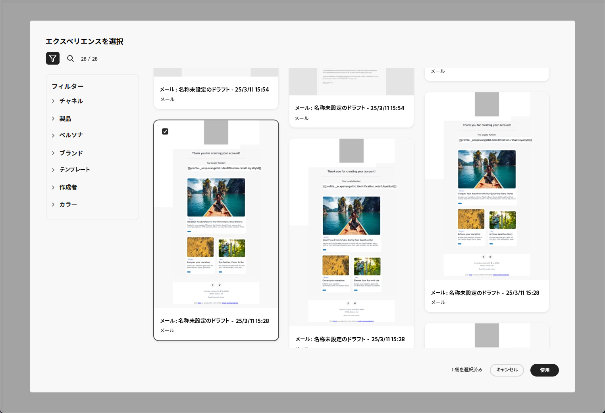
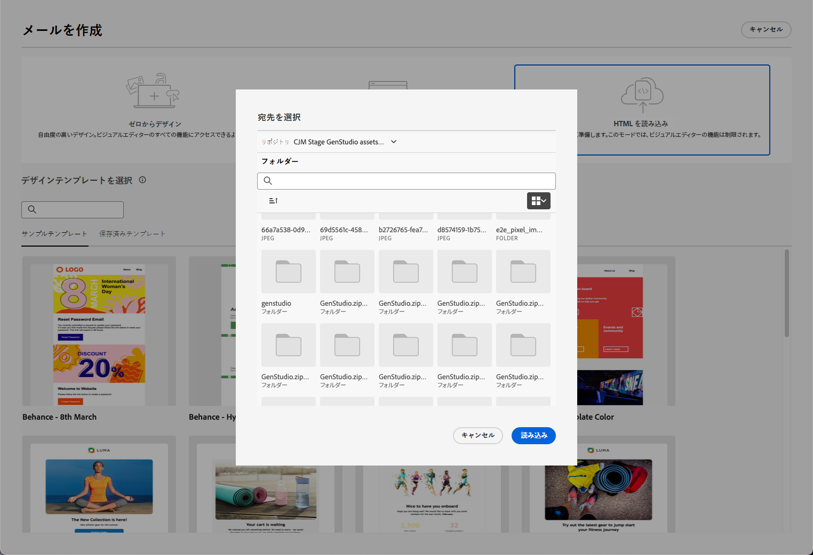
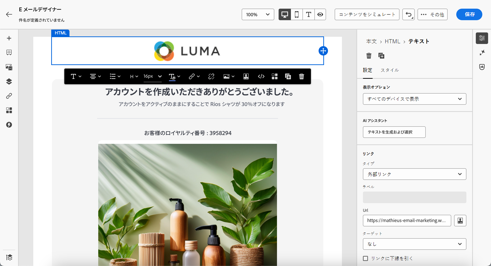

# GenStudio for Performance Marketing の操作 {#genstudio}

>[!CONTEXTUALHELP]
>id="ac_genstudio_button"
>title="GenStudio で作成したテンプレートの使用"
>abstract="GenStudio for Performance Marketing とのシームレスな統合により、Adobe AI テクノロジーで強化された GenStudio テンプレートを簡単に読み込むことができます。"

## GenStudio の基本を学ぶ {#gs-genstudio}

[Adobe GenStudio for Performance Marketing](https://experienceleague.adobe.com/ja/docs/genstudio-for-performance-marketing/user-guide/home){target="_blank"} は、マーケティングチームが独自の広告やメールを作成して、ブランド標準を遵守し、企業ポリシーに準拠した、効果的でパーソナライズされたマーケティングキャンペーンを推進できるようにする生成 AI ファーストのアプリケーションです。Adobe AI テクノロジーを活用することで、コンテンツの作成と管理の複雑さを簡素化し、クリエイターがイノベーションに焦点を当てることができるようにする包括的なツールスイートを提供します。

>[!AVAILABILITY]
>
>この機能は、メールチャネルでのみ使用できます。

マーケティング効率を高め、ブランドの一貫性を維持するために、[!DNL **GenStudio for Performance Marketing**] エクスペリエンスを [!DNL **Adobe Campaign**] とシームレスに統合できます。これにより、[!DNL Adobe Campaign] の高度なオーケストレーション機能と共に、[!DNL GenStudio] の AI を活用したコンテンツ作成を活用できます。

>[!INFO]
>
>詳しくは、この[概要](https://business.adobe.com/jp/products/genstudio-for-performance-marketing.html#watch-overview){target="_blank"}と [!DNL Adobe GenStudio for Performance Marketing] の[デモ](https://business.adobe.com/jp/products/genstudio-for-performance-marketing.html#demo){target="_blank"}を参照してください。

## Adobe Campaign での GenStudio 機能の使用 {#use-genstudio}

[!DNL GenStudio for Performance Marketing] と [!DNL Adobe Campaign] の統合により、会社のマーケターがより適切に連携してプロセスを効率化できます。

例えば、[!DNL Adobe Campaign] を使用してメールキャンペーンを開発および自動化するテクニカルマーケターは、[!DNL GenStudio] を使用してコンテンツを作成するパフォーマンスマーケターと共同作業できます。

この統合により、両方は連携して [!DNL GenStudio] のブランドに即したコンテンツを [!DNL Adobe Campaign] に簡単に統合し、特定の顧客セグメントをターゲットにしてセールスを推進する魅力的なメールを配信できます。

### Adobe Campaign から GenStudio への HTML テンプレートのエクスポート {#export-from-campaign-to-genstudio}

まず、ブランドのガイドラインを含む [!DNL Adobe Campaign] HTML テンプレートを [!DNL GenStudio for Performance Marketing] にエクスポートできます。 以下の手順に従います。

1. [!DNL Adobe Campaign] で、メールのコンテンツにアクセスします。[詳細情報](../email/create-email.md#create-content)

1. E メールデザイナーで、「**[!UICONTROL 詳細]**」ボタンから「**[!UICONTROL HTML をエクスポート]**」を選択します。

   {zoomable="yes"}

1. この HTML エクスポートテンプレートを [!DNL GenStudio for Performance Marketing] にアップロードします。<!--Make sure you detect the fields that the generative AI uses to insert content in order to create an actionable template.-->

   >[!NOTE]
   >
   >HTML テンプレートを [!DNL GenStudio] にアップロードする方法について詳しくは、[Adobe GenStudio for Performance Marketing ユーザーガイド](https://experienceleague.adobe.com/ja/docs/genstudio-for-performance-marketing/user-guide/content/templates/use-templates#templates-from-ajo-and-marketo){target="_blank"}の専用の節を参照してください。<!--GenStudio doc to be updated with Campaign-->

1. GenStudio では、このテンプレートを使用して、AI プロンプトを含む複数のメールのバリエーションを作成し、保存します。

   >[!NOTE]
   >
   >メールエクスペリエンスを作成する方法について詳しくは、GenStudio 専用の[節](https://experienceleague.adobe.com/ja/docs/genstudio-for-performance-marketing/user-guide/create/create-email-experience){target="_blank"}を参照してください。

### Adobe Campaign での GenStudio エクスペリエンスの活用 {#leverage-genstudio-experiences}

作成した [!DNL GenStudio] メールのバリエーションを [!DNL Adobe Campaign] にインポートして活用するには、次の手順に従います。

1. [!DNL Adobe Campaign] で、[メール配信を作成します](../email/create-email.md)。

1. メール配信ダッシュボードで、「**[!UICONTROL コンテンツを編集]**」ボタンをクリックします。[詳細情報](../email/create-email.md#create-content)

1. E メールデザイナーのホームページで、「**[!UICONTROL HTML をインポート]**」を選択し、「**[!UICONTROL Adobe GenStudio for Performance Marketing]**」ボタンをクリックします。

   {zoomable="yes"}

1. GenStudio エクスペリエンスを参照して、コンテンツの作成を開始します。製品、ペルソナ、ブランド、色など、複数の条件でエクスペリエンスをフィルタリングできます。

   <!--{zoomable="yes"}-->

1. エクスペリエンスを選択し、「**[!UICONTROL 使用]**」をクリックします。

   {zoomable="yes"}

1. GenStudio エクスペリエンスをインポートするフォルダーを選択します。

   {zoomable="yes"}

1. 選択したコンテンツが E メールデザイナーに表示されます。

   {zoomable="yes"}

   >[!NOTE]
   >
   >[ [!DNL Adobe Campaign]  テンプレートから作成](#export-from-ajo-to-genstudio)した GenStudio エクスペリエンスは、E メールデザイナーに直接インポートされます。[!DNL Adobe Campaign] テンプレートを使用せずに作成した GenStudio エクスペリエンスは、[互換性モード](../email/existing-content.md)にインポートされます。

   [メールコンテンツ編集ツール](../email/create-email-content.md)と[パーソナライゼーションフィールド](../personalization/personalize.md)を使用して、必要に応じてメールを編集します。コンテンツを保存します。

<!--Detail a use case with A/B testing to import other GenStudio variations and track how your tratments are performing.-->

<!--
## How-to video {#video}

Discover the process of exporting an email template from Adobe Campaign to GenStudio for Performance Marketing, crafting brand-compliant emails using the template in GenStudio, and importing them seamlessly back into Adobe Campaign.

>[!VIDEO](https://video.tv.adobe.com/v/3456038/?quality=12)
TO REPLACE WITH CAMPAIGN VIDEO WHEN/IF RELEASED
-->