# ランディングページの作成と公開 {#create-lp}

>[!CONTEXTUALHELP]
>id="acw_landingpages_menu"
>title="ランディングページの作成と管理"
>abstract="Adobe Campaign では、ランディングページを作成、デザイン、共有して、ビルトインテンプレートに基づいて、獲得、購読／購読解除およびブロックリストのユースケースを管理することで、オンライン web ページにユーザーを誘導できます。"

Campaign web ユーザーインターフェイスを使用すると、ランディングページの作成、デザインおよび公開できます。公開されたら、配信でフォームへのリンクを挿入できます。受信者がそのリンクをクリックすると、対応するランディングページに移動します。

[!DNL Adobe Campaign] には、**獲得**、**購読**、**登録解除**、**ブロックリスト**&#x200B;のユースケースを管理するための、4 つのテンプレートが付属しています。[詳細情報](lp-use-cases.md)

## ランディングページへのアクセス {#access-landing-pages}

ランディングページリストにアクセスするには、左側のメニューから&#x200B;**[!UICONTROL キャンペーン管理]**／**[!UICONTROL ランディングページ]**&#x200B;を選択します。

{zoomable="yes"}

**[!UICONTROL ランディングページ]**&#x200B;インベントリには、作成したすべての項目が表示されます。「**[!UICONTROL フィルターを表示]**」ボタンを使用してフィルタリングできます。

* 作成または変更した項目をフィルタリングできます。
* ドロップダウンリストを使用して結果を特定の[フォルダー](../get-started/permissions.md#folders)に制限したり、[クエリモデラー](../query/query-modeler-overview.md)を使用してルールを追加したりできます。

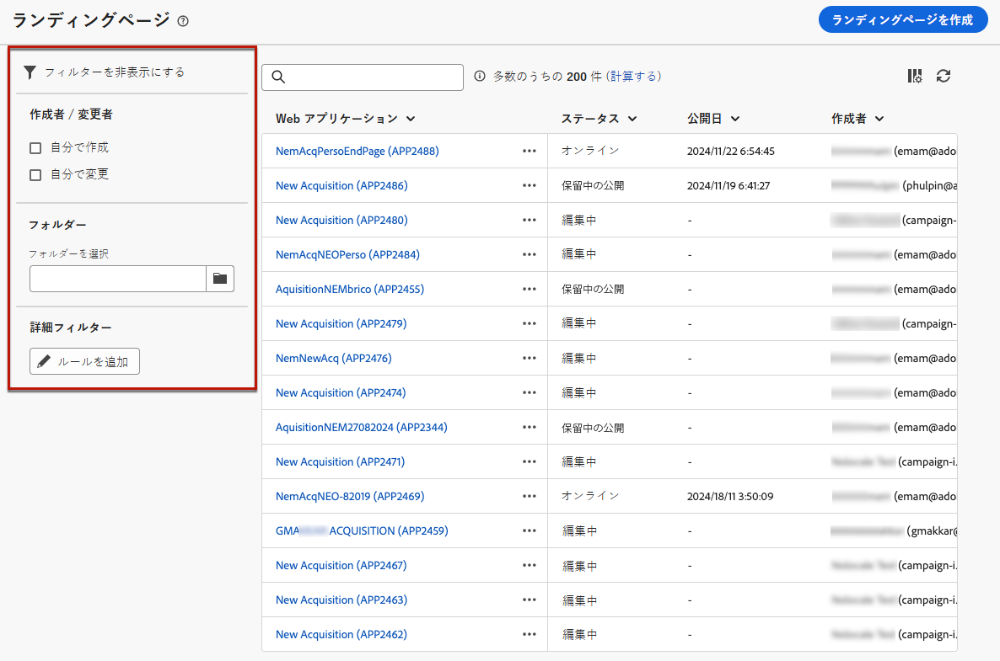{zoomable="yes"}

<!--From this list, you can access the [landing page Live report](../reports/lp-report-live.md) or [landing page Global report](../reports/lp-report-global.md) for published items.-->

>[!CAUTION]
>
>Campaign web ユーザーインターフェイスのクライアントコンソール（web フォーム）から作成したランディングページは、表示または編集できません。詳しくは、[Campaign コンソールドキュメント](https://experienceleague.adobe.com/docs/campaign/campaign-v8/content/webapps.html?lang=ja){target="_blank"}を参照してください。

<!--If you unpublish a landing page which is referenced in a message, the link to the landing page will be broken and an error page will be displayed. You cannot delete a published landing page. To delete it, you must first unpublish it.-->

ランディングページを複製または削除できます。ランディングページの横にある省略記号をクリックし、目的のアクションを選択します。

## ランディングページの作成 {#create-landing-page}

>[!CONTEXTUALHELP]
>id="acw_landingpages_properties"
>title="ランディングページのプロパティの定義"
>abstract="ラベルなどのプロパティフィールドに入力し、必要に応じてスキーマを変更します。また、内部名の編集、ランディングページの保存先フォルダーの変更、説明の入力を行うこともできます。"

>[!CONTEXTUALHELP]
>id="acw_landingpages_pages_list"
>title="各ページのコンテンツの定義"
>abstract="フォーム自体、フォームの送信時に表示される確認ページ、エラーが発生した場合にユーザーがリダイレクトされるページなど、このランディングページの一部である各ページのコンテンツを調整します。"

>[!CONTEXTUALHELP]
>id="acw_landingpages_schedule"
>title="ランディングページのスケジュール"
>abstract="ランディングページの開始日と終了日を定義します。ページが有効期間の終わりに達すると、フォームは使用できなくなります。その代わりに、**有効期限**&#x200B;のページが表示されます。"

>[!CONTEXTUALHELP]
>id="acw_landingpages_preload"
>title="プリロードオプションの定義"
>abstract="「**フォームで参照されるデータを事前入力**」のオプションを選択したときに、ランディングページの訪問者がデータベースのプロファイルと一致する場合、プロファイルの情報がフォームに自動的に事前ロードされます。「**ID が存在しないことを承認**」オプションを選択すると、匿名ユーザーを含むすべての訪問者がランディングページにアクセスできます。"

<!--With the **Skip preloading if no ID** option selected, each profile entered will be added to the database after approval of the form."-->

>[!CONTEXTUALHELP]
>id="acw_landingpages_storage"
>title="ストレージオプションの定義"
>abstract="プリロードセクションでは、データベースで更新されるレコードの検索方法を示すことができます。"

<!--The main steps to create landing pages are as follows:

{zoomable="yes"}-->

ランディングページを作成するには、次の手順に従います。

1. **[!UICONTROL ランディングページ]**&#x200B;の在庫から、「**[!UICONTROL ランディングページを作成]**」をクリックします。

   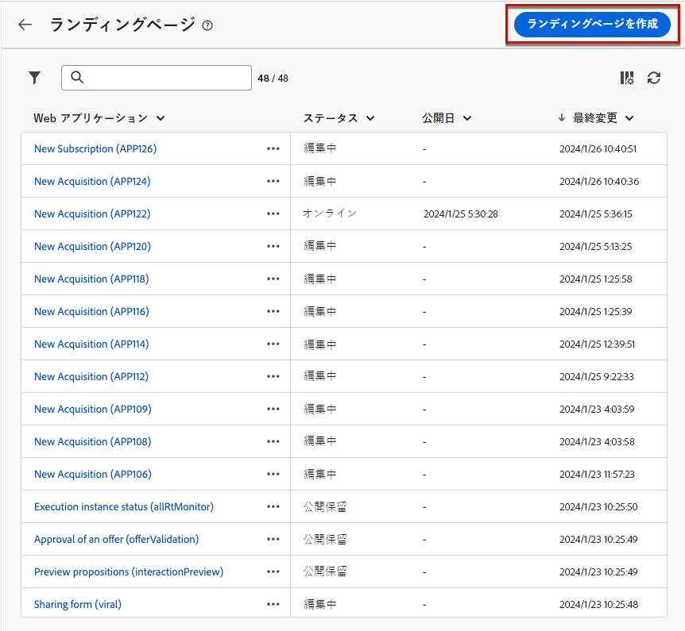{zoomable="yes"}

1. 次からテンプレートを選択します。
   * **[!UICONTROL 獲得]**：ランディングページのデフォルトテンプレートで、これを使用すると、プロファイルデータを取得および更新できます。
   * **[!UICONTROL 購読]**：ユーザーが特定の[サービス](../audience/manage-services.md)に登録できるようにするには、このテンプレートを使用します。
   * **[!UICONTROL 登録解除]**：サービスのサブスクライバー宛に配信されたメールで使用できるテンプレートで、これを使用してサブスクライバーは、その[サービス](../audience/manage-services.md)を登録解除できます。
   * **[!UICONTROL ブロックリスト]**：プロファイルが配信されたメールのオプトアウトリンクをクリックして、今後の連絡を希望しない場合に使用されるテンプレートです。

   {zoomable="yes"}

   >[!NOTE]
   >
   >[このページ](lp-use-cases.md)の各テンプレートに対応する様々なユースケースについて説明します。

1. 「**[!UICONTROL 作成]**」をクリックします。

1. ラベルなどの&#x200B;**[!UICONTROL プロパティ]**&#x200B;フィールドに入力します。

   デフォルトでは、ランディングページは **[!UICONTROL web アプリケーション]**&#x200B;フォルダーに保存されます。**[!UICONTROL その他のオプション]**&#x200B;で目的の場所を参照して変更できます。[詳しくは、フォルダーの操作方法を参照してください](../get-started/permissions.md#folders)。

   また、ランディングページを保護するには、Captcha を設定することもできます。[詳しくは、こちらを参照してください](#captcha)。

   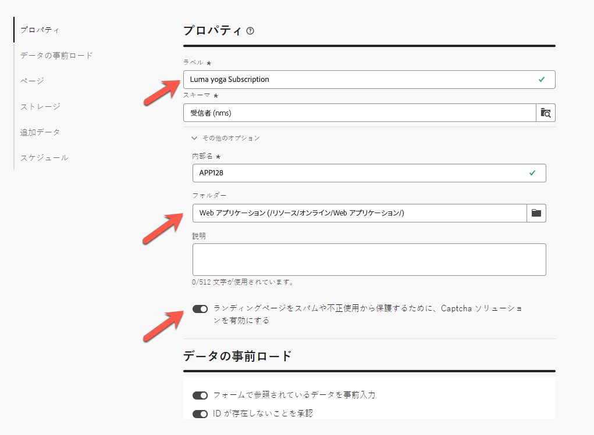{zoomable="yes"}

1. 「**[!UICONTROL データの事前ロード]**」セクションでは、次のオプションを使用できます。

   * 「**[!UICONTROL フォームで参照されるデータを事前入力]**」のオプションを選択したときに、ランディングページの訪問者がデータベースのプロファイルと一致する場合、プロファイルの情報がフォームに自動的に事前ロードされます。ユーザーは、未入力のフィールドに入力し、必要に応じて既存の値を更新するだけです。これにより、重複を作成する代わりに、既存のプロファイルのデータを結合できます。

     >[!NOTE]
     >
     >このオプションは、すべてのランディングページテンプレートに対してデフォルトで選択されます。

   * 「**[!UICONTROL ID が存在しないことを承認]**」オプションを使用すると、すべての訪問者がランディングページにアクセスできます。このオプションを選択解除すると、匿名訪問者はこのオプションを使用できなくなります。つまり、識別されたユーザーのみがフォームにアクセスして送信できます。

     **[!UICONTROL 獲得]**&#x200B;と&#x200B;**[!UICONTROL 購読]**&#x200B;のテンプレートの場合、このオプションはデフォルトで選択されます。**[!UICONTROL 購読解除]**&#x200B;と&#x200B;**[!UICONTROL ブロックリスト]**&#x200B;のテンプレートの場合、このオプションはデフォルトで選択されず、変更できません。

1. ランディングページの後続のページを作成できます。ページを追加するには、「**[!UICONTROL ページ]**」セクションで、このランディングページ用にデザインする各ページの「**[!UICONTROL コンテンツを編集]**」ボタンをクリックします。各ページのコンテンツは既に事前入力済みです。必要に応じて編集します。[詳細情報](lp-content.md)。

   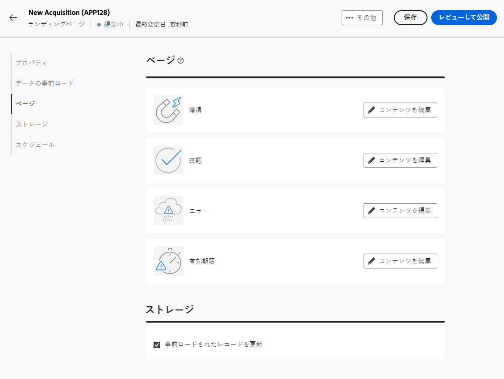{zoomable="yes"}

1. 「**[!UICONTROL ストレージ]**」セクションでは、「**[!UICONTROL 事前ロードされたレコードを更新]**」オプションがデフォルトで選択されます。ランディングページを使用して、データベースに保存されているプロファイルを更新できます。事前ロードボックスを使用すると、データベースで更新されるレコードの検索方法を示すことができます。

   また、ランディングページの現在のコンテキストフィールドから選択することもでき、データベースで対応するプロファイルを検索するために使用されます。これを行うには、「**[!UICONTROL 事前ロードされたレコードを更新]**」オプションを選択し、「**[!UICONTROL 紐付けオプション]**」にある目的のフィールドを確認します。

   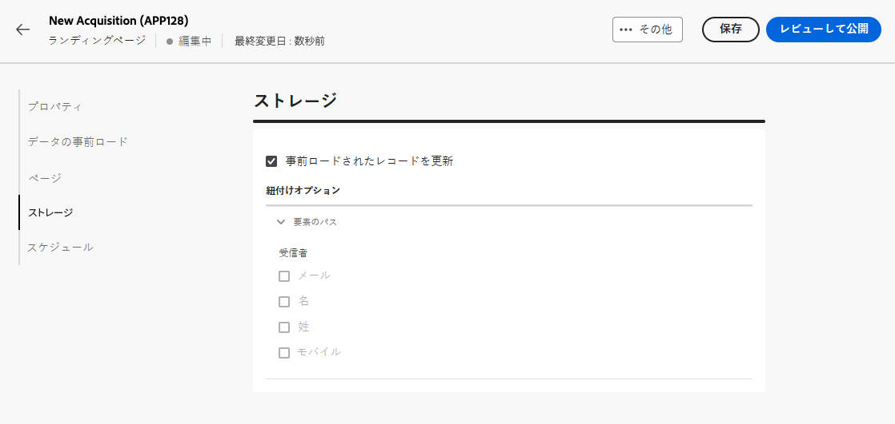{zoomable="yes"}

1. ランディングページの送信時に内部データを保存する&#x200B;**[!UICONTROL 追加のデータ]**&#x200B;を作成します。このデータは、ページを訪問するユーザーには表示されません。定数値のみが使用できます。

   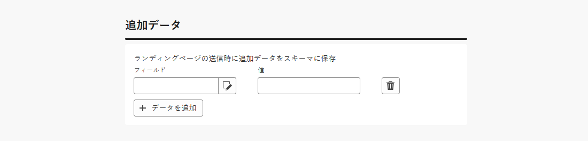{zoomable="yes"}

1. ランディングページの開始日と終了日を定義できます。「**[!UICONTROL スケジュールを有効にする]**」を選択し、日付を設定します。

   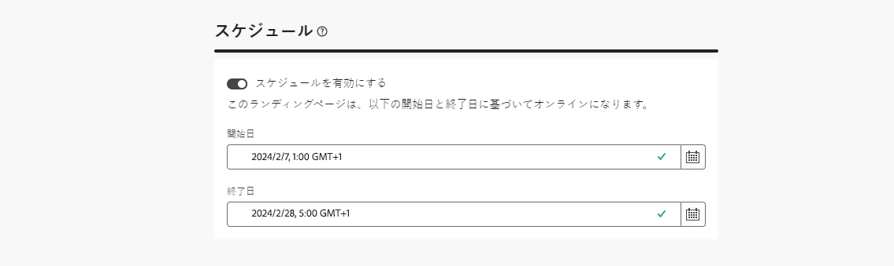{zoomable="yes"}

   * ランディングページは指定された開始日時に自動的に公開されます。

     >[!NOTE]
     >
     >開始日を定義しない場合、ランディングページは公開されるとすぐにライブになります。

   * ページが終了日に達したら、フォームは使用できなくなります。その代わりに、**[!UICONTROL 有効期限]**&#x200B;のページが表示されます。

     >[!NOTE]
     >
     >セキュリティ上の理由とプラットフォームのパフォーマンス上の理由により、アドビでは終了日を設定することをお勧めします。

1. 「**[!UICONTROL レビューして公開]**」をクリックします。

すべての設定を定義し、すべてのページの[デザイン](lp-content.md)が終わったら、以下に示すようにランディングページを[テスト](#test-landing-page)して、[公開](#publish-landing-page)できます。

## Captcha でランディングページを保護 {#captcha}

Captcha の設定は、ランディングページをスパムや不正使用から保護するのに役立ちます。

これを使用するには、ランディングページの&#x200B;**[!UICONTROL プロパティ]**に移動します。
**[!UICONTROL その他のオプション]**&#x200B;でもかまいません。「**[!UICONTROL その他の Captcha ソリューションを有効にする]**」切替スイッチをアクティブ化します。

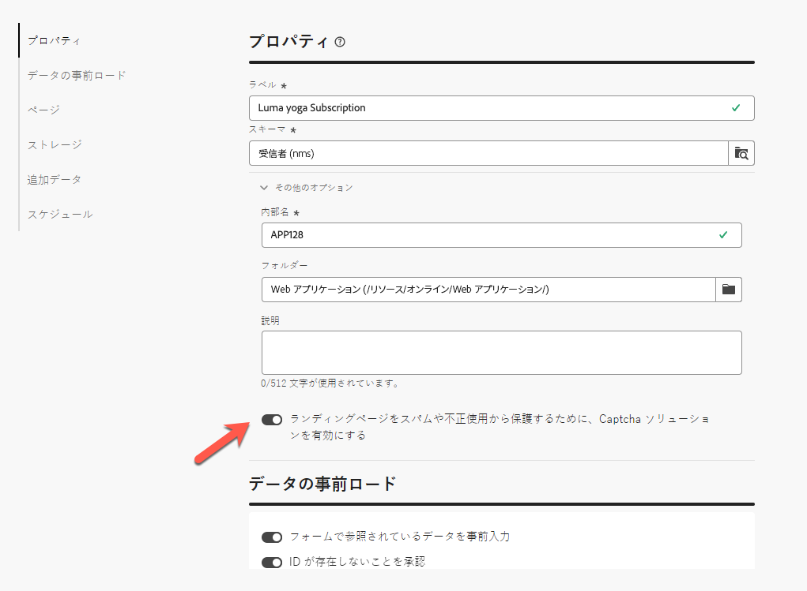{zoomable="yes"}

Captcha 設定を確認するには、「**[!UICONTROL レビューして公開]**」ボタン、「**[!UICONTROL コンテンツをシミュレート]**」の順にクリックします。フォームを送信すると、以下のように、検証中に Captcha ウィジェットが機能していることがわかります。

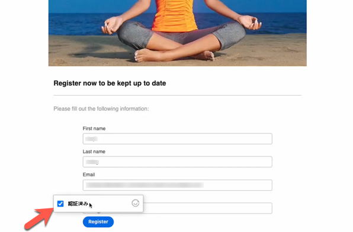{zoomable="yes"}

>[!NOTE]
>
>Adobe Campaign v8 の Captcha ウィジェットは、フローティングモードで動作する ALTCHA です。このウィジェットは、検証中に表示され、プロセスが完了すると消えます。

## ランディングページのテスト {#test-landing-page}

>[!CONTEXTUALHELP]
>id="acw_landingpages_simulate"
>title="ランディングページのシミュレート"
>abstract="ランディングページのプレビューは、Campaign web ユーザーインターフェイスで表示するか、新しい web ブラウザーのタブで開くことができます。"

>[!CONTEXTUALHELP]
>id="ac_preview_lp_profiles"
>title="ランディングページのプレビューとテスト"
>abstract="ランディングページの設定とコンテンツを定義したら、テストプロファイルを使用してプレビューできます。"

ランディングページの設定とコンテンツを定義したら、テストプロファイルを使用してプレビューできます。[パーソナライズされたコンテンツ](../personalization/gs-personalization.md)を挿入した場合は、このコンテンツがランディングページにどのように表示されるかを、テストプロファイルデータを利用して確認できます。

>[!CAUTION]
>
>メッセージのプレビューや配達確認の送信を行うには、テストプロファイルを使用可能にしておく必要があります。[テストプロファイルの詳細情報を参照してください](../audience/test-profiles.md)。

ランディングページをテストするには、次の手順に従います。

1. 「**[!UICONTROL レビューと公開]**」をクリックした後、ランディングページの「**[!UICONTROL コンテンツをシミュレート]**」ボタンを選択して、テストプロファイルの選択にアクセスします。

   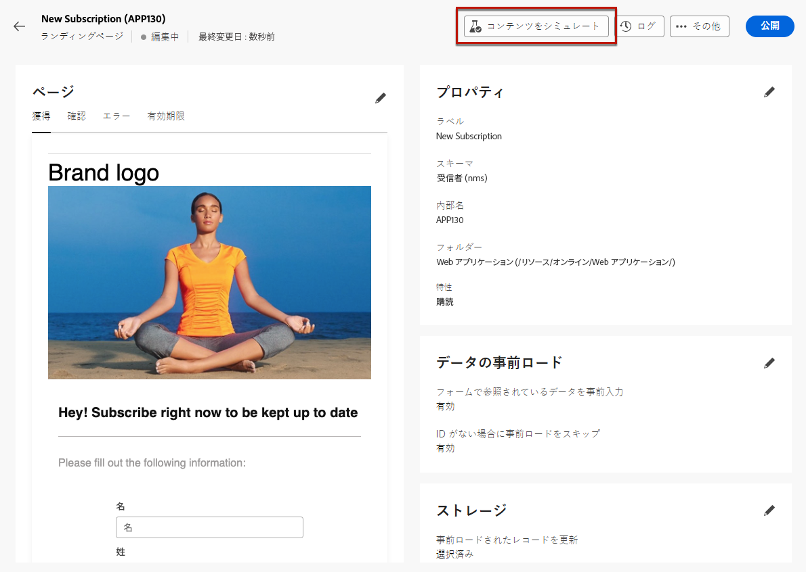{zoomable="yes"}

1. **[!UICONTROL シミュレート]**&#x200B;画面から、1 つ以上のテストプロファイルを選択します。

   テストプロファイルを選択する手順は、メッセージをテストする場合と同じです。詳しくは、[プレビューとテスト](../preview-test/preview-test.md)の節を参照してください。

1. 「**[!UICONTROL URL からのサービス]**」オプションを選択して動的ランディングページをテストする場合 - [詳細情報](../landing-pages/create-lp.md#define-actions-on-form-submission)

1. 「**[!UICONTROL プレビューを開く]**」を選択して、ランディングページをテストします。

   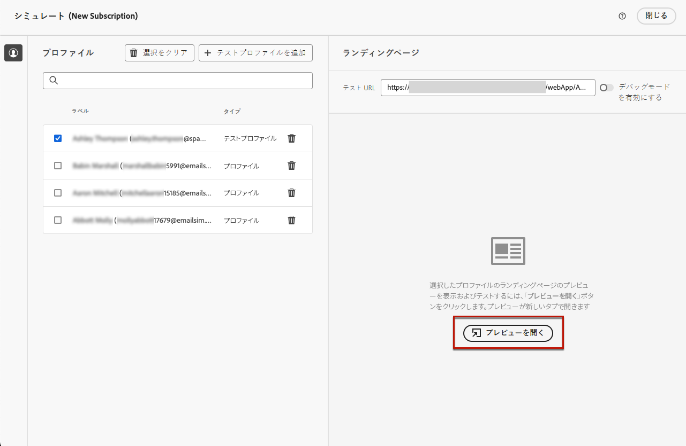{zoomable="yes"}

1. ランディングページのプレビューが新しいタブで開きます。パーソナライズされた要素が、選択したテストプロファイルデータに置き換えられます。

   ランディングページで「**[!UICONTROL フォームで参照されるデータを事前入力]**」オプションを選択すると、フォームフィールドには、対応するテストプロファイルデータが自動的に事前入力されます。<!--TBC-->

   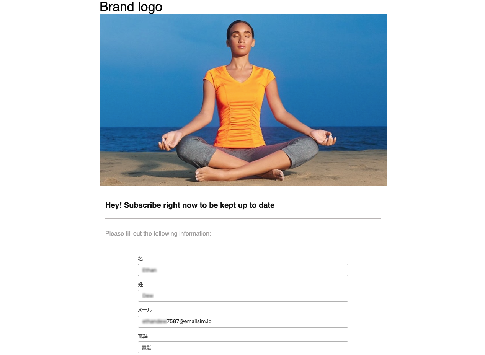{zoomable="yes"}

1. 他のテストプロファイルを選択して、ランディングページの各バリアントに対するレンダリングをプレビューします。

<!--Can you preview Confirmation/Error/Expiration pages?-->

## ランディングページの公開 {#publish-landing-page}

ランディングページの準備が整い、検証が完了したら、ページを公開して、対応するボタンを使用して配信で使用できるようにします。

公開後：

* ランディングページが&#x200B;**[!UICONTROL 公開済み]**&#x200B;ステータスでランディングページリストに追加されます。ページが公開され、コンテンツ内で参照できるようになりました。

* ページの上部に表示される&#x200B;**[!UICONTROL ランディングページの URL]** を web ブラウザーにコピー＆ペーストすると、ランディングページをプレビューできます。

>[!CAUTION]
>
>ランディングページを完全にテストまたは活用する場合は、このリンクを web ブラウザーまたは配信に直接コピー＆ペーストできません。代わりに、[コンテンツをシミュレート](#test-landing-page)機能を使用してテストし、[この節](lp-use-cases.md)で説明する手順に従ってランディングページを適切に使用します。

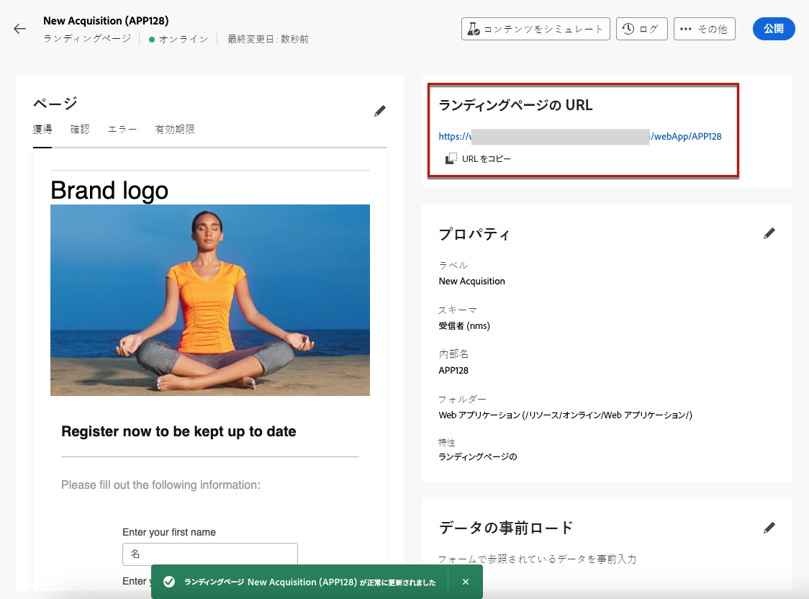{zoomable="yes"}

ランディングページの影響は、ログ<!--and specific reports-->を通じて監視できます。「**[!UICONTROL ログ]**」ボタンをクリックします。