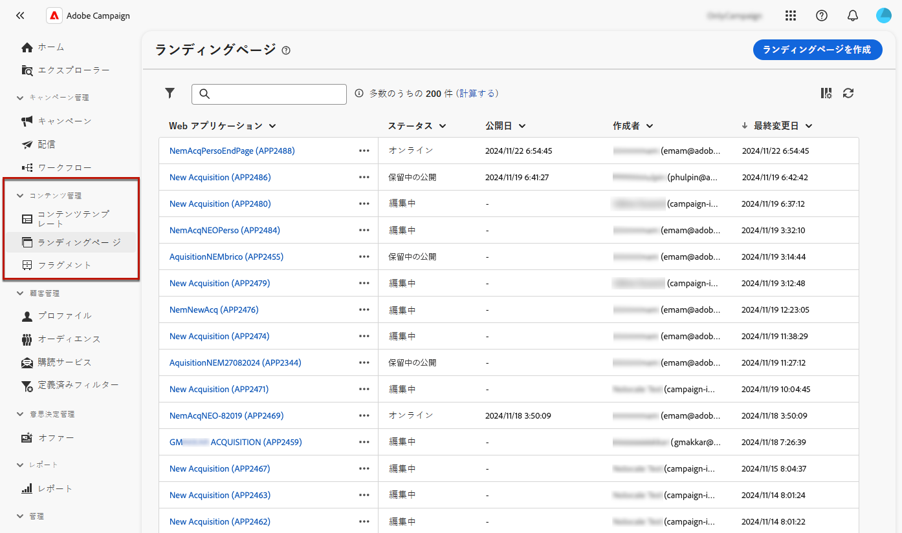

# ランディングページの作成と公開 {#create-lp}

>[!CONTEXTUALHELP]
>id="acw_landingpages_menu"
>title="ランディングページの作成と管理"
>abstract="Adobe Campaignでは、ランディングページを作成、デザインおよび共有して、組み込みのテンプレートに基づいて、獲得、購読/購読解除および使用例の管理をおこなうことがでブロックリストに加えるきる、オンライン Web ページにユーザーを誘導できます。"

Campaign Web ユーザーインターフェイスを使用すると、ランディングページの作成、デザインおよび公開が可能です。 公開されたら、配信でフォームへのリンクを挿入できます。 受信者がそのリンクをクリックすると、対応するランディングページに移動します。

[!DNL Adobe Campaign] には、次の使用例を管理するための 4 つのテンプレートが付属しています。 **獲得**, **購読**, **購読解除**、および **ブロックリストに加える**.

## ランディングページへのアクセス {#access-landing-pages}

ランディングページリストにアクセスするには、左側のメニューから&#x200B;**[!UICONTROL キャンペーン管理]**／**[!UICONTROL ランディングページ]**&#x200B;を選択します。

{zoomable=&quot;yes&quot;}

**[!UICONTROL ランディングページ]**&#x200B;インベントリには、作成したすべての項目が表示されます。「**フィルターを表示**」ボタンを使用してフィルタリングできます。ドロップダウンリストを使用して結果を特定の[フォルダー](../get-started/permissions.md#folders)に制限したり、[クエリモデラー](../query/query-modeler-overview.md)を使用してルールを追加したりできます。

{zoomable=&quot;yes&quot;}

<!--From this list, you can access the [landing page Live report](../reports/lp-report-live.md) or [landing page Global report](../reports/lp-report-global.md) for published items.-->

>[!CAUTION]
>
>Campaign Web ユーザーインターフェイスのクライアントコンソール（Web フォーム）から作成したランディングページは、表示または編集できません。 詳しくは、[Campaign コンソールドキュメント](https://experienceleague.adobe.com/docs/campaign/campaign-v8/content/webapps.html?lang=ja){target="_blank"}を参照してください。

<!--If you unpublish a landing page which is referenced in a message, the link to the landing page will be broken and an error page will be displayed. You cannot delete a published landing page. To delete it, you must first unpublish it.-->

ランディングページを複製または削除できます。ランディングページの横にある省略記号をクリックして、目的のアクションを選択します。

## ランディングページの作成 {#create-landing-page}

>[!CONTEXTUALHELP]
>id="acw_landingpages_properties"
>title="ランディングページのプロパティの定義"
>abstract="ラベルなどのプロパティフィールドに入力し、必要に応じてスキーマを変更します。また、内部名の編集、ランディングページの保存先フォルダーの変更、説明の入力を行うこともできます。"

>[!CONTEXTUALHELP]
>id="acw_landingpages_pages_list"
>title="各ページのコンテンツを定義"
>abstract="フォーム自体、フォームの送信時に表示される確認ページ、エラーが発生した場合にユーザーがリダイレクトされるページなど、このランディングページの一部である各ページのコンテンツを調整します。"

>[!CONTEXTUALHELP]
>id="acw_landingpages_schedule"
>title="ランディングページのスケジュール"
>abstract="ランディングページの開始日と終了日を定義できます。ページが有効期間の終わりに達すると、フォームは使用できなくなります。 The **有効期限** ページが表示されます。"

>[!CONTEXTUALHELP]
>id="acw_landingpages_primarypage"
>title="プライマリページ設定の定義"
>abstract="プライマリページは、メールや web サイトなど、ユーザーがランディングページへのリンクをクリックした際、直ちに表示されます。"

>[!CONTEXTUALHELP]
>id="acw_landingpages_subscription"
>title="購読ランディングページの設定"
>abstract="購読ページを使用すると、顧客はサービスを購読できます。"

<!--The main steps to create landing pages are as follows:

{zoomable="yes"}-->

ランディングページを作成するには、次の手順に従います。

1. **[!UICONTROL ランディングページ]**&#x200B;の在庫から、「**[!UICONTROL ランディングページを作成]**」をクリックします。

   {zoomable=&quot;yes&quot;}

1. 次のテンプレートを選択します。
   * **[!UICONTROL 獲得]**：ランディングページのデフォルトテンプレートで、プロファイルデータを取得および更新できます。
   * **[!UICONTROL 購読]**：ユーザーが特定のに購読登録できるようにするには、このテンプレートを使用します [サービス](../audience/manage-services.md).
   * **[!UICONTROL 購読解除]**：このテンプレートは、サービスの購読者に送信される配信で使用して、購読者がこの配信から登録解除できるようにします [サービス](../audience/manage-services.md).
   * **[!UICONTROL ブロックリストに加える]**：プロファイルが配信のオプトアウトリンクをクリックし、今後連絡を希望しない場合に使用するテンプレートです。

   {zoomable=&quot;yes&quot;}

   >[!NOTE]
   >
   >各テンプレートに対応する様々な使用例を [このページ](lp-use-cases.md).

1. 「**[!UICONTROL 作成]**」をクリックします。

1. 次の項目に入力： **[!UICONTROL プロパティ]** ラベルなどのフィールド。

   デフォルトでは、ランディングページは **[!UICONTROL web アプリケーション]**&#x200B;フォルダーに保存されます。**[!UICONTROL その他のオプション]**&#x200B;で目的の場所を参照して変更できます。[詳しくは、フォルダーの操作方法を参照してください](../get-started/permissions.md#folders)

   {zoomable=&quot;yes&quot;}

1. 「**[!UICONTROL データの事前ロード]**」セクションでは、次の 2 つのオプションがデフォルトで選択されています。

   * 次の場合に **[!UICONTROL フォームで参照されるデータを事前入力]** 「 」オプションを選択した場合、ランディングページの訪問者がデータベースのプロファイルと一致する場合、プロファイルの情報がフォームに自動的にプリロードされます。 ユーザーは、見つからないフィールドに入力し、必要に応じて既存の値を更新するだけです。 これにより、重複を作成する代わりに、既存のプロファイルのデータを結合できます。

   * プロファイルを更新しない場合、「**[!UICONTROL ID がない場合にプリロードをスキップ]**」オプションを選択する必要があります。この場合、入力した各プロファイルは、フォームの承認後にデータベースに追加されます。例えば、フォームが Web サイトに投稿される際に、このオプションが使用されます。

1. ランディングページの後続のページを作成できます。 ページを追加するには、 **[!UICONTROL ページ]** 」セクションで、 **[!UICONTROL コンテンツを編集]** ボタンをクリックします。 各ページのコンテンツは既に事前入力済みです。必要に応じて編集します。[詳細情報](lp-content.md)

   {zoomable=&quot;yes&quot;}

1. The **[!UICONTROL プリロードされたレコードを更新]** オプションはデフォルトで選択されています。 ランディングページを使用して、データベースに保存されているプロファイルを更新できます。 プリロードボックスを使用すると、データベースで更新されるレコードの検索方法を示すことができます。

   また、ランディングページの現在のコンテキストのフィールドから選択し、データベースで対応するプロファイルを見つけるために使用するフィールドも選択できます。 これをおこなうには、 **[!UICONTROL プリロードされたレコードを更新]** 」オプションを選択し、以下の目的のフィールドを確認します。 **[!UICONTROL 紐付けオプション]**.

   {zoomable=&quot;yes&quot;}

1. ランディングページの開始日と終了日を定義できます。選択 **[!UICONTROL スケジュールを有効にする]** 日付を設定します。

   {zoomable=&quot;yes&quot;}

   * ランディングページは指定された開始日時に自動的に公開されます。

     >[!NOTE]
     >
     >開始日を定義しない場合、ランディングページは公開されるとすぐにライブになります。

   * ページが終了日に達したら、 <!--the landing page is automatically unpublished and -->フォームは使用できなくなりました。 The **[!UICONTROL 有効期限]** ページが表示されます。

     >[!NOTE]
     >
     >セキュリティ上の理由とプラットフォームのパフォーマンス上の理由により、Adobeでは終了日を設定することをお勧めします。

1. 「**[!UICONTROL レビューして公開]**」をクリックします。

すべての設定を定義し、 [設計済み](lp-content.md) すべてのページで、以下を実行できます。 [テスト](#test-landing-page) および [公開](#publish-landing-page) ランディングページの詳細を以下に示します。

## ランディングページのテスト {#test-landing-page}

>[!CONTEXTUALHELP]
>id="acw_landingpages_simulate"
>title="ランディングページのシミュレート"
>abstract="ランディングページのプレビューは、Campaign web ユーザーインターフェイスで表示するか、新しい web ブラウザーのタブで開くことができます。"

>[!CONTEXTUALHELP]
>id="ac_preview_lp_profiles"
>title="ランディングページのプレビューとテスト"
>abstract="ランディングページの設定とコンテンツを定義したら、テストプロファイルを使用してプレビューできます。"

ランディングページの設定とコンテンツを定義したら、テストプロファイルを使用してプレビューできます。[パーソナライズされたコンテンツ](../personalization/gs-personalization.md)を挿入した場合は、このコンテンツがランディングページにどのように表示されるかを、テストプロファイルデータを利用して確認できます。

>[!CAUTION]
>
>メッセージのプレビューや配達確認の送信を行うには、テストプロファイルを使用可能にしておく必要があります。[詳しくは、テストプロファイルを参照してください](../audience/test-profiles.md)

ランディングページをテストするには、次の手順に従います。

1. 次をクリックした後： **[!UICONTROL レビューと公開]**&#x200B;を選択し、 **[!UICONTROL コンテンツをシミュレート]** ボタンをクリックして、テストプロファイルの選択にアクセスします。

   {zoomable=&quot;yes&quot;}

1. **[!UICONTROL シミュレート]**&#x200B;画面から、1 つ以上のテストプロファイルを選択します。

   テストプロファイルを選択する手順は、メッセージをテストする場合と同じです。詳しくは、[プレビューとテスト](../preview-test/preview-test.md)の節を参照してください。

1. 「**[!UICONTROL プレビューを開く]**」を選択して、ランディングページをテストします。

   {zoomable=&quot;yes&quot;}

1. ランディングページのプレビューが新しいタブで開きます。パーソナライズされた要素が、選択したテストプロファイルデータに置き換えられます。

   次を選択した場合、 **[!UICONTROL フォームで参照されるデータを事前入力]** 「 」オプションを選択すると、フォームフィールドには、対応するテストプロファイルデータが自動的に事前入力されます。<!--TBC-->

   {zoomable=&quot;yes&quot;}

1. 他のテストプロファイルを選択して、ランディングページの各バリアントに対するレンダリングをプレビューします。

<!--Can you preview Confirmation/Error/Expiration pages?-->

## ランディングページの公開 {#publish-landing-page}

ランディングページの準備と検証が完了したら、それを公開して、対応するボタンを使用して、配信で使用できるようにします。

公開後：

* ランディングページが、 **[!UICONTROL 公開済み]** ステータス。 これで、ライブ状態になり、コンテンツで参照できる状態になります。

* 次の項目をコピー&amp;ペーストできます。 **[!UICONTROL ランディングページの URL]** ページの上部に表示されるので、Web ブラウザーでランディングページをプレビューできます。

>[!CAUTION]
>
>ランディングページを完全にテストまたは活用するには、このリンクを Web ブラウザーや配信に直接コピー&amp;ペーストすることはできません。 代わりに、 [コンテンツをシミュレート](#test-landing-page) 関数を使用してテストし、 [この節](lp-use-cases.md) を使用して、ランディングページを適切に使用します。

{zoomable=&quot;yes&quot;}

ランディングページの影響はログを通じて監視できます<!--and specific reports-->. 次をクリック： **[!UICONTROL ログ]** 」ボタンをクリックします。
