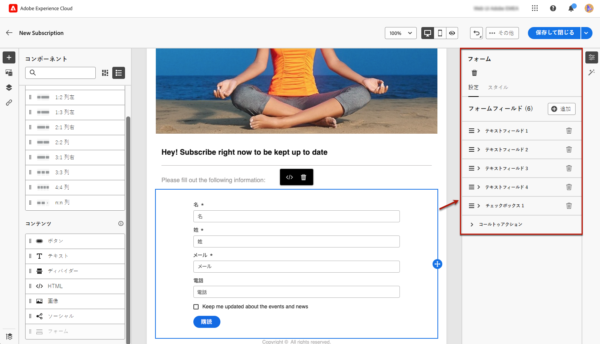
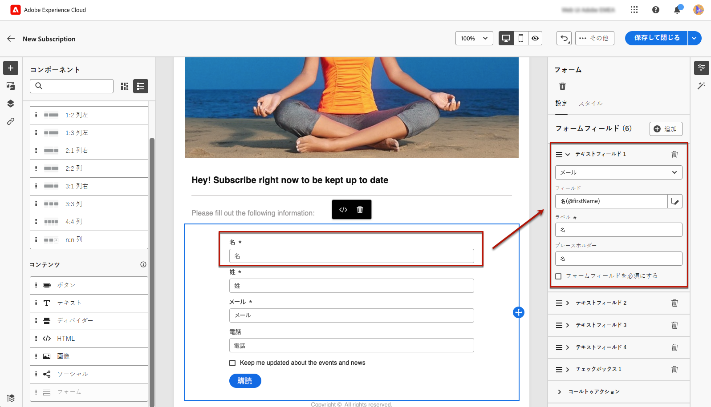
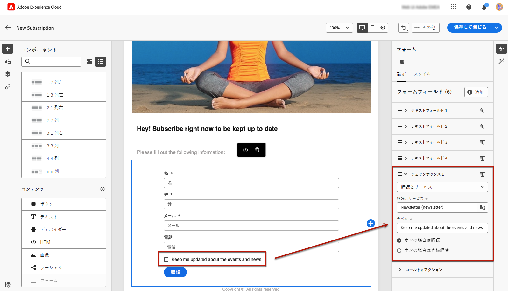
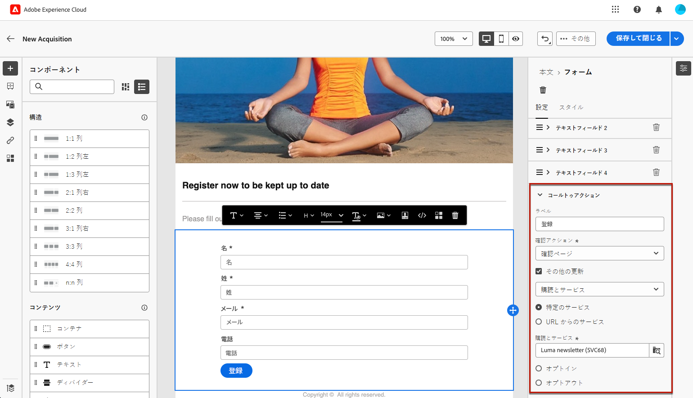
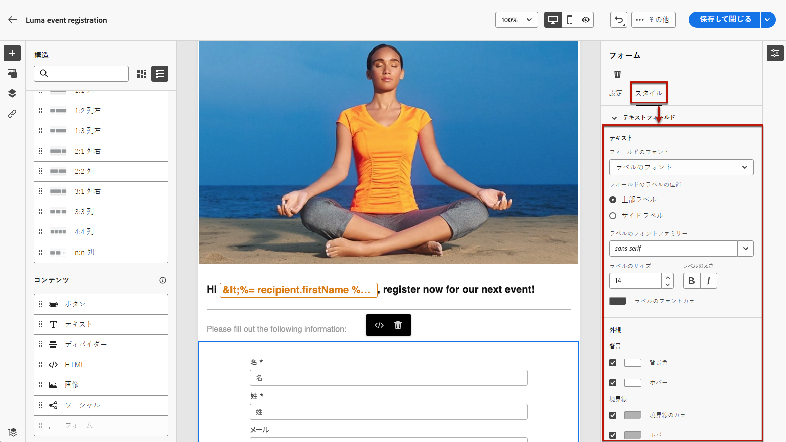
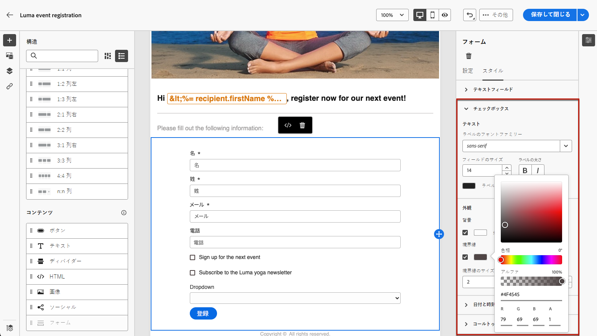
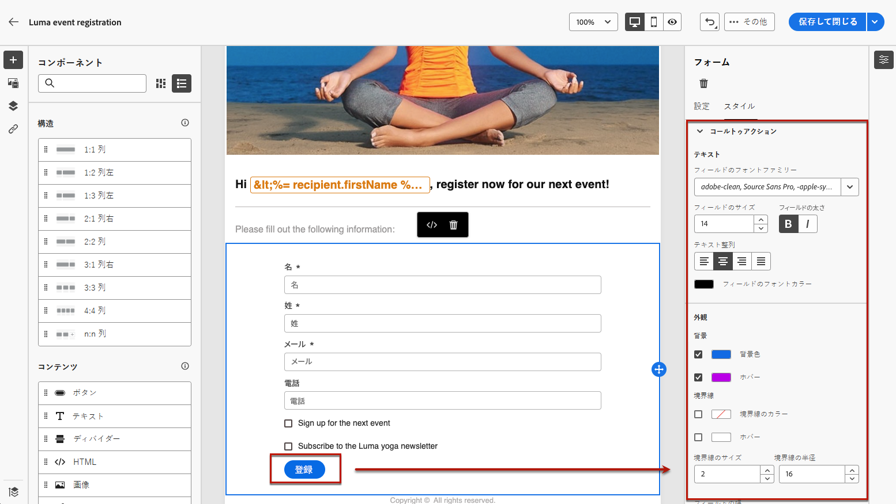

# ランディングページ固有のコンテンツの定義 {#lp-content}

>[!CONTEXTUALHELP]
>id="ac_lp_components"
>title="コンテンツコンポーネントの使用"
>abstract="コンテンツコンポーネントは、ランディングページのレイアウトの作成に使用できる空のコンテンツプレースホルダーです。ユーザーが選択肢を選択して送信できるようにする特定のコンテンツを定義するには、フォームコンポーネントを使用します。"

ランディングページの任意のページのコンテンツを編集できます。

最初のページは、ユーザーがランディングページへのリンクをクリックした後すぐに表示され、既に [ランディングページ固有のフォームコンポーネント](#use-form-component) 選択したテンプレート用<!-- to enable users to select and submit their choices-->.

のコンテンツ **[!UICONTROL 確認]**, **[!UICONTROL エラー]** および **[!UICONTROL 有効期限]** ページも事前入力されます。 必要に応じて編集します。

また、 [ランディングページのスタイル](#lp-form-styles).

ランディングページのコンテンツをさらに設計するには、メールと同じコンポーネントを使用できます。[詳細情報](../email/content-components.md#add-content-components)

## フォームコンポーネントの使用 {#use-form-component}

>[!CONTEXTUALHELP]
>id="ac_lp_formfield"
>title="フォームコンポーネントフィールドの設定"
>abstract="受信者がランディングページから選択肢を表示および送信する方法を定義します。"

>[!CONTEXTUALHELP]
>id="acw_landingpages_calltoaction"
>title="ボタンをクリックした際の動作"
>abstract="ユーザーがランディングページフォームを送信した際の動作を定義します。"

ユーザーが選択して送信できるランディングページの特定のコンテンツを定義するには、 **[!UICONTROL フォーム]** コンポーネント。 それには、次の手順に従います。

1. ランディングページ固有の&#x200B;**[!UICONTROL フォーム]**&#x200B;コンポーネントは、選択したテンプレートのキャンバスに既に表示されています。

   >[!NOTE]
   >
   >**[!UICONTROL フォーム]**&#x200B;コンポーネントは、同じページで 1 回のみ使用できます。

1. これを選択します。「**[!UICONTROL フォームコンテンツ]**」タブが右側のパレットに表示され、フォームの様々なフィールドを編集できます。

   {zoomable=&quot;yes&quot;}

   >[!NOTE]
   >
   >フォーム コンポーネントコンテンツのスタイルを編集するには、いつでも「**[!UICONTROL スタイル]**」タブに切り替えます。[詳細情報](#lp-form-styles)

1. 1 つ目のテキストフィールドがある場合は展開します。または、 **[!UICONTROL 追加]** 」ボタンをクリックします。 次から： **[!UICONTROL テキストフィールド 1]** 「 」セクションでは、フィールドタイプ、更新するデータベースフィールド、ラベル、ユーザーが値を入力する前にフィールド内に表示されるテキストを編集できます。

   {zoomable=&quot;yes&quot;}

1. 必要に応じて、「**[!UICONTROL フォームフィールドを必須にする]**」オプションをオンにします。その場合、ランディングページは、ユーザーがこのフィールドに入力した場合にのみ送信できます。

   >[!NOTE]
   >
   >必須フィールドが未入力の場合、ユーザーがページを送信するとエラーメッセージが表示されます。

1. チェックボックスがある場合は展開するか、 **[!UICONTROL 追加]** 」ボタンをクリックします。 そのチェックボックスでデータベースのサービスまたはフィールドを更新するかどうかを選択します。

   {zoomable=&quot;yes&quot;}

   次を選択した場合、 **[!UICONTROL 購読とサービス]**、リストからサービスを選択し、次の 2 つのオプションのいずれかを選択します。

   * **[!UICONTROL オンにした場合は購読]**：ユーザーは、同意するには、チェックボックスをオンにする必要があります（オプトイン）。
   * **[!UICONTROL オンにすると登録解除]**：ユーザーは、チェックボックスをオンにして同意を削除する必要があります（オプトアウト）。

   次を選択した場合、 **[!UICONTROL フィールド]**&#x200B;で、属性リストからフィールドを選択し、以下の 2 つのオプションのいずれかを選択します。

   * **[!UICONTROL オンにした場合は可]**<!--TBC-->

   * **[!UICONTROL オンにした場合はいいえ]**<!--TBC-->

1. 削除して追加できるフィールドの数は、テキストフィールド、ラジオボタン、チェックボックス、ドロップダウンリストなどです。 必要に応じて。

1. すべてのフィールドを追加または更新したら、 **[!UICONTROL コールトゥアクション]** をクリックして、対応するセクションを展開します。 これにより、**[!UICONTROL フォーム]**&#x200B;コンポーネントのボタンの動作を定義できます。

   {zoomable=&quot;yes&quot;}

1. 次のボタンをクリックした場合の動作を定義します。

   * **[!UICONTROL 確認ページ]**：ユーザーは、現在のランディングページに設定されている&#x200B;**[!UICONTROL 確認]**&#x200B;ページにリダイレクトされます。

   * **[!UICONTROL リダイレクト URL]**：ユーザーがリダイレクトされるページの URL を入力します。

1. フォームの送信時に追加の更新を行う場合は、 **[!UICONTROL その他の更新]**&#x200B;をクリックし、更新する項目を選択します。
   * 購読サービス — この場合、フォームの送信時にユーザーをオプトインまたはオプトアウトするかを定義します。
   * フォームの入力時に使用する電子メールアドレス。
   * すべてのチャネル — フォームの送信時に、ユーザーは（選択したテンプレートに応じて）すべてのチャネルのブランドからのすべてのコミュニケーションに対して、オプトインまたはオプトアウトされます
   * データベースのフィールド — 属性リストからフィールドを選択し、フォームの送信時に True または False に設定する必要があるかどうかを定義します。

   {zoomable=&quot;yes&quot;}

1. コンテンツを保存して、[ランディングページのプロパティ](create-lp.md#create-landing-page)に戻ります。

## ランディングページフォームスタイルの定義 {#lp-form-styles}

1. フォームコンポーネントコンテンツのスタイルを変更するには、いつでも **[!UICONTROL スタイル]** タブをクリックします。

1. The **[!UICONTROL テキストフィールド]** セクションはデフォルトで展開されます。 ラベルのフォント、ラベルの位置、フィールドの背景色、フィールドの境界線など、テキストフィールドの外観を編集できます。

   {zoomable=&quot;yes&quot;}

1. を展開します。 **[!UICONTROL チェックボックス]** 「 」セクションに追加し、チェックボックスと対応するテキストの外観を定義します。 例えば、フォントファミリとサイズ、またはチェックボックスの境界線の色を調整できます。

   {zoomable=&quot;yes&quot;}

1. 追加した他のフィールド（ラジオボタン、ドロップダウンリスト、日時など）に対応する他のセクションを展開して編集します。 をフォームに追加します。

1. を展開します。 **[!UICONTROL コールトゥアクション]** 「 」セクションを使用して、コンポーネントフォーム内のボタンの外観を変更します。 例えば、フォントを変更したり、境界線を追加したり、マウスポインターを置いたときのラベルの色を編集したり、ボタンの配置を調整したりできます。

   {zoomable=&quot;yes&quot;}

   「**[!UICONTROL コンテンツをシミュレート]**」ボタンを使用すると、ポインタを合わせたときのボタンのラベルの色など、一部の設定をプレビューできます。[詳細情報](create-lp.md#test-landing-page)

1. 変更内容を保存します。
