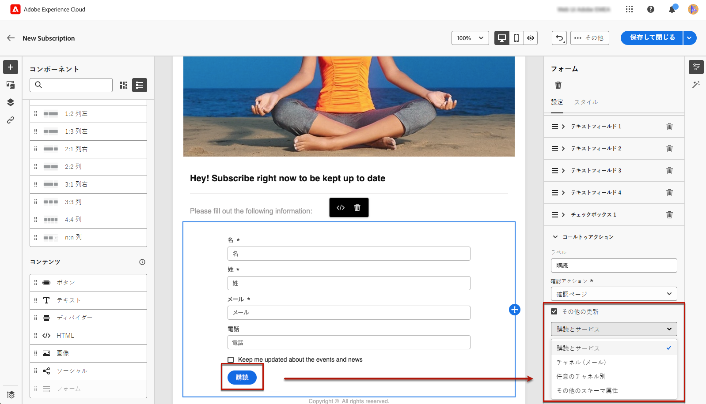

# ランディングページ固有のコンテンツの定義 {#lp-content}

>[!CONTEXTUALHELP]
>id="ac_lp_components"
>title="コンテンツコンポーネントの使用"
>abstract="コンテンツコンポーネントは、ランディングページのレイアウトの作成に使用できる空のコンテンツプレースホルダーです。ユーザーが選択肢を選択して送信できるようにする特定のコンテンツを定義するには、フォームコンポーネントを使用します。"

ランディングページの任意のページのコンテンツを編集する際、それらのコンテンツは既に事前入力されています。

最初のページは、ユーザーがランディングページへのリンクをクリックした後すぐに表示され、既に [ランディングページ固有のフォームコンポーネント](#use-form-component) 選択したテンプレートに対して、ユーザーが選択を選択して送信できるようにします。 また、[ランディングページ固有のスタイル](#lp-form-styles)を定義することもできます。

ランディングページのコンテンツをさらに設計するには、メールと同じコンポーネントを使用できます。[詳細情報](../email/content-components.md#add-content-components)

のコンテンツ **[!UICONTROL 確認]**, **[!UICONTROL エラー]** および **[!UICONTROL 有効期限]** ページも事前入力されます。 必要に応じて編集します。

## フォームコンポーネントの使用 {#use-form-component}

>[!CONTEXTUALHELP]
>id="ac_lp_formfield"
>title="フォームコンポーネントフィールドの設定"
>abstract="受信者がランディングページから選択肢を表示および送信する方法を定義します。"

>[!CONTEXTUALHELP]
>id="acw_landingpages_calltoaction"
>title="ボタンをクリックした際の動作"
>abstract="ユーザーがランディングページフォームを送信した際の動作を定義します。"

ユーザーがランディングページから選択肢を選択して送信できるようにする特定のコンテンツを定義するには、**[!UICONTROL フォーム]**&#x200B;コンポーネントを使用します。それには、次の手順に従います。

1. ランディングページ固有の&#x200B;**[!UICONTROL フォーム]**&#x200B;コンポーネントは、選択したテンプレートのキャンバスに既に表示されています。

   >[!NOTE]
   >
   >**[!UICONTROL フォーム]**&#x200B;コンポーネントは、同じページで 1 回のみ使用できます。

1. これを選択します。「**[!UICONTROL フォームコンテンツ]**」タブが右側のパレットに表示され、フォームの様々なフィールドを編集できます。

   

   >[!NOTE]
   >
   >フォーム コンポーネントコンテンツのスタイルを編集するには、いつでも「**[!UICONTROL スタイル]**」タブに切り替えます。[詳細情報](#lp-form-styles)

1. 最初のテキストフィールドを展開します。「**[!UICONTROL テキストフィールド 1]**」セクションから、ユーザーがフィールドに入力する前にフィールド内に表示されるフィールドタイプ、データベースからのフィールド、ラベルおよびテキストを編集できます。

   

1. 必要に応じて、「**[!UICONTROL フォームフィールドを必須にする]**」オプションをオンにします。その場合、ランディングページは、ユーザーがこのフィールドに入力した場合にのみ送信できます。

   >[!NOTE]
   >
   >必須フィールドが未入力の場合、ユーザーがページを送信するとエラーメッセージが表示されます。

1. チェックボックスを追加します。そのチェックボックスでデータベースのサービスまたはフィールドを更新するかどうかを選択します。

   

   このチェックボックスでユーザーをオプトインするかオプトアウトするかを定義します。次の 2 つのオプションの中から選択します。

   * **[!UICONTROL オンにした場合は購読]**：ユーザーは、同意するには、チェックボックスをオンにする必要があります（オプトイン）。
   * **[!UICONTROL オンにすると登録解除]**：ユーザーは、チェックボックスをオンにして同意を削除する必要があります（オプトアウト）。

1. 必要に応じて、テキストフィールドやチェックボックスを削除して追加できます。

1. 目的のチェックボックスやテキストフィールドをすべて追加したら、「**[!UICONTROL コールトゥアクション]**」をクリックして、対応するセクションを展開します。これにより、**[!UICONTROL フォーム]**&#x200B;コンポーネントのボタンの動作を定義できます。

   

1. 次のボタンをクリックした場合の動作を定義します。

   * **[!UICONTROL 確認ページ]**：ユーザーは、現在のランディングページに設定されている&#x200B;**[!UICONTROL 確認]**&#x200B;ページにリダイレクトされます。

   * **[!UICONTROL リダイレクト URL]**：ユーザーがリダイレクトされるページの URL を入力します。

1. フォームの送信時に追加の更新を行う場合は、 **[!UICONTROL その他の更新]**&#x200B;を選択します。 **[!UICONTROL オプトイン]** または **[!UICONTROL オプトアウト]**&#x200B;をクリックし、使用する E メールアドレスのみ、またはチャネルのサブスクリプションリストを更新するかを定義します。

   

1. コンテンツを保存して、[ランディングページのプロパティ](create-lp.md)に戻ります。

## ランディングページフォームスタイルの定義 {#lp-form-styles}

1. フォームコンポーネントコンテンツのスタイルを変更するには、いつでも「**[!UICONTROL スタイル]**」タブに切り替えます。

   

1. 「**[!UICONTROL フィールド]**」セクションはデフォルトで展開され、ラベルとプレースホルダーのフォント、ラベルの位置、フィールドの背景色、フィールドの境界線など、テキストフィールドの外観を編集できます。

   

1. 「**[!UICONTROL チェックボックス]**」セクションを展開して、チェックボックスと対応するテキストの外観を定義します。例えば、フォントファミリやサイズ、チェックボックスの境界線の色を調整できます。

   

1. 「**[!UICONTROL ボタン]**」セクションを展開して、コンポーネントフォームのボタンの外観を変更します。例えば、フォントを変更したり、境界線を追加したり、マウスポインターを置いたときのラベルの色を編集したり、ボタンの配置を調整したりできます。

   

   「**[!UICONTROL コンテンツをシミュレート]**」ボタンを使用すると、ポインタを合わせたときのボタンのラベルの色など、一部の設定をプレビューできます。ランディングページのテストについて詳しくは、[こちら](create-lp.md#test-landing-page)を参照してください。

1. 「**[!UICONTROL フォームレイアウト]**」セクションを展開して、背景色、パディング、余白などのレイアウト設定を編集します。

   

<!--
1. Expand the **[!UICONTROL Form error]** section to adjust the display of the error message that displays in case a problem occurs. Check the corresponding option to preview the error text on the form.

    -->

