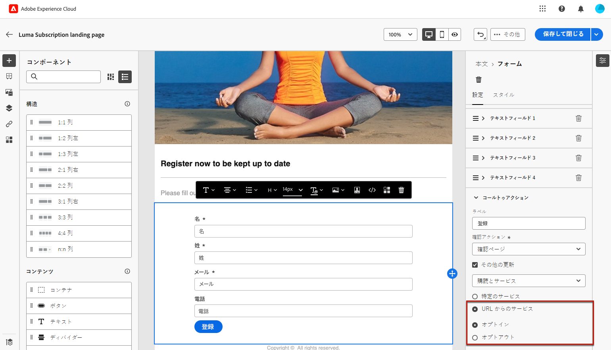
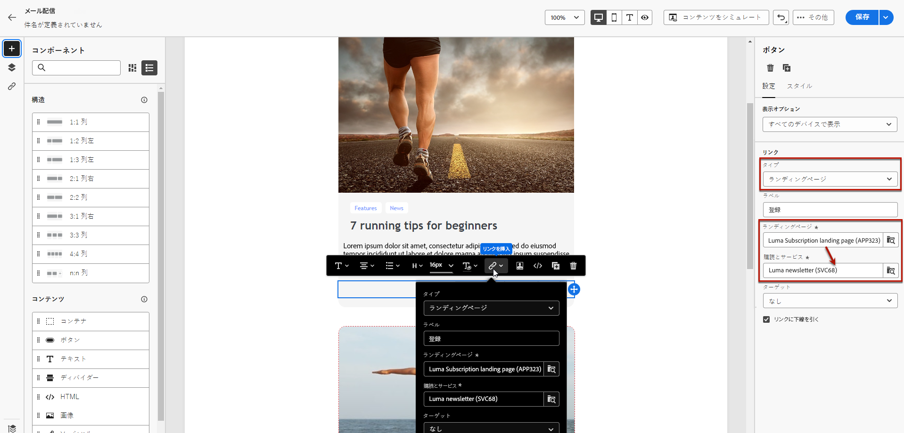
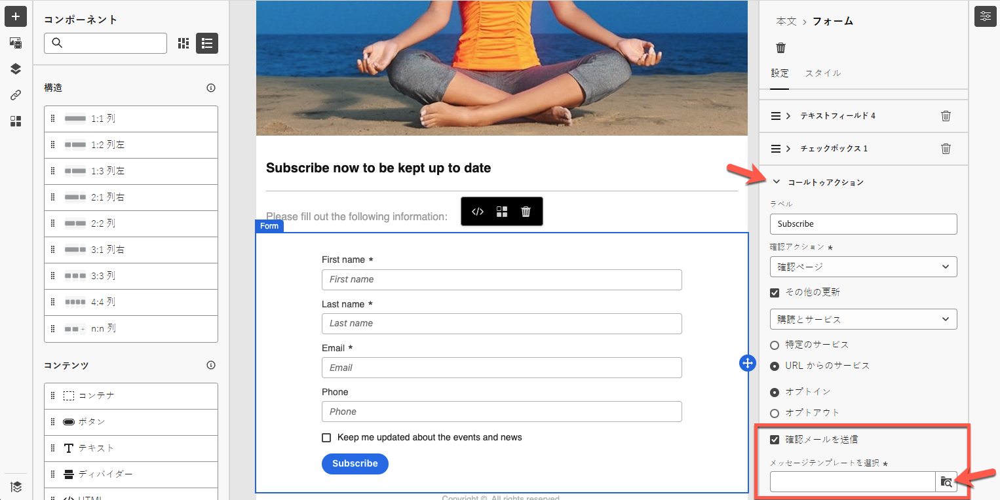

# ランディングページ固有のコンテンツの定義 {#lp-content}

>[!CONTEXTUALHELP]
>id="ac_lp_components"
>title="コンテンツコンポーネントの使用"
>abstract="コンテンツコンポーネントは、ランディングページのレイアウトの作成に使用できる空のコンテンツプレースホルダーです。ユーザーが選択肢を選択して送信できるようにする特定のコンテンツを定義するには、フォームコンポーネントを使用します。"

>[!CONTEXTUALHELP]
>id="acw_landingpages_primarypage"
>title="プライマリページ設定の定義"
>abstract="プライマリページは、メールや web サイトなど、ユーザーがランディングページへのリンクをクリックした際、直ちに表示されます。"

ランディングページの任意のページのコンテンツを編集できます。

最初のページは、ユーザーがランディングページへのリンクをクリックした後すぐに表示され、選択したテンプレート <!-- to enable users to select and submit their choices--> の[ランディングページ固有のフォームコンポーネント](#use-form-component)が事前入力されています。

**[!UICONTROL 確認]**、**[!UICONTROL エラー]**、**[!UICONTROL 有効期限]**&#x200B;のページのコンテンツも事前入力されます。必要に応じて編集します。

また、[ランディングページのスタイル](#lp-form-styles)を定義できます。

ランディングページのコンテンツをさらにデザインするには：

* メールのデザインに使用するコンポーネントと同じコンポーネントを使用できます。[詳細情報](../email/content-components.md#add-content-components)

* メールと同じ方法で、ランディングページに条件付きコンテンツを追加できます。[詳細情報](../personalization/conditions.md#condition-condition-builder)

  >[!AVAILABILITY]
  >
  >この機能は、限定提供（LA）です。これは、**Adobe Campaign Standard から Adobe Campaign v8** に移行するお客様に限定され、他の環境にはデプロイできません。

## フォームコンポーネントの使用 {#use-form-component}

>[!CONTEXTUALHELP]
>id="ac_lp_formfield"
>title="フォームコンポーネントフィールドの設定"
>abstract="受信者がランディングページから選択肢を表示および送信する方法を定義します。"

>[!CONTEXTUALHELP]
>id="acw_landingpages_calltoaction"
>title="ボタンをクリックした際の動作"
>abstract="ユーザーがランディングページフォームを送信した際の動作を定義します。"

ユーザーがランディングページから選択肢を選択して送信できるようにする特定のコンテンツを定義するには、**[!UICONTROL フォーム]**&#x200B;コンポーネントを編集します。それには、次の手順に従います。

1. ランディングページ固有の&#x200B;**[!UICONTROL フォーム]**&#x200B;コンポーネントは、選択したテンプレートのキャンバスに既に表示されています。

   >[!NOTE]
   >
   >**[!UICONTROL フォーム]**&#x200B;コンポーネントは、同じページで 1 回のみ使用できます。

1. これを選択します。「**[!UICONTROL フォームコンテンツ]**」タブが右側のパレットに表示され、フォームの様々なフィールドを編集できます。

   {zoomable="yes"}

   >[!NOTE]
   >
   >フォーム コンポーネントコンテンツのスタイルを編集するには、いつでも「**[!UICONTROL スタイル]**」タブに切り替えます。[詳細情報](#lp-form-styles)

1. 1 つ目のテキストフィールドがある場合は展開するか、「**[!UICONTROL 追加]**」ボタンを使用してテキストフィールドを追加します。「**[!UICONTROL テキストフィールド 1]**」セクションから、ユーザーが値を入力する前にフィールド内に表示されるフィールドタイプ、更新するデータベースフィールド、ラベル、テキストを編集できます。

   {zoomable="yes"}

1. 必要に応じて、「**[!UICONTROL フォームフィールドを必須にする]**」オプションをオンにします。その場合、ランディングページは、ユーザーがこのフィールドに入力した場合にのみ送信できます。

   >[!NOTE]
   >
   >必須フィールドが未入力の場合、ユーザーがページを送信するとエラーメッセージが表示されます。

1. チェックボックスがある場合は、展開するか、「**[!UICONTROL 追加]**」ボタンを使用してテキストフィールドを追加します。そのチェックボックスでデータベースのサービスまたはフィールドを更新するかどうかを選択します。

   {zoomable="yes"}

   「**[!UICONTROL 購読とサービス]**」を選択した場合、リストから[サービス](../audience/manage-services.md)を選択し、次の 2 つのオプションのいずれかを選択します。

   * **[!UICONTROL オンにすると購読]**：ユーザーは、同意するには、チェックボックスをオンにする必要があります（オプトイン）。
   * **[!UICONTROL オンにすると登録解除]**：ユーザーは、チェックボックスをオンにして同意を削除する必要があります（オプトアウト）。

   **[!UICONTROL フィールド]**&#x200B;を選択した場合、属性リストからフィールドを選択し、以下の 2 つのオプションのいずれかを選択します。

   * **[!UICONTROL はい（オンの場合）]**。<!--TBC-->

   * **[!UICONTROL いいえ（オンの場合）]**。<!--TBC-->

1. フィールドの数は、テキストフィールド、ラジオボタン、チェックボックス、ドロップダウンリストなど、必要な数だけ、削除したり、追加したりできます。

1. すべてのフィールドを追加または更新したら、「**[!UICONTROL コールトゥアクション]**」をクリックして、対応するセクションを展開します。これにより、**[!UICONTROL フォーム]**&#x200B;コンポーネントのボタンの動作を定義できます。[詳細情報](#define-actions-on-form-submission)

   {zoomable="yes"}

1. コンテンツを保存して、[ランディングページのプロパティ](create-lp.md#create-landing-page)に戻ります。

### フォーム送信時のアクションの定義 {#define-actions-on-form-submission}

1. 次のボタンをクリックした場合の動作を定義します。

   * **[!UICONTROL 確認ページ]**：デフォルトでは、ユーザーは現在のランディングページに設定されている&#x200B;**[!UICONTROL 確認]**&#x200B;ページにリダイレクトされます。

   * **[!UICONTROL リダイレクト URL]**：ユーザーがリダイレクトされるページの URL を入力します。

   * **[!UICONTROL ランディングページ]**：ユーザーのリダイレクト先となる別のランディングページを選択できます。それに応じて選択したランディングページを設定します。

1. フォームの送信時に追加の更新を行う場合は、「**[!UICONTROL 追加の更新]**」を選択し、更新する項目を選択します。
   * 購読[サービス](../audience/manage-services.md) - この場合、フォームの送信時にユーザーをオプトインまたはオプトアウトするかを定義します。メールをデザインする際に、このランディングページに対する&#x200B;**[!UICONTROL ランディングページ]**&#x200B;タイプのリンクを定義すると、選択したサービスが自動的に使用されます。[詳しくは、リンクの挿入を参照してください](../email/message-tracking.md)

     >[!NOTE]
     >
     >このランディングページで複数のサービスを使用する場合は、以下で説明する「**[!UICONTROL URL からのサービス]**」オプションを使用します。

   * チャネル - フォームの入力時に使用するメールアドレス。
   * すべてのチャネル - フォームの送信時に、ユーザーは、すべてのチャネル上のブランドからのすべての通信に対して（選択したテンプレートに応じて）オプトインまたはオプトアウトされます。
   * データベースのフィールド - 属性リストからフィールドを選択し、フォームの送信時にフィールドを True または False に設定する必要があるかどうかを定義します。

   {zoomable="yes"}

1. 「**[!UICONTROL URL からサービス]**」オプションを選択すると、ランディングページを複数のサービスに使用でき、動的になります。フォームの送信時にユーザーをオプトインまたはオプトアウトするかを定義します。

   >[!AVAILABILITY]
   >
   >この機能は、限定提供（LA）です。これは、**Adobe Campaign Standard から Adobe Campaign v8** に移行するお客様に限定され、他の環境にはデプロイできません。

   {zoomable="yes"}

   メールをデザインする際に、このランディングページに対する&#x200B;**[!UICONTROL ランディングページ]**&#x200B;タイプのリンクを定義すると、リストから任意のサービスを選択できます。その後、このランディングページに対する他のリンクを定義する際に、他のサービスを選択できます。[詳しくは、リンクの挿入を参照してください](../email/message-tracking.md)

   {zoomable="yes"}

1. ランディングページの送信時にメッセージを送信できます。[詳しくは、こちらを参照してください](#lp-message)

### 送信後のメッセージの送信 {#lp-message}

>[!AVAILABILITY]
>
>この機能は、限定提供（LA）です。これは、**Adobe Campaign Standard から Adobe Campaign v8** に移行するお客様に限定され、他の環境にはデプロイできません。

ランディングページの送信後に確認メッセージを自動的に送信するには、次の手順に従います。

1. 「**[!UICONTROL コールトゥアクション]**」セクションで、「**[!UICONTROL 確認メールを送信]**」オプションをオンにします。

1. 関連するドロップダウンリストで、送信する必要があるトランザクションメッセージテンプレートを選択します。

{zoomable="yes"}

## ランディングページフォームスタイルの定義 {#lp-form-styles}

1. いつでも「**[!UICONTROL スタイル]**」タブに切り替えて、フォームコンポーネントコンテンツのスタイルを変更できます。

1. 「**[!UICONTROL テキストフィールド]**」セクションはデフォルトで展開されます。これにより、ラベルのフォント、ラベルの位置、フィールドの背景色、フィールドの境界線など、テキストフィールドの外観を編集できます。

   {zoomable="yes"}

1. 「**[!UICONTROL チェックボックス]**」セクションを展開して、チェックボックスと対応するテキストの外観を定義します。例えば、フォントファミリとサイズ、チェックボックスの境界線の色を調整できます。

   {zoomable="yes"}

1. フォームに追加した他のフィールド（ラジオボタン、ドロップダウンリスト、日付と時刻など）に対応する他のセクションを展開して編集します。

1. 「**[!UICONTROL コールトゥアクション]**」セクションを展開して、コンポーネントフォームのボタンの外観を変更します。例えば、フォントの変更や境界線の追加、マウスポインターを置いたときのラベルの色を編集したり、ボタンの配置を調整したりできます。

   {zoomable="yes"}

   「**[!UICONTROL コンテンツをシミュレート]**」ボタンを使用すると、ポインターを合わせたときのボタンのラベルの色など、一部の設定をプレビューできます。[詳細情報](create-lp.md#test-landing-page)

1. 変更内容を保存します。
