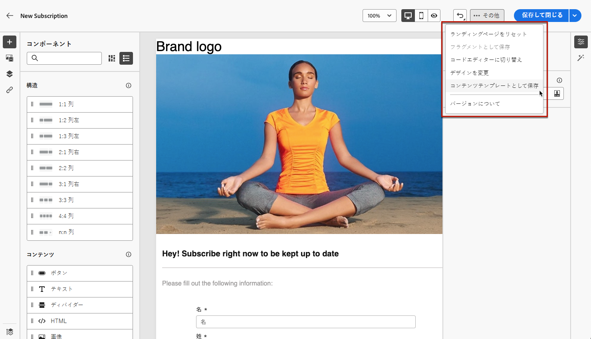
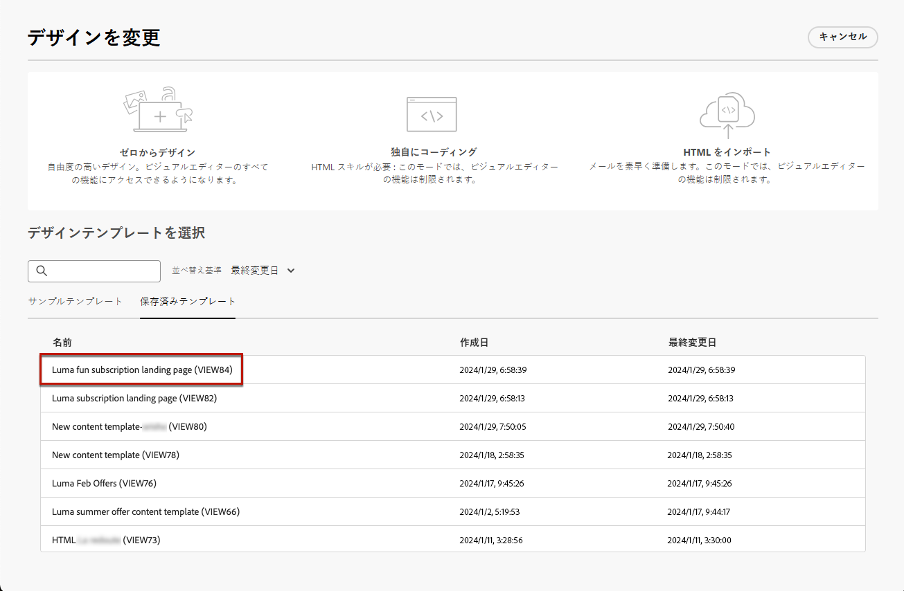
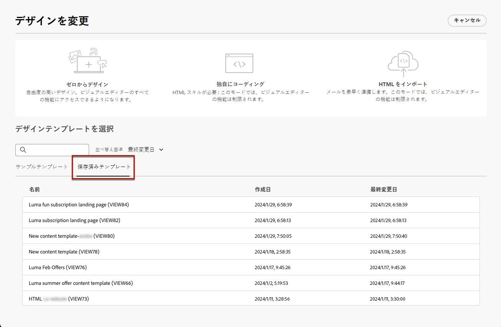
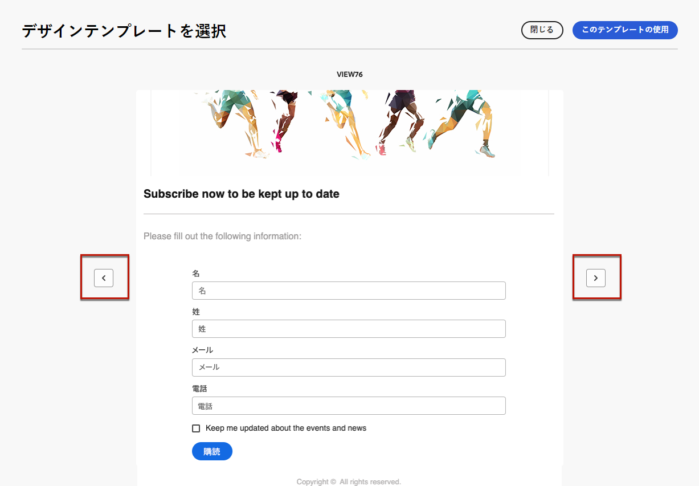

# ランディングページコンテンツテンプレートの操作 {#work-with-templates}

## ページをテンプレートとして保存 {#save-as-template}

[ ランディングページコンテンツ ](lp-content.md) をデザインしたら、後日再利用するために保存できます。 ページをテンプレートとして保存するには、次の手順に従います。

1. 画面右上の **[!UICONTROL その他]** ボタンをクリックします。

1. ドロップダウンメニューから「**[!UICONTROL コンテンツテンプレートとして保存]**」を選択します。

   {zoomable="yes"}

1. このテンプレートに名前を追加します。

1. 「**[!UICONTROL 保存]**」をクリックします。

このテンプレートを使用すると、次回ランディングページを作成する際にコンテンツを作成できます。 詳しくは、以下の[節](#use-saved-template)を参照してください。

{zoomable="yes"}

## 保存済みテンプレートの使用 {#use-saved-template}

<!--Not for GA?-->

1. ランディングページのコンテンツを編集する場合は、「**[!UICONTROL 詳細]**」ボタンをクリックし、「**[!UICONTROL デザインを変更]**」を選択します。

   {zoomable="yes"}

1. 選択内容を確認します。

   >[!NOTE]
   >
   >現在のコンテンツを削除し、新しいテンプレートのコンテンツに置き換えます。

1. 以前に保存したすべてのテンプレートのリストは、「**[!UICONTROL 保存済みのテンプレート]** タブに表示されます。 **[!UICONTROL 名前別]**、**[!UICONTROL 最終変更日]** および **[!UICONTROL 最終作成日]** で並べ替えることができます。

   {zoomable="yes"}

1. リストから目的のテンプレートを選択します。選択したら、左右の矢印を使用して、保存済みのすべてのテンプレート間を移動します。

   {zoomable="yes"}

1. 「**[!UICONTROL このテンプレートを使用]**」をクリックします。

1. ランディングページデザイナーを使用して、必要に応じてコンテンツを編集します。

<!--Primary page templates and subpage templates are managed separately, meaning that you cannot use a primary page template to create a subpage, and vice versa. TBC in Web user interface-->