# ランディングページの使用方法 {#lp-use-cases}

>[!CONTEXTUALHELP]
>id="acw_landingpages_url"
>title="慎重に URL をコピーする"
>abstract="ランディングページを完全にテストまたは活用する場合は、このリンクを web ブラウザーまたは配信に直接コピー＆ペーストできません。代わりに、**コンテンツをシミュレート**&#x200B;関数を使用してテストし、ドキュメントに記載されている手順に従ってランディングページを適切に使用します。"

>[!CONTEXTUALHELP]
>id="acw_landingpages_templates"
>title="慎重に URL をコピーする"
>abstract="ランディングページを作成する場合、標準の 4 つのテンプレートを使用して、Campaign データベースに対するプロファイルの追加または更新、サービスに対する顧客の購読、サービスからの登録解除、ユーザーのオプトアウトなど、様々なユースケースを実装できます。"
>additional-url="https://experienceleague.adobe.com/docs/campaign-web/v8/landing-pages/create-lp.html?lang=ja#create-landing-page" text="ランディングページの作成"

ランディングページを適切に使用するには、専用オプションを使用して、メッセージ内のリンクとして参照します。 公開済みの配信ダッシュボードに表示されたリンクは、配信に直接、または web ページにコピー&amp;ペーストすることはできません。 代わりに、**コンテンツをシミュレート** 機能を使用してテストします。

[!DNL Adobe Campaign Web] インターフェイスには、4 つの標準テンプレートが用意されており、異なるユースケースを実装できます。 ただし、主な手順は変わりません。次に詳しく説明します。

1. 「[ランディングページの作成](create-lp.md#create-landing-page)」をクリックし、使用例に従って、目的のテンプレートを選択します。

1. ランディングページのプロパティと設定

   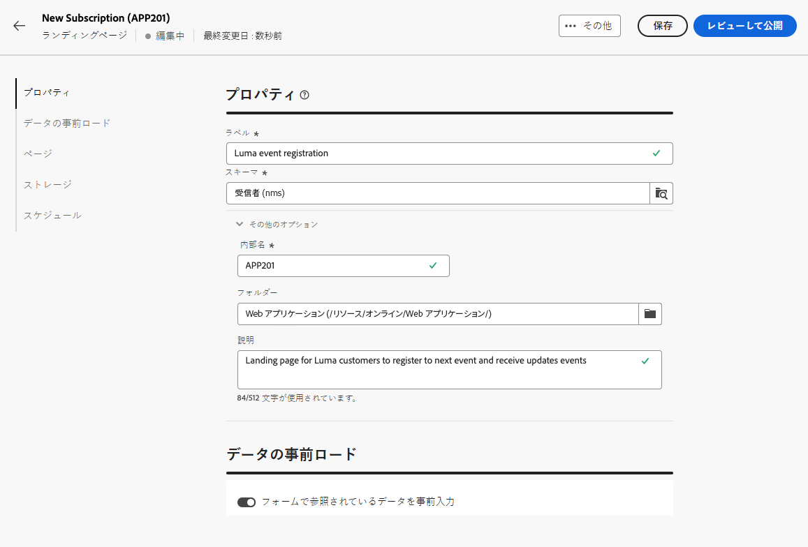{zoomable="yes"}

1. 状況に応じて、「**[!UICONTROL 購入]**」、「**[!UICONTROL 購読]**」、「**[!UICONTROL 購読解除]**」または「**[!UICONTROL ブロックリスト]**」ページを選択します。

1. ページのコンテンツが表示されます。ランディングページフォームに対応するパーツを選択します。

   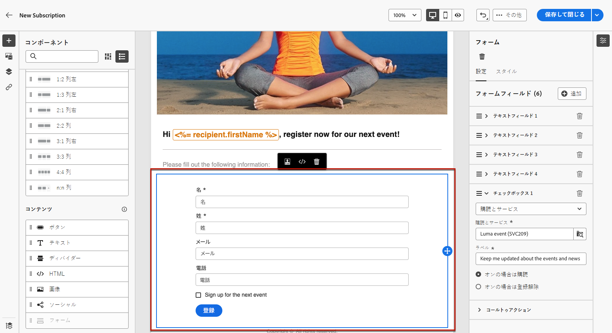{zoomable="yes"}

1. 選択したテンプレートに従ってコンテンツを編集します。

   * [獲得](#lp-acquisition)
   * [購読](#lp-subscription)
   * [購読解除](#lp-unsubscription)
   * [ブロックリスト](#lp-denylist)

1. 必要に応じて残りのコンテンツを変更し、変更を保存して閉じます。

1. 必要に応じて&#x200B;**[!UICONTROL 確認]**&#x200B;ページを編集し、**[!UICONTROL エラー]**、**[!UICONTROL 有効期限]**&#x200B;のページも同様に編集します。**[!UICONTROL 確認]** ページは、受信者がフォームを送信すると表示されます。

   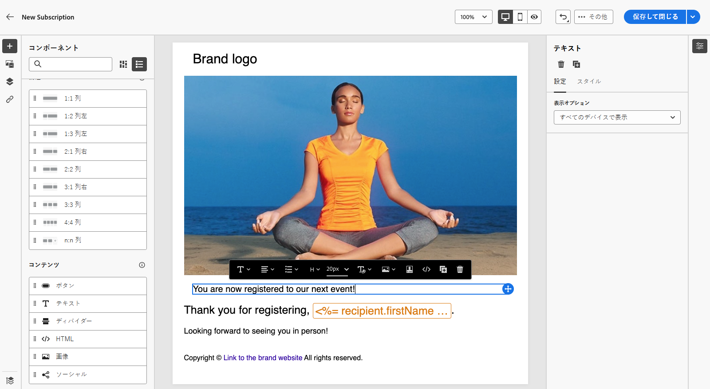{zoomable="yes"}

1. ランディングページの[テスト](create-lp.md#test-landing-page)と[公開](create-lp.md#publish-landing-page)

1. [メール](../email/create-email.md)配信を作成して、ランディングページへのトラフィックを促進する

1. メッセージコンテンツに[リンクを挿入](../email/message-tracking.md#insert-links)します。**[!UICONTROL リンクタイプ]**&#x200B;として「**[!UICONTROL ランディングページ]**」を選択し、作成したランディングページを選択します。

   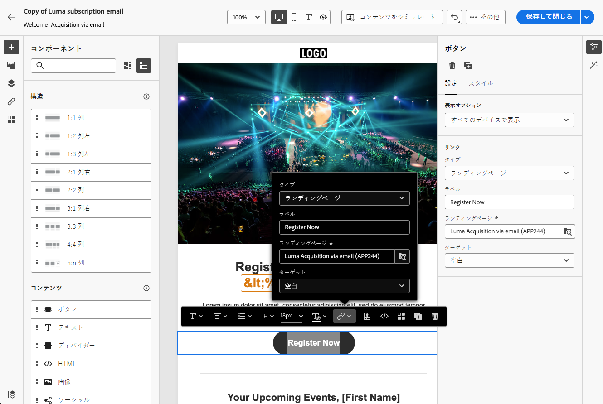{zoomable="yes"}

   >[!NOTE]
   >
   >メッセージを送信するには、選択したランディングページがまだ期限切れでないことを確認します。[詳細情報](create-lp.md#create-landing-page)

受信者がメールを受け取ったら、ランディングページへのリンクをクリックしてフォームを送信します。

* 確認ページが表示されます。
* ランディングページで定義されたその他のアクションが適用されます。例えば、ユーザーがお客様のサービスを購読する場合や、今後お客様からの連絡を受け取らない場合があります。

以下は、[!DNL Adobe Campaign] ランディングページを様々なユースケースで使用できる例です。

## プロファイルの獲得 {#lp-acquisition}

1 つ目のテンプレートでは、Campaign データベースにプロファイルを追加または更新できます。

1. [ランディングページを作成](create-lp.md#create-landing-page)するときは、**[!UICONTROL 獲得]**&#x200B;のテンプレートを選択します。

1. ランディングページのプロパティで「**[!UICONTROL フォームで参照されているデータの事前入力]**」オプションを選択して、プロファイルから既存の情報をプリロードし、重複の作成を避けます。

1. **[!UICONTROL 獲得]**&#x200B;ページを選択して、そのコンテンツを編集します。

1. プロファイルで収集する情報に従って、必要に応じてテキストフィールドを編集します。

1. ニュースレターサービスを購読するよう顧客を招待するチェックボックスを追加します。 [詳しくは、サービストの作成方法を参照してください](../audience/manage-services.md)

   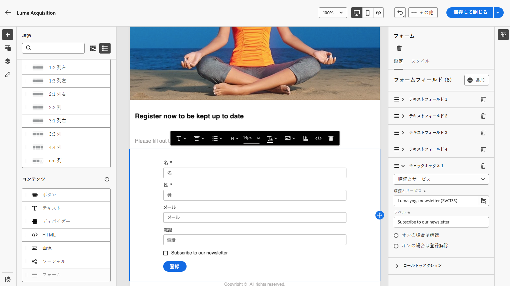{zoomable="yes"}

1. 必要に応じて、コンテンツを調整し、変更を保存します。

1. ランディングページを確認して、[公開](create-lp.md#publish-landing-page)します。

1. [メール](../email/create-email.md)を作成し、ランディングページへの[リンクを追加](../email/message-tracking.md#insert-links)します。

メールを受け取った受信者が、ランディングページへのリンクをクリックしてフォームを送信すると、受信者のプロファイルが Campaign データベースに追加されるか、指定した情報で更新されます。

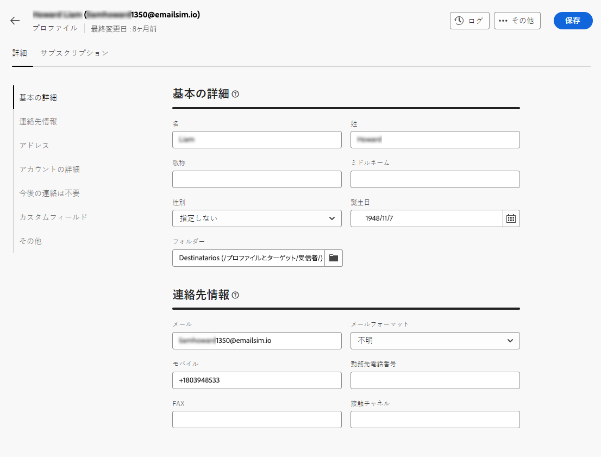{zoomable="yes"}

ニュースレターの受信をオプトインした場合、対応するサービスが購読されます。

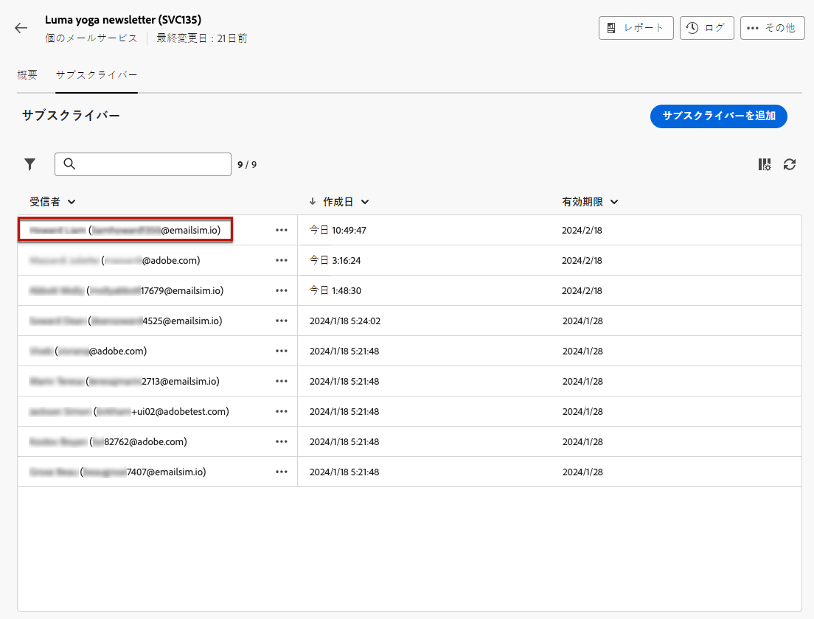{zoomable="yes"}

## サービスの購読 {#lp-subscription}

>[!CONTEXTUALHELP]
>id="acw_landingpages_subscription"
>title="購読ランディングページの設定"
>abstract="購読ページを使用すると、顧客はサービスを購読できます。"

最も一般的な使用例の 1 つは、ランディングページを通じて [ ニュースレターやイベントなどのサービスを購読 ](../audience/manage-services.md) するように顧客を招待することです。 以下の手順に従います。

<!--For example, let's say you organize an event next month and you want to launch an event registration campaign. To do this, you're going to send an email including a link to a landing page that will enable your recipients to register for this event. The users who register will be added to the subscription list that you created for this purpose.-->

1. イベントを登録しているユーザー向けの確認テンプレートを作成しておくと、サービス作成時にテンプレートを簡単に選択できます。 [詳細情報](../audience/manage-services.md#create-confirmation-message)

   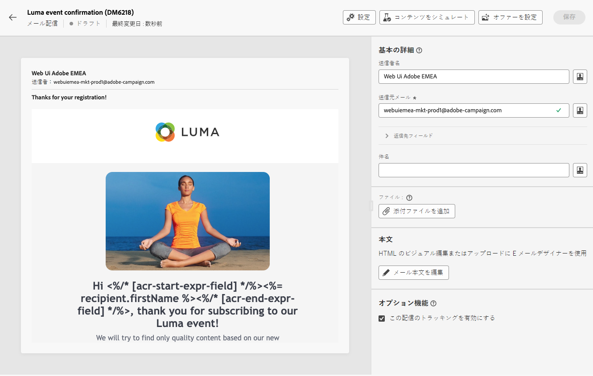{zoomable="yes"}

1. 購読サービスを作成します。このサービスは、イベントに登録されたユーザーを保存します。 [詳しくは、サービスの作成方法を参照してください](../audience/manage-services.md)

1. ユーザーが購読時に受信する確認メールとして作成したテンプレートを選択します。

   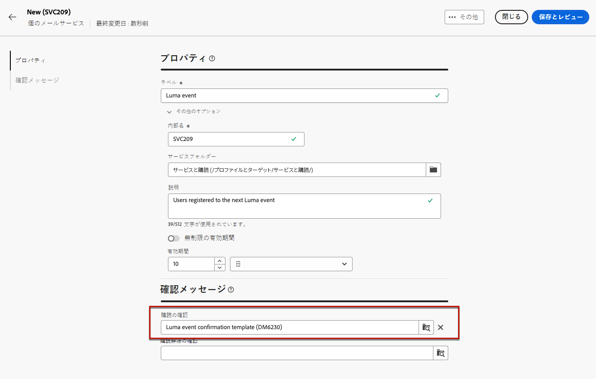{zoomable="yes"}

1. [ランディングページを作成](create-lp.md#create-landing-page)して、受信者がイベントに登録できるようにします。**[!UICONTROL 購読]**&#x200B;テンプレートを選択します。

1. コンテンツを編集する&#x200B;**[!UICONTROL 購読]**&#x200B;ページを選択します。

1. ページのコンテンツが表示されます。ランディングページフォームに対応するパーツを選択し、「**[!UICONTROL チェックボックス 1]**」セクションを展開します。

1. 「**[!UICONTROL 購読とサービス]**」フィールドで、イベント用に作成したサービスを選択します。「**[!UICONTROL オンにすると購読]**」オプションを有効のままにしておきます。

   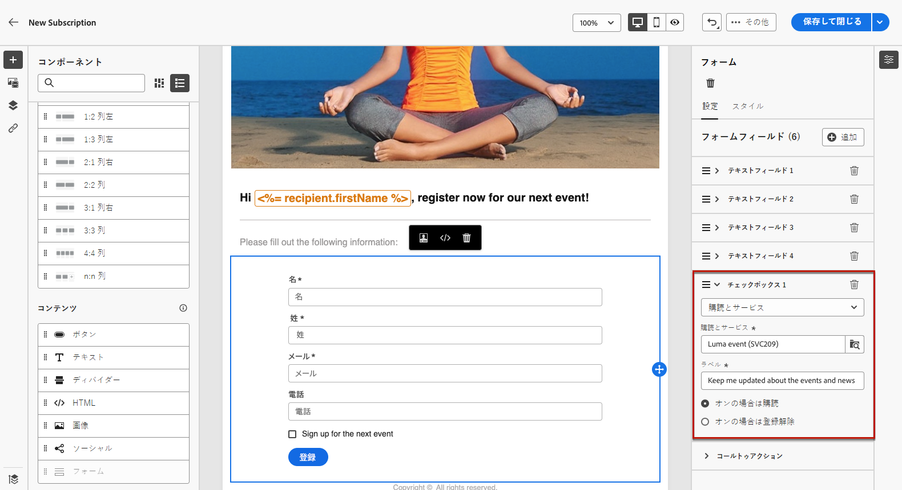{zoomable="yes"}
<!--
1. You can add an additional checkbox to offer subscription to your newsletter for example.-->

1. 必要に応じて、コンテンツを調整し、変更を保存します。

1. ランディングページを確認して、[公開](create-lp.md#publish-landing-page)します。

1. [メール](../email/create-email.md)を作成し、[リンクを追加](../email/message-tracking.md#insert-links)して、登録ランディングページへのトラフィックを推進します。

1. イベントへの登録が開始されたことを通知するメールを設計します。

メールを受け取った受信者がランディングページへのリンクをクリックしてフォームを送信すると、確認ページに移動し、購読リストに追加されます。

## 購読解除 {#lp-unsubscription}

お客様がランディングページを使用してサービスを登録解除することができます。

1. サービスの登録解除するユーザー用の確認テンプレートを作成して、サービスの作成時に簡単に選択できるようにします。 [詳細情報](../audience/manage-services.md#create-confirmation-message)

1. [購読サービス](../audience/manage-services.md)で、ユーザーが購読解除時に受信する確認メールとして作成したテンプレートを選択します。

1. [ランディングページを作成します](create-lp.md#create-landing-page)。**[!UICONTROL 購読解除]**&#x200B;テンプレートを選択します。

1. コンテンツを編集する&#x200B;**[!UICONTROL 購読解除]**&#x200B;ページを選択します。

1. ページのコンテンツが表示されます。ランディングページフォームに対応するパーツを選択します。

1. 「**[!UICONTROL チェックボックス]**」セクションを追加し、サービスを選択して、「**[!UICONTROL オンの場合は購読解除]** オプションを選択します。

   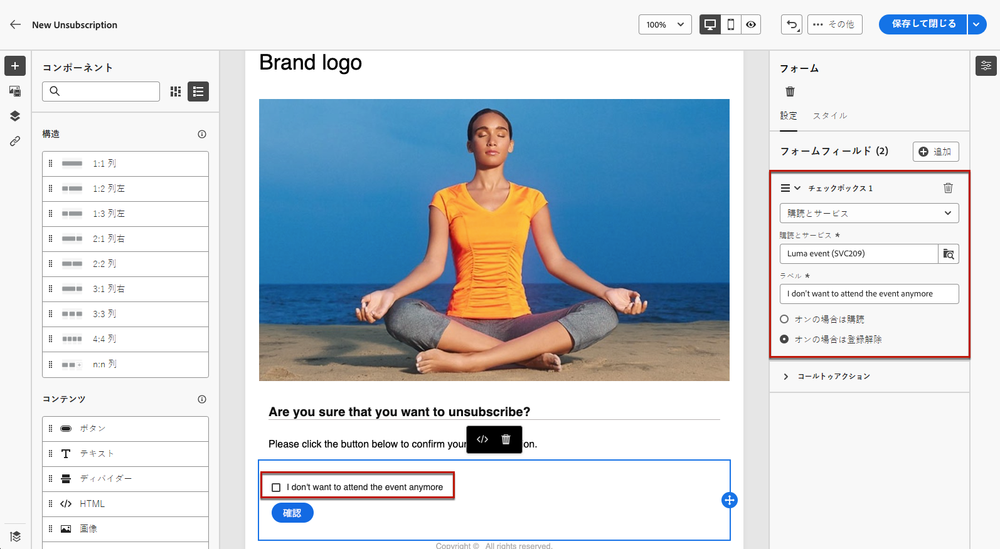{zoomable="yes"}

1. 「**[!UICONTROL コールトゥアクション]**」セクションを展開し、「**[!UICONTROL 追加の更新]**」オプションを選択します。 サービスを選択し、「**[!UICONTROL オプトアウト]**」オプションをオンにします。

   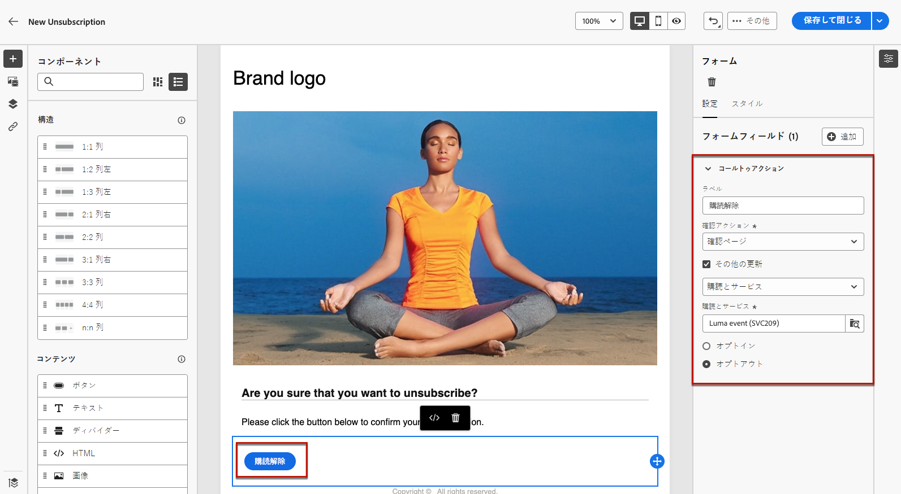{zoomable="yes"}

1. 必要に応じて、コンテンツを調整し、変更を保存します。

1. ランディングページを確認して、[公開](create-lp.md#publish-landing-page)します。

1. [メール](../email/create-email.md)を作成し、ランディングページに[リンクを追加](../email/message-tracking.md#insert-links)します。

メールを受け取った受信者がランディングページへのリンクをクリックしてフォームを送信すると、購読解除の確認ページに移動し、対応する購読サービスから削除されます。

## ブロックリスト {#lp-denylist}

受信者がブランドからのコミュニケーションを登録解除する機能を提供することは、法的要件で定められています。したがって、受信者に送信されるすべてのメールに&#x200B;**登録解除リンク**&#x200B;を必ず含める必要があります。受信者がこのリンクをクリックすると、オプトアウトを確認するボタンを含むランディングページが表示されます。

**[!UICONTROL ブロックリスト]**&#x200B;ランディングページを設定して、ユーザーがすべての配信をオプトアウトできるようにすることができます。

1. [ランディングページを作成](create-lp.md#create-landing-page)する際に、**[!UICONTROL ブロックリスト]**&#x200B;テンプレートを選択します。

1. コンテンツを編集する&#x200B;**[!UICONTROL ブロックリスト]**&#x200B;ページを選択します。

1. 「**[!UICONTROL コールトゥアクション]**」セクションを展開し、「**[!UICONTROL 追加の更新]**」オプションを選択します。

1. 対応するドロップダウンリストから「**[!UICONTROL チャネル（メール）]**」を選択して、受信者がメール通信のみをオプトアウトできるようにします。すべてのチャネルのすべての通信からオプトアウトするために、「すべてのチャネルによる **&#x200B;**&#x200B;を選択することもできます。

   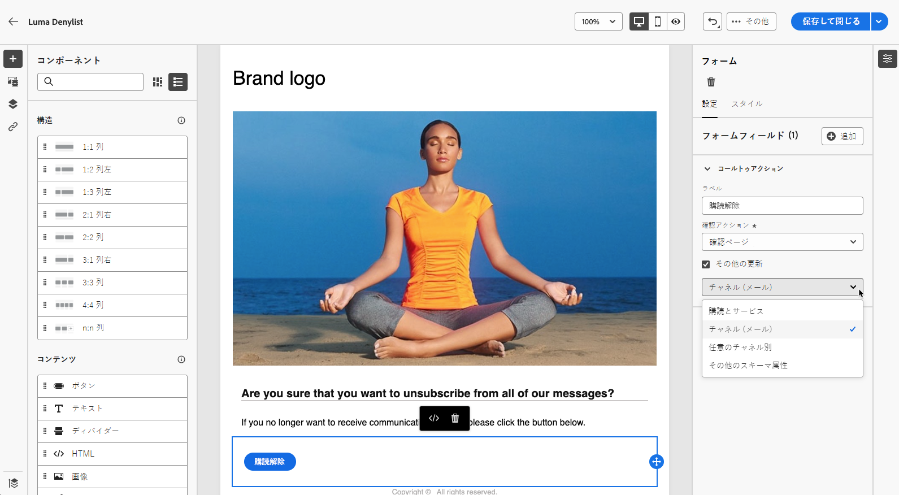{zoomable="yes"}

1. 必要に応じて、コンテンツを調整し、変更を保存します。

1. ランディングページを確認して、[公開](create-lp.md#publish-landing-page)します。

1. ランディングページに [ メール ](../email/create-email.md) および [ リンクを追加 ](../email/message-tracking.md#insert-links) を作成して、ユーザーがコミュニケーションの受信をオプトアウトできるようにします。

メールを受信した受信者がランディングページへのリンクをクリックしてフォームを送信すると、ブロックリスト確認ページに誘導され、受信者が提供した情報でプロファイルが更新されます。

対応するプロファイルの選択が更新されたことを確認するには、**[!UICONTROL プロファイル]**&#x200B;メニューを参照して、そのプロファイルを選択します。

例えば、ランディングページで「**[!UICONTROL チャネル（メール）]**」オプションの更新を選択した場合、「**[!UICONTROL 今後のメールによる連絡は不要]**」オプションがオンになります。

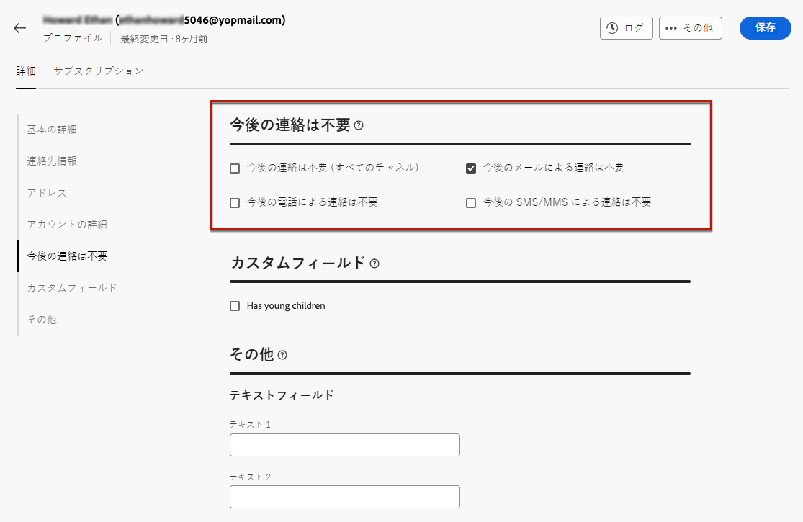{zoomable="yes"}

このプロファイルは、再度購読しない限りブランドからのメール通信は受信されません。