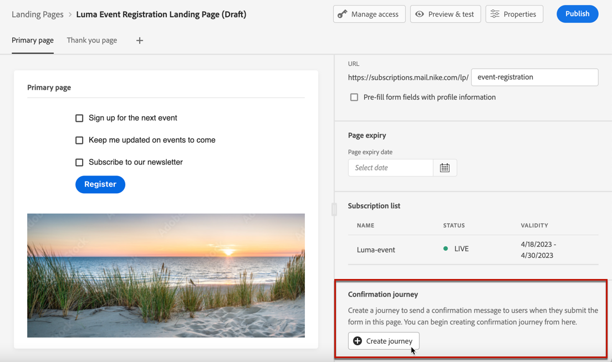
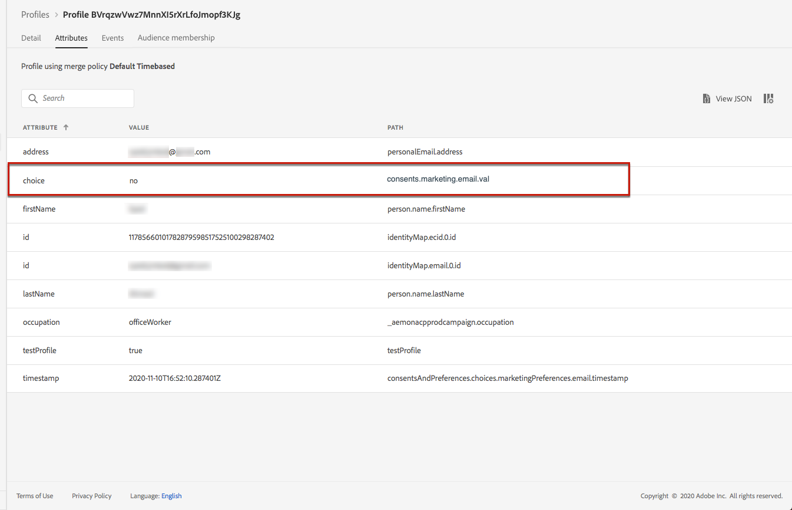
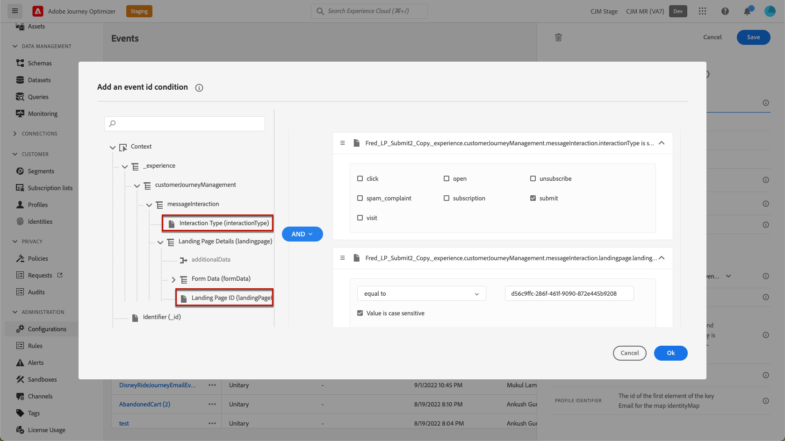

# ランディングページの使用例 {#lp-use-cases}

以下に、 [!DNL Journey Optimizer] ランディングページを使用して、一部またはすべてのコミュニケーションの受信から顧客がオプトイン/オプトアウトできるようにすることを検討してください。

## サービスの購読 {#subscription-to-a-service}

最も一般的な使用例の 1 つは、顧客を [サービスを購読する](subscription-list.md) （ニュースレターやイベントなど）ランディングページを通じて。 主な手順は次のグラフに示します。

例えば、イベントを来月整理し、イベント登録キャンペーンを開始するとします<!--to keep your customers that are interested updated on that event-->. これをおこなうには、受信者がこのイベントに登録できるようにするランディングページへのリンクを含む E メールを送信します。 登録したユーザーは、この目的で作成した購読リストに追加されます。

### ランディングページの設定 {#set-up-lp}

1. イベント登録の購読リストを作成します。このリストには、登録済みユーザーが格納されます。 購読リストの作成方法を説明します [ここ](subscription-list.md#define-subscription-list).

   

1. [ランディングページの作成](create-lp.md) をクリックして、受信者がイベントに登録できるようにします。

   

1. 登録の設定 [プライマリランディングページ](create-lp.md#configure-primary-page).

1. を設計する際に [ランディングページコンテンツ](design-lp.md)「 」で、作成した購読リストを選択し、「登録」チェックボックスをオンにしたプロファイルで更新します。

   

1. 受信者が登録フォームを送信すると、受信者に表示される「ありがとうございました」ページを作成します。 ランディングサブページの設定方法を説明します [ここ](create-lp.md#configure-subpages).

   

1. [公開](create-lp.md#publish) ランディングページ。

1. 内 [ジャーニー](../building-journeys/journey.md)、を追加します。 **電子メール** トラフィックを登録ランディングページに導く「 」アクティビティ。

   

1. [E メールのデザイン](../email/get-started-email-design.md) イベントの登録が開始されました。

1. [リンクを挿入](../email/message-tracking.md#insert-links) をメッセージコンテンツに追加します。 選択 **[!UICONTROL ランディングページ]** として **[!UICONTROL リンクタイプ]** を選択し、 [ランディングページ](create-lp.md#configure-primary-page) 登録用に作成した

   

   >[!NOTE]
   >
   >メッセージを送信するには、選択したランディングページがまだ期限切れでないことを確認します。 有効期限の更新方法を説明します [この節](create-lp.md#configure-primary-page).

   受信者が E メールを受け取ると、ランディングページへのリンクをクリックすると、「ありがとうございました」ページに移動し、購読リストに追加されます。

### 確認メールを送信
 {#send-confirmation-email}

また、イベントに登録した受信者に確認 E メールを送信することもできます。 それには、次の手順に従います。

1. 別のを作成 [ジャーニー](../building-journeys/journey.md). ランディングページで **[!UICONTROL ジャーニーを作成]** 」ボタンをクリックします。 [詳細情報](create-lp.md#configure-primary-page)

   

1. を展開します。 **[!UICONTROL イベント]** カテゴリとドロップ **[!UICONTROL オーディエンスの選定]** アクティビティをキャンバスに追加します。 [詳細情報](../building-journeys/audience-qualification-events.md)

1. をクリックします。 **[!UICONTROL 対象ユーザ]** 「 」フィールドで、作成した購読リストを選択します。

   

1. 選択した確認 E メールを追加し、ジャーニーを通じて送信します。

   

イベントに登録したすべてのユーザーに確認メールが送信されます。

<!--The event registration's subscription list tracks the profiles who registered and you can send them targeted event updates.-->

## オプトアウト {#opt-out}

受信者がコミュニケーションを購読解除できるようにするには、オプトアウトランディングページへのリンクを E メールに含めます。

受信者の同意の管理と、これが重要な理由について詳しくは、 [この節](../privacy/opt-out.md).

### オプトアウト管理 {#opt-out-management}

受信者がブランドからの通信の受信を登録解除する機能を提供することは、法的要件です。 該当する法律について詳しくは、 [Experience Platform文書](https://experienceleague.adobe.com/docs/experience-platform/privacy/regulations/overview.html#regulations){target="_blank"}.

したがって、常に **配信停止リンク** 受信者に送信されるすべての e メール内：

* 受信者は、このリンクをクリックすると、オプトアウトを確認するボタンを含むランディングページに誘導されます。
* オプトアウトボタンをクリックすると、プロファイルデータがこの情報で更新されます。

### オプトアウトの設定 {#configure-opt-out}

E メールの受信者がランディングページを通じてコミュニケーションを購読解除できるようにするには、次の手順に従います。

1. ランディングページを作成します。 [詳細情報](create-lp.md)

1. プライマリページを定義します。 [詳細情報](create-lp.md#configure-primary-page)

1. [デザイン](design-lp.md) プライマリページコンテンツ：ランディングページ固有のを使用します。 **[!UICONTROL フォーム]** コンポーネント、定義 **[!UICONTROL オプトアウト]** チェックボックスをオンにして更新を選択 **[!UICONTROL チャネル（E メール）]**：ランディングページのオプトアウトボックスをチェックするプロファイルは、すべてのコミュニケーションからオプトアウトされます。

   

   <!--You can also build your own landing page and host it on the third-party system of your choice.-->

1. 確認を追加 [サブページ](create-lp.md#configure-subpages) フォームを送信するユーザーに表示されます。

   

   >[!NOTE]
   >
   >必ずプライマリページの **[!UICONTROL コールトゥアクション]** のセクション **[!UICONTROL フォーム]** コンポーネント。 [詳細情報](design-lp.md)

1. ページのコンテンツを設定して定義したら、 [公開](create-lp.md#publish) ランディングページ。

1. [電子メールメッセージの作成](../email/get-started-email-design.md) ジャーニーで。

1. コンテンツ内のテキストを選択し、 [リンクを挿入](../email/message-tracking.md#insert-links) コンテキストツールバーを使用する。 ボタンにリンクを使用することもできます。

1. 選択 **[!UICONTROL ランディングページ]** から **[!UICONTROL リンクタイプ]** ドロップダウンリストで、 [ランディングページ](create-lp.md#configure-primary-page) オプトアウト用に作成した

   

   >[!NOTE]
   >
   >メッセージを送信するには、選択したランディングページがまだ期限切れでないことを確認します。 有効期限の更新方法を説明します [この節](create-lp.md#configure-primary-page).

1. ジャーニーを公開して実行します。 [詳細情報](../building-journeys/journey.md)。

1. メッセージを受け取ると、受信者が E メールの購読解除リンクをクリックすると、ランディングページが表示されます。

   

   受信者がボックスをオンにしてフォームを送信した場合：

   * オプトアウトした受信者は、確認メッセージ画面にリダイレクトされます。

   * プロファイルデータは更新され、再度購読しない限り、ブランドからの通信は受信されません。

対応するプロファイルの選択が更新されたことを確認するには、「Experience Platform」に移動し、 ID 名前空間と対応する ID 値を選択して、プロファイルにアクセスします。 詳しくは、 [Experience Platform文書](https://experienceleague.adobe.com/docs/experience-platform/profile/ui/user-guide.html#getting-started){target="_blank"}.

Adobe Analytics の **[!UICONTROL 属性]** 」タブをクリックすると、 **[!UICONTROL 選択]** は次の値に変更されました： **[!UICONTROL いいえ]**.

オプトアウト情報は、 **同意サービスデータセット**. [データセットの詳細を説明します](../data/get-started-datasets.md)

>[!NOTE]
>
>デフォルトの結合メソッドの場合 [Adobe Experience Platform](https://experienceleague.adobe.com/docs/experience-platform/profile/home.html){target="_blank"} **[!UICONTROL Profiles]** merge policy is **[!UICONTROL Dataset Precedence]**, make sure to enable the **[!UICONTROL AJO Consent Service Dataset]** and to prioritize it in the merge policy. [Learn more](https://experienceleague.adobe.com/docs/experience-platform/profile/merge-policies/ui-guide.html#dataset-precedence-profile){target="_blank"}
>
>このデータセットにバッチが追加されていない場合でも、オプトイン/オプトアウト情報が含まれます。

<!--

### Other ways to opt out

You can also enable your recipients to unsubscribe whithout using landing pages.

* **One-click opt-out**

    You can add a one-click opt-out link into your email content. This will enable your recipients to quickly unsubscribe from your communications, without being redirected to a landing page where they need to confirm opting out. [Learn more](../privacy/opt-out.md#one-click-opt-out-link)

* **Unsubscribe link in header**

    If the recipients' email client supports displaying an unsubscribe link in the email header, emails sent with [!DNL Journey Optimizer] automatically include this link. [Learn more](../privacy/opt-out.md#unsubscribe-header)

////////

## Leverage landing page submission event {#leverage-lp-event}

You can use information that was submitted on a landing page to send communications to your customers. For example, if a user subscribes to a given subscription list, you can leverage that information to send an email recommending other subscription lists to that user.

To do this, you need to create an event containing the landing page submission information and use it in a journey. Follow the steps below.

1. Go to **[!UICONTROL Administration]** > **[!UICONTROL Configurations]**, and in the **[!UICONTROL Events]** section, select **[!UICONTROL Manage]**.

    

1. The list of events displays. Select **[!UICONTROL Create Event]**.

    

1. The event configuration pane opens on the right side of the screen. Configure a rule-based unitary event. [Learn more](../event/about-creating.md)

1. Define the schema: select **[!UICONTROL AJO Email Tracking Experience Event Schema v.1]** (available by default in [!DNL Journey Optimizer]).

    

1. In the **[!UICONTROL Fields]** section, select the following elements:

    * **[!UICONTROL _experience]** > **[!UICONTROL customerJourneyManagement]** > **[!UICONTROL messageInteraction]** > **[!UICONTROL Interaction Type]**
    
    * **[!UICONTROL _experience]** > **[!UICONTROL customerJourneyManagement]** > **[!UICONTROL messageInteraction]** > **[!UICONTROL Landing Page Details]** > **[!UICONTROL Landing Page ID]**

    

1. Click inside the **[!UICONTROL Event ID condition]** field. Using the simple expression editor, define the condition for the **[!UICONTROL Interaction Type]** and **[!UICONTROL Landing Page ID]** fields. This will be used by the system to identify the events that will trigger your journey.

    

    >[!NOTE]
    >
    >To find the landing page ID, you can insert the landing page as a link into an email and select the source code from the contextual toolbar to display the landing page information.
    >
    >

1. Save your changes.

1. Create a [journey](../building-journeys/journey.md). You can do it directly from the landing page by clicking the **[!UICONTROL Create journey]** button. Learn more [here](create-lp.md#configure-primary-page)

    

1. In the journey, unfold the **[!UICONTROL Events]** category and drop the event that you created into the canvas. Learn more [here](../building-journeys/audience-qualification-events.md)

    

1. Unfold the **[!UICONTROL Actions]** category and drop an email action into the canvas.

    

///How do you use the information from the event to send an email to the users? -->
