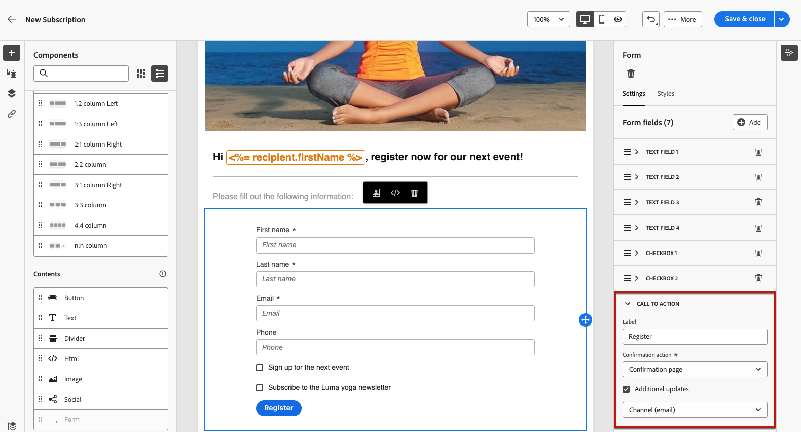

# ランディングページの使用方法 {#lp-use-cases}

>[!CONTEXTUALHELP]
>id="acw_landingpages_url"
>title="URL をコピーする際は注意が必要です"
>abstract="ランディングページを完全にテストまたは活用するには、このリンクを Web ブラウザーや配信に直接コピー&amp;ペーストすることはできません。 代わりに、 **コンテンツをシミュレート** 関数を使用してテストし、ドキュメントに記載されている手順に従ってランディングページを適切に使用します。"

ランディングページを適切に使用するには、専用のオプションを使用して、配信でリンクとして参照する必要があります。

>[!CAUTION]
>
>ランディングページを最大限に活用するには、公開された配信ダッシュボードに表示されるリンクを、直接配信または Web ページにコピー&amp;ペーストすることはできません。

Adobe Analytics の [!DNL Adobe Campaign Web] inferface では、標準の 4 つのテンプレートを使用して、様々なユースケースを実装できます。 ただし、主な手順は変わりません。次に詳しく説明します。

1. [ランディングページの作成](create-lp.md#create-landing-page) をクリックし、使用例に応じて、目的のテンプレートを選択します。

   * [獲得](#lp-acquisition)
   * [購読](#lp-subscription)
   * [購読解除](#lp-unsubscription)
   * [ブロックリスト](#lp-denylist)

1. ランディングページのプロパティと設定を定義します。

   

1. お使いの場合に応じて、 **[!UICONTROL 獲得]**, **[!UICONTROL 購読]**, **[!UICONTROL 購読解除]** または **[!UICONTROL ブロックリストに加える]** ページに貼り付けます。

1. ページのコンテンツが表示されます。 ランディングページフォームに対応するパーツを選択します。

   

1. ランディングページのラベルとフィールドを必要に応じて、それ以外の更新をいくつでもおこないます。 残りのコンテンツを必要に応じて編集し、変更を保存して閉じます。

1. 各使用例について、以下に説明する手順に従います。

1. を編集します。 **[!UICONTROL 確認]** 必要に応じてページを作成し、 **[!UICONTROL エラー]** および **[!UICONTROL 有効期限]** ページ。 登録フォームを送信すると、受信者に表示されます。

   

1. テストおよび [公開](create-lp.md#publish-landing-page) ランディングページを作成します。

1. の作成 [電子メール](../email/create-email.md) ランディングページへのトラフィックを促進する配信

1. メッセージコンテンツに[リンクを挿入](../email/message-tracking.md#insert-links)します。選択 **[!UICONTROL ランディングページ]** として **[!UICONTROL リンクタイプ]** を選択し、 [ランディングページ](create-lp.md#configure-primary-page) 作成した

   

   >[!NOTE]
   >
   >メッセージを送信するには、選択したランディングページがまだ期限切れでないことを確認します。有効期限の更新方法について詳しくは、[この節](create-lp.md#create-landing-page)を参照してください。

受信者が E メールを受け取ったら、受信者がランディングページへのリンクをクリックし、ランディングページフォームを送信すると、確認ページに移動し、ランディングページで定義されたその他のアクションが適用されます（例：ユーザーがサービスを購読するか、今後連絡を受け取りません）。

[!DNL Adobe Campaign] ランディングページを使用して、顧客にコミュニケーションの一部またはすべての受信をオプトイン／オプトアウトさせる方法例をいくつか、以下に示します。

## プロファイルの獲得 {#lp-acquisition}

1. [ランディングページの作成](create-lp.md#create-landing-page). を選択します。 **[!UICONTROL 獲得]** テンプレート。

1. ランディングページのプロパティと設定を定義します。

   

1. を選択します。 **[!UICONTROL 獲得]** ページの内容を編集します。

1. ページのコンテンツが表示されます。 ランディングページフォームに対応するパーツを選択します。

## サービスの購読 {#lp-subscription}

最も一般的なユースケースの 1 つでは、ランディングページを通じて[サービスを購読](../audience/manage-services.md)するよう（ニュースレターやイベントなど）顧客を招待します。以下の手順に従います。

<!--For example, let's say you organize an event next month and you want to launch an event registration campaign. To do this, you're going to send an email including a link to a landing page that will enable your recipients to register for this event. The users who register will be added to the subscription list that you created for this purpose.-->

1. まず、サービスの作成時に簡単に選択できるように、イベントを購読しているユーザー用の確認テンプレートを作成します。 [詳細情報](../audience/manage-services.md#create-confirmation-message)

   

1. 登録済みユーザーをイベントに保存する購読サービスを作成します。 [サービスの作成方法を説明します](../audience/manage-services.md)

1. ユーザーが購読時に受け取る確認 E メールとして作成したテンプレートを選択します。

   

1. [ランディングページの作成](create-lp.md#create-landing-page) をクリックして、受信者がイベントに登録できるようにします。 を選択します。 **[!UICONTROL 購読]** テンプレート。

   <!---->

1. ランディングページのプロパティと設定を定義します。

   <!---->

1. を選択します。 **[!UICONTROL 購読]** ページの内容を編集します。

   

1. ページのコンテンツが表示されます。 ランディングページフォームに対応するパーツを選択し、 **[!UICONTROL チェックボックス 1]** 」セクションに入力します。

   Adobe Analytics の **[!UICONTROL 購読とサービス]** 「 」フィールドで、イベント用に作成したサービスを選択します。 を残します。 **[!UICONTROL オンにすると購読]** オプションが有効です。

   

1. 例えば、ニュースレターの購読をオファーするためのチェックボックスを追加できます。

<!--

1. You can also update the profiles who register for your event for the email channel. Expand the **[!UICONTROL Call to action]** section and select Additional updates.

    -->

1. ランディングページのラベルとフィールドを必要に応じて、それ以外の更新をいくつでもおこないます。 残りのコンテンツを必要に応じて編集し、変更を保存して閉じます。

1. を編集します。 **[!UICONTROL 確認]** 必要に応じてページを作成し、 **[!UICONTROL エラー]** および **[!UICONTROL 有効期限]** ページ。 登録フォームを送信すると、受信者に表示されます。

   

1. テストおよび [公開](create-lp.md#publish-landing-page) ランディングページを作成します。

1. の作成 **電子メール** トラフィックを促進する配信を登録ランディングページに送信します。 イベントの登録が開かれたことを知らせる電子メールをデザインします。

1. メッセージコンテンツに[リンクを挿入](../email/message-tracking.md#insert-links)します。**[!UICONTROL リンクタイプ]**&#x200B;として「**[!UICONTROL ランディングページ]**」を選択し、登録用に作成した[ランディングページ](create-lp.md#configure-primary-page)を選択します。

   

   >[!NOTE]
   >
   >メッセージを送信するには、選択したランディングページがまだ期限切れでないことを確認します。有効期限の更新方法について詳しくは、[この節](create-lp.md#create-landing-page)を参照してください。

受信者が E メールを受け取ったら、受信者がランディングページへのリンクをクリックしてランディングページフォームを送信すると、確認ページに移動し、購読リストに追加されます。

## 購読解除 {#lp-unsubscription}

1. [ランディングページの作成](create-lp.md#create-landing-page). を選択します。 **[!UICONTROL 購読解除]** テンプレート。

1. ランディングページのプロパティと設定を定義します。

1. を選択します。 **[!UICONTROL 購読解除]** ページの内容を編集します。

1. ページのコンテンツが表示されます。 ランディングページフォームに対応するパーツを選択します。

## オプトアウトランディングページの設定 {#lp-denylist}

受信者がブランドからのコミュニケーションを登録解除する機能を提供することは、法的要件で定められています。該当する法律について詳しくは、[Experience Platform ドキュメント](https://experienceleague.adobe.com/docs/experience-platform/privacy/regulations/overview.html?lang=ja#regulations){target="_blank"}を参照してください。

したがって、受信者に送信されるすべての メールに&#x200B;**登録解除リンク**&#x200B;を必ず含める必要があります。

* 受信者がこのリンクをクリックすると、オプトアウトを確認するボタンを含むランディングページが表示されます。
* オプトアウトボタンをクリックすると、プロファイルのデータがこの情報で更新されます。

次の設定を行うことができます： **[!UICONTROL ブロックリストに加える]** すべての配信のオプトアウトをユーザーに許可するランディングページ。

ユーザーがすべての配信をオプトアウトできるようにするには、 **[!UICONTROL ブロックリストに加える]** ランディングページ。

ユーザーがランディングページのリンクをクリックすると、 **[!UICONTROL 今後の連絡は不要（すべてのチャネル）]** 」オプションが自動的に選択されます。

を定義する **[!UICONTROL オプトアウト]** チェックボックスをオンにして更新を選択 **[!UICONTROL チャネル（E メール）]**：ランディングページのオプトアウトボックスをチェックするプロファイルは、すべてのコミュニケーションからオプトアウトされます。

メッセージを受信した受信者がメール内の登録解除リンクをクリックすると、ランディングページが表示されます。

受信者がチェックボックスをオンにしてフォームを送信すると、次のようになります。

* オプトアウトした受信者は、確認メッセージ画面にリダイレクトされます。

* プロファイルデータが更新され、再度購読しない限りブランドからの通信は受信されません。

対応するプロファイルの選択が更新されたことを確認するには、「プロファイル」に移動し、プロファイルを選択します。

