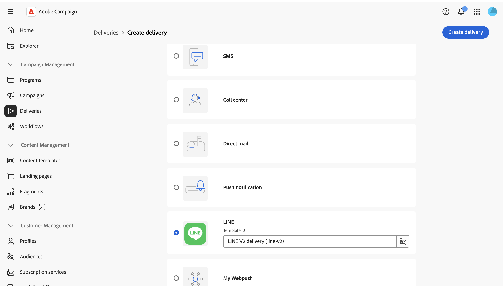
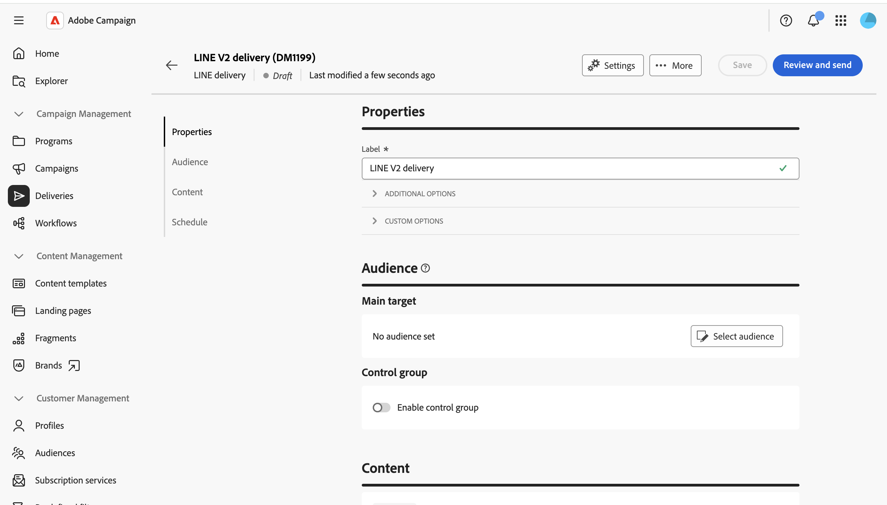
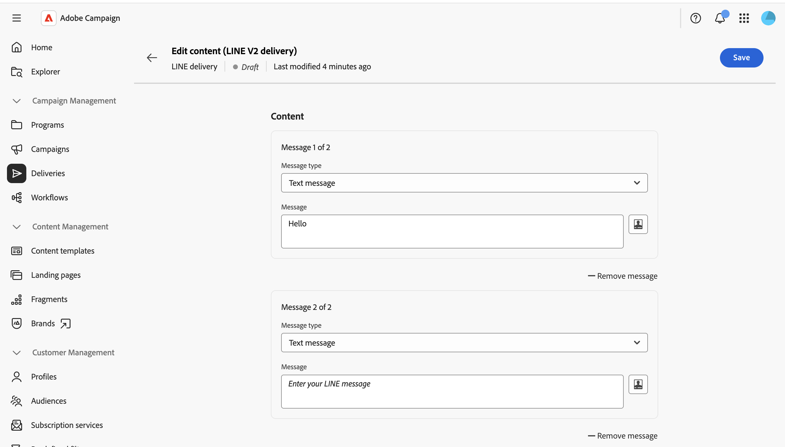
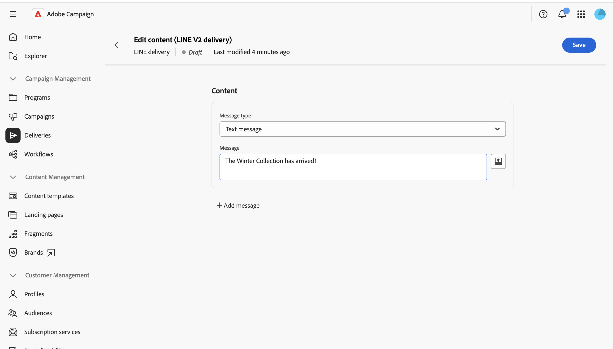
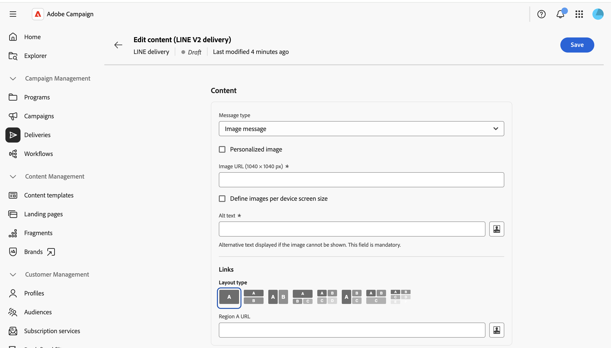

# LINE メッセージを送信する {#send-line}

テキスト、画像、動画コンテンツを使用して、LINE メッセージを作成し、購読者に送信できます。 LINE配信は、スタンドアロン配信として作成することも、ワークフローに追加することもできます。

このページでは、スタンドアロンのLINE配信の作成について説明しますが、ワークフローでLINE チャネルアクティビティを設定する場合も同じ手順が適用されます。

>[!IMPORTANT]
>
>メッセージのプレビューは現在、LINE配信ではサポートされていません。 レンダリングされたメッセージを事前にプレビューすることはできないので、送信前にエディターでコンテンツを慎重に確認してください。

## LINE配信の作成 {#create-line-delivery}

1. **[!UICONTROL 配信]**&#x200B;メニューを参照し、「**[!UICONTROL 配信を作成]**」をクリックします。

1. **[!UICONTROL LINE]**&#x200B;を選択し、デフォルトの&#x200B;**[!UICONTROL LINE V2配信]** テンプレートなどの配信テンプレートを選択します。 [テンプレートの詳細情報はこちら](../msg/delivery-template.md)。

   

1. 「**[!UICONTROL 配信を作成]**」をクリックして、配信設定画面を確認および表示します。

1. 配信の&#x200B;**[!UICONTROL ラベル]**&#x200B;を入力し、必要に応じて追加またはカスタムオプションを定義します。 [詳細情報](../push/create-push.md#configure-push-settings)。

   

## オーディエンスの選択 {#audience}

1. 「**[!UICONTROL オーディエンスを選択]**」をクリックして、既存のオーディエンスをターゲットにするか、独自のオーディエンスを作成します。 LINE配信のターゲティングは、**[!UICONTROL 訪問者のサブスクリプション]**&#x200B;に基づいています。 [詳しくは、オーディエンスを参照してください](../audience/about-recipients.md)。

1. 「**[!UICONTROL コントロールグループを有効にする]**」オプションをオンにして、コントロールグループを設定し、配信の影響を測定します。 そのコントロール母集団にはメッセージが送信されないので、メッセージを受信した母集団の行動と、受信しなかった連絡先の行動を比較できます。 [詳細情報](../audience/control-group.md)

## コンテンツを定義 {#content}

「**[!UICONTROL コンテンツを編集]**」をクリックします。

LINE コンテンツエディターが表示されます。

LINE配信には、最大5つのメッセージを含めることができます。 「**[!UICONTROL メッセージを追加]**」をクリックして配信に別のメッセージを追加するか、「**[!UICONTROL メッセージを削除]**」をクリックして1つを削除します。

利用可能な場合は、パーソナライゼーションエディターを使用して動的コンテンツを挿入できます。 [詳細情報](../personalization/personalize.md)。

各メッセージは、次のいずれかのタイプを使用します。

>[!NOTE]
>
>サポートされているのは画像とビデオのURLのみです。 クライアントコンソールの動作に一致するローカルファイルのアップロードは使用できません。

### テキストメッセージ {#text-message}

テキストメッセージは、テキストフォームで送信されるシンプルなメッセージです。 関連するフィールドにメッセージを入力し、必要に応じてパーソナライゼーションフィールドを使用するだけです。

### 画像メッセージ {#image-message}

画像メッセージを使用すると、画像を送信できます。必要に応じてクリック可能な領域に分割し、それぞれ異なるURLにリンクします。

* **[!UICONTROL パーソナライズされた画像]**：受信者ごとに画像を動的に定義します。
* **[!UICONTROL 画像URL]**：画像のURLを指定します。 推奨サイズは1040 x 1040 pxです。 デバイスの画面サイズごとに&#x200B;**[!UICONTROL 画像を定義]**&#x200B;して、様々な画面サイズに最適化された様々な画像解像度を提供します。
* **[!UICONTROL 代替テキスト]**：必須の代替テキスト。画像を読み込めない場合に表示されます。
* **[!UICONTROL リンク]**：画像を1つ以上のクリック可能な領域に分割するレイアウトを選択し、各領域にURLを割り当てます。

### ビデオメッセージ {#video-message}

ビデオメッセージを使用すると、受信者にビデオを送信できます。

* **[!UICONTROL ビデオ URL]**：ビデオのURL。 MP4形式のみがサポートされています。
* **[!UICONTROL 画像のプレビューURL]**：ビデオの再生前に表示される画像のURL。

## スケジュールと送信 {#schedule-send}

1. コンテンツを定義したら、**保存**&#x200B;をクリックし、戻るアイコンをクリックして配信設定画面に戻ります。

1. **[!UICONTROL スケジュール]**&#x200B;を有効にして、特定の日時に送信します。 [詳細情報](../msg/gs-deliveries.md#gs-schedule)。

   

1. コンテンツの準備ができたら、**[!UICONTROL レビューして送信]**&#x200B;をクリックします。 配信ダッシュボードが開きます。

   

1. 「**[!UICONTROL 準備]**」をクリックしてから確認します。 エラーがある場合は、修正して、**[!UICONTROL 準備]**&#x200B;をもう一度クリックします。

1. **[!UICONTROL 送信]**&#x200B;をクリックします。 次に、配信&#x200B;**[!UICONTROL レポート]**&#x200B;および&#x200B;**[!UICONTROL ログ]**&#x200B;のエントリポイントの結果を追跡できます。
