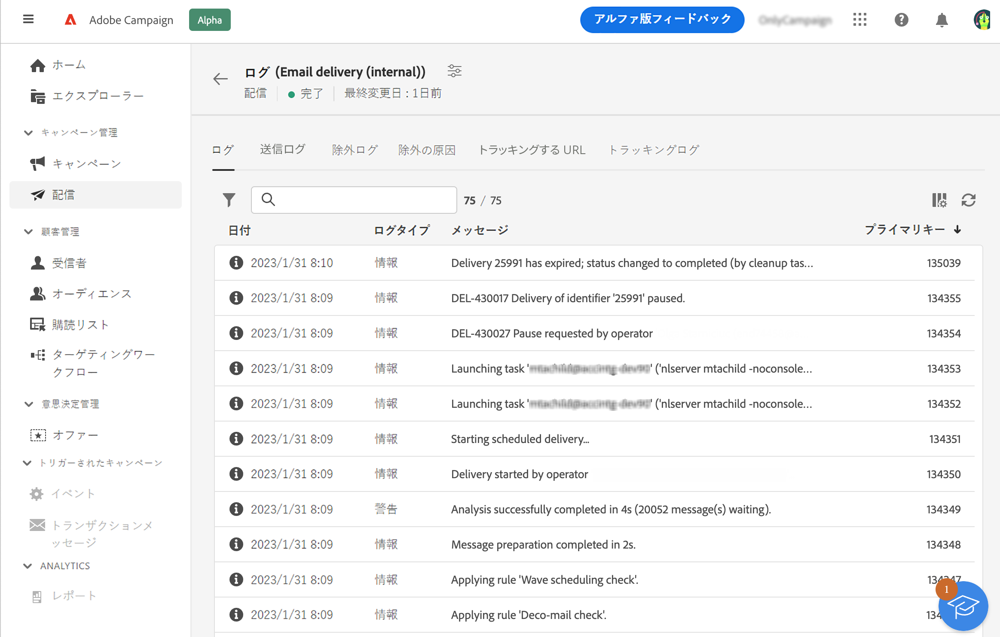
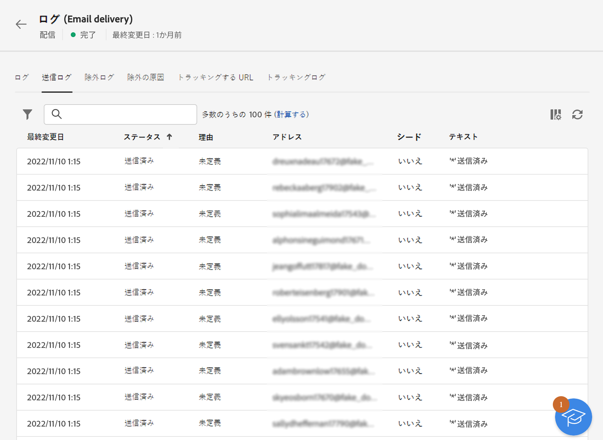
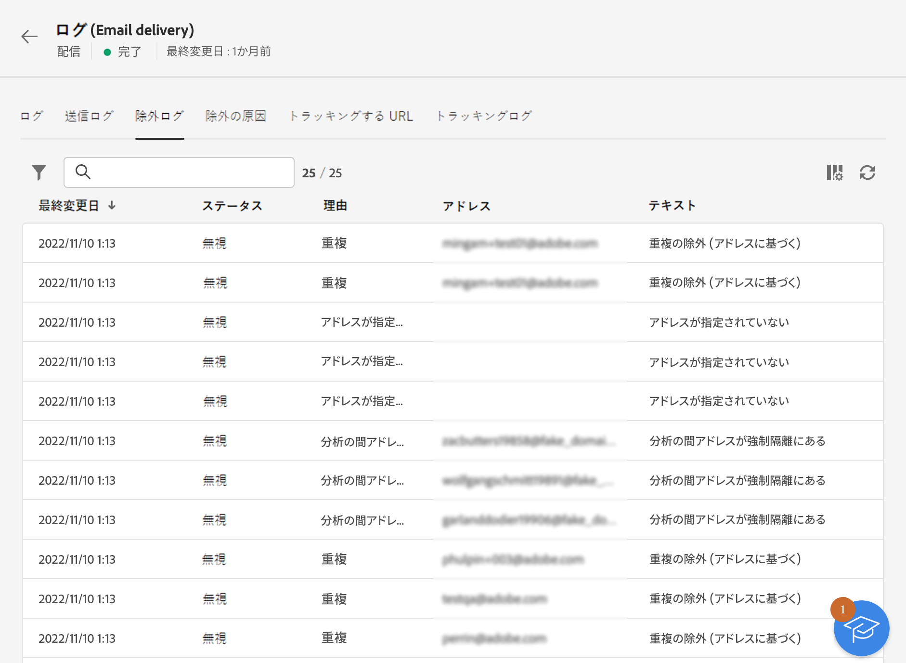
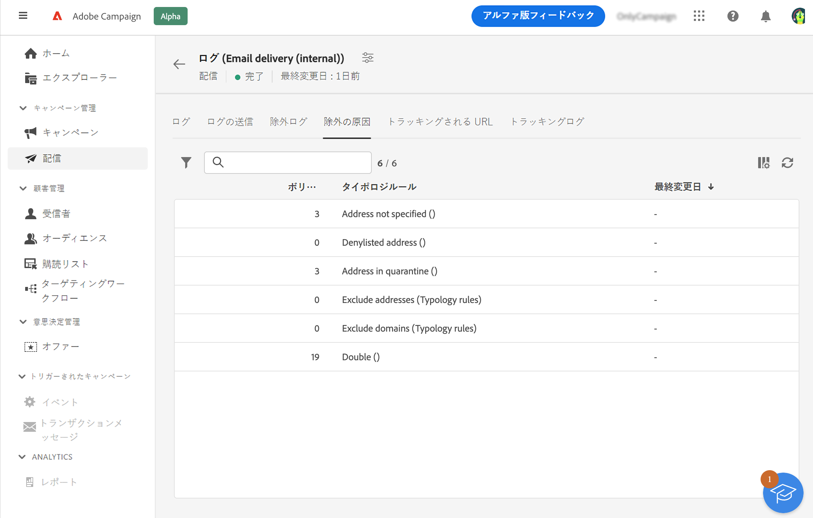
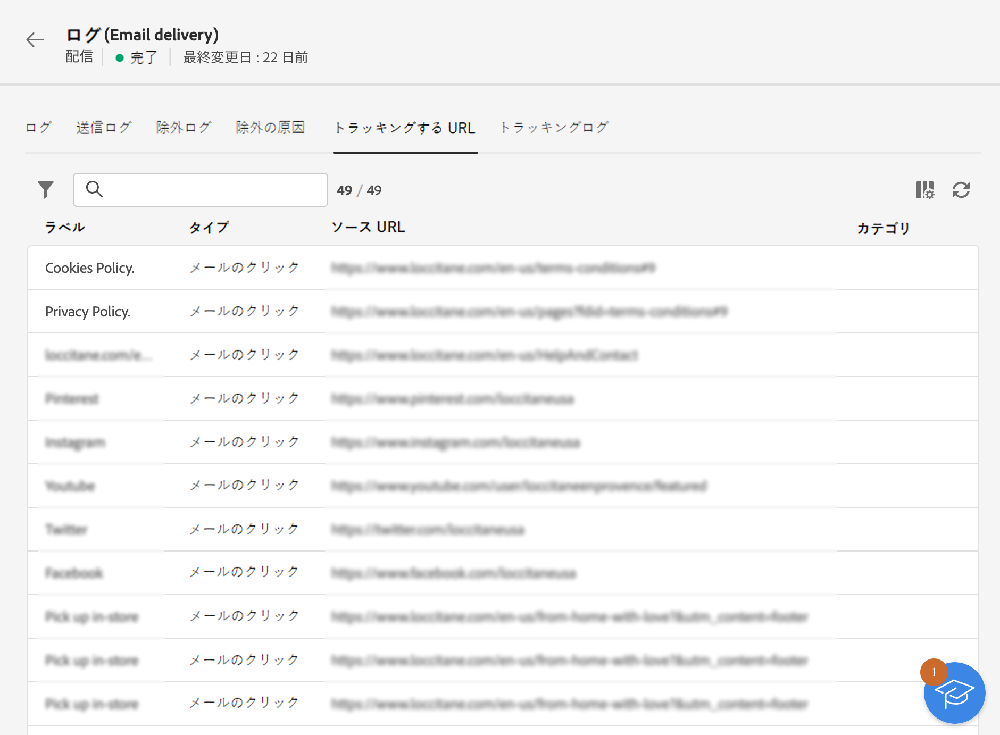
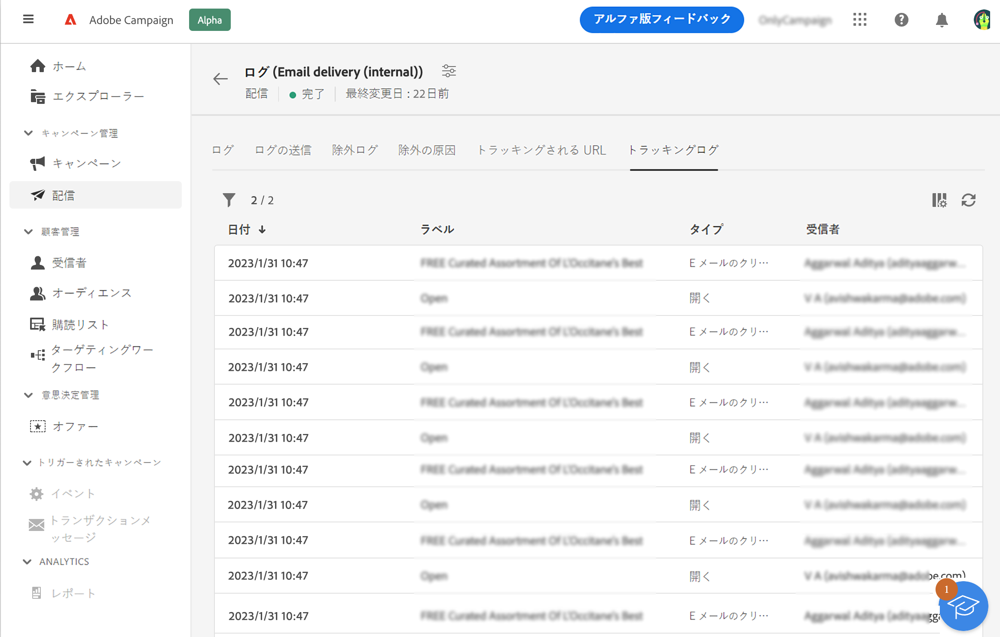

# 配信ログの監視 {#delivery-logs}

>[!CONTEXTUALHELP]
>id="acw_deliveries_email_preparation_logs"
>title="配信ログ"
>abstract="配信ログには、送信の詳細が表示されます。送信の詳細、除外されたターゲットとその理由、および開封数やクリック数などの追跡情報が表示されます。"

配信の準備が整い、「**送信**」ボタンをクリックしたら、配信ログを参照して、警告、エラー、ステータス、除外、トラッキングデータを確認します。これらのログは、メッセージダッシュボードから直接アクセスできます。送信の詳細、除外されたターゲットとその理由、および開封数やクリック数などの追跡情報が表示されます。

ログを表示するには、配信ダッシュボードにアクセスし、「**ログ**」ボタンをクリックします。

次のタブを使用できます。

* [ログ](#logs-tab)
* [配信](#deliveries-tab)
* [除外](#exclusion-tab)
* [除外の原因](#exclusion-causes)
* [トラッキングする URL](#tracked-urls)
* [トラッキング](#tracking)

## ログ {#logs-tab}

「**ログ**」タブには、配信と配達確認に関するすべてのメッセージが含まれます。特別なアイコンによって、エラーまたは警告を識別できます。

すべての検証手順、警告およびエラーが表示されます。色付きのアイコンは、メッセージタイプを示します。

* 灰色のアイコンは、情報メッセージを示します。
* 黄色のアイコンは、重要でない処理エラーを示します。
* 赤色のアイコンは、配信の送信を妨げる重大なエラーを示します。配信を送信するには、重大なエラーを修正する必要があります。

## 配信 {#deliveries-tab}

「**送信ログ**」タブには、この配信のすべての発生履歴が表示されます。送信されたメッセージのリストとそのステータスがここに保存されます。各受信者の配信ステータスを表示できます。

## 除外 {#exclusion-tab}

「**除外ログ**」タブには、ターゲットから除外されたすべてのメッセージが一覧表示され、送信が失敗した理由が示されます。

## 除外の原因 {#exclusion-causes-tab}

「**除外の原因**」タブには、考えられる原因ごとに、ターゲットから除外されたメッセージ数が表示されます。

## トラッキングする URL {#tracked-urls-tab}

「**トラッキングする URL**」タブは、送信されたメッセージに含まれている URL を、その URL タイプとソース URL を含めて再グループ化します。

## トラッキング {#tracking-tab}

「**トラッキング**」タブには、この配信のトラッキング履歴が一覧表示されます。このタブには、送信されたメッセージのトラッキングデータ、つまり、Adobe Campaign によってトラッキングされたすべての URL が表示されます。

>[!NOTE]
>
>配信トラッキングが有効になっていない場合、このタブは表示されません。