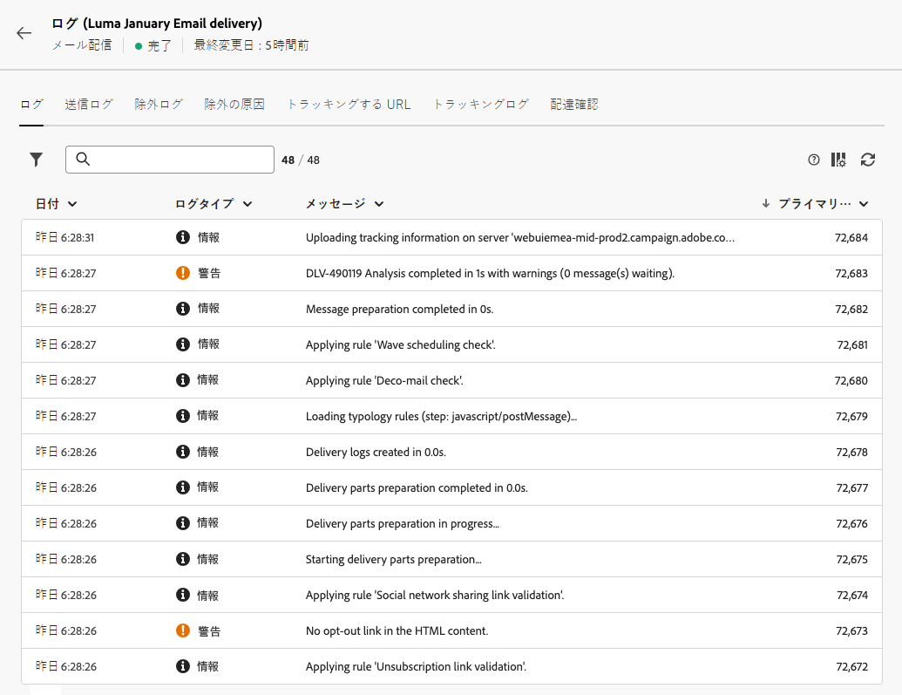

# 配信ログの監視 {#delivery-logs}

>[!NOTE]
>
>このドキュメントは作成中で、頻繁に更新されています。 このコンテンツの最終バージョンは、2023 年 1 月に準備が整います。

>[!CONTEXTUALHELP]
>id="acw_deliveries_email_preparation_logs"
>title="配信ログ"
>abstract="TBC"

E メールを準備して送信した後、配信ログを使用して、エラーがないことを確認できます。 これらのログは、メッセージダッシュボードから直接アクセスできます。 送信の詳細、除外されたターゲットとその理由、および開封数やクリック数などの追跡情報が表示されます。

ログを表示するには、 **ログ** 」ボタンをクリックします。

いくつかのタブには、送信ログ、除外ログ、除外の原因、トラッキングログ、トラッキングされる URL に関する情報（存在する場合）が含まれます。

**ロス** タブ

この **ログ** 「 」タブには、配信と配達確認に関するすべてのメッセージが含まれます。 特別なアイコンによって、エラーまたは警告を識別できます。

すべての検証手順、警告およびエラーが表示されます。色付きのアイコンは、メッセージタイプを示します。

* 灰色のアイコンは、情報メッセージを示します。
* 黄色のアイコンは、重要でない処理エラーを示します。
* 赤色のアイコンは、配信の送信を妨げる重大なエラーを示します。

**「配信」タブ**

この **配信** 「 」タブには、この配信のすべての発生履歴が表示されます。 送信されたメッセージのリストとそのステータスがここに保存されます。各受信者の配信ステータスを表示できます。

**除外** タブ

「除外ログ」タブには、送信されたターゲットから除外されたすべてのメッセージがリスト表示され、送信が失敗した理由を特定します。

**除外の原因** タブ

この **除外の原因** 「 」タブには、ターゲット送信から除外されたメッセージの量（メッセージ数）が表示されます。

**トラッキングする URL** タブ

この **トラッキングする URL** タブ表示

**「トラッキング」タブ**

「**トラッキング**」タブには、この配信のトラッキング履歴が一覧表示されます。このタブには、送信されたメッセージのトラッキングデータ、つまり、Adobe Campaign によってトラッキングされたすべての URL が表示されます。トラッキングデータは 1 時間ごとに更新されます。

>[!NOTE]
>
>配信トラッキングが有効になっていない場合、このタブは表示されません。

トラッキングデータは、配信レポートに表示されます。詳しくは、この節を参照してください。

