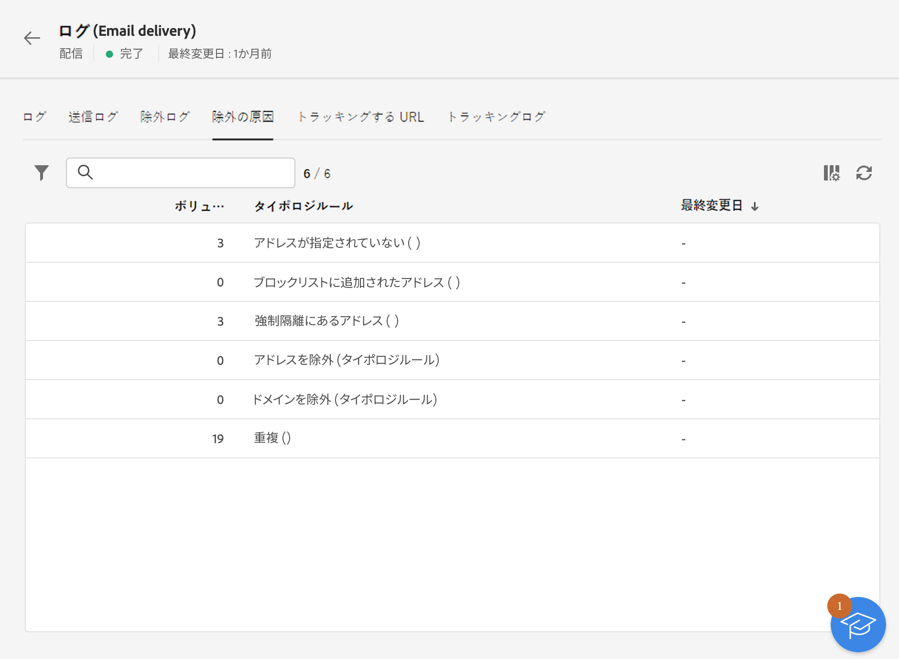

# 配信ログの監視 {#delivery-logs}

>[!CONTEXTUALHELP]
>id="acw_deliveries_email_preparation_logs"
>title="配信ログ"
>abstract="TBC"

メールを準備して送信した後、配信ログを使用して、エラーがないことを確認できます。これらのログは、メッセージダッシュボードから直接アクセスできます。送信の詳細、除外されたターゲットとその理由、および開封数やクリック数などの追跡情報が表示されます。

ログを表示するには、配信ダッシュボードにアクセスし、「**ログ**」ボタンをクリックします。

複数のタブが表示されます。

## ログ

「**ログ**」タブには、配信と配達確認に関するすべてのメッセージが含まれます。特別なアイコンによって、エラーまたは警告を識別できます。

すべての検証手順、警告およびエラーが表示されます。色付きのアイコンは、メッセージタイプを示します。

* 灰色のアイコンは、情報メッセージを示します。
* 黄色のアイコンは、重要でない処理エラーを示します。
* 赤色のアイコンは、配信の送信を妨げる重大なエラーを示します。

## 配信

この **ログの送信** 「 」タブには、この配信のすべての発生履歴が表示されます。 送信されたメッセージのリストとそのステータスがここに保存されます。各受信者の配信ステータスを表示できます。

## 除外

この **除外ログ** 「 」タブには、ターゲットから除外されたすべてのメッセージのリストが表示され、送信が失敗した理由を特定します。

## 除外の原因

この **除外の原因** 「 」タブには、ターゲットから除外されたメッセージの量（メッセージ数）が表示されます。

## トラッキングされる URL

「**トラッキングする URL**」タブは、送信されたメッセージに含まれている URL を、その URL タイプとソース URL を含めて再グループ化します。

## トラッキング

「**トラッキング**」タブには、この配信のトラッキング履歴が一覧表示されます。このタブには、送信されたメッセージのトラッキングデータ、つまり、Adobe Campaign によってトラッキングされたすべての URL が表示されます。

>[!NOTE]
>
>配信トラッキングが有効になっていない場合、このタブは表示されません。

