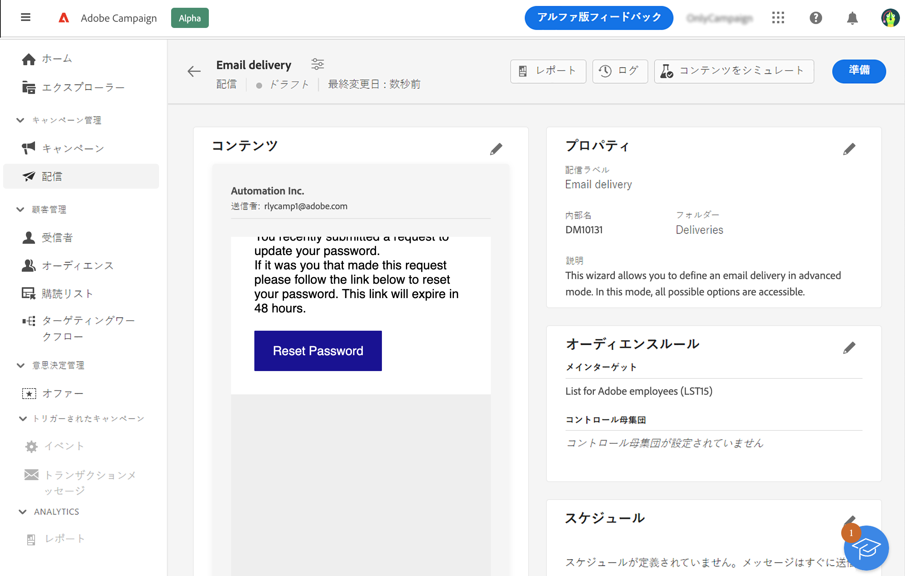
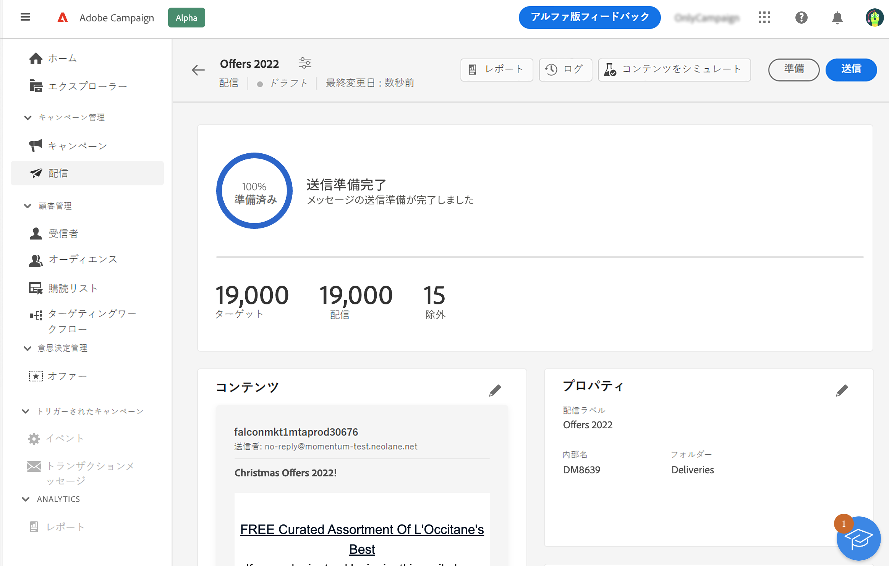
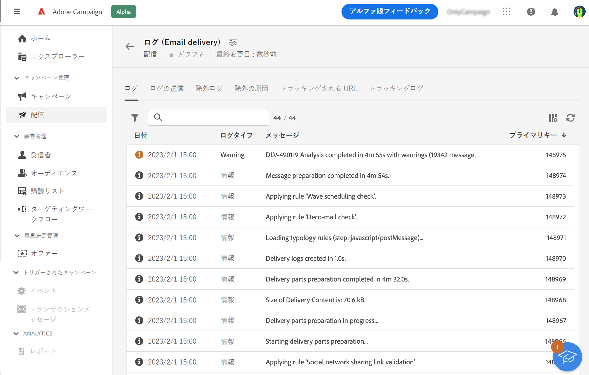
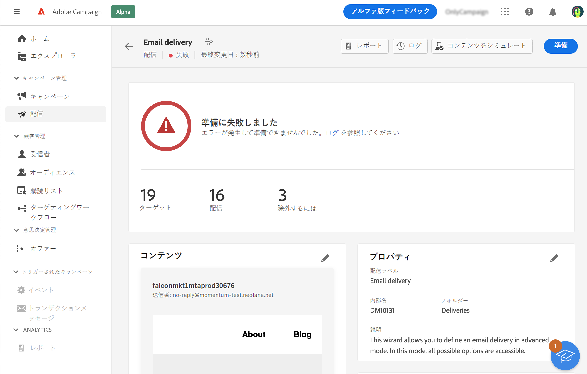
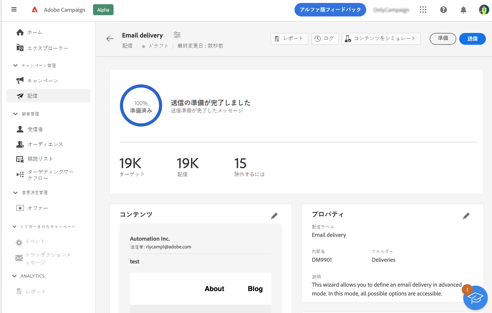
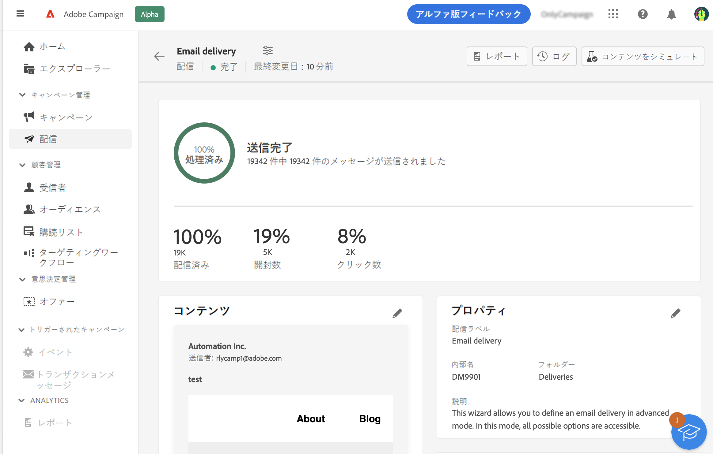

# メールの準備と送信 {#prepare-send}

>[!CONTEXTUALHELP]
>id="acw_homepage_card5"
>title="メールの準備と送信"
>abstract="メールの準備方法と KPI の送信に関する詳細について説明します。"

<!--

	show how to prepare and send the email + the live kpis in the dashboard

like acc when preparation, target calculated then send
real time KPIs, not in AJO. similar to ACS.
exclusion logs, causes
-->

<!--
send also KPIs
-->

## 送信の準備{#prepare}

コンテンツ、オーディエンスおよびスケジュールを定義したら、メッセージの準備を始めます。準備段階では、ターゲット母集団を計算し、ターゲットに含まれるプロファイルごとのメッセージコンテンツを生成します。準備が完了したら、メッセージは、すぐに送信、またはスケジュールされた日時に送信できる状態になります。分析時に使用される検証ルールについては、[Campaign Classic v7 ドキュメント](https://experienceleague.adobe.com/docs/campaign-classic/using/sending-messages/key-steps-when-creating-a-delivery/steps-validating-the-delivery.html?lang=ja#validation-process-with-typologies){target="_blank"}を参照してください。

以下の手順に従います。

1. 配信ダッシュボードで、 右上隅の「**準備**」ボタンをクリックし、確定します。

   

   準備の進行状況が表示されます。ターゲット母集団のサイズによっては、この操作に時間がかかる場合があります。

   >[!NOTE]
   >
   >「**準備を停止**」ボタンでいつでも準備を停止できます。準備段階では、メッセージは送信されません。そのため、何かに影響を与えるリスクなく、準備を開始または停止できます。

1. 準備が完了したら、KPI を確認します。送信するメッセージの数が期待値と異なる場合は、オーディエンスを変更し、準備をやり直します。

   

   次に、様々な KPI を示します。

   * **ターゲット**：ターゲットとする受信者の数
   * **配信対象**：送信されるメッセージの数
   * **除外対象**：タイポロジルールによって除外されるメッセージの数

1. 「**ログ**」ボタンをクリックし、エラーがないことを確認します。最後のログメッセージには、エラーメッセージとエラー件数が表示されます。詳しくは、[こちらの節](delivery-logs.md)を参照してください。

   

準備中に配信の送信を妨げる重大なエラーが検出された場合、準備ステータスは配信ダッシュボードに失敗と表示されます。

準備が完了した後に配信に変更を加える場合は、変更を反映させるために準備をやり直す必要があります。

エラーなく準備が完了したら、メッセージの送信準備は完了です。詳しくは、[こちらの節](#send)を参照してください。

## メッセージの送信{#send}

>[!CONTEXTUALHELP]
>id="acw_deliveries_email_metrics_delivered"
>title="配信済み"
>abstract="正常に配信されたメッセージの数。この指標は 5 分ごとに更新されます。表示されるパーセンテージは、送信されたメッセージの合計数に基づきます。"

>[!CONTEXTUALHELP]
>id="acw_deliveries_email_metrics_opens"
>title="開封数"
>abstract="開封されたメッセージの数。この指標は 5 分ごとに更新されます。表示されるパーセンテージは、配信されたメッセージ数に対する、ユニーク開封数の割合です。"

>[!CONTEXTUALHELP]
>id="acw_deliveries_email_metrics_clicks"
>title="クリック数"
>abstract="メール内で 1 回以上クリックした受信者の数。この指標は 5 分ごとに更新されます。表示されるパーセンテージは、配信されたメッセージ数に対する、ユニーククリック数の割合です。"

準備が完了したら、メッセージを送信できます。この手順は、すぐに送信するメッセージに対してのみ必要となります。メッセージがスケジュールされている場合は、指定した日付に送信されます。

次の手順に従います。

1. 配信ダッシュボードで、右上隅の「**送信**」ボタンをクリックして、確定します。

   

1. 送信の進行状況が表示されます。表示された KPI を確認します。また、ログを確認することもできます。詳しくは、[こちらの節](delivery-logs.md)を参照してください。

   

   次に、様々な KPI を示します。

   * **配信済み**：正常に配信されたメッセージの数。表示されるパーセンテージは、送信されたメッセージの合計数に基づきます。
   * **開封数**：開封されたメッセージの数。表示されるパーセンテージは、配信されたメッセージ数に対する、ユニーク開封数の割合です。
   * **クリック数**：メール内で 1 回以上クリックした受信者の数。表示されるパーセンテージは、配信されたメッセージ数に対する、ユニーククリック数の割合です。

   >[!NOTE]
   >
   >すべての指標は、配信が開始されてから 5 分ごとに更新されます。配信準備の指標はリアルタイムです。

   送信はいつでも一時停止、再開できます。送信中に配信を停止した場合は、再開できません。
