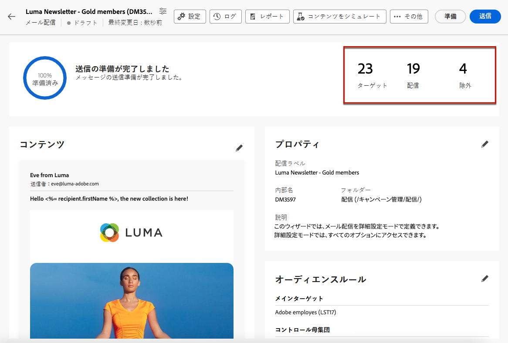

# メールの準備と送信 {#prepare-send}

## 送信の準備 {#prepare}

[コンテンツ](../content/edit-content.md)、[オーディエンス](../audience/add-audience.md)およびスケジュールを定義したら、メール配信の準備を始めます。

準備段階では、ターゲット母集団を計算し、ターゲットに含まれるプロファイルごとのメッセージコンテンツを生成します。準備が完了したら、メッセージは、すぐに送信、またはスケジュールされた日時に送信できる状態になります。

配信の準備中に使用される検証ルールについて詳しくは、 [Campaign v8（クライアントコンソール）ドキュメント](https://experienceleague.adobe.com/docs/campaign/campaign-v8/campaigns/send/validate/delivery-analysis.html?lang=ja){target="_blank"}.

送信を準備する主な手順を以下に示します。

1. 配信ダッシュボードで、「**[!UICONTROL 確認して送信]**」をクリックします。

   

1. 右上隅の「**[!UICONTROL 準備]**」ボタンをクリックし、確定します。

   

   >[!NOTE]
   >
   >配信をスケジュールし、「**[!UICONTROL 送信前に確認を有効にする]**」オプションを無効にした場合、準備と送信の手順は「**[!UICONTROL 準備と送信]**」ボタンの下にグループ化されます。[詳しくは、スケジュール設定を参照してください](../email/create-email.md#schedule)

1. 準備の進行状況が表示されます。ターゲット母集団のサイズによっては、この操作に時間がかかる場合があります。

   「**[!UICONTROL 準備を停止]**」ボタンでいつでも準備を停止できます。

   

   >[!NOTE]
   >準備段階では、メッセージは送信されません。そのため、何かに影響を与えるリスクなく、準備を開始または停止できます。

1. 準備が完了したら、KPI を確認します。送信するメッセージの数が期待値と異なる場合は、オーディエンスを変更し、準備をやり直します。

   

   次に、様々な KPI を示します。

   * **[!UICONTROL ターゲット]**：ターゲットとする受信者の数。
   * **[!UICONTROL 配信対象]**：送信されるメッセージの数。
   * **[!UICONTROL 除外対象]**[：タイポロジルールによって除外されるメッセージの数](../advanced-settings/delivery-settings.md#typology)。

1. 「**[!UICONTROL ログ]**」ボタンをクリックし、エラーがないことを確認します。最後のログメッセージには、エラーメッセージとエラー件数が表示されます。[詳細情報](delivery-logs.md)

   

1. 準備中に配信の送信を妨げる重大なエラーが検出された場合、準備ステータスは配信ダッシュボードに失敗と表示されます。

   

1. 準備が完了した後に配信に変更を加える場合は、変更を反映させるために準備をやり直す必要があります。

エラーなく準備が完了したら、メッセージの送信準備は完了です。

## メッセージの送信 {#send}

>[!CONTEXTUALHELP]
>id="acw_deliveries_email_metrics_delivered"
>title="配信済み"
>abstract="正常に配信されたメッセージの数。この指標は 5 分ごとに更新されます。表示されるパーセンテージは、送信されたメッセージの合計数に基づきます。"

>[!CONTEXTUALHELP]
>id="acw_deliveries_email_metrics_opens"
>title="開封数"
>abstract="開封されたメッセージの数。この指標は 5 分ごとに更新されます。表示されるパーセンテージは、配信されたメッセージ数に対する、ユニーク開封数の割合です。"

>[!CONTEXTUALHELP]
>id="acw_deliveries_email_metrics_clicks"
>title="クリック数"
>abstract="メール内で 1 回以上クリックした受信者の数。この指標は 5 分ごとに更新されます。表示されるパーセンテージは、配信されたメッセージ数に対する、ユニーククリック数の割合です。"

[準備](#prepare)が完了したら、メールを送信できます。

メッセージがスケジュールされている場合は、指定した日付に送信されます。[詳細情報](#schedule-the-send)

### 直ちに送信 {#send-immediately}

メールを直ちに送信するには、次の手順に従います。

1. 配信ダッシュボードで、右上隅の「**[!UICONTROL 送信]**」ボタンをクリックします。

   

1. メッセージを直ちにメインターゲットに送信するには、このアクションを確定します。

1. 送信の進行状況が表示されます。

### 送信のスケジュール {#schedule-the-send}

メールを後で送信するようにスケジュールした場合は、次の手順に従います。

1. 「**[!UICONTROL 確認して送信]**」ボタンを押す前に、メールのスケジュールを定義していることを確認します。[詳細情報](../email/create-email.md#schedule)

1. 配信ダッシュボードで、右上隅の「**[!UICONTROL スケジュールどおりに送信]**」ボタンをクリックします。

   

1. 「**[!UICONTROL 送信を確認]**」をクリックします。配信は、スケジュールされた日付にメインターゲットに送信されます。

   >[!NOTE]
   >
   >「**[!UICONTROL 送信前に確認を有効にする]**」オプションを無効にした場合、準備と送信の手順は「**[!UICONTROL 準備と送信]**」ボタンの下にグループ化されます。[詳しくは、スケジュール設定を参照してください](../email/create-email.md#schedule)

## 送信を一時停止または停止 {#pause-stop-sending}

配信がスケジュールされているかどうかに関係なく、送信プロセス中にいつでも 2 つのアクションを実行できます。

* メッセージの送信を中断するには、「**[!UICONTROL 送信を一時停止]**」をクリックします。送信はいつでも再開できます。

* 送信を直ちに中断するには、「**[!UICONTROL 送信を停止]**」をクリックします。停止した後は、準備も送信も再開できません。

## KPI の確認 {#check-kpis}

>[!CONTEXTUALHELP]
>id="acw_deliveries_email_metrics_sent"
>title="送信済み指標"
>abstract="配信の分析中に処理されたメッセージの合計数。"

>[!CONTEXTUALHELP]
>id="acw_deliveries_email_metrics_errors"
>title="エラー指標"
>abstract="送信されたメッセージの合計数に対して、配信と自動返信処理の間に累積したエラーの合計数。"

送信が完了したら、表示される KPI を確認できます。

* **[!UICONTROL 送信済み]**：配信されたメッセージの数。表示されるパーセンテージは、配信するメッセージの合計数に基づきます。

* **[!UICONTROL 配信済み]**：正常に配信されたメッセージの数。表示されるパーセンテージは、送信されたメッセージの合計数に基づきます。

* **[!UICONTROL 開封数]**：開封されたメッセージの数。表示されるパーセンテージは、配信されたメッセージ数に対するユニーク開封数です。

* **[!UICONTROL クリック数]**：メール内で 1 回以上クリックした受信者の数。表示されるパーセンテージは、配信されたメッセージ数に対するユニーククリック数です。

* **[!UICONTROL エラー数]**：エラーステータスが含まれるメールの数。表示されるパーセンテージは、送信されたメッセージの合計数に基づきます。

>[!NOTE]
>
>すべての指標は、配信が開始されてから 5 分ごとに更新されます。配信準備の指標はリアルタイムです。

また、ログを確認することもできます。[詳細情報](delivery-logs.md)