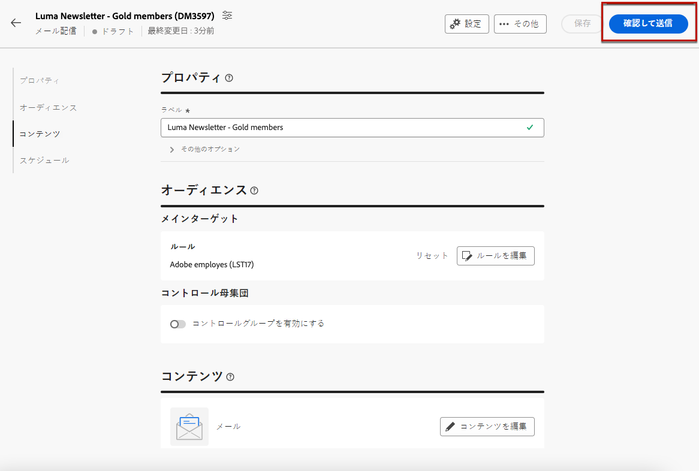
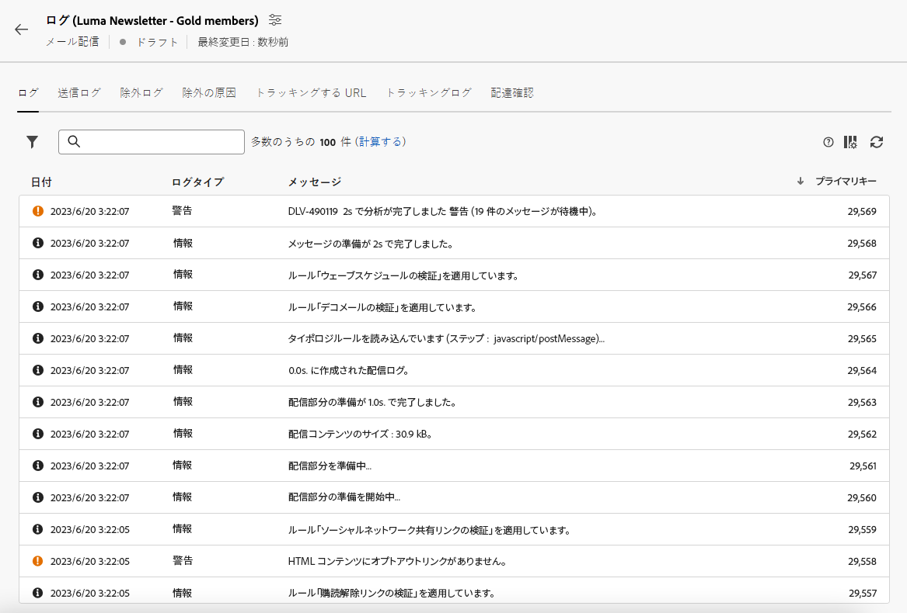
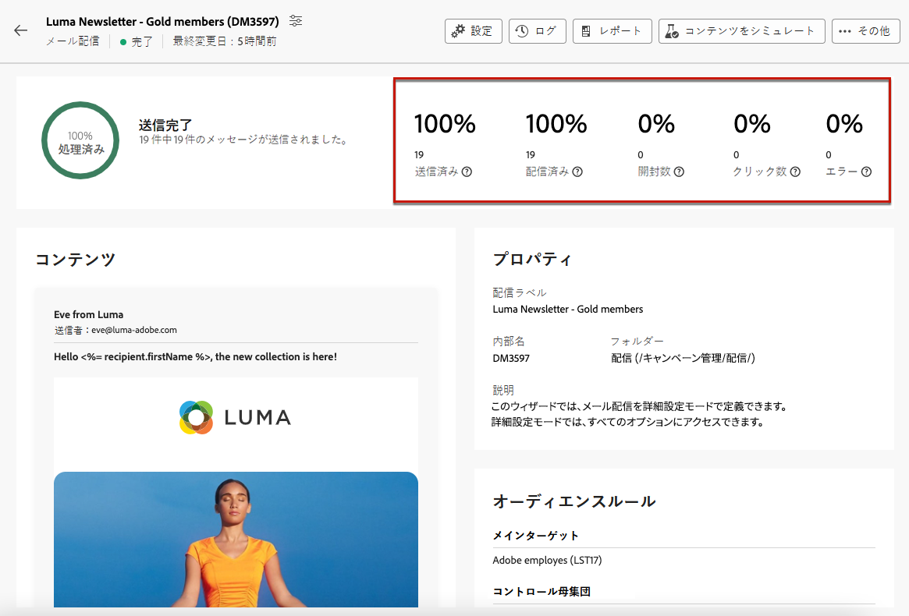

# メールの準備と送信 {#prepare-send}

## 送信の準備 {#prepare}

を定義したら、 [コンテンツ](../content/edit-content.md), [audience](../audience/add-audience.md) スケジュールを設定し、E メール配信の準備が整いました。

準備段階では、ターゲット母集団を計算し、ターゲットに含まれるプロファイルごとのメッセージコンテンツを生成します。準備が完了したら、メッセージは、すぐに送信、またはスケジュールされた日時に送信できる状態になります。

配信の準備時に使用される検証ルールについては、[Campaign v8（コンソール）ドキュメント](https://experienceleague.adobe.com/docs/campaign/campaign-v8/campaigns/send/validate/delivery-analysis.html?lang=ja){target="_blank"}を参照してください。

送信を準備する主な手順を次に示します。

1. 配信ダッシュボードで、 **[!UICONTROL 確認して送信]**.

   

1. 次をクリック： **[!UICONTROL 準備]** ボタンをクリックし、確定します。

   

   >[!NOTE]
   >
   >配信をスケジュールし、 **[!UICONTROL 送信前に確認を有効にする]** 」オプションを選択すると、準備手順と送信手順が **[!UICONTROL 準備と送信]** 」ボタンをクリックします。 [スケジュールの詳細を説明します](../email/create-email.md#schedule)

1. 準備の進行状況が表示されます。ターゲット母集団のサイズによっては、この操作に時間がかかる場合があります。

   「**[!UICONTROL 準備を停止]**」ボタンでいつでも準備を停止できます。

   

   >[!NOTE]
   >準備段階では、メッセージは送信されません。そのため、何かに影響を与えるリスクなく、準備を開始または停止できます。

1. 準備が完了したら、KPI を確認します。送信するメッセージの数が期待値と異なる場合は、オーディエンスを変更し、準備をやり直します。

   

   次に、様々な KPI を示します。

   * **[!UICONTROL ターゲット]**：ターゲットとする受信者の数.
   * **[!UICONTROL 配信対象]**：送信されるメッセージの数.
   * **[!UICONTROL 除外対象]**[：タイポロジルールによって除外されるメッセージの数](../advanced-settings/delivery-settings.md#typology).

1. 「**[!UICONTROL ログ]**」ボタンをクリックし、エラーがないことを確認します。最後のログメッセージには、エラーメッセージとエラー件数が表示されます。[詳細情報](delivery-logs.md)

   

1. 準備中に配信の送信を妨げる重大なエラーが検出された場合、準備ステータスは配信ダッシュボードに失敗と表示されます。

   

1. 準備後に配信に変更を加えた場合は、変更を反映させるために準備をやり直す必要があります。

エラーなく準備が完了したら、メッセージの送信準備は完了です。

## メッセージの送信 {#send}

>[!CONTEXTUALHELP]
>id="acw_deliveries_email_metrics_delivered"
>title="配信済み"
>abstract="正常に配信されたメッセージの数。この指標は 5 分ごとに更新されます。表示されるパーセンテージは、送信されたメッセージの合計数に基づきます。"

>[!CONTEXTUALHELP]
>id="acw_deliveries_email_metrics_opens"
>title="開封数"
>abstract="開封されたメッセージの数。この指標は 5 分ごとに更新されます。表示されるパーセンテージは、配信されたメッセージ数に対する、ユニーク開封数の割合です。"

>[!CONTEXTUALHELP]
>id="acw_deliveries_email_metrics_clicks"
>title="クリック数"
>abstract="メール内で 1 回以上クリックした受信者の数。この指標は 5 分ごとに更新されます。表示されるパーセンテージは、配信されたメッセージ数に対する、ユニーククリック数の割合です。"

一度 [準備](#prepare) が完了したら、メールを送信できます。

メッセージがスケジュールされている場合は、定義された日時に送信されます。 [詳細情報](#schedule-the-send)

### すぐに送信 {#send-immediately}

E メールを直ちに送信するには、次の手順に従います。

1. 配信ダッシュボードで、 **[!UICONTROL 送信]** 」ボタンを使用します。

   

1. メッセージを直ちにメインターゲットに送信するには、この操作を確定します。

1. 送信の進行状況が表示されます。

### 送信のスケジュール設定 {#schedule-the-send}

E メールを後で送信するようにスケジュールした場合は、次の手順に従います。

1. ヒットする前に **[!UICONTROL 確認して送信]** 」ボタンをクリックし、電子メールのスケジュールを定義したことを確認します。 [詳細情報](../email/create-email.md#schedule)

1. 配信ダッシュボードで、 **[!UICONTROL 「スケジュール済みとして送信」ボタン]** 」ボタンを使用します。

   

1. クリック **[!UICONTROL 送信を確認]**. 配信は、予定日にメインターゲットに送信されます。

   >[!NOTE]
   >
   >を無効にした場合、 **[!UICONTROL 送信前に確認を有効にする]** 」オプションを選択すると、準備手順と送信手順が **[!UICONTROL 準備と送信]** 」ボタンをクリックします。 [スケジュールの詳細を説明します](../email/create-email.md#schedule)

## 送信を一時停止または停止 {#pause-stop-sending}

配信がスケジュールされているかどうかに関わらず、送信プロセス中はいつでも 2 つのアクションを実行できます。

* クリック **[!UICONTROL 送信を一時停止]** ：メッセージの送信を中断します。 送信はいつでも再開できます。

* クリック **[!UICONTROL 送信を停止]** ：送信を直ちに中断します。 停止した後は、準備も送信も再開できません。

## KPI を確認 {#check-kpis}

送信が完了したら、表示された KPI を確認できます。

* **[!UICONTROL 送信済み]**:配信されたメッセージ数。 表示される割合は、配信するメッセージの合計数に基づきます。

* **[!UICONTROL 配信済み]**：正常に配信されたメッセージの数。表示されるパーセンテージは、送信されたメッセージの合計数に基づきます。

* **[!UICONTROL 開封数]**：開封されたメッセージの数。表示される割合は、配信されたメッセージ数に対する、ユニーク開封数です。

* **[!UICONTROL クリック数]**:e メール内で少なくとも 1 回クリックした受信者の数。 表示される割合は、配信されたメッセージ数に対するユニーククリック数です。

* **[!UICONTROL エラー]**:エラーステータスの電子メールの数。 表示されるパーセンテージは、送信されたメッセージの合計数に基づきます。

>[!NOTE]
>
>すべての指標は、配信が開始されてから 5 分ごとに更新されます。配信準備の指標はリアルタイムです。

また、ログを確認することもできます。[詳細情報](delivery-logs.md)