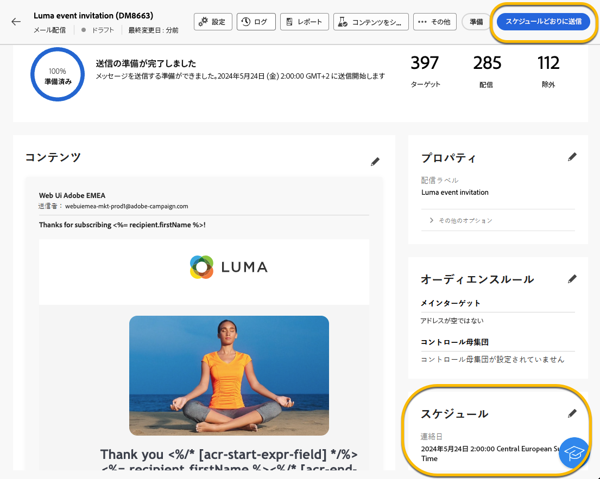

# 配信の送信スケジュール設定 {#schedule-sending}

配信の送信をスケジュールできます。 このための手順は、スタンドアロン（1 回限りの）配信か、キャンペーンワークフローのコンテキストで作業しているかによって異なります。

## スタンドアロン配信

スタンドアロン配信の場合は、配信の日時を直接スケジュールできます。
各配信タイプ（メール、SMS、プッシュ通知）については、以下の例を参照してください。

### メール {#schedule-email-standalone}

メール配信の送信スケジュールを設定するには、次の手順に従います。

1. が含まれる **[!UICONTROL スケジュール]** 配信プロパティの「」セクションで、 **[!UICONTROL スケジュールを有効にする]** 切り替え

1. 送信する日時を設定し、クリックします。 **[!UICONTROL 確認して送信]** ボタン。

   {zoomable="yes"}

>[!NOTE]
>
>デフォルトでは、「**[!UICONTROL 送信前に確認を有効にする]**」オプションが有効になっています。このオプションでは、スケジュール設定した日時に配信を送信する前に送信を確定する必要があります。必要な場合 **配信の自動送信** スケジュールされた日時に、このオプションを無効にする必要があります。
>

1. スケジュールが正しいことを確認し、をクリックします。 **[!UICONTROL 準備]** ボタン。

{zoomable="yes"}

1. 準備が完了すると、メッセージを送信する準備が整います。 配信の主要指標（ターゲット母集団の合計、配信するメッセージの数、除外された受信者の数）が表示されます。 「」をクリックします **[!UICONTROL スケジュールどおりに送信]** をクリックして、スケジュールされた日時にメインターゲットに配信を送信することを確認します。

{zoomable="yes"}

### SMS

特定の日時に sms 配信をスケジュール設定するには、手順はメール配信の場合と同じです。 [上記を参照](#schedule-email-standalone).

{zoomable="yes"}

また、スケジュールが考慮されていることを確認することもできます。

{zoomable="yes"}

### プッシュ通知

特定の日時にスタンドアロンのプッシュ配信をスケジュールするには、手順はメール配信の場合と同じです。 [上記を参照](#schedule-email-standalone).

{zoomable="yes"}

また、スケジュールが考慮されていることを確認することもできます。

{zoomable="yes"}

### キャンペーンでのスタンドアロン配信

ワークフローを使用せずに、キャンペーン内にスタンドアロン配信を作成できます。 前述のように、この配信の日時スケジュールを設定できます。
キャンペーンには、開始日と終了日でスケジュールを設定できます。 このスケジュールによって、配信スケジュールが妨げられることはありません。

{zoomable="yes"}

## キャンペーンワークフローでの配信のスケジュール

キャンペーンワークフローのコンテキストでは、は **ベストプラクティス** は、 **[!UICONTROL スケジューラー]** 配信の送信を含む、ワークフローの開始日時を適用するアクティビティ。 [スケジューラーの詳細](../workflows/activities/scheduler.md)

{zoomable="yes"}

で日時を設定する必要があります **[!UICONTROL スケジューラー]** アクティビティ。

{zoomable="yes"}

>[!NOTE]
>
>使用する場合 **[!UICONTROL スケジューラー]** ワークフローでの配信の送信をスケジュールするアクティビティ。 **有効化しない** この **[!UICONTROL スケジュールを有効にする]** での切り替え **[!UICONTROL 配信]** アクティビティの設定 配信は自動的に送信されます。
>

をアクティブにした場合、 **[!UICONTROL スケジュールを有効にする]** での切り替え **[!UICONTROL 配信]** アクティビティを設定し、日時を設定すると、この日時に配信が送信されるのを待ちます。 つまり、ワークフローの開始日と送信日の間に遅延がある場合、オーディエンスが最新でない可能性があります。

