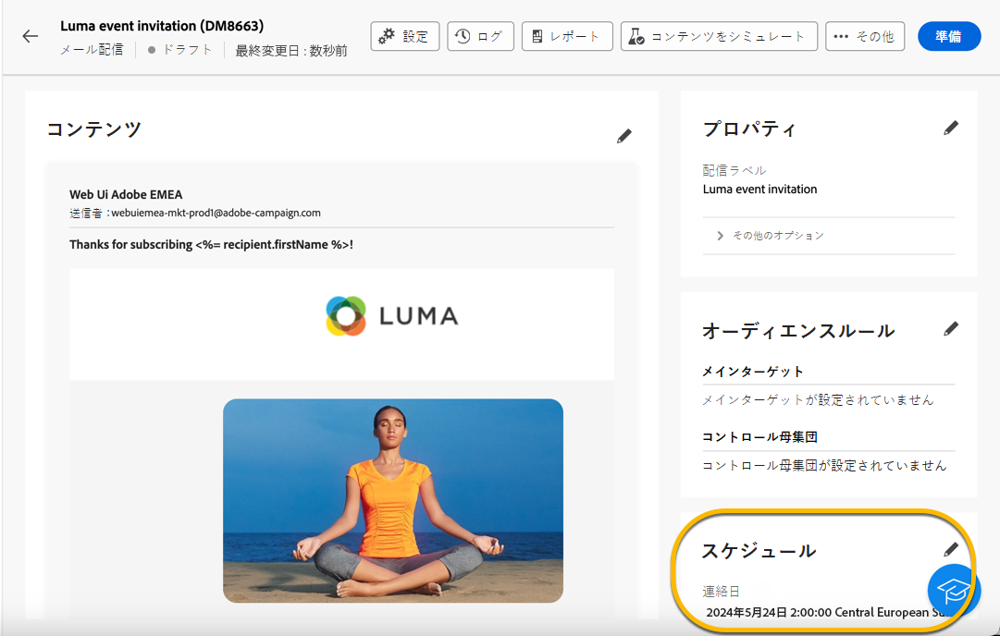
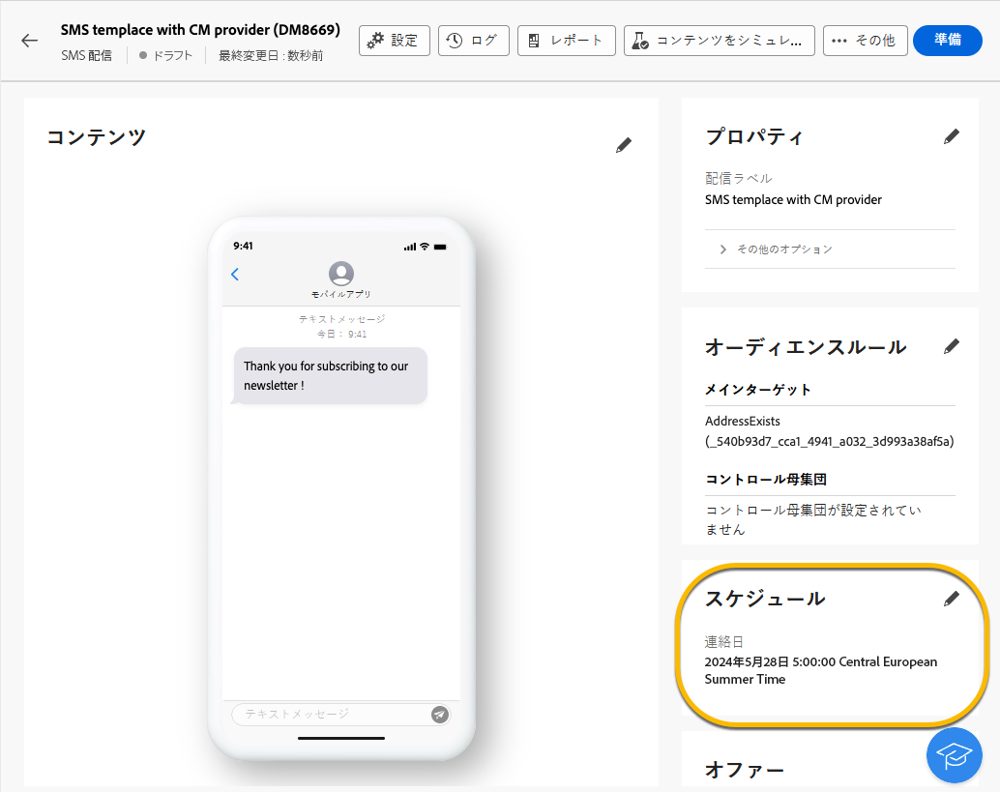

# 配信の送信のスケジュール設定 {#schedule-sending}

配信の送信をスケジュール設定できます。手順は、スタンドアロン（1 回限りの）配信か、キャンペーンワークフローのコンテキストで作業しているかによって異なります。

## スタンドアロン配信

スタンドアロン配信の場合は、配信で直接日時をスケジュールします。 配信のタイプ（メール、SMS およびプッシュ通知）ごとに、例を参照してください。

### メール {#schedule-email-standalone}

メール配信の送信スケジュールを設定するには、次の手順に従います。

1. 配信プロパティの **[!UICONTROL スケジュール]** セクションで、「**[!UICONTROL スケジュールを有効にする]** 切り替えを有効にします。

1. 送信する日時を指定し、「確認して送信 **[!UICONTROL ボタンをクリックし]** す。

   {zoomable="yes"}

>[!NOTE]
>
>デフォルトでは、「**[!UICONTROL 送信前に確認を有効にする]**」オプションが有効になっています。このオプションでは、スケジュール設定した日時に配信を送信する前に送信を確定する必要があります。スケジュールを設定した日時に配信を自動的に送信する必要がある場合は、このオプションを無効にします。
>

1. スケジュールが正しいことを確認し、「**[!UICONTROL 準備]**」ボタンをクリックします。

{zoomable="yes"}

1. 準備が完了すると、メッセージを送信する準備が整います。ターゲット母集団の合計、配信するメッセージの数、除外された受信者の数など、配信の主要指標が表示されます。 **[!UICONTROL スケジュールどおりに送信]** ボタンをクリックして、スケジュールされた日時にメインターゲットに配信が送信されることを確認します。

{zoomable="yes"}

### SMS

特定の日時に SMS 配信をスケジュールするには、メール配信と同じ手順に従います。 [ 上記を参照 ](#schedule-email-standalone)。

{zoomable="yes"}

スケジュールが適用されていることを確認することもできます。

{zoomable="yes"}

### プッシュ通知

特定の日時にスタンドアロンのプッシュ配信をスケジュールするには、メール配信の場合と同じ手順に従います。 [ 上記を参照 ](#schedule-email-standalone)。

{zoomable="yes"}

スケジュールが適用されていることを確認することもできます。

{zoomable="yes"}

### キャンペーンでのスタンドアロン配信

ワークフローを使用せずに、キャンペーン内にスタンドアロン配信を作成できます。前述のように、この配信の日時スケジュールを設定します。 キャンペーンには、開始日と終了日を含む独自のスケジュールを設定できます。 このスケジュールによって、配信スケジュールが妨げられることはありません。

{zoomable="yes"}

## キャンペーンワークフローでの配信のスケジュール設定

キャンペーンワークフローのコンテキストでは、**[!UICONTROL スケジューラー]** アクティビティを使用して、ワークフローを起動する日時を適用することをお勧めします。これには配信の送信が含まれます。 [ スケジューラーの詳細情報 ](../workflows/activities/scheduler.md)。

{zoomable="yes"}

**[!UICONTROL スケジューラー]** アクティビティに日時を設定します。

{zoomable="yes"}

>[!NOTE]
>
>**[!UICONTROL スケジューラー]** アクティビティを使用してワークフローでの配信の送信をスケジュールする場合は、「**[!UICONTROL 配信]**」アクティビティ設定の **[!UICONTROL スケジュールを有効にする]** 切り替えスイッチを有効にしないでください。 配信は自動的に送信されます。
>

**[!UICONTROL 配信]** アクティビティ設定の **[!UICONTROL スケジュールを有効にする]** 切替スイッチをアクティブにして、そこで日時を設定した場合、配信はこの日時に送信されるのを待ちます。 つまり、ワークフローの開始日と送信日の間に遅延がある場合、オーディエンスが最新でない可能性があります。