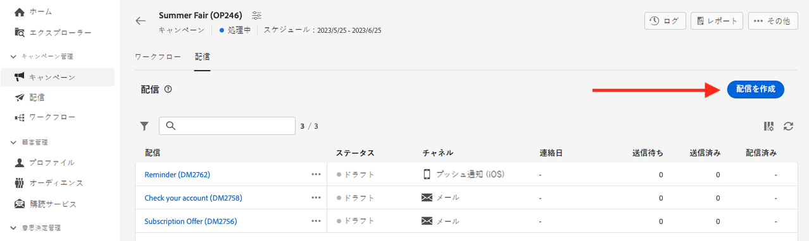
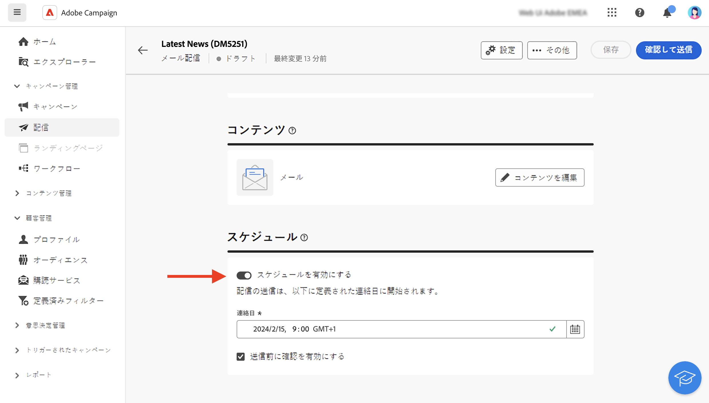

# 配信を作成 {#create-delivery}

**[!UICONTROL 配信]**&#x200B;の左メニューからスタンドアロンの配信を作成したり、キャンペーンに含まれるかどうかに関係なく、ワークフローのコンテキストで配信を作成したりできます。

配信の作成方法については、以下のタブを参照してください。

>[!BEGINTABS]

>[!TAB スタンドアロン配信を作成]

スタンドアロン配信を作成するには、次の手順に従います。

1. 左側のナビゲーションの&#x200B;**[!UICONTROL 配信]**&#x200B;メニューを参照し、「**[!UICONTROL 配信を作成]**」ボタンをクリックします。

   {zoomable="yes"}

1. 配信用チャネルを選択します。
1. メインターゲットとコントロール母集団に対する配信オーディエンスを定義します。[詳しくは、オーディエンスを参照してください](../audience/about-recipients.md)。

   {zoomable="yes"}{width="70%" align="left"}

1. メッセージコンテンツを定義します。配信チャネルと配信コンテンツの定義方法について詳しくは、次の節を参照してください。

   * [メールチャネル](../email/create-email.md)
   * [プッシュ通知チャネル](../push/gs-push.md)
   * [SMS チャネル](../sms/create-sms.md)

1. （オプション）配信[スケジュール](#gs-schedule)を定義します。スケジュールが定義されていない場合、「**[!UICONTROL 送信]**」ボタンをクリックするとメッセージが即座に送信されます。
1. 設定を確認するには、「**[!UICONTROL 確認して送信]**」ボタンをクリックします。
1. 配信やパーソナライゼーションの設定をテストするには、「**[!UICONTROL コンテンツをシミュレート]**」ボタンを使用します。メッセージのシミュレーションについて詳しくは、[この節](../preview-test/preview-test.md)を参照してください。
1. 「**[!UICONTROL 準備]**」ボタンをクリックして、ターゲット母集団を計算し、メッセージを生成します。準備の手順には数分かかる場合があります。準備が完了すると、メッセージを送信する準備が整います。エラーが発生した場合は、**ログ**&#x200B;を参照してアラートと警告を確認してます。
1. 結果を確認し、「**[!UICONTROL 送信]**」ボタンをクリックして、メッセージの送信を開始します。
1. メッセージが送信されたら、「**レポート**」セクションを参照すると、主要指標にアクセスできます。配信レポートについて詳しくは、[この節](../reporting/delivery-reports.md)を参照してください。

>[!TAB ワークフローでの配信の作成]

ワークフローで配信を作成するには、次の手順に従います。

1. ワークフローを作成するか、既存のワークフローを開きます。[ワークフローの詳細](../workflows/gs-workflow-creation.md#gs-workflow-steps)
1. 「[**[!UICONTROL オーディエンスを作成]**](../workflows/activities/build-audience.md)」アクティビティを追加して設定します。
1. 「`+`」アイコンをクリックし、配信アクティビティ（**[!UICONTROL メール]**、**[!UICONTROL SMS]**、**[!UICONTROL プッシュ通知（Android）]**&#x200B;または&#x200B;**[!UICONTROL プッシュ通知（iOS）]**）を選択します。ワークフローの配信チャネルアクティビティと、配信コンテンツの定義方法について詳しくは、[この節](../workflows/activities/channels.md)を参照してください。

   {zoomable="yes"}

1. ワークフローを開始し、ログを確認します。

ワークフローを作成せずに、キャンペーンに配信を追加することもできます。これを行うには、キャンペーンの「**[!UICONTROL 配信]**」タブを参照し、「**[!UICONTROL 配信を作成]**」ボタンをクリックします。

{zoomable="yes"}

設定手順は、スタンドアロン配信の場合と同様です。

キャンペーンの設定方法およびキャンペーンに属する配信の管理方法について詳しくは、[この節](../campaigns/gs-campaigns.md)を参照してください。

>[!ENDTABS]

## パーソナライゼーションの追加 {#personalization}

Adobe Campaign が配信するメッセージは、様々な方法でパーソナライズすることができます。[詳しくは、パーソナライゼーション機能を参照してください](../personalization/gs-personalization.md)。

Campaign を使用して動的コンテンツを作成し、パーソナライズされたメッセージを送信します。パーソナライゼーション機能を組み合わせて、メッセージを改善し、カスタムなユーザーエクスペリエンスを実現することができます。

メッセージコンテンツは、次の方法でパーソナライズできます。

* 動的な&#x200B;**パーソナライゼーションフィールド**&#x200B;の挿入

  パーソナライゼーションフィールドは、メッセージの第 1 レベルのパーソナライゼーションに使用されます。パーソナライゼーションエディターから、データベースで使用可能な任意のフィールドを選択できます。配信の場合は、受信者、メッセージまたは配信に関連する任意のフィールドを選択できます。これらのパーソナライゼーション属性は、メッセージの件名行や本文に挿入できます。[詳細情報](../personalization/personalize.md)

* 事前定義済みの&#x200B;**式フラグメント**&#x200B;の挿入

  Campaign には、配信に挿入できる特定のレンダリングを含んだ一連の式フラグメントが付属しています。例えば、ロゴ、挨拶メッセージまたはメッセージのミラーページへのリンクを追加できます。式フラグメントは、パーソナライゼーションエディターの専用のエントリから使用できます。また、ニーズに合わせて独自の式フラグメントを作成することもできます。[詳しくは、式フラグメントの使用方法を参照してください](../content/use-expression-fragments.md)。

* **条件付きコンテンツ**&#x200B;の作成

  条件付きコンテンツを設定し、受信者のプロファイルなどに基づいて動的なパーソナライゼーションを追加します。特定の条件が成立した場合に、テキストブロックや画像を挿入できます。[詳細情報](../personalization/conditions.md)

* **パーソナライズされたオファー**&#x200B;の追加

  受信者の場所、現在の天気、最後の注文書に応じて、メッセージコンテンツにパーソナライズされたオファーを挿入します。[詳細情報](../msg/offers.md)

## 配信のプレビューとテスト

メッセージコンテンツを定義したら、プレビューしてメッセージのレンダリングを制御し、テストプロファイルでパーソナライゼーション設定を確認できます。[詳細情報](../preview-test/preview-test.md)

## 配信送信のスケジュール設定 {#gs-schedule}

>[!CONTEXTUALHELP]
>id="acw_deliveries_email_schedule"
>title="コンタクト日時の設定"
>abstract="配信を送信する日付と正確な時刻を定義します。マーケティングメッセージに最も適した時間を選択することで、開封率を最大化します。"

メッセージを送信する日付と正確な時刻を設定できます。マーケティングメッセージに最も適した時間を選択することで、開封率を最大化します。

配信の送信スケジュールを設定するには、配信を開き、「**[!UICONTROL スケジュール]**」セクションを参照します。「**[!UICONTROL スケジュールを有効にする]**」切替スイッチを使用してスケジュールをアクティベートし、送信する日時を設定します。配信を送信すると、実際の送信は、定義した連絡日に開始されます。

{zoomable="yes"}

デフォルトでは、「**[!UICONTROL 送信前に確認を有効にする]**」オプションが有効になっています。このオプションでは、スケジュール設定した日時に配信を送信する前に送信を確定する必要があります。スケジュール設定した日時に配信を自動的に送信する必要がある場合は、このオプションを無効にします。

スケジュール設定した配信を送信する手順については、[この節](../monitor/prepare-send.md#schedule-the-send)を参照してください。

## 監視とトラッキングログ {#gs-tracking-logs}

配信を送信後に監視することは、マーケティングキャンペーンを効率化し顧客に確実にリーチする重要なステップです。

配信の送信後に監視したり、配信の失敗や強制隔離がどのように管理されているかを把握したりできます。

監視機能とトラッキング機能について詳しくは、[この節](../reporting/gs-reports.md)を参照してください。