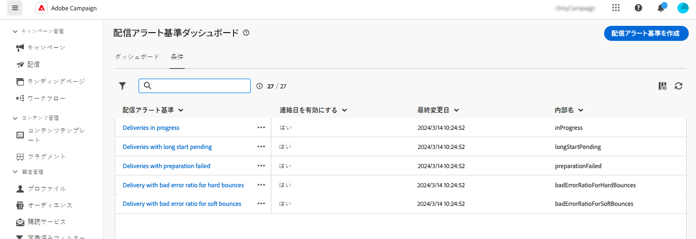
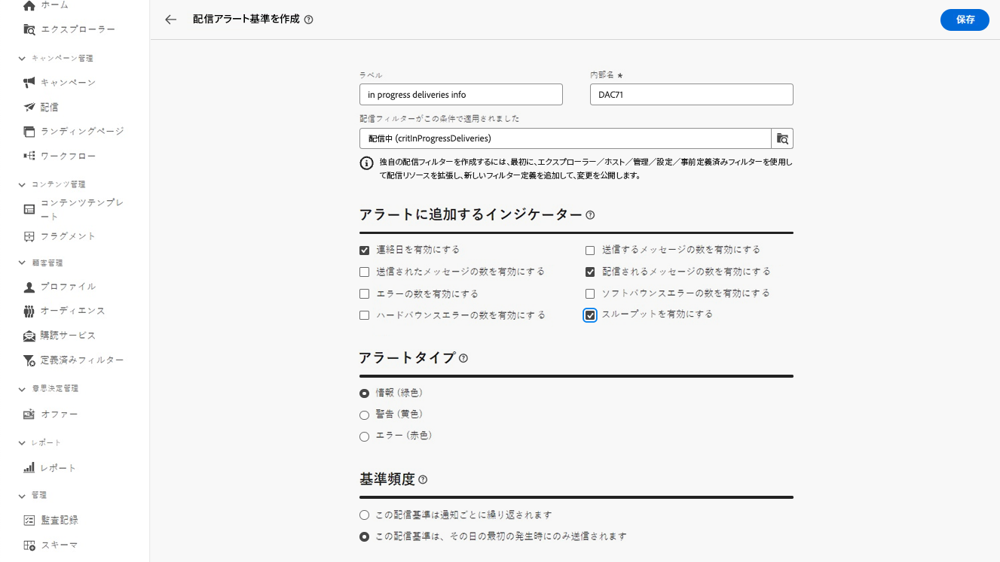

# 配信アラート基準 {#delivery-alerting-criteria}

>[!CONTEXTUALHELP]
>id="acw_delivery_alerting_criteria"
>title="配信アラート基準ダッシュボード"
>abstract="Campaign web ユーザーインターフェイスには、ダッシュボードに追加できる事前定義済みのアラート条件（スループットの低い配信、準備に失敗した配信など）が用意されています。 また、ニーズに合わせて独自の条件を作成することもできます。"

Campaign web ユーザーインターフェイスには、ダッシュボードに追加できる事前定義済みのアラート条件（スループットの低い配信、準備に失敗した配信など）が用意されています。 また、ニーズに合わせて独自の条件を作成することもできます。

アラート条件には、からアクセスできます **配信アラート** 左側のナビゲーション ウィンドウの下のメニュー **条件** タブ。

## 定義済みのアラート条件 {#ootb-criteria}

事前定義済みのアラート条件は、Campaign web ユーザーインターフェイスで使用できます。 これらの条件は、次に示す様々なシナリオに対応しています。

* **配信に失敗しました**：定義された範囲内でスケジュールされた配信（ステータスがエラーあり）。
* **準備に失敗した配信**：定義された範囲内で変更された配信で、準備手順（ターゲットの計算とコンテンツの生成）に失敗した場合。
* **ソフトバウンスで無効なエラー率の配信**：定義された範囲内にスケジュールされた配信で、ステータスが少なくとも処理中、ソフトバウンスエラー率が定義された割合を超えているもの。
* **ハードバウンスに対して、無効なエラー率で配信**：定義された範囲内にスケジュールされ、ステータスが処理中で、ハードバウンスエラー率が定義された割合を超える配信。
* **長時間開始が保留中の配信**：定義された範囲内でスケジュールされた配信で、開始保留中ステータスが定義された期間を超える場合、開始保留中ステータスは、メッセージがシステムでまだ考慮されていないことを意味します。
* **スループットの低い配信**：定義された期間より長く開始され、処理されたメッセージの割合が定義されている値未満で、スループットが定義されている値より低い配信。
* **配信中**：定義された範囲内でスケジュールされた配信（「処理中」ステータスを含む）。

>[!NOTE]
>
>上記の条件に一致するすべてのパラメーターにデフォルト値が適用されます。 これらの値は、 **条件パラメーター** 配信アラート ダッシュボードが使用されている場所のセクション。 [ダッシュボードの操作方法を学ぶ](../msg/delivery-alerting-dashboards.md)

## アラート条件の作成 {#criteria}

>[!CONTEXTUALHELP]
>id="acw_delivery_alerting_criteria_create"
>title="配信アラート基準を作成"
>abstract="Adobe Campaignが提供する事前定義済みのアラート条件に加えて、ニーズに合わせて独自の条件を作成できます。"

>[!CONTEXTUALHELP]
>id="acw_delivery_alerting_criteria_create_indicators"
>title="アラートに追加するインジケーター"
>abstract="メールアラートの「詳細」セクションで、列として表示する指標を選択します。"

>[!CONTEXTUALHELP]
>id="acw_delivery_alerting_criteria_create_alert"
>title="アラートタイプ"
>abstract="を指定 **アラートタイプ** 条件では、アラートの「概要」セクションの配信条件の横に表示されるラベルと色を意味します。"

>[!CONTEXTUALHELP]
>id="acw_delivery_alerting_criteria_create_frequency"
>title="基準頻度"
>abstract="条件を満たす各配信について、1 日あたりのアラートの頻度を制御します。"

>[!CONTEXTUALHELP]
>id="acw_delivery_alerting_filter"
>title="アラート条件の作成"
>abstract="独自の配信フィルターを作成するには、Campaign v8 コンソールで&#x200B;**管理**／**設定**／**定義済みフィルター**&#x200B;ノードから新しい定義済みフィルターを作成します。"

新しい条件を作成するには、次の手順に従います。

1. に移動します。 **配信の評価** メニューをクリックし、 **条件** タブ。
1. 「」をクリックします **配信アラート条件の作成** ボタン。
1. 条件のラベルを指定します。 内部名は自動的に入力され、読み取り専用です。
1. この **この条件で適用される配信フィルター** では、定義済みフィルターを適用して条件の範囲を絞り込むことができます。

   以下の例では、 **処理中の配信（critInProgressDeliveries）** フィルターが選択されています。つまり、この条件では「処理中」ステータスの配信のみが考慮されます。

   

   >[!NOTE]
   >
   >定義済みフィルターがニーズに合わない場合は、管理者に問い合わせて独自のフィルターを作成できます。  Campaign コンソールで定義済みフィルターを作成する方法について詳しくは、を参照してください。 [Adobe Campaign v8 （コンソール）ドキュメント](https://experienceleague.adobe.com/en/docs/campaign/campaign-v8/audience/create-audiences/create-filters){target="_blank"}
   >
   >この操作は、上級ユーザーのみが実行する必要があります。

1. が含まれる **アラートに追加する指標** セクションで、メールアラートの「詳細」セクションに列として表示する指標を選択します。

1. を指定 **アラートタイプ** 条件では、アラートの「概要」セクションの配信条件の横に表示されるラベルと色を意味します。

1. この **条件の頻度** 「」セクションでは、次の条件を満たす各配信の 1 日あたりのアラートの頻度を制御できます。

   * **この配信条件は、すべての通知で繰り返されます**：その日のすべてのメールアラートの条件を満たす配信を表示します。
   * **この配信条件は、その日の最初の回にのみ送信されます**：その日の最初のレポートのみの条件を満たす配信を表示し、後続のメールアラートでは繰り返し表示しません。
