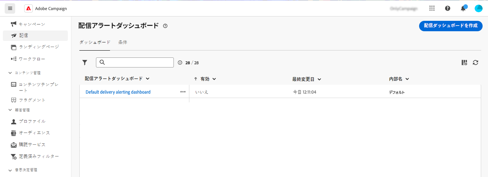
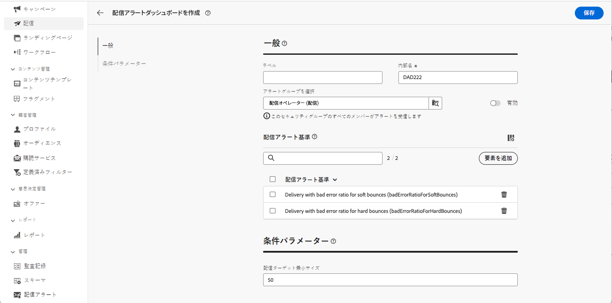
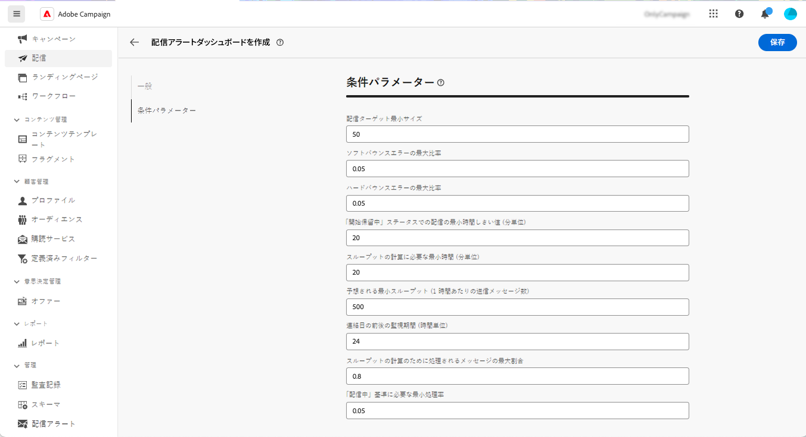
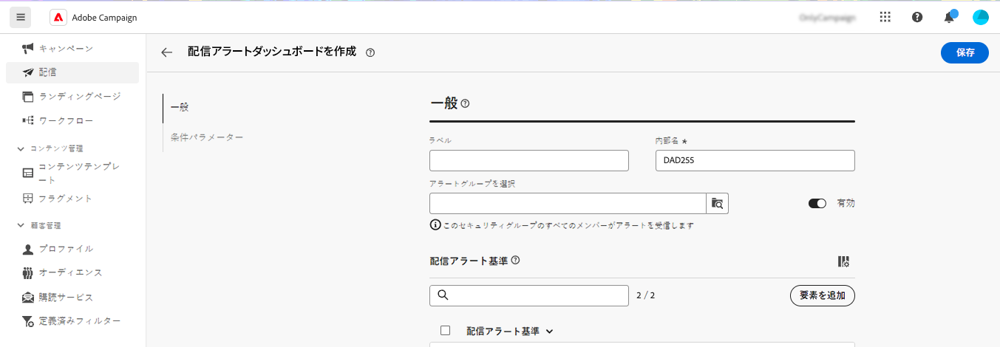
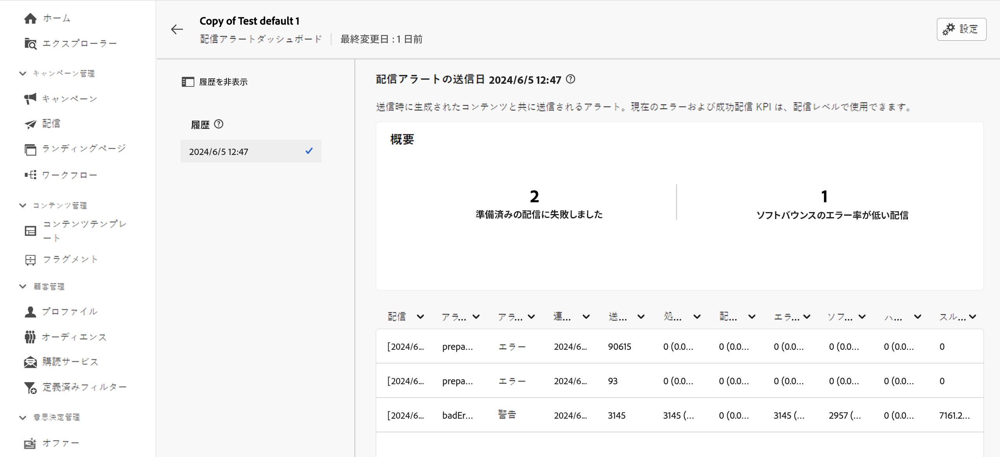

# 配信アラートダッシュボード {#delivery-alerting-dashboards}

>[!CONTEXTUALHELP]
>id="acw_delivery_alerting_dashboards"
>title="配信アラートダッシュボード"
>abstract="配信アラートは、ユーザーのグループが配信実行に関する情報を含むメール通知を自動的に受信できるようにする、アラート管理システムです。配信アラートダッシュボードを使用すると、メールアラートを受信するユーザーの指定、アラート送信に使用するアラート条件の選択と設定、すべての送信済み通知の履歴へのアクセスが可能になります。"

配信アラートダッシュボードを使用すると、メールアラートを受信するユーザーの指定、アラート送信に使用するアラート条件の選択と設定、すべての送信済み通知の履歴へのアクセスが可能になります。これらは、「**ダッシュボード**」タブの左側のナビゲーションパネルにある&#x200B;**配信アラート**&#x200B;メニューからアクセスできます。

## 配信ダッシュボードの作成 {#dashboards}

>[!CONTEXTUALHELP]
>id="acw_delery_alerting_dashboard_create"
>title="配信アラートダッシュボードを作成"
>abstract="配信アラートダッシュボードを作成すると、メールアラートを受信するユーザーの指定、アラート送信に使用するアラート条件の選択と設定、すべての送信済み通知の履歴へのアクセスが可能になります。"

>[!CONTEXTUALHELP]
>id="acw_delivery_alerting_create_general"
>title="配信アラート一般パラメーター"
>abstract="配信アラートダッシュボードの一般プロパティを指定します。「**アラートグループを選択**」フィールドで、このダッシュボードによって送信されるアラートを受信する&#x200B;**オペレーターグループ**&#x200B;を指定します。"

>[!CONTEXTUALHELP]
>id="acw_delivery_alerting_create_criteria_add"
>title="配信アラート条件"
>abstract="このセクションでは、このダッシュボードからアラートを送信するために使用する条件を追加します。定義済み条件から選択するか、特定のニーズに合わせて独自の条件を作成します。"

>[!CONTEXTUALHELP]
>id="acw_delivery_alerting_create_criteria_parameters"
>title="条件パラメーター"
>abstract="条件には、適用方法を定義するデフォルトのパラメーター値があります。このセクションから、ニーズに合わせてこれらの値を変更できます。"

配信ダッシュボードを作成するには、次の手順に従います。

1. 左側のナビゲーションパネルで **配信アラート** メニューに移動し、「**配信ダッシュボードを作成**」をクリックします。

   

1. 「**ラベル**」フィールドでダッシュボードの名前を付けます。「**内部名**」フィールドは自動的に入力され、読み取り専用になります。

1. 「**アラートグループを選択**」フィールドで、このダッシュボードによって送信されるアラートを受信する&#x200B;**オペレーターグループ**&#x200B;を指定します。選択したオペレーターグループのすべてのメンバーがアラートを受信します。

   権限とオペレーターグループについて詳しくは、[Adobe Campaign v8 （コンソール）ドキュメントを参照してください ](https://experienceleague.adobe.com/ja/docs/campaign/campaign-v8/admin/permissions/gs-permissions){target="_blank"}

1. 「**配信アラート条件**」セクションで、アラートの送信に使用する条件を追加します。定義済み条件から選択するか、特定のニーズに合わせて独自の条件を作成します。[詳しくは、条件の操作方法を参照してください](../msg/delivery-alerting-criteria.md)

1. 条件には、適用方法を定義するデフォルトのパラメーター値があります。 「**条件パラメーター**」セクションから、ニーズに合わせてこれらの値を変更できます。

   

   例えば、デフォルトでは、**配信ターゲットの最小サイズ**&#x200B;条件パラメーターは「50」に設定されます。つまり、このダッシュボードによって送信されるアラートには、50 以上のプロファイルをターゲットとする配信のみが含まれます。50 個未満のプロファイルをターゲットとする配信を含める場合は、このパラメーターを変更できます。

   各条件パラメーターについて詳しくは、以下の節を展開してください。

   +++使用可能な条件パラメーター

   * **配信ターゲットの最小サイズ**：例えば、このフィールドに「100」と入力すると、ターゲットが 100 人以上の受信者である配信に対してのみ通知が送信されます。このパラメーターは、すべての条件に適用されます。
   * **連絡日の前後の監視期間（時間単位）**：現在時刻の前後の時間数。この時間範囲内に連絡日がある配信のみが考慮されます。このパラメーターは、すべての条件に適用されます。デフォルトでは、このフィールドの値は 24 時間に設定されています。
   * **ソフトバウンスエラーの最大比率**：ソフトバウンスエラー率が指定した値を超えるすべての配信に対して通知が送信されます。デフォルトでは、このフィールドの値は 0.05（5%）に設定されます。
   * **ハードバウンスエラーの最大比率**：ハードバウンスエラー率が指定した値を超えるすべての配信に対して通知が送信されます。デフォルトでは、このフィールドの値は 0.05（5%）に設定されます。
   * **「開始保留中」ステータスでの配信の最小時間しきい値（分単位）**：このフィールドで指定した期間を超えて開始保留中ステータスにあるすべての配信に対して通知が送信されます。開始保留中ステータスは、メッセージがまだシステムによって考慮されていません。
   * **スループットの計算に必要な最小時間（分単位）**：低スループットでの配信条件では、指定した期間を超えて開始された（処理中ステータスの）配信のみが考慮されます。
   * **スループットの計算のために処理されるメッセージの最大割合**：低スループットでの配信条件では、処理したメッセージの割合が指定した割合よりも低い配信のみが考慮されます。
   * **予想される最小スループット（1 時間あたりの送信メッセージ数）**：低スループットでの配信基準では、指定した値より低いスループットの配信のみが考慮されます。
   * **「処理中の配信」基準に必要な最小処理率**：処理されたメッセージの割合が指定した割合を超える配信のみが考慮されます。

+++

1. デフォルトでは、アラートのダッシュボードは無効になっています。つまり、このダッシュボードにリンクされたメールアラートは送信されません。ダッシュボードをすぐに有効にするには、アラートグループ選択フィールドの横にある&#x200B;**一般**&#x200B;セクションで「**有効**」オプションを切り替えます。

   ダッシュボードは、保存して後で有効にすることもできます。

   

1. アラートダッシュボードを保存するには、「**保存**」ボタンをクリックします。

アラートダッシュボードが開き、空白のデータが表示されます。アラートをアクティブ化して通知を送信する準備が整ったら、「**設定**」ボタンをクリックし、「**有効**」オプションを切り替えていない場合は切り替えます。

これで、配信がこのダッシュボードで定義した基準を満たすたびに、指定したオペレーターグループにアラート通知が送信されるようになります。

## アラートダッシュボードの管理

>[!CONTEXTUALHELP]
>id="acw_delivery_alerting_dashboard_alerts"
>title="送信された配信アラート"
>abstract="このセクションでは、最新の送信済みアラートに関連する情報を視覚化できます。"

>[!CONTEXTUALHELP]
>id="acw_delivery_alerting_dashboard_history"
>title="配信アラート履歴"
>abstract="**履歴**&#x200B;ペインには、このダッシュボードから送信されたすべてのアラートが含まれています。項目をクリックすると、その特定の時間に送信された対応するアラートにアクセスできます。"

作成されたすべてのアラートダッシュボードには、「**ダッシュボード**」タブの&#x200B;**配信アラート**&#x200B;メニューからアクセスできます。

ダッシュボードの複製や削除には、ダッシュボード名の横にある「**その他のアクション**」ボタンを使用します。

ダッシュボードの詳細ビューにアクセスするには、リストからその名前をクリックします。この画面から、最後に送信されたアラートを視覚化できます。左側のペインには、すべての送信済みアラートが表示されます。項目をクリックすると、その特定の時間に送信された対応するアラートにアクセスできます。

ダッシュボードを編集するには、右上隅にある「**設定**」ボタンをクリックし、必要な変更を行います。