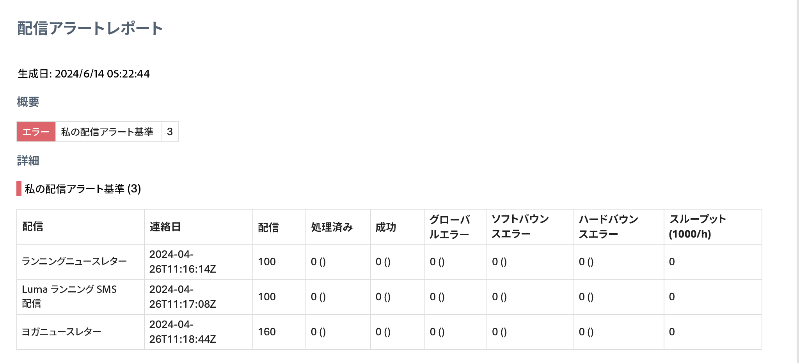

# 配信アラートの基本を学ぶ {#gs-delivery-alerting}

配信アラートは、ユーザーのグループが配信実行に関する情報を含むメール通知を自動的に受信できるようにする、アラート管理システムです。受信者は、Adobe Campaign によって処理される進行中の配信を監視し、問題が発生した場合に適切なアクションを実行できます。

通知は、Adobe Campaign web ユーザーインターフェイスを通じて定義された特定のアラート条件に基づいてカスタマイズできます。

配信エラーの管理方法について詳しくは、[Adobe Campaign v8 （コンソール）ドキュメント](https://experienceleague.adobe.com/ja/docs/campaign/campaign-v8/send/failures/delivery-failures#send){target="_blank"}を参照してください

## メール通知コンテンツ {#content}

メール通知には、次のセクションが含まれます。

* **概要**：定義済み条件を満たす配信数を、条件ごとにラベルとカラーで表示します。
* **詳細**：ダッシュボードに定義済みのすべての配信条件と、各条件に対応する配信をリストします。

## 配信アラートの設定 {#set-up}

これらのアラートを設定するために、Campaign web ユーザーインターフェイスでは、次の項目を作成および管理できます。

* **配信アラートダッシュボード**：受信者を指定し、ダッシュボードに含めるアラート条件を設定し、送信済みアラートの履歴にアクセスします。[詳しくは、ダッシュボードの操作方法を参照してください](../msg/delivery-alerting-dashboards.md)
* **配信アラート条件**：Campaign web ユーザーインターフェイスには、ダッシュボードに追加できる定義済みアラート条件（スループットが低い配信、準備に失敗した配信など）が用意されています。また、ニーズに合わせて独自の条件を作成することもできます。[詳しくは、条件の操作方法を参照してください](../msg/delivery-alerting-criteria.md)

例えば、失敗した配信については管理者権限を持つユーザーにのみ通知し、ソフトバウンスエラー率の高い配信についてはマーケティングユーザーに通知するとします。これを実現するには、受信者のグループごとに適切な条件を持つ 2 つの個別のダッシュボードを作成します。

>[!NOTE]
>
>ダッシュボードとアラート条件にアクセスして設定するには、**管理者権限**&#x200B;を持っているか、**配信スーパーバイザー**&#x200B;のセキュリティグループに属している必要があります。標準ユーザーは、Adobe Campaign インターフェイスのダッシュボードにアクセスできませんが、アラート通知を受信することはできます。[詳しくは、アクセスと権限を参照してください](../get-started/permissions.md)
