# 配信テンプレートを操作 {#work-with-delivery-templates}

>[!CONTEXTUALHELP]
>id="acw_delivery_template_for_campaign"
>title="配信テンプレート"
>abstract="キャンペーンの実行と開始を迅速におこなうために、配信テンプレートを使用してクリエイティブなルックアンドフィールを標準化します。"

高速で改善されたデザインプロセスを実現するために、配信テンプレートを作成して、キャンペーン全体でカスタムコンテンツや設定を簡単に再利用できます。 この機能を使用すると、クリエイティブなルックアンドフィールを標準化して、キャンペーンの実行と開始をより迅速に行うことができます。

テンプレートには、次の項目を含めることができます。

* [タイポロジ](../advanced-settings/delivery-settings.md#typology),
* 送信者のアドレス,
* An [audience](../audience/about-audiences.md)を含む [コントロール母集団](../audience/control-group.md),
* カスタム[コンテンツ](../content/edit-content.md),
* [パーソナライズされたフィールド](../personalization/personalize.md)と[条件付きコンテンツ](../personalization/conditions.md),
* [ミラーページ](../content/mirror-page.md)へのリンクと購読解除[リンク](../content/message-tracking.md),
* リソースの有効性、再試行パラメーター、強制隔離設定など、その他の配信プロパティ。

>[!NOTE]
>
>配信テンプレートは、 [電子メールコンテンツテンプレート](../content/email-templates.md)：メッセージのコンテンツのみを再利用できます。

## 配信テンプレートへのアクセスと管理 {#access-manage-templates}

>[!CONTEXTUALHELP]
>id="acw_delivery_templates"
>title="配信テンプレートの操作"
>abstract="配信テンプレートを使用すると、後で使用できるように既存の配信を簡単に作成して保存できます。"
>additional-url="https://experienceleague.adobe.com/docs/campaign-web/v8/msg/delivery-template.html?lang=ja#copy-an-existing-template" text="既存のテンプレートを複製"
>additional-url="https://experienceleague.adobe.com/docs/campaign-web/v8/msg/delivery-template.html?lang=ja#convert-an-existing-delivery" text="配信をテンプレートに変換"

コンテンツテンプレートリストにアクセスするには、左側のメニューから&#x200B;**[!UICONTROL キャンペーン管理]**／**[!UICONTROL 配信]**&#x200B;を選択し、「**テンプレート**」タブを参照します。

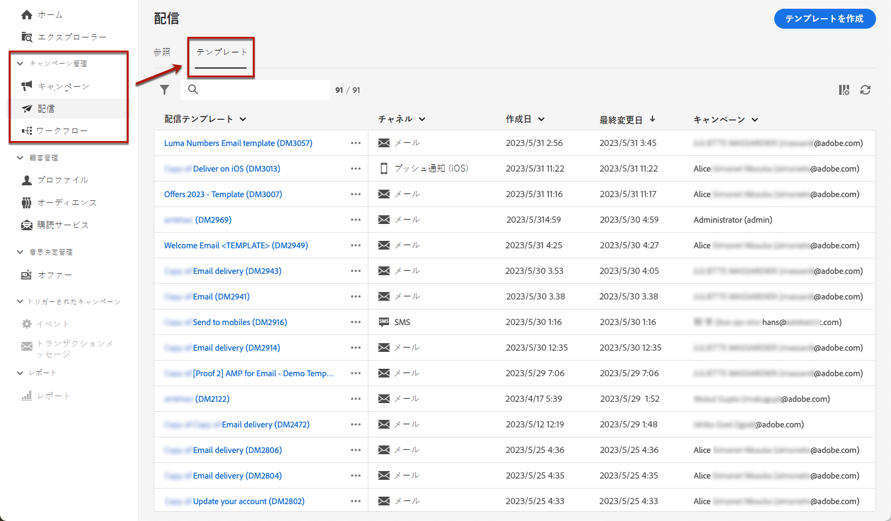

現在の環境で[作成](#create-a-delivery-template)されたすべてのテンプレートが表示されます。

チャネルおよびフォルダーのコンテンツテンプレートをフィルターできます。配信属性を使用してルールを作成すると、高度なフィルターを設定することもできます。[ルールビルダーの詳細情報](../audience/segment-builder.md)

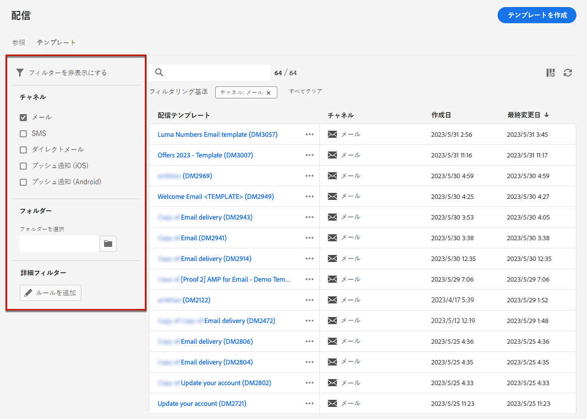

テンプレートを編集するには、リストから目的の項目をクリックします。そこから

* そのコンテンツ、プロパティ、オーディエンス、およびそれに添付されているオファーを変更できます。
* また、テンプレートをテストすることもできます。[詳細情報](#test-template)

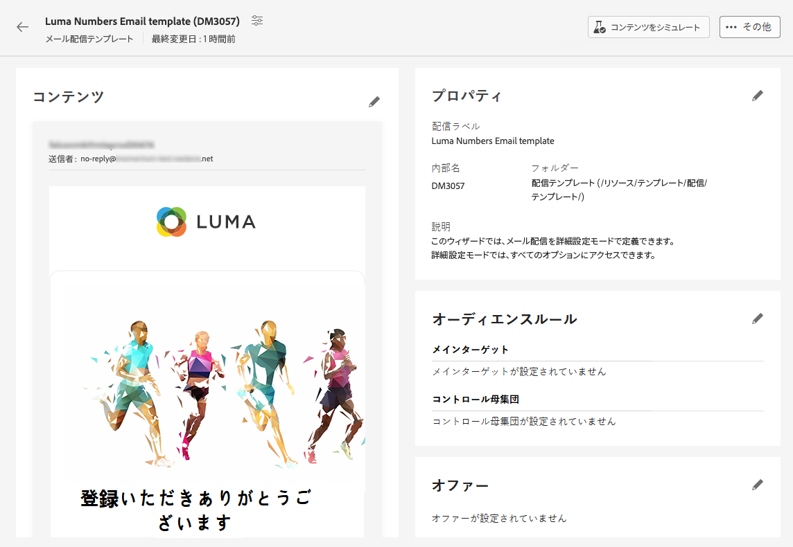

テンプレートを削除または[複製](#copy-an-existing-template)するには、**[!UICONTROL その他のアクション]**&#x200B;メニュー（**[!UICONTROL テンプレート]**&#x200B;リストまたはテンプレート編集画面）から対応するアクションを選択します。

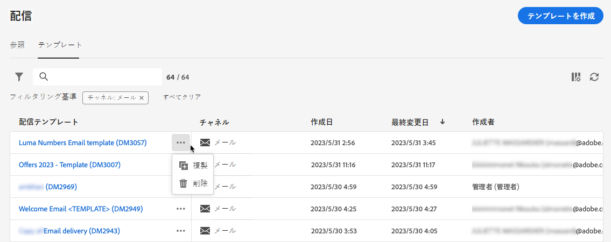

>[!NOTE]
>
>テンプレートが編集または削除されても、このテンプレートを使用して作成された配信は影響を受けません。

## 配信テンプレートの作成 {#create-a-delivery-template}

配信テンプレートを作成するには、次の操作を実行します。
* 既存のテンプレートを複製 - [詳細情報](#copy-an-existing-template)
* 既存の配信をテンプレートに変換 - [詳細情報](#convert-an-existing-delivery)
* 配信テンプレートをゼロから作成 - [詳細情報](#create-a-new-template)

### 既存の配信テンプレートの複製 {#copy-an-existing-template}

キャンペーンには、各チャネル用の一連の組み込みテンプレート（メール、プッシュ、SMS）が備わっています。配信テンプレートを作成する最も簡単な方法は、組み込みテンプレートを複製してカスタマイズすることです。

>[!NOTE]
>
>また、任意のカスタムテンプレートを複製することもできます。

配信テンプレートを複製するには、次の手順に従います。

1. **配信**&#x200B;の左側のメニューから、「**テンプレート**」タブを参照します。[詳細情報](#access-manage-templates)
1. 目的のテンプレート名の右側にある 「**[!UICONTROL その他のアクション]**」ボタンをクリックし、「**[!UICONTROL 複製]**」を選択します。

   リストからテンプレートを選択し、テンプレート編集画面からこのオプションを選択することもできます。

1. 複製を確定します。

   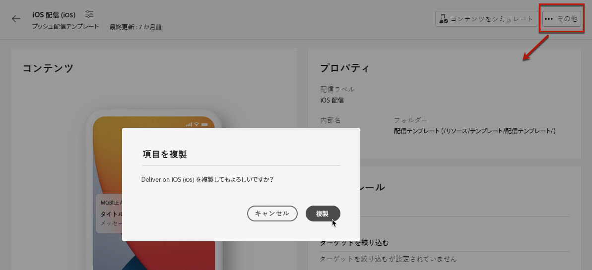

1. 中央の画面に新しいテンプレートダッシュボードが開きます。必要に応じて、テンプレート設定を編集します。

   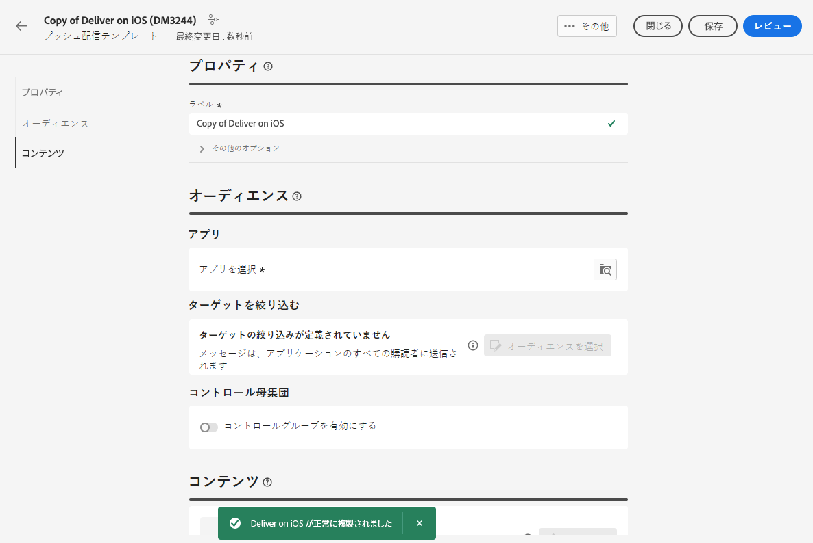

1. 「**[!UICONTROL レビュー]**」ボタンをクリックして、テンプレートを保存して確認します。すべての設定を編集、削除および複製できます。

   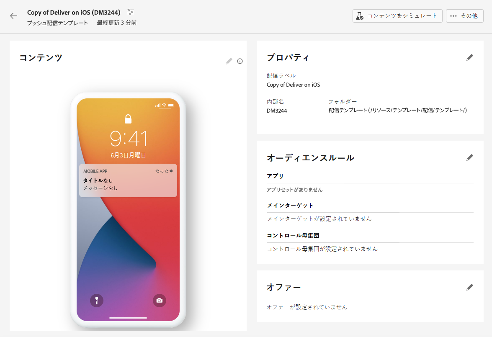

1. 必要に応じて、テンプレートのレンダリングをテストします。[詳細情報](#test-template)

新しいテンプレートが&#x200B;[**テンプレート**&#x200B;リスト](#access-manage-templates)に追加されます。これで、新しい配信を作成する際にテンプレートを選択できます。

### 配信をテンプレートに変換 {#convert-an-existing-delivery}

配信をテンプレートに変換すると、今後繰り返し配信アクションの作成に使用できます。

配信をテンプレートとして保存するには、次の手順に従います。

1. **[!UICONTROL キャンペーン管理]**／**[!UICONTROL 配信]**&#x200B;メニューに移動します。
1. 「**[!UICONTROL 参照]**」タブで、目的の配信名の右側にある「**[!UICONTROL その他のアクション]**」ボタンをクリックし、「**[!UICONTROL テンプレートとしてコピー]**」を選択します。

   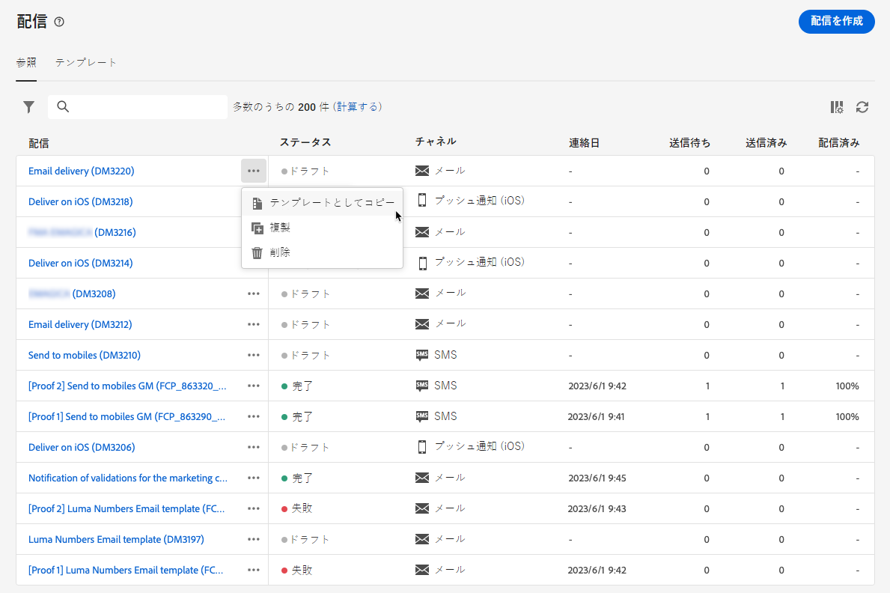

1. 複製を確定します。

1. 中央の画面に新しいテンプレートダッシュボードが開きます。必要に応じて、テンプレート設定を編集します。

1. 「**[!UICONTROL レビュー]**」ボタンをクリックして、テンプレートを保存して確認します。すべての設定を編集、削除および複製できます。

1. 必要に応じて、テンプレートのレンダリングをテストします。[詳細情報](#test-template)

新しいテンプレートが&#x200B;[**テンプレート**&#x200B;リスト](#access-manage-templates)に追加されます。これで、新しい配信を作成する際にテンプレートを選択できます。

### 新しい配信テンプレートを作成 {#create-a-new-template}

>[!NOTE]
>
>設定エラーを防ぐために、新しいテンプレートを作成するのではなく、[組み込みテンプレートを複製](#copy-an-existing-template)してプロパティをカスタマイズすることをお勧めします。

配信テンプレートを最初から設定するには、次の手順に従います。

1. **配信**&#x200B;の左側のメニューから、「**テンプレート**」タブを参照します。[詳細情報](#access-manage-templates)
1. 「**[!UICONTROL テンプレートを作成]**」ボタンをクリックします。

   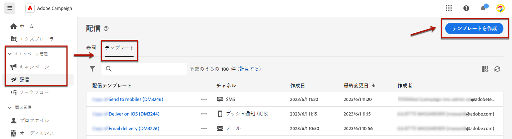

1. テンプレートに使用するチャネルを選択します。
1. そのチャネルの組み込み配信テンプレートは、独自のテンプレートの作成に役立つようにデフォルトで使用されます。 必要に応じて、選択したチャネルの右側にある専用ボタンを使用して別のテンプレートを選択します。

   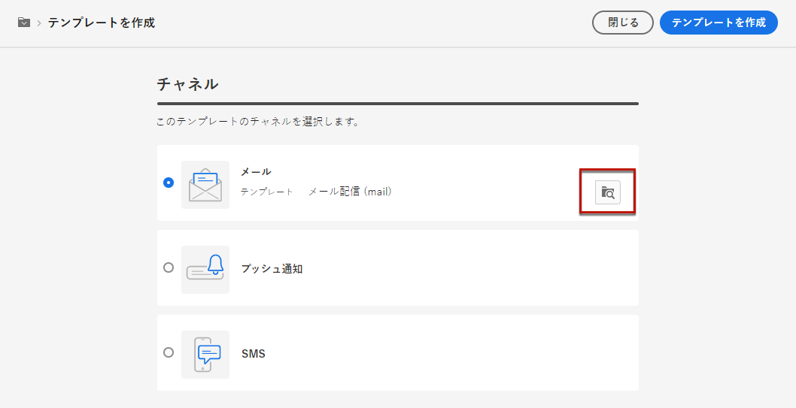

1. 「**[!UICONTROL テンプレートを作成]**」ボタンをもう一度クリックします。

1. 選択したチャネルに応じて、テンプレートのプロパティ、[オーディエンス](../audience/add-audience.md)およびコンテンツを定義します。

   >[!NOTE]
   >
   >配信チャネルと各コンテンツのデザイン方法について詳しくは、以下の節を参照してください。
   >
   > * [メールチャネル](../email/create-email.md)
   > * [プッシュ通知チャネル](../push/gs-push.md)
   > * [SMS チャネル](../sms/create-sms.md)

1. また、電子メールテンプレートの場合、タイポロジルールやターゲットマッピングなどの詳細設定には、 **[!UICONTROL 設定]** ボタンをクリックします。 [詳細情報](../advanced-settings/delivery-settings.md)

1. 「**[!UICONTROL レビュー]**」ボタンをクリックしてテンプレートを保存およびレビューします。すべての設定を編集、削除および複製できます。

1. 必要に応じて、テンプレートのレンダリングをテストします。[詳細情報](#test-template)

新しいテンプレートが&#x200B;[**テンプレート**&#x200B;リスト](#access-manage-templates)に追加されます。これで、新しい配信を作成する際にテンプレートを選択できます。

## 配信テンプレートをテスト {#test-template}

ゼロから作成した場合も、既存のコンテンツから作成した場合も、配信テンプレートのレンダリングをテストできます。これを行うには、以下の手順に従います。

1. **[!UICONTROL キャンペーン管理]**／**[!UICONTROL 配信]**&#x200B;メニューから「**テンプレート**」タブに移動し、任意のテンプレートを選択します。[詳細情報](#access-manage-templates)

1. 次をクリック： **[!UICONTROL コンテンツをシミュレート]** ボタンを使用して、画面の右上に表示されます。

   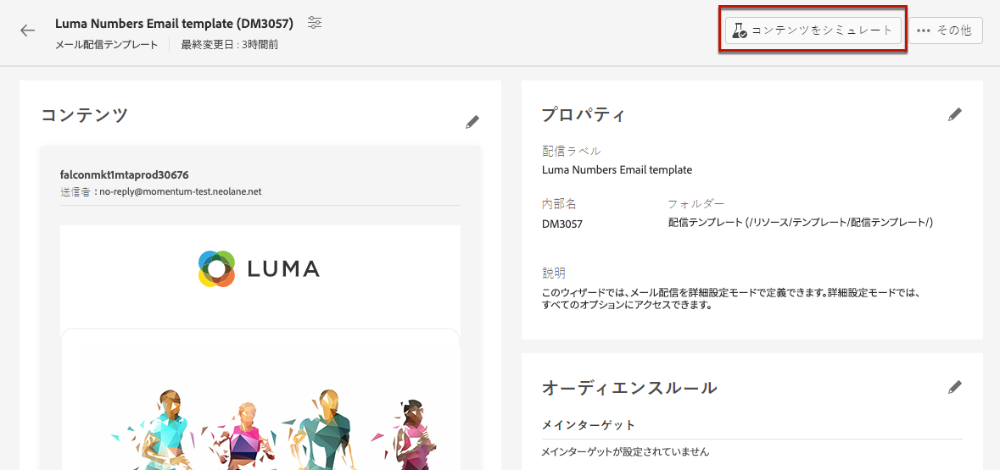

1. 1 つ以上のテストプロファイルを選択して、メールのレンダリングを確認します。また、データベースから実際のプロファイルを選択することもできます。

1. 様々なプロファイルを切り替えて、選択したプロファイルに従ってメッセージをパーソナライズして表示します。

   <!--[Learn more on test profiles](../preview-test/test-deliveries.md#recipients)-->

   また、ズームレベルを調整し、デスクトップビューまたはモバイルビューを選択することもできます。

   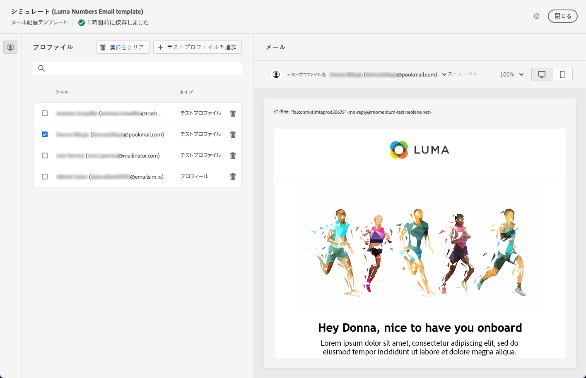

1. ウィンドウを閉じて、テンプレート編集画面に戻ります。

>[!NOTE]
>
>メールのレンダリングを使用したり、配信テンプレートで配達確認を送信したりすることはできません。

* [メールコンテンツのプレビューの詳細情報](../preview-test/preview-content.md)

* [SMS コンテンツのプレビューの詳細情報](../sms/content-sms.md)

* [プッシュコンテンツのプレビューの詳細情報](../push/gs-push.md)

