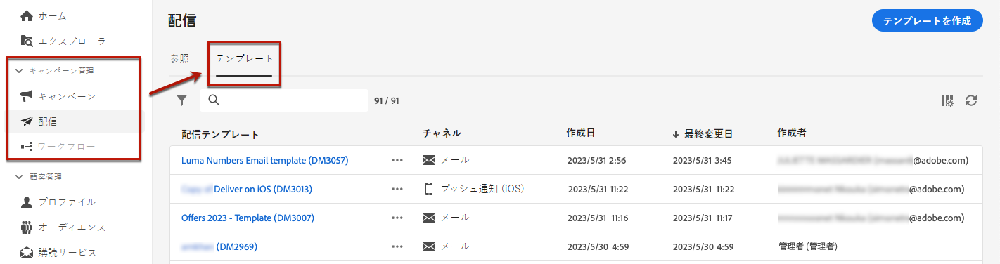
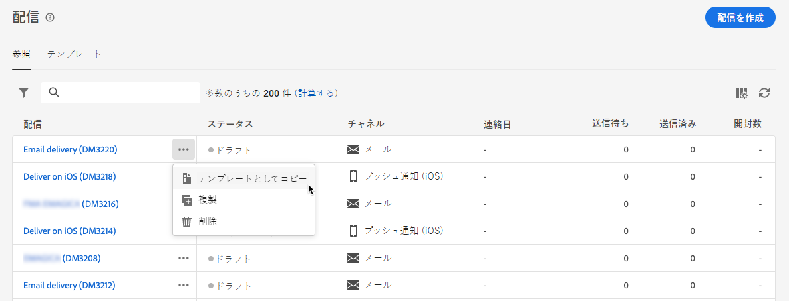
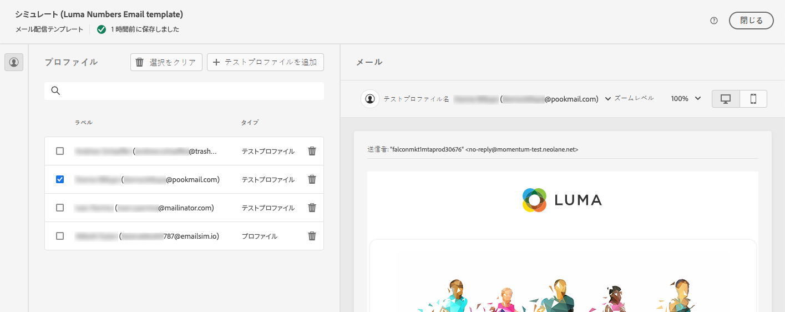

# 配信テンプレートの使用 {#work-with-delivery-templates}

>[!CONTEXTUALHELP]
>id="acw_delivery_template_for_campaign"
>title="配信テンプレート"
>abstract="設計プロセスの加速と改善のために、配信テンプレートを作成すると、キャンペーン全体でカスタムコンテンツと設定を再利用できます。この機能により、クリエイティブなルックアンドフィールが標準化され、キャンペーンの実行と開始をより迅速に行うことができます。"

設計プロセスの加速と改善のために、配信テンプレートを作成すると、キャンペーン全体でカスタムコンテンツと設定を再利用できます。この機能により、クリエイティブなルックアンドフィールが標準化され、キャンペーンの実行と開始をより迅速に行うことができます。

テンプレートには、次の項目が含まれます。

* テンプレートの&#x200B;**フォルダー**&#x200B;と&#x200B;**実行フォルダー**。フォルダーは、配信テンプレートが保存される場所です。実行フォルダーは、このテンプレートに基づいて作成された配信が保存されるフォルダーです。
* [タイポロジ](../advanced-settings/delivery-settings.md#typology),
* 送信者のアドレス、
* [オーディエンス](../audience/about-recipients.md)（[コントロール母集団](../audience/control-group.md)を含む）
* カスタム[コンテンツ](../email/edit-content.md)、
* [パーソナライズされたフィールド](../personalization/personalize.md)と[条件付きコンテンツ](../personalization/conditions.md)、
* [ミラーページ](../email/mirror-page.md)へのリンクと購読解除[リンク](../email/message-tracking.md)、
* リソースの有効性、再試行パラメーター、強制隔離設定など、その他の配信プロパティ。

>[!NOTE]
>
>配信テンプレートは、メールのコンテンツのみを再利用し、標準で用意されているサンプルメールテンプレートのいずれかを使用してコンテンツの作成を開始できる[コンテンツテンプレート](../content/create-email-templates.md)とは異なります。

## 配信テンプレートへのアクセスと管理 {#access-manage-templates}

>[!CONTEXTUALHELP]
>id="acw_delivery_templates"
>title="配信テンプレートを操作"
>abstract="配信テンプレートを使用して、キャンペーン全体で今後使用するための配信設定を作成および保存します。配信テンプレートは、ゼロから作成したり、既存のテンプレートを複製したり、配信をテンプレートに変換したりします。"

コンテンツテンプレートリストにアクセスするには、左側のメニューから&#x200B;**[!UICONTROL キャンペーン管理]**／**[!UICONTROL 配信]**&#x200B;を選択し、「**テンプレート**」タブを参照します。

{zoomable="yes"}

現在の環境で作成されたすべてのテンプレートが表示されます。

チャネルおよびフォルダー別にコンテンツテンプレートをフィルタリングできます。配信属性を使用してルールを作成すると、高度なフィルターを設定することもできます。[詳しくは、クエリモデラーを参照してください](../audience/../query/query-modeler-overview.md)。

{zoomable="yes"}

テンプレートを編集するには、リストから目的の項目をクリックします。そこから

* そのコンテンツ、プロパティ、オーディエンスおよびそれに添付されているオファーを変更します。
* テンプレートをテストします。[詳細情報](#test-template)

{zoomable="yes"}

テンプレートを削除または[複製](#copy-an-existing-template)するには、**[!UICONTROL その他のアクション]**&#x200B;メニュー（**[!UICONTROL テンプレート]**&#x200B;リストまたはテンプレート編集画面）から対応するアクションを選択します。

{zoomable="yes"}

>[!NOTE]
>
>テンプレートが編集または削除されても、このテンプレートを使用して作成された配信は影響を受けません。

## 配信テンプレートの作成 {#create-a-delivery-template}

配信テンプレートを作成するには、次の操作を実行します。

* 既存のテンプレートを複製 - [詳細情報](#copy-an-existing-template)
* 既存の配信をテンプレートに変換 - [詳細情報](#convert-an-existing-delivery)
* 配信テンプレートをゼロから作成 - [詳細情報](#create-a-new-template)

### 既存の配信テンプレートを複製 {#copy-an-existing-template}

キャンペーンには、各チャネル用のビルトインのテンプレート（メール、プッシュ、SMS）が含まれています。配信テンプレートを作成する最も簡単な方法は、組み込みテンプレートを複製してカスタマイズすることです。

>[!NOTE]
>
>また、任意のカスタムテンプレートを複製することもできます。

配信テンプレートを複製するには、次の手順に従います。

1. **配信**&#x200B;の左側のメニューから、「**テンプレート**」タブを参照します。[詳細情報](#access-manage-templates)
1. 目的のテンプレート名の右側にある「**[!UICONTROL その他のアクション]**」ボタンをクリックし、「**[!UICONTROL 複製]**」を選択します。

   リストからテンプレートを選択し、テンプレート編集画面からこのオプションを選択することもできます。

1. 複製を確認します。

   {zoomable="yes"}

1. 中央の画面に新しいテンプレートダッシュボードが開きます。必要に応じて、テンプレート設定を編集します。

   {zoomable="yes"}

1. 「**[!UICONTROL レビュー]**」ボタンをクリックしてテンプレートを保存およびレビューします。すべての設定を編集、削除および複製できます。

   {zoomable="yes"}

1. 必要に応じて、テンプレートのレンダリングをテストします。[詳細情報](#test-template)

新しいテンプレートが&#x200B;[**テンプレート**&#x200B;リスト](#access-manage-templates)に追加されます。これで、新しい配信を作成する際にテンプレートを選択できます。

### 配信をテンプレートに変換 {#convert-an-existing-delivery}

配信をテンプレートに変換すると、今後繰り返し配信アクションの作成に使用できます。

配信をテンプレートとして保存するには、次の手順に従います。

1. **[!UICONTROL キャンペーン管理]**／**[!UICONTROL 配信]**&#x200B;メニューを参照します。
1. 「**[!UICONTROL 参照]**」タブで、目的の配信名の右側にある「**[!UICONTROL その他のアクション]**」ボタンをクリックし、「**[!UICONTROL テンプレートとしてコピー]**」を選択します。

   {zoomable="yes"}

   リストからテンプレートを選択し、テンプレート編集画面からこのオプションを選択することもできます。

1. 複製を確認します。

1. 中央の画面に新しいテンプレートダッシュボードが開きます。必要に応じて、テンプレート設定を編集します。

1. 「**[!UICONTROL レビュー]**」ボタンをクリックしてテンプレートを保存およびレビューします。すべての設定を編集、削除および複製できます。

1. 必要に応じて、テンプレートのレンダリングをテストします。[詳細情報](#test-template)

新しいテンプレートが&#x200B;[**テンプレート**&#x200B;リスト](#access-manage-templates)に追加されます。これで、新しい配信を作成する際にテンプレートを選択できます。

### 新しい配信テンプレートの作成 {#create-a-new-template}

>[!NOTE]
>
>設定エラーを防ぐには、新しいテンプレートを作成するのではなく、[ビルトインのテンプレートを複製](#copy-an-existing-template)してプロパティをカスタマイズすることをお勧めします。

配信テンプレートを最初から設定するには、次の手順に従います。

1. **配信**&#x200B;の左側のメニューから、「**テンプレート**」タブを参照します。[詳細情報](#access-manage-templates)
1. 「**[!UICONTROL テンプレートを作成]**」ボタンをクリックします。

   {zoomable="yes"}

1. テンプレートに使用するチャネルを選択します。
1. そのチャネルのビルトインの配信テンプレートは、独自のテンプレートの作成に役立つようにデフォルトで使用されます。 必要に応じて、選択したチャネルの右側にある専用ボタンを使用して別のテンプレートを選択します。

   {zoomable="yes"}

1. 「**[!UICONTROL テンプレートを作成]**」ボタンをもう一度クリックします。

1. 選択したチャネルに応じて、テンプレートのプロパティ、[オーディエンス](../audience/add-audience.md)およびコンテンツを定義します。

   >[!NOTE]
   >
   >配信チャネルと各コンテンツのデザイン方法について詳しくは、以下の節を参照してください。
   >
   > * [メールチャネル](../email/create-email.md)
   > * [プッシュ通知チャネル](../push/gs-push.md)
   > * [SMS チャネル](../sms/create-sms.md)

1. また、メールテンプレートの場合、画面右上にある「**[!UICONTROL 設定]**」ボタンから、タイポロジルールやターゲットマッピングなどの詳細設定にアクセスできます。[詳細情報](../advanced-settings/delivery-settings.md)

1. 「**[!UICONTROL レビュー]**」ボタンをクリックしてテンプレートを保存およびレビューします。すべての設定を編集、削除および複製できます。

1. 必要に応じて、テンプレートのレンダリングをテストします。[詳細情報](#test-template)

新しいテンプレートが&#x200B;[**テンプレート**&#x200B;リスト](#access-manage-templates)に追加されます。これで、新しい配信を作成する際にテンプレートを選択できます。

## 配信テンプレートをテスト {#test-template}

ゼロから作成した場合も、既存のコンテンツから作成した場合も、配信テンプレートのレンダリングをテストできます。それには、次の手順に従います。

1. **[!UICONTROL キャンペーン管理]**／**[!UICONTROL 配信]**&#x200B;メニューから「**テンプレート**」タブに移動し、任意のテンプレートを選択します。[詳細情報](#access-manage-templates)

1. 画面右上の「**[!UICONTROL コンテンツをシミュレート]**」ボタンをクリックします。

   {zoomable="yes"}

1. 1 つ以上のテストプロファイルを選択して、メールのレンダリングを確認します。また、データベースから実際のプロファイルを選択することもできます。[詳しくは、テストプロファイルを参照してください](../audience/test-profiles.md)。

1. 様々なプロファイルを切り替えて、選択したプロファイルに従ってメッセージをパーソナライズして表示します。また、ズームレベルを調整し、デスクトップビューまたはモバイルビューを選択することもできます。

[詳しくは、コンテンツのプレビューを参照してください。](../preview-test/preview-content.md)

   {zoomable="yes"}

1. ウィンドウを閉じて、テンプレート編集画面に戻ります。

>[!NOTE]
>
>メールのレンダリングを使用したり、配信テンプレートで配達確認を送信したりすることはできません。