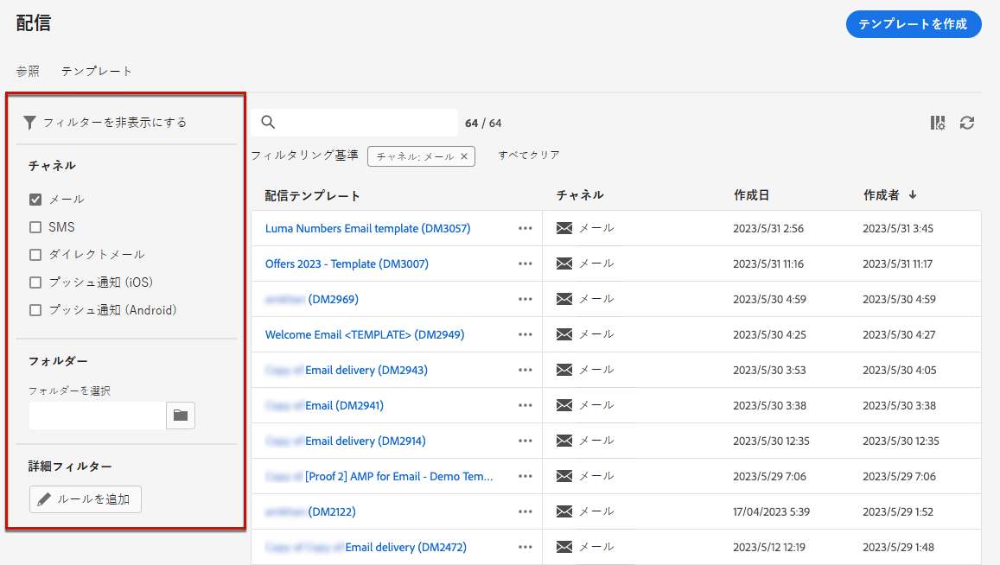

# 配信テンプレートの操作 {#work-with-delivery-templates}

高速で改善されたデザインプロセスを実現するために、配信テンプレートを作成して、キャンペーン全体でカスタムコンテンツを簡単に再利用できます。 この機能により、クリエイティブのルックアンドフィールを標準化して、キャンペーンの実行と開始を迅速におこなうことができます。

テンプレートには、次の項目を含めることができます。

* [タイポロジ](../advanced-settings/delivery-settings.md#typology)
* 送信者のアドレス
* An [audience](../audience/about-audiences.md)を含む [コントロール母集団](../audience/control-group.md)
* カスタム [コンテンツ](../content/edit-content.md)
* [パーソナライズされたフィールド](../personalization/personalize.md) および [条件付きコンテンツ](../personalization/conditions.md)
* リンク先 [ミラーページ](../content/mirror-page.md) および購読解除 [リンク](../content/message-tracking.md)
* リソースの有効性、再試行パラメーター、強制隔離設定など、その他の配信プロパティ。

## テンプレートへのアクセスと管理 {#access-manage-templates}

>[!CONTEXTUALHELP]
>id="acw_delivery_templates"
>title="配信テンプレートの操作"
>abstract="配信テンプレートを使用すると、後で使用するために既存の配信を簡単に作成して保存できます。"
>additional-url="https://experienceleague.adobe.com/docs/campaign-web/v8/msg/delivery-template.html#copy-an-existing-template" text="既存のテンプレートの複製"
>additional-url="https://experienceleague.adobe.com/docs/campaign-web/v8/msg/delivery-template.html#convert-an-existing-delivery" text="配信のテンプレートへの変換"

コンテンツテンプレートリストにアクセスするには、 **[!UICONTROL Campaign Management]** > **[!UICONTROL 配信]** 左のメニューから、 **テンプレート** タブをクリックします。

以前のバージョンの [作成済み](#create-a-delivery-template) 現在の環境が表示されます。

チャネルやフォルダーのコンテンツテンプレートにフィルターを適用することができます。 また、配信属性を使用してルールを作成することで、詳細フィルターを設定できます。 [ルールビルダーの詳細を説明します](../audience/segment-builder.md)

テンプレートを編集するには、リストから目的の項目をクリックします。 そこから：

* コンテンツ、プロパティ、オーディエンスおよびそれに添付されているオファーを変更できます。
* また、テンプレートをテストすることもできます。 [詳細情報](#test-template)

を削除または [重複](#copy-an-existing-template) テンプレートで、対応するアクションを **[!UICONTROL その他のアクション]** メニュー ( **[!UICONTROL テンプレート]** リストまたはテンプレート編集画面から。

>[!NOTE]
>
>テンプレートを編集または削除しても、このテンプレートを使用して作成された配信は影響を受けません。

## テンプレートの作成 {#create-a-delivery-template}

配信テンプレートを作成するには、次の操作を実行します。
* 既存のテンプレートの複製 — [詳細情報](#copy-an-existing-template)
* 既存の配信をテンプレートに変換 — [詳細情報](#convert-an-existing-delivery)
* 配信テンプレートをゼロから作成する — [詳細情報](#create-a-new-template)

### 既存のテンプレートの複製 {#copy-an-existing-template}

Campaign には、各チャネル用の一連の組み込みテンプレートが付属しています。メール、プッシュ、SMS。 配信テンプレートを作成する最も簡単な方法は、組み込みテンプレートを複製してカスタマイズすることです。

>[!NOTE]
>
>また、任意のカスタムテンプレートを複製することもできます。

配信テンプレートを複製するには、次の手順に従います。

1. 次を参照： **テンプレート** タブ、 **配信** 左メニュー [詳細情報](#access-manage-templates)
1. 次をクリック： **[!UICONTROL その他のアクション]** 」ボタンをクリックし、「  **[!UICONTROL 複製]**.

   また、リストからテンプレートを選択し、テンプレート編集画面からこのオプションを選択することもできます。

1. 複製を確認します。

   

1. 中央の画面に新しいテンプレートダッシュボードが開きます。 必要に応じてテンプレート設定を編集します。

   

1. 次をクリック： **[!UICONTROL レビュー]** ボタンをクリックして、テンプレートを保存およびレビューします。 その場合でも、すべての設定を編集、削除および複製できます。

   

1. 必要に応じて、テンプレートのレンダリングをテストします。 [詳細情報](#test-template)

新しいテンプレートが [**テンプレート** リスト](#access-manage-templates). これで、新しい配信を作成する際にテンプレートを選択できます。

### 配信のテンプレートへの変換 {#convert-an-existing-delivery}

任意の配信をテンプレートに変換して、今後繰り返される配信アクションのために使用することができます。

配信をテンプレートとして保存するには、次の手順に従います。

1. 次に移動： **[!UICONTROL キャンペーン管理]** > **[!UICONTROL 配信]** メニュー
1. 次の **[!UICONTROL 参照]** タブで、 **[!UICONTROL その他のアクション]** 」ボタンをクリックし、「 **[!UICONTROL テンプレートとしてコピー]**.

   

1. 複製を確認します。

1. 中央の画面に新しいテンプレートダッシュボードが開きます。 必要に応じてテンプレート設定を編集します。

1. 次をクリック： **[!UICONTROL レビュー]** ボタンをクリックして、テンプレートを保存およびレビューします。 その場合でも、すべての設定を編集、削除および複製できます。

1. 必要に応じて、テンプレートのレンダリングをテストします。 [詳細情報](#test-template)

新しいテンプレートが [**テンプレート** リスト](#access-manage-templates). これで、新しい配信を作成する際にテンプレートを選択できます。

### 新しいテンプレートの作成 {#create-a-new-template}

>[!NOTE]
>
>設定エラーを防ぐために、新しいテンプレートを作成するのではなく、[組み込みテンプレートを複製](#copy-an-existing-template)してプロパティをカスタマイズすることをお勧めします。

配信テンプレートを最初から設定するには、次の手順に従います。

1. 次を参照： **テンプレート** タブ、 **配信** 左メニュー [詳細情報](#access-manage-templates)
1. 次をクリック： **[!UICONTROL テンプレートを作成]** 」ボタンをクリックします。

   

1. テンプレートに使用するチャネルを選択します。
1. そのチャネルの組み込みの配信テンプレートは、デフォルトで、独自のテンプレートの作成に役立ちます。 必要に応じて、選択したチャネルの右側にある専用のボタンを使用し、別のテンプレートを選択します。

   

1. 次をクリック： **[!UICONTROL テンプレートを作成]** ボタンを再度クリックします。

1. テンプレートのプロパティを定義します。 [audience](../audience/add-audience.md) 選択したチャネルに応じて、コンテンツとコンテンツが表示されます。

   >[!NOTE]
   >
   >配信チャネルと各コンテンツのデザイン方法について詳しくは、以下の節を参照してください。
   >
   > * [E メールチャネル](../email/create-email.md)
   > * [プッシュ通知チャネル](../push/gs-push.md)
   > * [SMS チャネル](../sms/create-sms.md)

1. 次をクリック： **[!UICONTROL レビュー]** ボタンをクリックして、テンプレートを保存およびレビューします。 その場合でも、すべての設定を編集、削除および複製できます。

1. 必要に応じて、テンプレートのレンダリングをテストします。 [詳細情報](#test-template)

新しいテンプレートが [**テンプレート** リスト](#access-manage-templates). これで、新しい配信を作成する際にテンプレートを選択できます。

## 配信テンプレートのテスト {#test-template}

最初から作成した場合も、既存のコンテンツから作成した場合も、任意の配信テンプレートのレンダリングをテストできます。 それには、次の手順に従います。

1. 次を参照： **テンプレート** タブで **[!UICONTROL キャンペーン管理]** > **[!UICONTROL 配信]** メニューを開き、任意のテンプレートを選択します。 [詳細情報](#access-manage-templates)

1. 次をクリック： **[!UICONTROL コンテンツをシミュレート]** ボタンを使用して、画面の右上に表示されます。

   

1. 1 つ以上のテストプロファイルを選択して、E メールのレンダリングを確認します。 また、データベースから実際のプロファイルを選択することもできます。

1. 様々なプロファイルを切り替えて、選択したプロファイルに応じてメッセージのパーソナライズされた表現を取得します。

   <!--[Learn moreon test profiles](../preview-test/proofs.md#recipients)-->

   また、ズームレベルを調整し、デスクトップビューまたはモバイルビューを選択することもできます。

   

1. ウィンドウを閉じて、テンプレート編集画面に戻ります。

>[!NOTE]
>
>E メールのレンダリングや配達確認の送信は、配信テンプレートで使用できません。

* [E メールコンテンツのプレビューの詳細を説明します](../preview-test/preview-content.md)

* [SMS コンテンツのプレビューの詳細を説明します](../sms/content-sms.md)

* [プッシュコンテンツのプレビューの詳細を説明します](../push/gs-push.md)

