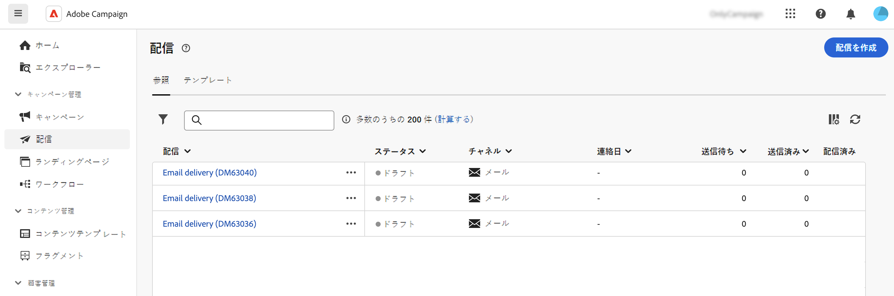
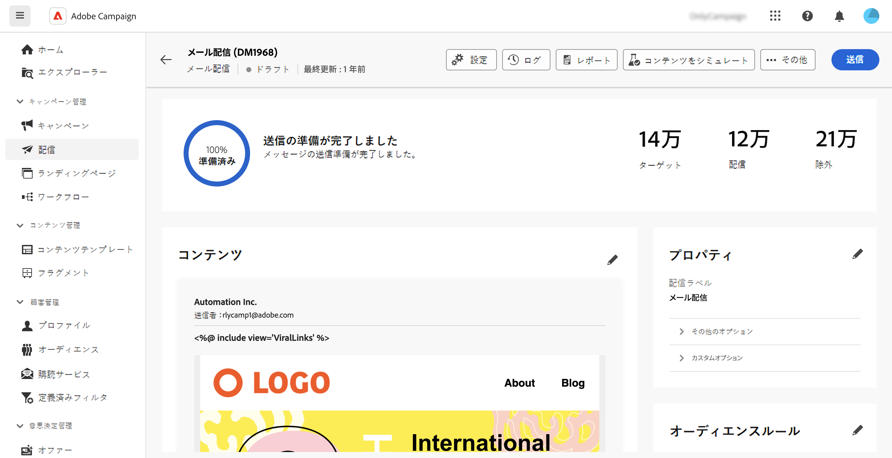
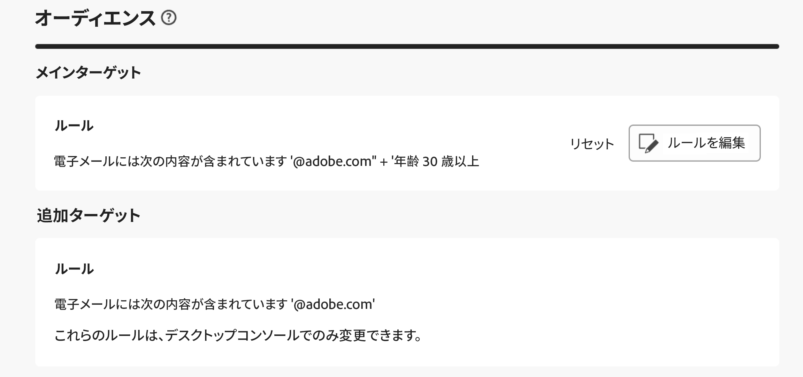
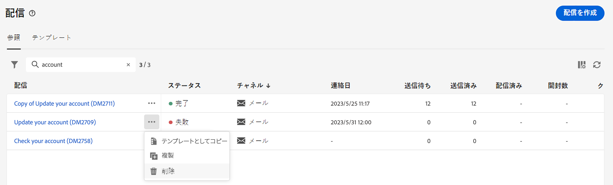
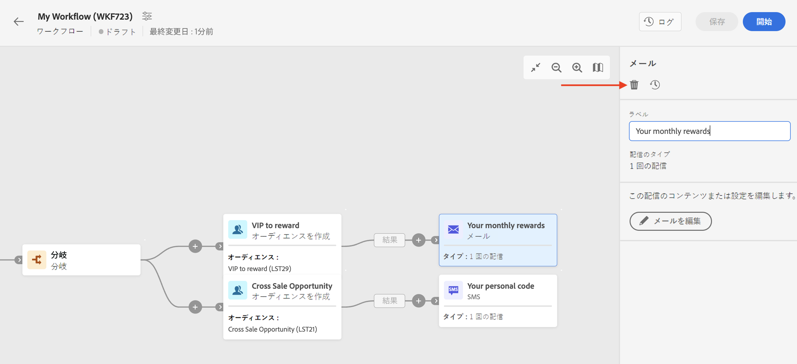

# 配信へのアクセス {#work-with-deliveries}

>[!CONTEXTUALHELP]
>id="acw_deliveries_list"
>title="配信"
>abstract="配信とは、特定のチャネル（メール、SMS、プッシュなど）でオーディエンスに送信される、コミュニケーションです。この画面では、既存の配信を編集、複製および削除できます。また、完了した配信のレポートを表示することもできます。「**配信を作成**」ボタンをクリックして、新しい配信を追加します。"

## 配信へのアクセス {#access}

>[!CONTEXTUALHELP]
>id="acw_deliveries_additional_target"
>title="追加ターゲット"
>abstract="これらのルールは、デスクトップコンソールでのみ変更できます。"

配信には、左側のナビゲーションの&#x200B;**[!UICONTROL 配信]**&#x200B;メニューからアクセスできます。クライアントコンソールまたは web ユーザーインターフェイスから作成したすべての配信がこのリストに表示されます。この画面から、既存のすべての配信を監視したり、配信を複製または削除したり、新しい配信を作成したりできます。

配信を開くには、リストから配信の名前をクリックします。配信が開き、専用のレポートを使用して、パラメーターの編集、実行の確認、パフォーマンスの監視など、様々なアクションを実行できます。

>[!NOTE]
>
>クライアントコンソールで作成した配信を開くと、オーディエンスに対して「**[!UICONTROL 追加ターゲット]**」セクションが表示される場合があります。つまり、この配信には複数のターゲットが設定されています。これらのパラメーターは、コンソールでのみ変更できます。
>
>{zoomable="yes"}

## 配信を複製 {#delivery-duplicate}

既存の配信のコピーは、配信リストや配信ダッシュボードから作成できます。

配信のリストから配信を複製するには、次の手順に従います。

1. 複製する配信の名前の横にある右側の「...」ボタンをクリックします。
1. 「**[!UICONTROL 複製]**」を選択します。
1. 複製を確認：中央の画面に新しい配信ダッシュボードが開きます。

ダッシュボードから配信を複製するには、次の手順に従います。

1. 配信を開いて、画面の上部セクションにある「**[!UICONTROL ...その他]**」ボタンをクリックします。
1. 「**[!UICONTROL 複製]**」を選択します。
1. 複製を確認：中央の画面では、新しい配信が現在の配信に置き換わります。

## 配信を削除 {#delivery-delete}

配信は、左側のパネルのメインの配信エントリから、またはキャンペーンの配信リストのいずれかからの配信リストから削除されます。

配信のリストから配信を削除するには、次の手順に従います。

1. 複製する配信の名前の横にある右側の「...」ボタンをクリックします。
1. 「**[!UICONTROL 削除]**」を選択します。
1. 削除を確認します。

これらのリストではすべての配信を使用できますが、ワークフローで作成された配信はそこから削除できません。ワークフローのコンテキストで作成された配信を削除するには、ワークフローから配信アクティビティを削除する必要があります。

ワークフローから配信を削除するには、次の手順に従います。

1. 配信アクティビティを選択します。
1. 右側のパネルにある「**[!UICONTROL 削除]**」アイコンをクリックします。
1. 削除を確認します。配信に子ノードがある場合は、削除するか、保持するかを選択できます。

