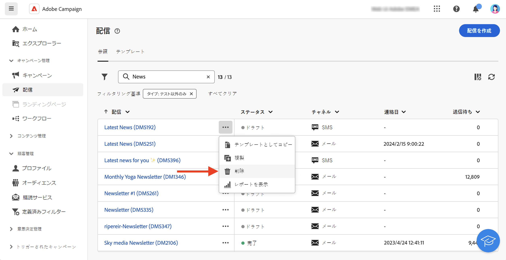

# メッセージの基本を学ぶ{#gs-messages}

>[!CONTEXTUALHELP]
>id="acw_deliveries_list"
>title="配信"
>abstract="配信のリストを閲覧できます。ステータス、連絡先、変更日、主要 KPI を確認できます。リストは、状態、コンタクト日またはチャネルでフィルタリングできます。「配信を作成」ボタンをクリックして、新しい配信を追加します。配信を選択して、コンテンツ、オーディエンスおよび詳細を表示します。"

Adobe Campaign を使用すると、メール、SMS、プッシュ通知などのクロスチャネルキャンペーンを送信し、各種の専用レポートを使用してキャンペーンの有効性を評価できます。

これらのメッセージは、デザインし、配信を介して送信します。また、受信者ごとにパーソナライズすることができます。これらの配信は、スタンドアロンで行うことも、マーケティングキャンペーンのコンテキストに含めることもできます。

Adobe Campaign v8 には、メール、SMS、モバイルアプリの配信チャネルが付属しています。

<table style="table-layout:fixed">
    <tr style="border: 0;">
    <td>
    
    
<a href="../email/create-email.md"><strong>メールを作成</strong>
    

    

    </td>
    <td>
    
    

    <a href="../push/gs-push.md"><strong>プッシュ通知を作成</strong></a>
    

    

    </td>
    <td>
    
    

    <a href="../sms/create-sms.md"><strong>SMS メッセージの作成</strong></a>
    

    

    </td>
    </tr>
    </table>

## 配信を作成 {#create-delivery}

スタンドアロンの配信を作成する場合は、**[!UICONTROL 配信]**&#x200B;の左メニューに移動するか、マーケティングキャンペーンのコンテキストで配信を作成する場合は、**[!UICONTROL キャンペーン]**&#x200B;の左メニューに移動します。

配信の作成方法については、以下のタブを参照してください。

>[!BEGINTABS]

>[!TAB スタンドアロン配信を作成]

スタンドアロン配信を作成するには、次の手順に従います。

1. 左側のナビゲーションの&#x200B;**[!UICONTROL 配信]**&#x200B;メニューを参照し、「**[!UICONTROL 配信を作成]**」ボタンをクリックします。

   

1. 配信用チャネルを選択します。配信チャネルと配信コンテンツの定義方法について詳しくは、次の節を参照してください。

   * [メールチャネル](../email/create-email.md)
   * [プッシュ通知チャネル](../push/gs-push.md)
   * [SMS チャネル](../sms/create-sms.md)

1. メインターゲットとコントロール母集団に対する配信オーディエンスを定義します。オーディエンスについて詳しくは、[この節](../audience/about-audiences.md)を参照してください。
1. メッセージコンテンツを定義します。
1. （オプション）配信スケジュールを定義します。スケジュールが定義されていない場合、「**[!UICONTROL 送信]**」ボタンをクリックするとメッセージが即座に送信されます。
1. 設定を確認するには、「**[!UICONTROL 確認して送信]**」ボタンをクリックします。
1. 配信やパーソナライゼーションの設定をテストするには、「**[!UICONTROL コンテンツをシミュレート]**」ボタンを使用します。メッセージのシミュレーションについて詳しくは、[この節](../preview-test/preview-test.md)を参照してください。
1. 「**[!UICONTROL 準備]**」ボタンをクリックして、ターゲット母集団を計算し、メッセージを生成します。準備の手順には数分かかる場合があります。準備が完了すると、メッセージを送信する準備が整います。 エラーが発生した場合は、**ログ**&#x200B;を参照してアラートと警告を確認してください。
1. 結果を確認し、「**[!UICONTROL 送信]**」ボタンをクリックして、メッセージの送信を開始します。
1. メッセージが送信されたら、「**レポート**」セクションを参照すると、主要指標にアクセスできます。配信レポートについて詳しくは、[この節](../reporting/delivery-reports.md)を参照してください。

>[!TAB キャンペーンでの配信の作成]

キャンペーンで配信を作成するには、次の手順に従います。

1. キャンペーンを作成するか、既存のキャンペーンを開きます。[マーケティングキャンペーン](../campaigns/gs-campaigns.md)の詳細情報をご覧ください。
1. ワークフローを作成するか、既存のワークフローを開きます。
1. **[!UICONTROL オーディエンスを作成]**&#x200B;アクティビティを追加して設定し、`+` ボタンをクリックします。

   

   **[!UICONTROL オーディエンスを作成]**&#x200B;アクティビティについて詳しくは、[この節](../workflows/activities/build-audience.md)を参照してください。

1. 配信アクティビティ（**[!UICONTROL メール]**、**[!UICONTROL SMS]**、**[!UICONTROL プッシュ通知（Android）]**&#x200B;または&#x200B;**[!UICONTROL プッシュ通知（iOS）]**）を選択します。ワークフローの配信チャネルアクティビティと、配信コンテンツの定義方法について詳しくは、この[節](../workflows/activities/about-activities.md#channel)を参照してください。
1. ワークフローを開始し、ログを確認します。

ワークフローを作成せずに、キャンペーンに配信を追加することもできます。これを行うには、キャンペーンの「**[!UICONTROL 配信]**」タブを参照し、「**[!UICONTROL 配信を作成]**」ボタンをクリックします。

設定手順は、スタンドアロン配信の場合と同様です。

キャンペーンの設定方法、およびキャンペーンに属する配信の管理方法について詳しくは、[この節](../campaigns/gs-campaigns.md)を参照してください。

>[!ENDTABS]

## パーソナライゼーションの追加{#personalization}

Adobe Campaign が配信するメッセージは、様々な方法でパーソナライズすることができます。[パーソナライゼーション機能の詳細を説明します](../personalization/gs-personalization.md)。

Campaign を使用して動的コンテンツを作成し、パーソナライズされたメッセージを送信します。パーソナライゼーション機能を組み合わせて、メッセージを改善し、カスタムなユーザーエクスペリエンスを実現することができます。

メッセージコンテンツは、次の方法でパーソナライズできます。

* 動的な&#x200B;**パーソナライゼーションフィールド**&#x200B;の挿入

  パーソナライゼーションフィールドは、メッセージの第 1 レベルのパーソナライゼーションに使用されます。パーソナライゼーションエディターから、データベースで使用可能な任意のフィールドを選択できます。配信の場合は、受信者、メッセージまたは配信に関連する任意のフィールドを選択できます。これらのパーソナライゼーション属性は、メッセージの件名行や本文に挿入できます。[詳細情報](../personalization/personalize.md)

* 事前定義済みの&#x200B;**コンテンツブロック**&#x200B;の挿入

  Campaign には、配信に挿入できる特定のレンダリングを含んだ一連のパーソナライゼーションブロックが付属しています。例えば、ロゴ、挨拶メッセージまたはメッセージのミラーページへのリンクを追加できます。コンテンツブロックは、パーソナライゼーションエディターの専用のエントリから使用できます。[詳細情報](../personalization/personalize.md#ootb-content-blocks)

* **条件付きコンテンツ**&#x200B;の作成

  条件付きコンテンツを設定し、受信者のプロファイルなどに基づいて動的なパーソナライゼーションを追加します。特定の条件が成立した場合に、テキストブロックや画像を挿入できます。[詳細情報](../personalization/conditions.md)

* **パーソナライズされたオファー**&#x200B;の追加

  受信者の場所、現在の天気、最後の注文書に応じて、メッセージコンテンツにパーソナライズされたオファーを挿入します。

## 配信のプレビューとテスト

メッセージコンテンツを定義したら、プレビューしてメッセージコのレンダリングを制御し、テストプロファイルでパーソナライゼーション設定を確認できます。[詳細情報](../preview-test/preview-test.md)

## 監視とトラッキングログ{#gs-tracking-logs}

送信後に配信を監視することは、マーケティングキャンペーンを効率的に実施し、顧客に働きかけるうえで重要です。

配信の送信後に監視したり、配信の失敗や強制隔離がどのように管理されているかを把握したりできます。

監視機能とトラッキング機能について詳しくは、[この節](../reporting/gs-reports.md)を参照してください。

## 配信を複製 {#delivery-duplicate}

既存の配信のコピーは、配信リストや配信ダッシュボードから作成できます。

配信のリストから配信を複製するには、次の手順に従います。

1. 複製する配信の名前の横にある右側の「...」ボタンをクリックします。
1. 「**[!UICONTROL 複製]**」を選択します。
1. 複製を確認：中央の画面に新しい配信ダッシュボードが開きます。

ダッシュボードから配信を複製するには、次の手順に従います。

1. 配信を開いて、画面の上部セクションにある「**[!UICONTROL ...その他]**」ボタンをクリックします。
1. 「**[!UICONTROL 複製]**」を選択します。
1. 複製を確認：中央の画面では、新しい配信が現在の配信に置き換わります。

## 配信を削除 {#delivery-delete}

配信は、左側のパネルのメインの配信エントリから、またはキャンペーンの配信リストのいずれかからの配信リストから削除されます。

配信のリストから配信を削除するには、次の手順に従います。

1. 複製する配信の名前の横にある右側の「...」ボタンをクリックします。
1. 「**[!UICONTROL 削除]**」を選択します。
1. 削除を確認します。

これらのリストではすべての配信を使用できますが、ワークフローで作成された配信はそこから削除できません。ワークフローのコンテキストで作成された配信を削除するには、ワークフローから配信アクティビティを削除する必要があります。

ワークフローから配信を削除するには、次の手順に従います。

1. 配信アクティビティを選択します。
1. 右側のパネルにある「**[!UICONTROL 削除]**」アイコンをクリックします。
1. 削除を確認します。配信に子ノードがある場合は、削除するか、保持するかを選択できます。

