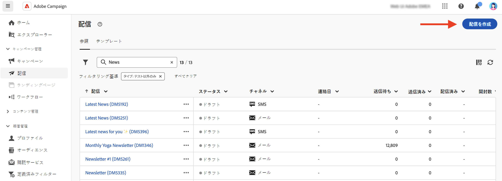

# メッセージの基本を学ぶ{#gs-messages}

Adobe Campaignでは、E メール、SMS、プッシュ通知を含むクロスチャネルキャンペーンを送信し、各種の専用レポートを使用してその有効性を評価できます。 これらのメッセージは、デザインし、配信を介して送信します。また、受信者ごとにパーソナライズすることができます。これらの配信は、スタンドアロンでもマーケティングキャンペーンのコンテキストに含めることもできます。

Adobe Campaign v8 には、次の配信チャネルが付属しています。

* **E メールチャネル**：E メール配信では、パーソナライズされた E メールをターゲット母集団に送信できます。で E メールを作成して送信する方法を説明します。 [このページ](../email/create-email.md).

* **SMS チャネル**:モバイルチャネルでの配信により、ターゲット母集団にパーソナライズされた SMS を送信できます。  で SMS を作成して送信する方法を説明します。 [このページ](../sms/create-sms.md).

* **モバイルアプリケーションチャネル**：モバイルアプリ配信では、通知を iOS システムおよび Android システムに送信できます。でプッシュ通知を作成して送信する方法を説明します。 [このページ](../push/gs-push.md).

## 配信の作成 {#create-delivery}

スタンドアロンの配信は、 **[!UICONTROL 配信]** 左側のメニューに移動するか、マーケティングキャンペーンのコンテキストで配信を作成する場合は、 **[!UICONTROL キャンペーン]** 左メニュー

>[!BEGINTABS]

>[!TAB スタンドアロン配信の作成]

スタンドアロン配信を作成するには、次の手順に従います。

1. 次を参照： **[!UICONTROL 配信]** 左側のナビゲーションのメニューで、 **[!UICONTROL 配信を作成]** 」ボタンをクリックします。

   

1. 配信のチャネルを選択します。 配信チャネルと配信コンテンツの定義方法について詳しくは、次の節を参照してください。

   * [メールチャネル](../email/create-email.md)
   * [プッシュ通知チャネル](../push/gs-push.md)
   * [SMS チャネル](../sms/create-sms.md)

1. メインターゲットとコントロール母集団に対する配信オーディエンスを定義します。 オーディエンスの詳細 [この節](../audience/about-audiences.md).
1. メッセージコンテンツの定義.
1. （オプション）配信スケジュールを定義します。 スケジュールを定義していない場合、 **[!UICONTROL 送信]** 」ボタンをクリックします。
1. 次をクリック：  **[!UICONTROL 確認して送信]** ボタンをクリックして設定を確認します。
1. 以下を使用：  **[!UICONTROL コンテンツをシミュレート]** ボタンを使用して配信やパーソナライゼーションの設定をテストします。 メッセージのシミュレーションの詳細については、 [この節](../preview-test/preview-test.md).
1. 次をクリック：  **[!UICONTROL 準備]** ボタンを使用してターゲット母集団を計算し、メッセージを生成します。 準備の手順には数分かかる場合があります。 準備が完了すると、メッセージを送信する準備が整います。 エラーが発生した場合は、 **ログ** アラートと警告を確認するには、次の手順に従います。
1. 結果を確認し、  **[!UICONTROL 送信]** ボタンをクリックして、メッセージの送信を開始します。
1. メッセージが送信されたら、 **レポート** 」セクションをクリックして、主要指標にアクセスします。 配信レポートについて詳しくは、 [この節](../reporting/delivery-reports.md).

>[!TAB キャンペーンでの配信の作成]

キャンペーンで配信を作成するには、次の手順に従います。

1. キャンペーンを作成するか、既存のキャンペーンを開きます。 詳細情報： [マーケティングキャンペーン](../campaigns/gs-campaigns.md).
1. ワークフローを作成するか、既存のワークフローを開きます。
1. の追加と設定 **[!UICONTROL オーディエンスの構築]** 「 」アクティビティを選択し、 `+`」ボタンをクリックします。

   

   この **[!UICONTROL オーディエンスの構築]** アクティビティについて詳しくは、 [この節](../workflows/activities/build-audience.md).

1. 配信アクティビティを選択します。 **[!UICONTROL 電子メール]**, **[!UICONTROL SMS]**, **[!UICONTROL プッシュ通知 (Android)]** または **[!UICONTROL プッシュ通知 (iOS)]**. ワークフローの配信チャネルアクティビティと、このワークフローでの配信コンテンツの定義方法について説明します [セクション](../workflows/activities/about-activities.md#channel).
1. ワークフローを開始し、ログを確認します。

ワークフローを作成せずに、キャンペーンに配信を追加することもできます。 これをおこなうには、 **[!UICONTROL 配信]** 」タブをクリックし、 **[!UICONTROL 配信を作成]** 」ボタンをクリックします。

設定手順は、スタンドアロン配信の場合と同様です。

キャンペーンの設定方法、およびキャンペーンに属する配信の管理方法について詳しくは、 [この節](../campaigns/gs-campaigns.md).

>[!ENDTABS]

## パーソナライゼーションの追加{#personalization}

Adobe Campaign が配信するメッセージは、様々な方法でパーソナライズすることができます。[パーソナライゼーション機能の詳細を説明します](../personalization/personalize.md)。

Campaign を使用して動的コンテンツを作成し、パーソナライズされたメッセージを送信します。パーソナライゼーション機能を組み合わせて、メッセージを改善し、カスタムなユーザーエクスペリエンスを実現することができます。

メッセージコンテンツは、次の方法でパーソナライズできます。

* 動的な&#x200B;**パーソナライゼーションフィールド**&#x200B;の挿入

   パーソナライゼーションフィールドは、メッセージの第 1 レベルのパーソナライゼーションに使用されます。パーソナライゼーションエディターから、データベースで使用可能な任意のフィールドを選択できます。配信の場合は、受信者、メッセージまたは配信に関連する任意のフィールドを選択できます。これらのパーソナライゼーション属性は、メッセージの件名行や本文に挿入できます。[詳細情報](../personalization/personalize.md)

* 事前定義済みの&#x200B;**コンテンツブロック**&#x200B;の挿入

   Campaign には、配信に挿入できる特定のレンダリングを含んだ一連のパーソナライゼーションブロックが付属しています。例えば、ロゴ、挨拶メッセージまたはメッセージのミラーページへのリンクを追加できます。コンテンツブロックは、パーソナライゼーションエディターの専用のエントリから使用できます。[詳細情報](../personalization/personalize.md#ootb-content-blocks)

* **条件付きコンテンツ**&#x200B;の作成

   条件付きコンテンツを設定し、受信者のプロファイルなどに基づいて動的なパーソナライゼーションを追加します。特定の条件が成立した場合に、テキストブロックや画像を挿入できます。[詳細情報](../personalization/conditions.md)

* 追加 **パーソナライズされたオファー**

   受信者の場所、現在の天気、最後の発注書に応じて、パーソナライズされたオファーをメッセージコンテンツに挿入します。

## 配信のプレビューとテスト

メッセージコンテンツを定義したら、プレビューしてメッセージのレンダリングを制御し、テストプロファイルでパーソナライゼーション設定を確認できます。 [詳細情報](../preview-test/preview-test.md)

## 配信とトラッキングログ{#gs-tracking-logs}

送信後に配信を監視することは、マーケティングキャンペーンを効率的に実施し、顧客に働きかけるうえで重要なステップになります。 配信の送信後に監視したり、配信の失敗や強制隔離がどのように管理されているかを把握したりできます。

## 配信の複製{#delivery-duplicate}

既存の配信のコピーは、配信リストから、または配信ダッシュボードから作成できます。

配信のリストから配信を複製するには、次の手順に従います。

1. 右側の、複製する配信の名前の横にある 3 つのドットボタンをクリックします。
1. 選択  **[!UICONTROL 複製]**.
1. 複製の確認：中央の画面に新しい配信ダッシュボードが開きます。

ダッシュボードから配信を複製するには、次の手順に従います。

1. 配信を開き、  **[!UICONTROL ...詳細]** ボタンを使用して、画面の上部のセクションに配置できます。
1. 選択  **[!UICONTROL 複製]**.
1. 複製の確認：中央の画面で、現在の配信が新しい配信に置き換えられます。

