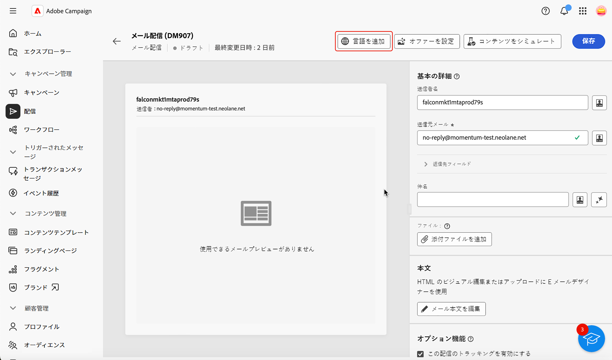
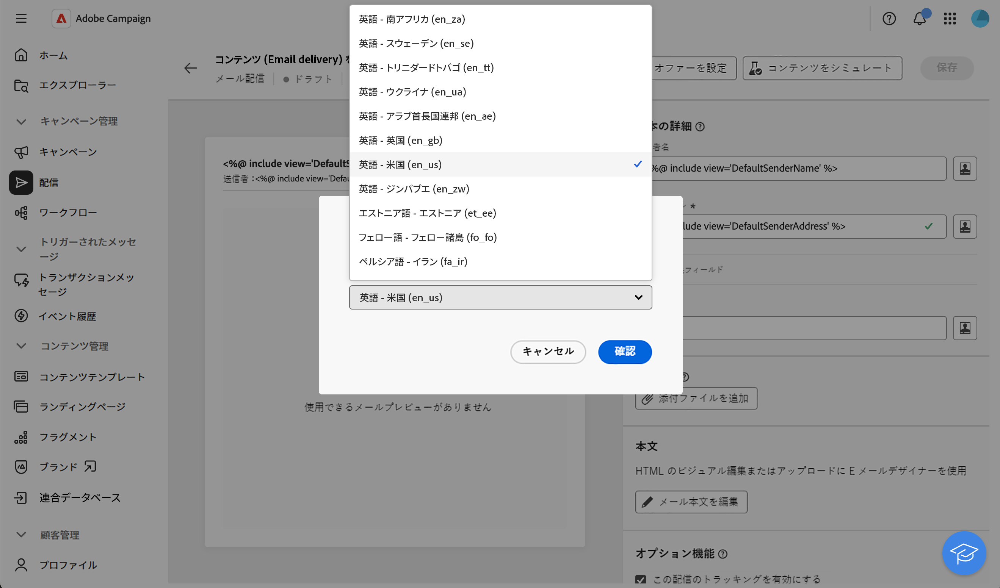
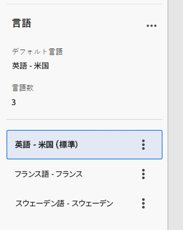
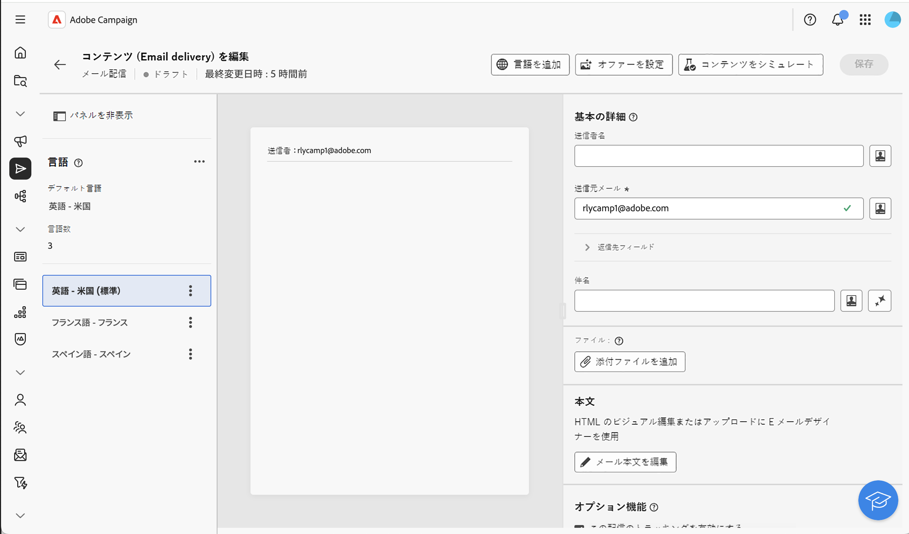
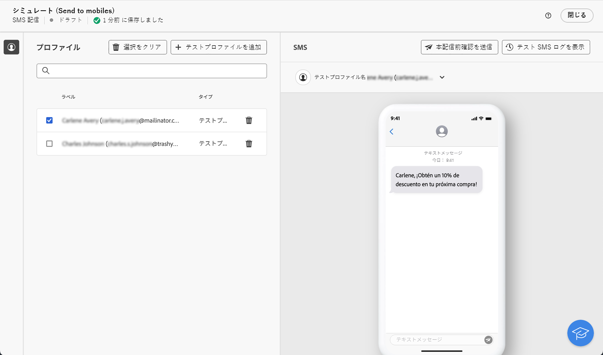
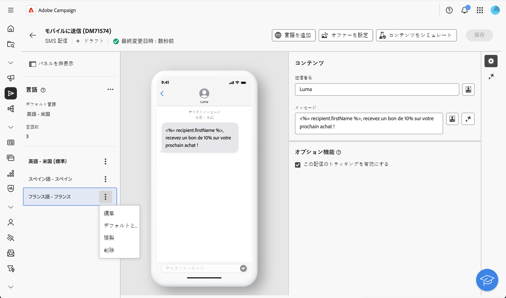

# 多言語配信の設定 {#multilingual-delivery}

>[!CONTEXTUALHELP]
>id="acw_deliveries_email_multilingual"
>title="言語を追加"
>abstract="このタブには、配信を送信する言語のリストがあります。「言語を追加」ボタンをクリックするか、このタブから別の言語を複製して、さらに言語を追加できます。"

>[!CONTEXTUALHELP]
>id="acw_multilingual_file_upload"
>title="言語バリアントをインポート"
>abstract="このダイアログを使用して、CSV ファイルをインポートして言語バリアントを追加します。ファイルは、選択した言語で使用可能なすべてのフィールドを自動的に入力します。確認する前に、ファイルをドラッグ＆ドロップするか、コンピューターから選択できます。"

Campaign web ユーザーインターフェイスでは、メール配信を多言語として設定し、プロファイルの優先言語に基づいてメッセージを送信できます。環境設定を定義していない場合、メッセージはデフォルトの言語で送信されます。

多言語配信では、言語管理はバリアントに基づいています。各バリアントは 1 つの言語を表します。配信の作成時に、メッセージに必要な言語の数に一致する複数の言語のバリアントを追加できます。 また、これらのバリアントを追加した後は、いつでもデフォルト言語を変更できます。

現在、多言語機能は、メール、プッシュ通知、トランザクションメッセージおよび SMS で使用できます。

多言語配信を設定するには、次の主な手順に従います。

1. 言語バリアントを追加します。[詳細情報](#add-variant)
1. 各バリアントのコンテンツを定義します。[詳細情報 ](#define-content)
1. 言語バリアントを管理します。[詳細情報](#manage-variant)

## 言語バリアントの追加{#add-variant}

言語バリアントを作成するには、次の手順に従います。

1. 配信ダッシュボードで、鉛筆アイコンをクリックして配信コンテンツの編集画面にアクセスし、「**[!UICONTROL 言語を追加]**」をクリックします。

   >[!IMPORTANT]
   >
   >「**[!UICONTROL 言語を追加]**」ボタンは、ターゲットディメンションに&#x200B;**言語**&#x200B;スキーマが含まれている場合にのみ使用できます。スキーマとターゲットディメンションについて詳しくは、[詳細ドキュメント](../audience/targeting-dimensions.md)を参照してください。

   {zoomable="yes"}

1. **言語を追加** ドロップダウンから、追加する言語を選択し、確認します。 プッシュ通知の場合は、[CSV ファイルをアップロード ](#csv-upload) して、すべての言語のバリアントを一度に読み込むこともできます。

   最初に追加した言語は自動的にデフォルトに設定され、既存のコンテンツがデフォルトバージョンになります。 言語が追加されると、そのコンテンツは最初にデフォルト言語からコピーされます。

   {zoomable="yes"}

   >[!NOTE]
   >
   >このリストを通じて使用できる言語は、**言語属性**&#x200B;で定義された値（system、user、dbenum などの値）によって異なります。定義済みリストの管理について詳しくは、[このセクション](../administration/enumerations.md)を参照してください。

1. 他の言語を追加するには、この手順を繰り返します。 **[!UICONTROL 言語]**&#x200B;パネルには、選択した言語のリスト、言語の数、デフォルト言語が表示されます。

   例えば、英語、フランス語、スウェーデン語を選択した場合、これら 3 つの言語は以下のように表示されます。

   {zoomable="yes"}

   言語バリアントの管理方法について詳しくは、[この節](#manage-variant)を参照してください。

## 各バリアントのコンテンツの定義{#define-content}

言語を設定したら、言語ごとに配信のコンテンツを定義します。

1. 配信コンテンツの編集画面で、左側の&#x200B;**[!UICONTROL 言語]**&#x200B;パネルから言語を選択します。

   {zoomable="yes"}

1. この言語のメッセージのコンテンツを定義します。 詳しくは、[この節](../msg/create-deliveries.md)を参照してください。

1. 各言語に対してこの操作を繰り返します。

<!--
>[!BEGINTABS]

>[!TAB Email delivery]

1. From the delivery content edition screen, choose a language and click the **[!UICONTROL Edit email body]** button. You can also hover over the email preview and select **[!UICONTROL Open email designer]**.

    {zoomable="yes"}

1. Define the content of your email for this language. [Read more](../email/get-started-email-designer.md#start-authoring)

1. Repeat this operation for each language.

>[!TAB SMS delivery]

1. From the delivery content edition screen, choose a language.

1. Edit the content of the SMS message for this language. [Read more](../sms/create-sms.md)

    {zoomable="yes"}

1. Repeat this operation for each language.

>[!ENDTABS]

-->

配信をプレビューするには、「**[!UICONTROL コンテンツをシミュレート]**」ボタンをクリックし、プロファイルを選択します。プロファイルごとに適切なコンテンツが表示されていることを確認します。

{zoomable="yes"}

## 言語バリアントの管理{#manage-variant}

左側のパネルには、すべての言語バリアント情報が表示されます。 すべての言語を削除するには、「展開」ボタンをクリックし、「**[!UICONTROL すべてのバリアントを削除]**」をクリックします。

{zoomable="yes"}

言語バリアントのリストで、次のアクションを実行できます。

* **編集**：関連コンテンツを保持したまま、言語を変更します。
* **デフォルトとして設定**：言語をデフォルトとして設定します。 プロファイルに言語が定義されていない場合、メッセージはデフォルト言語で送信されます。
* **複製**：この言語に対して定義されたコンテンツを複製し、別のバリアントを選択します。
* **削除**：バリアントおよび関連するコンテンツを削除します。

{zoomable="yes"}

## CSV （プッシュ通知）から言語のバリアントを読み込む {#csv-upload}

プッシュ通知の場合、多言語コンテンツを含む CSV ファイルをアップロードすることで、すべての言語のバリアントをすばやく入力できます。 この機能により、コンテンツをオフラインで準備して一括で読み込むことができるため、多言語キャンペーンの作成が合理化されます。

* **効率**:1 回の操作で複数の言語とそのコンテンツを追加する
* **一貫性**：すべての言語バリアントで一貫したメッセージングを確保する
* **Collaboration**: コンテンツチームが、使い慣れたスプレッドシートツールで翻訳を準備できるようにします
* **一括管理**：多数の言語バリアントを簡単に管理および更新

### 前提条件 {#csv-best-practices}

CSV の読み込みを正常に行うには、以下のベストプラクティスに従います。

* **正確な列構造を使用**：一部が空白のままでも、14 列すべてが CSV ファイルに存在する必要があります。 列が見つからない場合、読み込みに失敗します。 別の順序を使用できますが、すべての列が存在する必要があります。
* **列名を完全に一致させる**：列名では大文字と小文字が区別されます。 `title` not `Title`, `badge` not `Bbadge`, `locale` not `Locale` を使用します。
* **小文字のロケールコードを使用**：ロケールコードを `en_us` や `fr_fr` ではなく、`de_de`、`en_US`、`en-us` （小文字とアンダースコア）の形式にします。
* **必須の列に入力**:`locale` 列と `language` 列には、各行の値が含まれている必要があります。 値が空の場合は、読み込みが失敗します。
* **ロケールを一意に保持**：各ロケールコードは、CSV ファイルに 1 回だけ表示される必要があります。 重複したロケールは拒否されます。
* **UTF-8 として保存**：国際文字を正しくサポートするには、常に UTF-8 エンコーディングで CSV ファイルを保存します。
* **コンマを含むコンテンツを引用符で囲む**：タイトルまたはメッセージ本文にコンマが含まれている場合は、フィールド全体を二重引用符で囲みます：`"Hello, welcome!"`。
* **数値を正しく使用**：フラグ列（isContentAvailable、isMutableContent、silentPush）には、true の場合は `1`、false の場合は `0` を使用し、デフォルトでは空白のままにします。
* **JSON 形式を検証**: customFields 列を使用する場合、JSON が正しくフォーマットされていることを確認します：正しい引用符と括弧で囲まれた `{"key":"value"}`。
* **最初に最小限のデータでテスト**：大きなファイルを作成する前に、単純な 2～3 言語の CSV で形式を検証します。

>[!NOTE]
>
>列の構造について詳しくは、この節 [ 参照してください ](#csv-columns)。

### CSV ファイルを読み込みます {#csv-steps}

CSV ファイルから言語のバリアントを読み込むには、次の手順に従います。

1. 配信コンテンツエディターで、「**[!UICONTROL 言語を追加]**」をクリックします。

   {zoomable="yes"}

1. アップロード領域に CSV ファイルをドラッグ&amp;ドロップして選択するか、をクリックしてコンピューターを参照します。

   システムはファイル形式とコンテンツを検証します。 検証に失敗した場合、どの列またはデータが正しくないかがエラーメッセージで示されます。 CSV ファイルの問題を修正して、もう一度アップロードします。 この[節](#csv-troubleshooting)を参照してください。

   {zoomable="yes"}

1. 読み込んだコンテンツを言語のバリアント パネルでレビューし、正しく読み込まれたすべての翻訳を確認します。

   {zoomable="yes"}

### 列の構造 {#csv-columns}

使用する正しい列構造は次のとおりです。

>[!NOTE]
>
>別の順序を使用できますが、すべての列が存在する必要があります。 ベストプラクティスについて詳しくは、この節 [ 参照してください ](#csv-best-practices)。

1. **タイトル**：通知のタイトル（必須）
1. **messageBody**：通知メッセージの本文（必須）
1. **サウンド**：サウンドファイル名（`default`、`custom_sound.mp3` など） – デフォルトでは空白のままにします
1. **バッジ**：アプリアイコン（iOS）に表示するバッジ番号 – 番号のみを使用します
1. **deeplinkURI**：通知がタップされたときに開くディープリンク URL – 使用しない場合は空白のままにします
1. **category**：カスタムアクションの通知カテゴリ ID （iOS） – 使用しない場合は空白のままにします
1. **iosMediaAttachmentURL**:iOS通知用のメディア添付ファイルの URL – 使用しない場合は空白のままにします
1. **androidMediaAttachmentURL**:Android通知用のメディア添付ファイルの URL – 使用しない場合は空白のままにします
1. **isContentAvailable**：コンテンツ利用可能フラグ（iOS） - true の場合は `1`、false の場合は `0`、デフォルト（0）の場合は空白のままにします。
1. **isMutableContent**：可変コンテンツフラグ（iOS） - true の場合は `1`、false の場合は `0` を使用し、デフォルト（0）の場合は空白のままにします。
1. **customFields**:JSON 形式（`{"key1":"value1","key2":"value2"}` など）のカスタムデータ – 使用しない場合は空白のままにします
1. **ロケール**：言語コード （必須） – 例：`en_us`、`fr_fr`、`de_de` - **必須。行ごとに一意である必要があります**
1. **言語**：言語名（必須） – 例：`English-United States`、`French-France` - **必須**
1. **silentPush**：サイレントプッシュフラグ – サイレントプッシュには `1` を使用し、通常は `0` を使用し、デフォルト（0）は空白のままにします

### CSV ファイルの例 {#csv-examples}

必須フィールドの基本的な例を次に示します。

```csv
title,messageBody,sound,badge,deeplinkURI,category,iosMediaAttachmentURL,androidMediaAttachmentURL,isContentAvailable,isMutableContent,customFields,locale,language,silentPush
Welcome!,Thank you for joining us,,,,,,,,,, en_us,English-United States,0
Bienvenue !,Merci de nous avoir rejoint,,,,,,,,,,fr_fr,French-France,0
Willkommen!,Vielen Dank für Ihre Anmeldung,,,,,,,,,, de_de,German-Germany,0
¡Bienvenido!,Gracias por unirte a nosotros,,,,,,,,,, es_es,Spanish-Spain,0
```

オプションフィールドを含む例を次に示します。

```csv
title,messageBody,sound,badge,deeplinkURI,category,iosMediaAttachmentURL,androidMediaAttachmentURL,isContentAvailable,isMutableContent,customFields,locale,language,silentPush
Welcome!,Thank you for joining us,default,1,,,https://example.com/welcome-en.jpg,https://example.com/welcome-en.jpg,,,, en_us,English-United States,0
Bienvenue !,Merci de nous avoir rejoint,default,1,,,https://example.com/welcome-fr.jpg,https://example.com/welcome-fr.jpg,,,, fr_fr,French-France,0
Willkommen!,Vielen Dank für Ihre Anmeldung,default,1,,,https://example.com/welcome-de.jpg,https://example.com/welcome-de.jpg,,,, de_de,German-Germany,0
¡Bienvenido!,Gracias por unirte a nosotros,default,1,,,https://example.com/welcome-es.jpg,https://example.com/welcome-es.jpg,,,, es_es,Spanish-Spain,0
```

カスタムフィールドの例を次に示します

```csv
title,messageBody,sound,badge,deeplinkURI,category,iosMediaAttachmentURL,androidMediaAttachmentURL,isContentAvailable,isMutableContent,customFields,locale,language,silentPush
New Collection,Discover our latest products,default,1,,,,,,,"{"campaign":"summer2025","segment":"premium"}",en_us,English-United States,0
Nouvelle Collection,Découvrez nos derniers produits,default,1,,,,,,,"{"campaign":"summer2025","segment":"premium"}",fr_fr,French-France,0
```

>[!NOTE]
>
>カルーセルまたはアクションボタンを含むリッチなプッシュ通知の場合、Campaign では、CSV 読み込みとは異なる設定方法を使用します。 基本的な多言語コンテンツの読み込み後に、配信エディターでリッチプッシュコンテンツを直接設定します。

### CSV ファイルでのPersonalization {#csv-personalization}

CSV コンテンツでパーソナライゼーションフィールドを使用するには、`<span>` のタグを使用する必要があります。

```csv
title,messageBody,sound,badge,deeplinkURI,category,iosMediaAttachmentURL,androidMediaAttachmentURL,isContentAvailable,isMutableContent,customFields,locale,language,silentPush
"Hello <span class=""nl-dce-field nl-dce-done"" data-nl-expr=""recipient.firstName"">recipient.firstName</span>","Your order has shipped!",,,,,,,,,,en_us,English-United States,0
"Bonjour <span class=""nl-dce-field nl-dce-done"" data-nl-expr=""recipient.firstName"">recipient.firstName</span>","Votre commande a été expédiée !",,,,,,,,,,fr_fr,French-France,0
```

配信時に、Campaign はこれらのプレースホルダーを実際の受信者データに置き換えます。

### トラブルシューティング {#csv-troubleshooting}

| エラー | 原因 | 解決策 |
|-------|-------|----------|
| 必要な列がありません | CSV ファイルには、14 列すべてが含まれているわけではありません | CSV に 14 列がすべて、上記の順序で含まれていることを確認してください。 未使用の列には空の値を使用します。 |
| 無効なロケール/言語値 | ロケール列または言語列が空です | ロケール列と言語列の両方に、各行の値が必要です |
| ロケールを複製 | 同じロケールコードが複数回表示される | 各ロケール値は一意である必要があります – 重複行を削除 |
| ファイルエンコーディングの問題 | CSV ファイルで互換性のないエンコーディングを使用する | UTF-8 エンコーディングで CSV ファイルを保存 |
| 列の不一致 | 行の列数がヘッダーと異なります | すべての行の列がヘッダーと一致することを確認します |
| 無効な数値 | バッジ、isContentAvailable、isMutableContent または silentPush に数値以外の値が含まれている | 数値のみを使用：フラグの場合は 0 または 1 を指定し、デフォルトの場合は空白のままにします |
| JSON の形式が正しくありません | customFields 列に無効な JSON が含まれる | JSON 構文が正しいことを確認します：`{"key":"value"}` または空白のままにします |
| 列名の大文字と小文字が一致しません | 列名が完全には一致しません | 列名では大文字と小文字が区別されます。上記の正確な名前を使用してください（例：`badge` や `Badge` ではなく `BADGE`） |

>ベストプラクティスについては、この [ 節 ](#csv-best-practices) を参照してください。 列の構造について詳しくは、この節 [ 参照してください ](#csv-columns)。

