# 多言語配信の設定 {#multilingual-delivery}

>[!CONTEXTUALHELP]
>id="acw_deliveries_email_multilingual"
>title="言語を追加"
>abstract="このタブには、配信を送信する言語のリストがあります。「言語を追加」ボタンをクリックするか、このタブから別の言語を複製して、さらに言語を追加できます。"

>[!CONTEXTUALHELP]
>id="acw_multilingual_file_upload"
>title="言語バリアントをインポート"
>abstract="このダイアログを使用して、CSV ファイルをインポートして言語バリアントを追加します。ファイルは、選択した言語で使用可能なすべてのフィールドを自動的に入力します。確認する前に、ファイルをドラッグ＆ドロップするか、コンピューターから選択できます。"

Campaign web ユーザーインターフェイスでは、メール配信を多言語として設定し、プロファイルの優先言語に基づいてメッセージを送信できます。環境設定を定義していない場合、メッセージはデフォルトの言語で送信されます。

多言語配信では、言語管理はバリアントに基づいています。各バリアントは 1 つの言語を表します。配信の作成時に、メッセージに必要な言語の数に一致する複数の言語のバリアントを追加できます。 また、これらのバリアントを追加した後は、いつでもデフォルト言語を変更できます。

現在、多言語機能は、メール、プッシュ通知、トランザクションメッセージおよび SMS で使用できます。

多言語配信を設定するには、次の主な手順に従います。

1. 言語バリアントを追加します。[詳細情報](#add-variant)
1. 各バリアントのコンテンツを定義します。[詳細情報 ](#define-content)
1. 言語バリアントを管理します。[詳細情報](#manage-variant)

## 言語バリアントの追加{#add-variant}

言語バリアントを作成するには、次の手順に従います。

1. 配信ダッシュボードで、鉛筆アイコンをクリックして配信コンテンツの編集画面にアクセスし、「**[!UICONTROL 言語を追加]**」をクリックします。

   >[!IMPORTANT]
   >
   >「**[!UICONTROL 言語を追加]**」ボタンは、ターゲットディメンションに&#x200B;**言語**&#x200B;スキーマが含まれている場合にのみ使用できます。スキーマとターゲットディメンションについて詳しくは、[詳細ドキュメント](../audience/targeting-dimensions.md)を参照してください。

   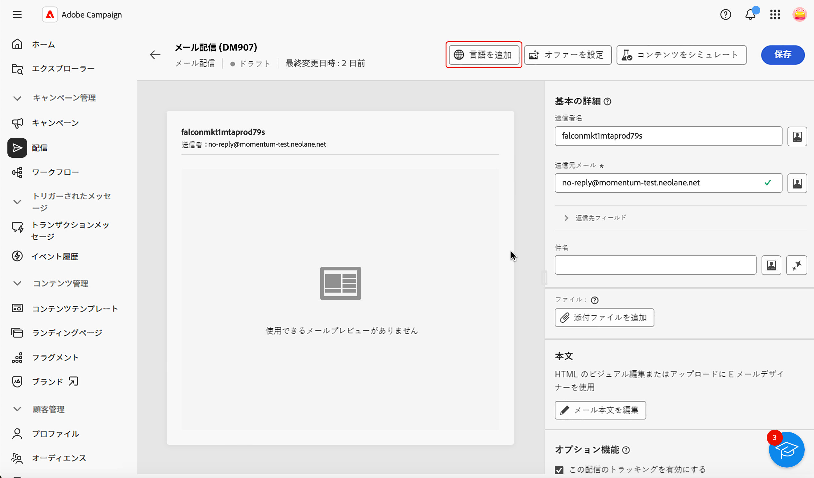{zoomable="yes"}

1. 「**言語を追加**」ドロップダウンから、追加する言語を選択してから確認します。 プッシュ通知の場合は、[CSV ファイル ](#csv-upload)をアップロードして、すべての言語のバリエーションを一度に読み込むこともできます。

   最初に追加した言語は自動的にデフォルトに設定され、既存のコンテンツがデフォルトバージョンになります。 言語が追加されると、そのコンテンツは最初にデフォルト言語からコピーされます。

   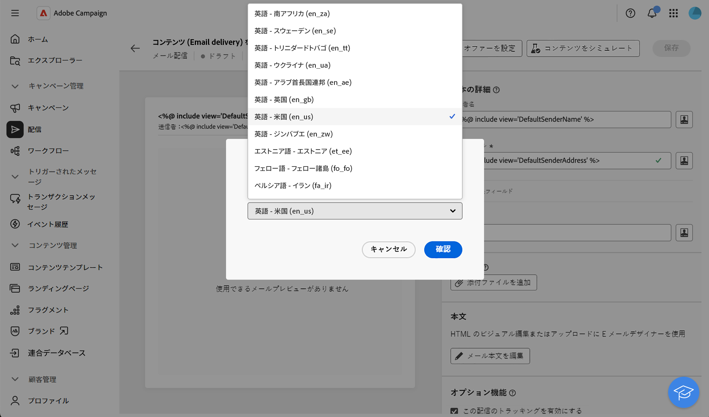{zoomable="yes"}

   >[!NOTE]
   >
   >このリストを通じて使用できる言語は、**言語属性**&#x200B;で定義された値（system、user、dbenum などの値）によって異なります。定義済みリストの管理について詳しくは、[このセクション](../administration/enumerations.md)を参照してください。

1. 他の言語を追加するには、この手順を繰り返します。 **[!UICONTROL 言語]**&#x200B;パネルには、選択した言語のリスト、言語の数、デフォルト言語が表示されます。

   例えば、英語、フランス語、スウェーデン語を選択した場合、これら 3 つの言語は以下のように表示されます。

   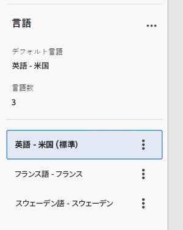{zoomable="yes"}

   言語バリアントの管理方法について詳しくは、[この節](#manage-variant)を参照してください。

## 各バリアントのコンテンツの定義{#define-content}

言語を設定したら、言語ごとに配信のコンテンツを定義します。

1. 配信コンテンツの編集画面で、左側の&#x200B;**[!UICONTROL 言語]**&#x200B;パネルから言語を選択します。

   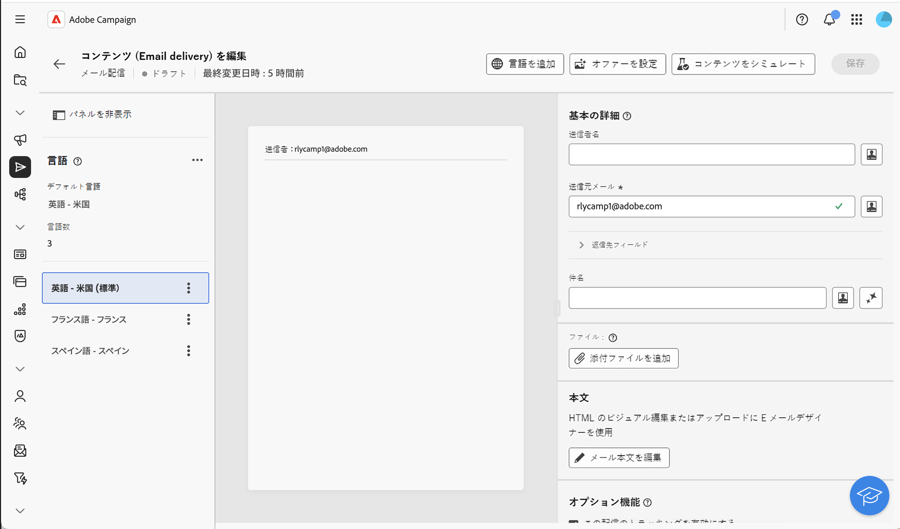{zoomable="yes"}

1. この言語のメッセージのコンテンツを定義します。 詳しくは、[この節](../msg/create-deliveries.md)を参照してください。

1. 各言語に対してこの操作を繰り返します。

<!--
>[!BEGINTABS]

>[!TAB Email delivery]

1. From the delivery content edition screen, choose a language and click the **[!UICONTROL Edit email body]** button. You can also hover over the email preview and select **[!UICONTROL Open email designer]**.

    {zoomable="yes"}

1. Define the content of your email for this language. [Read more](../email/get-started-email-designer.md#start-authoring)

1. Repeat this operation for each language.

>[!TAB SMS delivery]

1. From the delivery content edition screen, choose a language.

1. Edit the content of the SMS message for this language. [Read more](../sms/create-sms.md)

    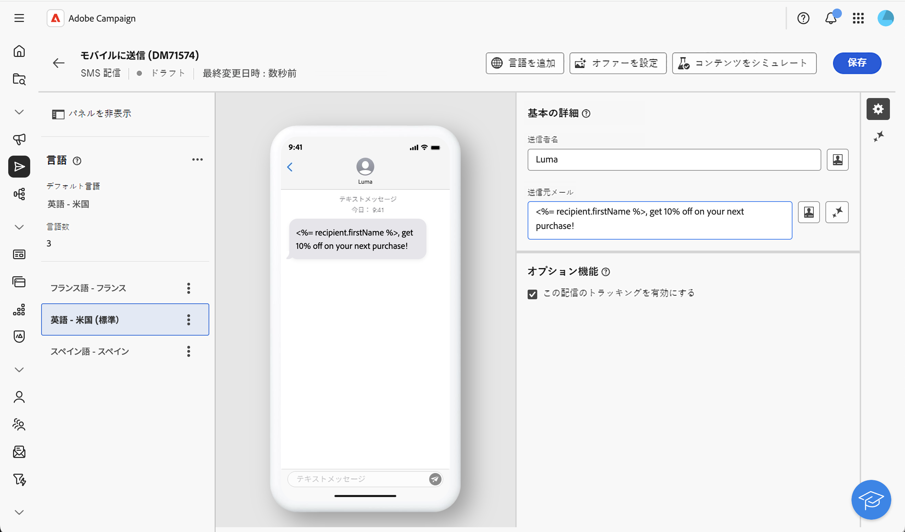{zoomable="yes"}

1. Repeat this operation for each language.

>[!ENDTABS]

-->

配信をプレビューするには、「**[!UICONTROL コンテンツをシミュレート]**」ボタンをクリックし、プロファイルを選択します。プロファイルごとに適切なコンテンツが表示されていることを確認します。

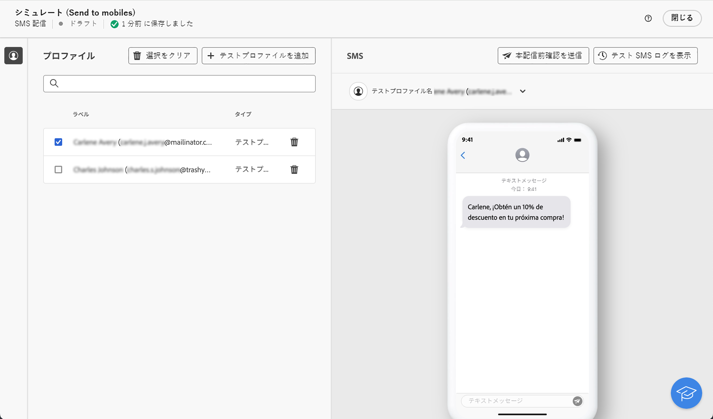{zoomable="yes"}

## 言語バリアントの管理{#manage-variant}

左側のパネルには、すべての言語バリアント情報が表示されます。 すべての言語を削除するには、「展開」ボタンをクリックし、「**[!UICONTROL すべてのバリアントを削除]**」をクリックします。

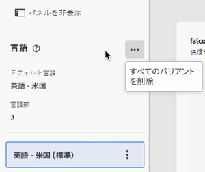{zoomable="yes"}

言語バリアントのリストで、次のアクションを実行できます。

* **編集**：関連コンテンツを保持したまま、言語を変更します。
* **デフォルトとして設定**：言語をデフォルトとして設定します。 プロファイルに言語が定義されていない場合、メッセージはデフォルト言語で送信されます。
* **複製**：この言語に対して定義されたコンテンツを複製し、別のバリアントを選択します。
* **削除**：バリアントおよび関連するコンテンツを削除します。

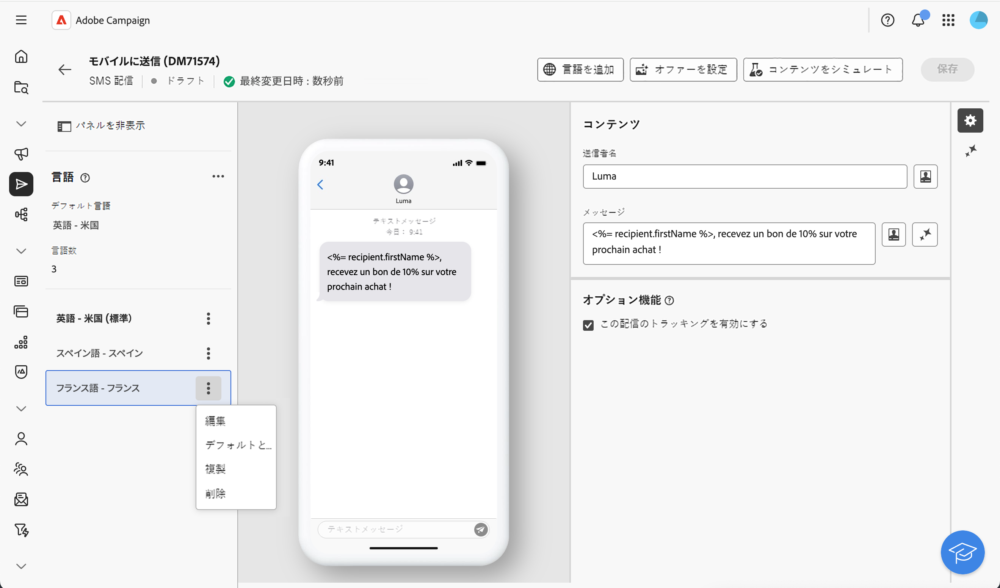{zoomable="yes"}

## CSVから言語バリエーションを読み込む（プッシュ通知） {#csv-upload}

プッシュ通知の場合、多言語コンテンツを含むCSV ファイルをアップロードすることで、すべての言語バリエーションをすばやく入力できます。 この機能は、コンテンツをオフラインで準備し、一括インポートできるようにすることで、多言語キャンペーンの作成を合理化します。

* **効率**：複数の言語とそのコンテンツを1回の操作で追加します
* **一貫性**：すべての言語バリエーションで統一されたメッセージを確保
* **Collaboration**: コンテンツチームが使い慣れたスプレッドシートツールで翻訳を準備できるようにします
* **一括管理**：大量の言語バリエーションを簡単に管理および更新

### 前提条件 {#csv-best-practices}

CSVのインポートを成功させるには、次のベストプラクティスに従ってください。

* **正確な列構造を使用**：空白のままにしても、14列すべてがCSV ファイルに含まれている必要があります。 列が見つからないと、読み込みエラーが発生します。 別の順序を使用できますが、すべての列が存在する必要があります。
* **列名が正確に一致する**：列名では大文字と小文字が区別されます。 `title`は`Title`ではなく、`badge`は`Bbadge`ではなく、`locale`は`Locale`ではなく使用してください。
* **小文字のロケールコードを使用**: ロケールコードの形式は、`en_us`または`fr_fr`ではなく、`de_de`、`en_US`、`en-us` （アンダースコア付きの小文字）です。
* **必須列**&#x200B;を入力：`locale`列と`language`列には、各行の値を含める必要があります。 値が空の場合、読み込みエラーが発生します。
* **ロケールを一意に保つ**：各ロケールコードは、CSV ファイルに1回だけ表示する必要があります。 重複したロケールは拒否されます。
* **UTF-8**&#x200B;として保存：国際文字を正しくサポートするために、常にUTF-8 エンコーディングを使用してCSV ファイルを保存します。
* **引用コンマを含むコンテンツ**: タイトルまたはメッセージ本文にコンマが含まれる場合、フィールド全体を二重引用符で囲みます：`"Hello, welcome!"`。
* **数値を正しく使用する**: フラグ列（isContentAvailable、isMutableContent、silentPush）の場合は、`1`をtrueに使用し、`0`をfalseに使用するか、デフォルトで空白のままにします。
* **JSON形式を検証**: customFields列を使用する場合は、JSONが正しくフォーマットされていることを確認してください：`{"key":"value"}` （引用符と角括弧が正しいこと）。
* **最小限のデータでテストを開始**：大きなファイルを作成する前に、単純な2 ～ 3言語のCSVから形式を検証します。

>[!NOTE]
>
>列構造について詳しくは、この[ セクション ](#csv-columns)を参照してください。

### CSV ファイルの読み込み {#csv-steps}

CSV ファイルから言語バリエーションを読み込むには、次の手順に従います。

1. 配信コンテンツエディターで、**[!UICONTROL 言語を追加]**&#x200B;をクリックします。

   プッシュ通知コンテンツエディターの「言語を追加」ボタンを表示する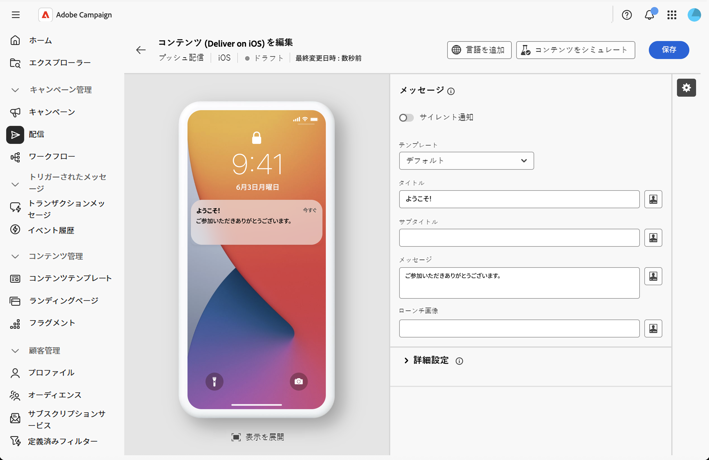{zoomable="yes"}

1. CSV ファイルをアップロード領域にドラッグ&amp;ドロップして選択するか、クリックしてコンピューターを参照します。

   ファイル形式とコンテンツが検証されます。 検証が失敗した場合、エラーメッセージは、どの列またはデータが正しくないかを示します。 CSV ファイルの問題を修正し、再度アップロードします。 この[節](#csv-troubleshooting)を参照してください。

   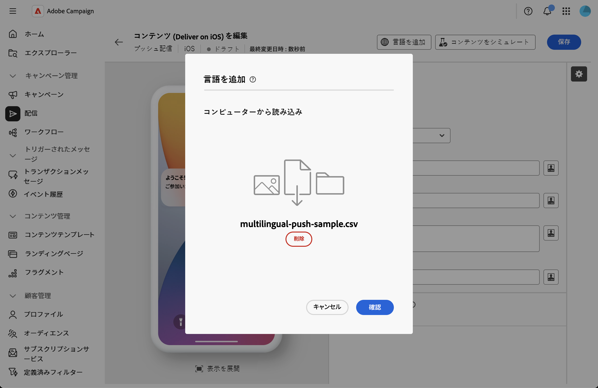{zoomable="yes"}

1. 言語バリエーション パネルで読み込んだコンテンツを確認して、すべての翻訳が正しく読み込まれることを確認します。

   インポートされた多言語コンテンツのバリエーションのプレビューを示す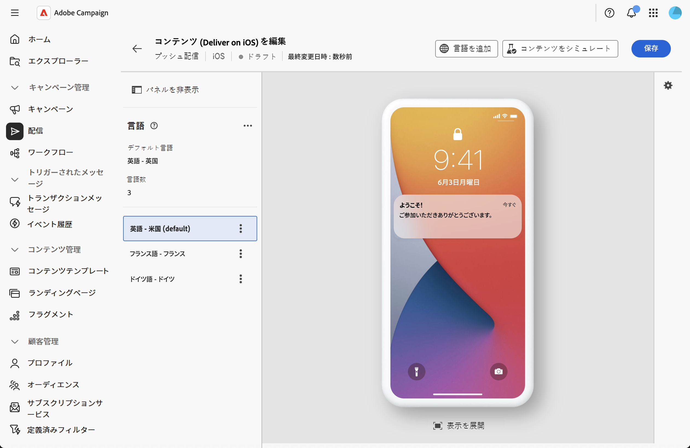{zoomable="yes"}

### 列構造 {#csv-columns}

使用する正しい列構造は次のとおりです。

>[!NOTE]
>
>別の順序を使用できますが、すべての列が存在する必要があります。 ベストプラクティスについては、この[ セクション ](#csv-best-practices)を参照してください。

1. **title**：通知タイトル（必須）
1. **messageBody**：通知メッセージ本文（必須）
1. **sound**: サウンド ファイル名（例：`default`、`custom_sound.mp3`） – デフォルトでは空白のままにします
1. **バッジ**: アプリ アイコンに表示するバッジ番号（iOS） – 番号のみを使用
1. **deeplinkURI**：通知がタップされたときに開くディープリンク URL。使用しない場合は空白のままにします
1. **カテゴリ**：カスタムアクションの通知カテゴリ ID （iOS） – 使用しない場合は空白のままにします
1. **iosMediaAttachmentURL**: iOS通知用のメディア添付ファイルのURL – 使用しない場合は空白のままにします
1. **androidMediaAttachmentURL**: Android通知のメディア添付ファイルのURL – 使用しない場合は空白のままにします
1. **isContentAvailable**: Content available flag （iOS） - trueには`1`を、falseには`0`を使用し、デフォルトには空白のままにします（0）
1. **isMutableContent**：可変コンテンツフラグ （iOS） - trueには`1`を、falseには`0`を使用し、デフォルトには空白のままにします（0）
1. **customFields**: JSON形式のカスタムデータ （例：`{"key1":"value1","key2":"value2"}`） – 使用しない場合は空白のままにします
1. **ロケール**：言語コード （必須） – 例：`en_us`、`fr_fr`、`de_de`、**必須。行**&#x200B;ごとに一意である必要があります
1. **言語**：言語名（必須） – 例：`English-United States`、`French-France` - **必須**
1. **silentPush**: サイレントプッシュフラグ – サイレントプッシュには`1`を、通常のプッシュには`0`を使用し、デフォルトでは空白のままにします（0）

### CSV ファイルの例 {#csv-examples}

必須フィールドを使用した基本的な例を次に示します。

```csv
title,messageBody,sound,badge,deeplinkURI,category,iosMediaAttachmentURL,androidMediaAttachmentURL,isContentAvailable,isMutableContent,customFields,locale,language,silentPush
Welcome!,Thank you for joining us,,,,,,,,,, en_us,English-United States,0
Bienvenue !,Merci de nous avoir rejoint,,,,,,,,,,fr_fr,French-France,0
Willkommen!,Vielen Dank für Ihre Anmeldung,,,,,,,,,, de_de,German-Germany,0
¡Bienvenido!,Gracias por unirte a nosotros,,,,,,,,,, es_es,Spanish-Spain,0
```

オプションのフィールドを使用した例を次に示します。

```csv
title,messageBody,sound,badge,deeplinkURI,category,iosMediaAttachmentURL,androidMediaAttachmentURL,isContentAvailable,isMutableContent,customFields,locale,language,silentPush
Welcome!,Thank you for joining us,default,1,,,https://example.com/welcome-en.jpg,https://example.com/welcome-en.jpg,,,, en_us,English-United States,0
Bienvenue !,Merci de nous avoir rejoint,default,1,,,https://example.com/welcome-fr.jpg,https://example.com/welcome-fr.jpg,,,, fr_fr,French-France,0
Willkommen!,Vielen Dank für Ihre Anmeldung,default,1,,,https://example.com/welcome-de.jpg,https://example.com/welcome-de.jpg,,,, de_de,German-Germany,0
¡Bienvenido!,Gracias por unirte a nosotros,default,1,,,https://example.com/welcome-es.jpg,https://example.com/welcome-es.jpg,,,, es_es,Spanish-Spain,0
```

以下は、カスタムフィールドを使用した例です

```csv
title,messageBody,sound,badge,deeplinkURI,category,iosMediaAttachmentURL,androidMediaAttachmentURL,isContentAvailable,isMutableContent,customFields,locale,language,silentPush
New Collection,Discover our latest products,default,1,,,,,,,"{"campaign":"summer2025","segment":"premium"}",en_us,English-United States,0
Nouvelle Collection,Découvrez nos derniers produits,default,1,,,,,,,"{"campaign":"summer2025","segment":"premium"}",fr_fr,French-France,0
```

>[!NOTE]
>
>カルーセルまたはアクションボタンを含むリッチプッシュ通知の場合、CampaignではCSV インポートとは異なる設定方法を使用します。 基本的な多言語コンテンツを読み込んだ後、配信エディターでリッチプッシュコンテンツを直接設定できます。

### CSV ファイル内のPersonalization {#csv-personalization}

CSV コンテンツでパーソナライゼーションフィールドを使用するには、`<span>` タグを使用する必要があります。

```csv
title,messageBody,sound,badge,deeplinkURI,category,iosMediaAttachmentURL,androidMediaAttachmentURL,isContentAvailable,isMutableContent,customFields,locale,language,silentPush
"Hello <span class=""nl-dce-field nl-dce-done"" data-nl-expr=""recipient.firstName"">recipient.firstName</span>","Your order has shipped!",,,,,,,,,,en_us,English-United States,0
"Bonjour <span class=""nl-dce-field nl-dce-done"" data-nl-expr=""recipient.firstName"">recipient.firstName</span>","Votre commande a été expédiée !",,,,,,,,,,fr_fr,French-France,0
```

配信中、Campaignはこれらのプレースホルダーを実際の受信者データに置き換えます。

### トラブルシューティング {#csv-troubleshooting}

| エラー | 原因 | Solution |
|-------|-------|----------|
| 必要な列がありません | CSV ファイルに14列がすべて含まれていない | CSVに14列がすべて上に表示されている順序になっていることを確認します。 未使用の列には空の値を使用します。 |
| 無効なロケール/言語値 | ロケールまたは言語列が空です | ロケール列と言語列の両方に、各行の値が必要です |
| ロケールの重複 | 同じロケールコードが複数回表示される | 各ロケール値は一意である必要があります – 重複する行を削除します |
| ファイルエンコーディングの問題 | CSV ファイルで互換性のないエンコーディングが使用されています | UTF-8 エンコーディングを使用したCSV ファイルの保存 |
| 列の不一致 | 行の列数がヘッダーと異なります | すべての行にヘッダーに一致する列が正確に14個あることを確認します |
| 無効な数値 | badge、isContentAvailable、isMutableContent、またはsilentPushに数値以外の値が含まれている | フラグには0または1の数字のみを使用するか、デフォルトでは空白のままにします |
| 不正なJSON | customFields列に無効なJSONが含まれています | JSON構文が正しいことを確認します：`{"key":"value"}`。空白のままにします |
| 列名の大文字と小文字が一致しません | 列名が正確に一致しない | 列名では大文字と小文字が区別されます。上に示した名前と完全に一致する名前を使用します（例：`badge`、ではなく`Badge`、または`BADGE`）。 |

>ベストプラクティスは、この[ セクション ](#csv-best-practices)に記載されています。 列構造について詳しくは、この[ セクション ](#csv-columns)を参照してください。
