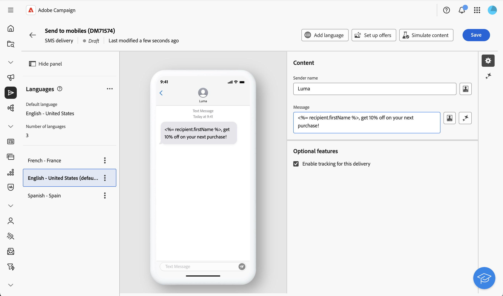

# 多言語配信の設定 {#multilingual-delivery}

>[!CONTEXTUALHELP]
>id="acw_deliveries_email_multilingual"
>title="言語を追加"
>abstract="このタブには、配信を送信する言語のリストがあります。「言語を追加」ボタンをクリックするか、このタブから別の言語を複製して、さらに言語を追加できます。"

[!CONTEXTUALHELP]
>id=&quot;acw_multilingual_file_upload&quot;
>title=&quot;言語のバリアントを読み込む&quot;
>abstract=&quot;このダイアログを使用して、CSV ファイルを読み込んで言語バリアントを追加します。 ファイルは、選択した言語で使用可能なすべてのフィールドに自動的に入力されます。 ファイルをドラッグ&amp;ドロップするか、コンピューターから選択してから確認できます。」

Campaign web ユーザーインターフェイスでは、メール配信を多言語として設定し、プロファイルの優先言語に基づいてメッセージを送信できます。環境設定を定義していない場合、メッセージはデフォルトの言語で送信されます。

多言語配信では、言語管理はバリアントに基づいています。各バリアントは 1 つの言語を表します。配信の作成時に、メッセージに必要な言語の数に一致する複数の言語のバリアントを追加できます。 また、これらのバリアントを追加した後は、いつでもデフォルト言語を変更できます。

現在、多言語機能は、メール、プッシュ通知、トランザクションメッセージおよび SMS で使用できます。

>[!AVAILABILITY]
>
>多言語プッシュ通知、トランザクションメッセージ、SMS は、一連の組織（使用制限あり）でのみ使用でき、今後のリリースでグローバルにロールアウトされます。 サーバーは 8.8.2 以上にアップグレードする必要があります。

多言語配信を設定するには、次の主な手順に従います。

1. 言語バリアントを追加します。[詳細情報](#add-variant)
1. 各バリアントのコンテンツを定義します。[詳細情報 ](#define-content)
1. 言語バリアントを管理します。[詳細情報](#manage-variant)

## 言語バリアントの追加{#add-variant}

言語バリアントを作成するには、次の手順に従います。

1. 配信ダッシュボードで、鉛筆アイコンをクリックして配信コンテンツの編集画面にアクセスし、「**[!UICONTROL 言語を追加]**」をクリックします。

   >[!IMPORTANT]
   >
   >「**[!UICONTROL 言語を追加]**」ボタンは、ターゲットディメンションに&#x200B;**言語**&#x200B;スキーマが含まれている場合にのみ使用できます。スキーマとターゲットディメンションについて詳しくは、[詳細ドキュメント](../audience/targeting-dimensions.md)を参照してください。

   {zoomable="yes"}

1. 「**言語を追加**」ドロップダウンから、追加する言語を選択し、確定します。

   最初に追加した言語は自動的にデフォルトに設定され、既存のコンテンツがデフォルトバージョンになります。 言語が追加されると、そのコンテンツは最初にデフォルト言語からコピーされます。

   {zoomable="yes"}

   >[!NOTE]
   >
   >このリストを通じて使用できる言語は、**言語属性**&#x200B;で定義された値（system、user、dbenum などの値）によって異なります。定義済みリストの管理について詳しくは、[このセクション](../administration/enumerations.md)を参照してください。

1. 他の言語を追加するには、この手順を繰り返します。 **[!UICONTROL 言語]**&#x200B;パネルには、選択した言語のリスト、言語の数、デフォルト言語が表示されます。

   例えば、英語、フランス語、スウェーデン語を選択した場合、これら 3 つの言語は以下のように表示されます。

   {zoomable="yes"}

   言語バリアントの管理方法について詳しくは、[この節](#manage-variant)を参照してください。

## 各バリアントのコンテンツの定義{#define-content}

言語を設定したら、言語ごとに配信のコンテンツを定義します。

1. 配信コンテンツの編集画面で、左側の&#x200B;**[!UICONTROL 言語]**&#x200B;パネルから言語を選択します。

   {zoomable="yes"}

1. この言語のメッセージのコンテンツを定義します。 詳しくは、[この節](../msg/create-deliveries.md)を参照してください。

1. 各言語に対してこの操作を繰り返します。

<!--
>[!BEGINTABS]

>[!TAB Email delivery]

1. From the delivery content edition screen, choose a language and click the **[!UICONTROL Edit email body]** button. You can also hover over the email preview and select **[!UICONTROL Open email designer]**.

    {zoomable="yes"}

1. Define the content of your email for this language. [Read more](../email/get-started-email-designer.md#start-authoring)

1. Repeat this operation for each language.

>[!TAB SMS delivery]

1. From the delivery content edition screen, choose a language.

1. Edit the content of the SMS message for this language. [Read more](../sms/create-sms.md)

    {zoomable="yes"}

1. Repeat this operation for each language.

>[!ENDTABS]

-->

配信をプレビューするには、「**[!UICONTROL コンテンツをシミュレート]**」ボタンをクリックし、プロファイルを選択します。プロファイルごとに適切なコンテンツが表示されていることを確認します。

{zoomable="yes"}

## 言語バリアントの管理{#manage-variant}

左側のパネルには、すべての言語バリアント情報が表示されます。 すべての言語を削除するには、「展開」ボタンをクリックし、「**[!UICONTROL すべてのバリアントを削除]**」をクリックします。

{zoomable="yes"}

言語バリアントのリストで、次のアクションを実行できます。

* **編集**：関連コンテンツを保持したまま、言語を変更します。
* **デフォルトとして設定**：言語をデフォルトとして設定します。 プロファイルに言語が定義されていない場合、メッセージはデフォルト言語で送信されます。
* **複製**：この言語に対して定義されたコンテンツを複製し、別のバリアントを選択します。
* **削除**：バリアントおよび関連するコンテンツを削除します。

{zoomable="yes"}

