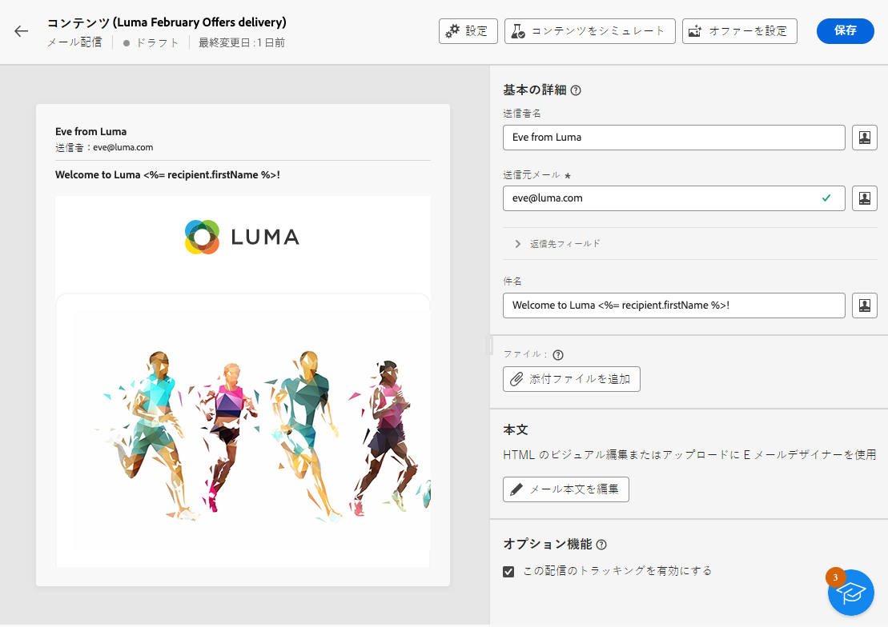
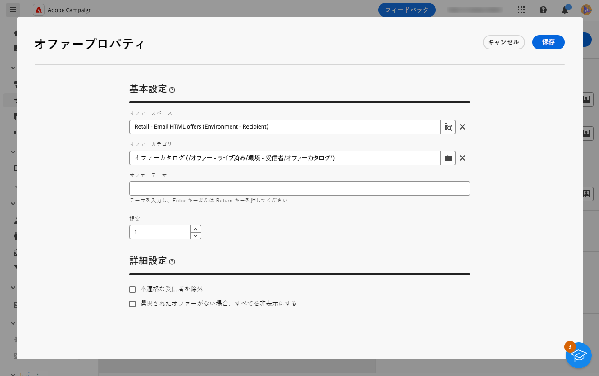
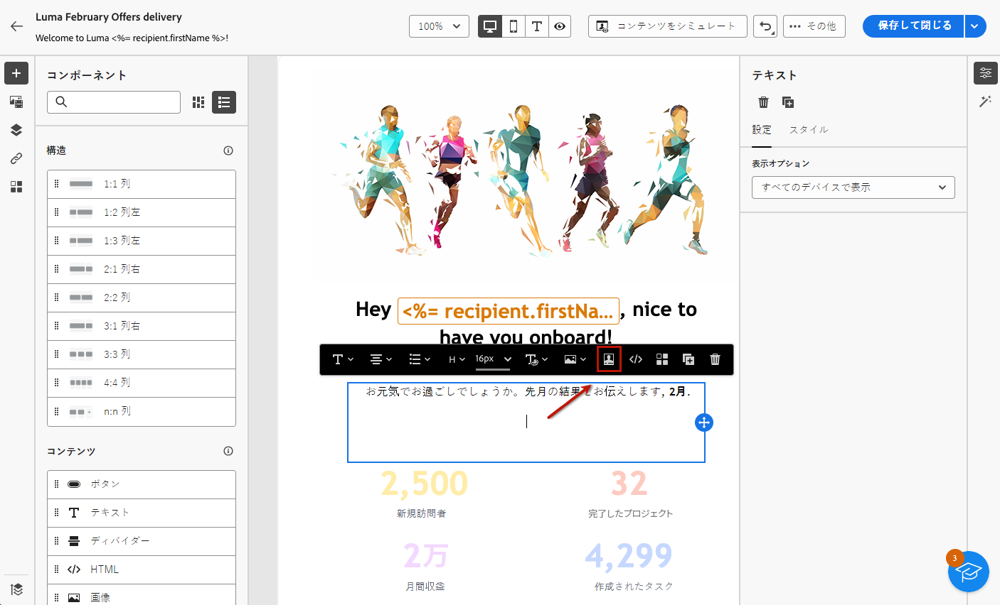
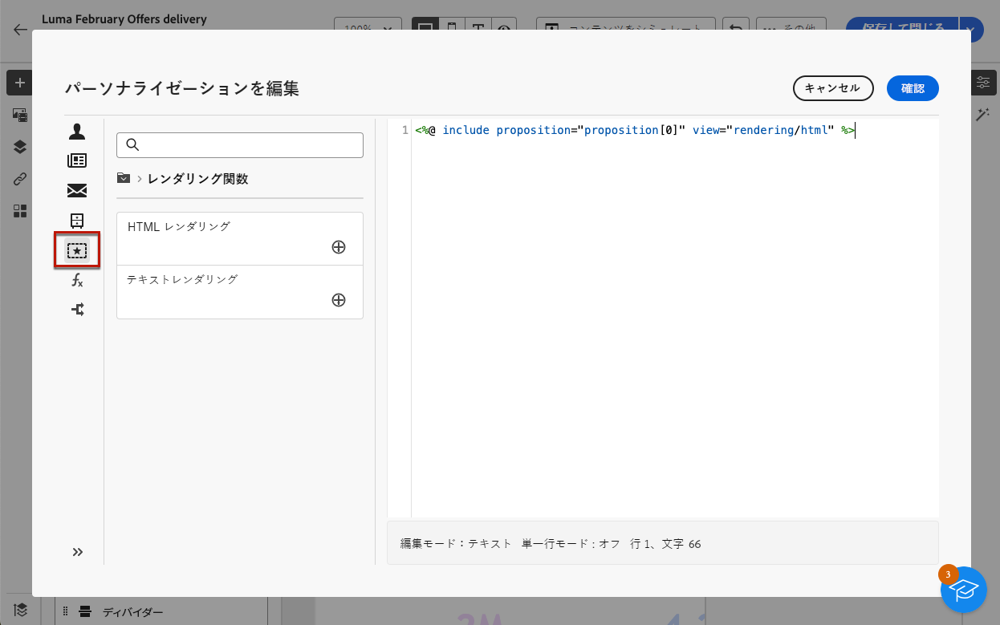

# メッセージへのオファーの追加 {#offers-content}

Adobe Campaign Web を使用すると、 **[!UICONTROL インタラクション]** モジュール。 インタラクションの詳細と、コンソールでオファーカタログを管理する方法については、[Campaign v8（クライアントコンソール）ドキュメント](https://experienceleague.adobe.com/docs/campaign/campaign-v8/offers/interaction.html?lang=ja){target="_blank"}を参照してください。

配信でオファーを送信する手順は、次のとおりです。

1. [提案するオファーの設定](#configure)
1. [配信にオファーを挿入](#insert)

## 提案するオファーの設定 {#configure}

>[!CONTEXTUALHELP]
>id="acw_deliveries_email_offers_settings"
>title="オファーパラメーターの定義"
>abstract="オファースペース、オプションでカテゴリとテーマを定義して、受信者に提案するオファーを設定し、配信に挿入するオファーの数を指定します。"

>[!CONTEXTUALHELP]
>id="acw_deliveries_email_offers_advanced_settings"
>title="オファーの詳細設定"
>abstract="実施要件を満たすオファーが十分にない受信者の除外を有効にし、提案の 1 つが存在しない場合にメッセージを処理する方法を選択できます。"

Adobe Campaign を利用すれば、特定の連絡先とのインタラクション時に、1 つまたは複数の特定のオファーを提供することで、リアルタイムに応答することができます。これらのオファーには、簡単な通信メッセージ、1 つまたは複数の製品やサービスの特別オファーなどがあります。

配信に追加するオファーを選択するには、次の手順に従います。

1. 配信コンテンツ編集画面で「**[!UICONTROL オファーを設定]**」ボタンをクリックします。

   

1. 受信者に提案するオファーを設定します。

   まず、オファー環境に合致する&#x200B;**[!UICONTROL オファースペース]**&#x200B;を選択します。オファースペースを作成する方法については、[Campaign v8（クライアントコンソール）ドキュメント](https://experienceleague.adobe.com/docs/campaign/campaign-v8/offers/interaction-settings/interaction-offer-spaces.html?lang=ja){target="_blank"}を参照してください。

   

1. エンジンのオファー選択を調整するには、オファーを並べ替える特定の&#x200B;**[!UICONTROL オファーカテゴリ]**&#x200B;を選択します。

   フォルダーを選択すると、すべてのサブフォルダーが自動的に含まれ、削除できません。[!DNL Campaign] インターフェイスには、この動作は反映されません。

   >[!NOTE]
   >
   >カテゴリが指定されてない場合、**[!UICONTROL オファーテーマ]**&#x200B;が選択されていない限り、環境に含まれているすべてのオファーがオファーエンジンで考慮されます。

1. （オプション）カテゴリをフィルタリングするテーマを入力します。テーマは、カテゴリの上流で定義されたキーワードです。これらはフィルターとして機能し、一連のカテゴリで選択することにより、提示するオファーの数を調整することができます。

1. 「**[!UICONTROL 提案]**」フィールドを使用して、配信に挿入するオファーの数を指定します。

1. 必要に応じて、「**[!UICONTROL 不適格な受信者を除外]**」オプションを選択します。

   このオプションを使用すると、実施要件を満たすオファーが十分にない受信者の除外を有効または無効にすることができます。

   * このオプションが有効になっている場合は、十分な提案が揃わない受信者が配信から除外されます。
   * このオプションが無効になっている場合、そのような受信者は、除外はされませんが、リクエストした数の提案を受け取ることはできません。

1. 必要に応じて、「**[!UICONTROL オファーが選択されていない場合はすべて非表示にする]**」オプションを選択します。

   このオプションを使用すると、提案のいずれかが存在しない場合にメッセージがどのように処理されるかを選択できます。

   * このオプションが有効になっている場合は、見つからない提案の表示域が表示されず、その提案に関するコンテンツはメッセージに表示されません。
   * このオプションが無効になっている場合は、メッセージそのものが送信中にキャンセルされ、受信者はメッセージを受信しなくなります。

配信に提案するオファーを設定したら、配信コンテンツにオファーを挿入できます。

## 配信にオファーを挿入 {#insert}

オファーは、[式エディター](../personalization/gs-personalization.md#access)を使用して配信に追加できます。件名または配信本文に挿入できます。

>[!CAUTION]
>
>配信にオファーを挿入する前に、[その配信で提案するオファーを設定](#configure)したことを確認します。

式エディターを使用してオファーを挿入するには、次の手順に従います。

1. 配信の件名またはコンテンツにアクセスします。

1. オファーを挿入する場所にマウスのカーソルを置き、「パーソナライゼーション」アイコンを使用して式エディターを開きます。

   

1. **[!UICONTROL 提案]**&#x200B;メニューを選択します。使用可能な提案がリストに表示されます。

   >[!NOTE]
   >
   >提案の数は、現在の配信の[オファーを設定](#configure)する際に定義されます。

1. 使用可能なパーソナライゼーションフィールド、レンダリング関数またはオファー属性を使用して、各提案を定義します。

   

   >[!NOTE]
   >
   >使用可能な提案の数は、エンジンの呼び出しがどのように設定されているかによって異なります。また、提案の順序は、オファーの優先度によって異なります。詳しくは、[Campaign v8（クライアントコンソール）ドキュメント](https://experienceleague.adobe.com/docs/campaign/campaign-v8/offers/interaction-best-practices.html?lang=ja){target="_blank"}を参照してください。

1. 変更内容を保存します。

1. コンテンツを完成させ、配信をテストして送信します。[詳細情報](gs-messages.md)

受信者が配信を受信すると、その特定のプロファイルに対して適切なオファーが表示されます。
