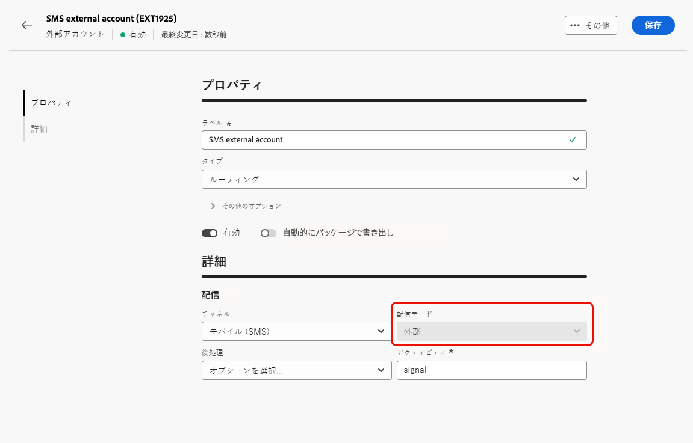
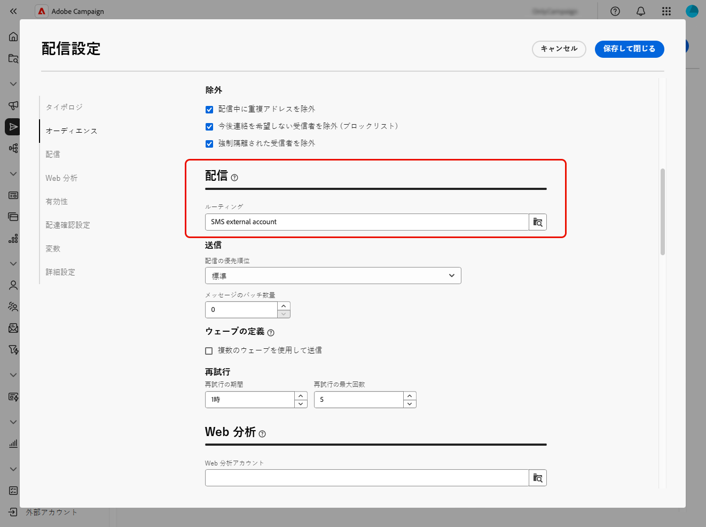
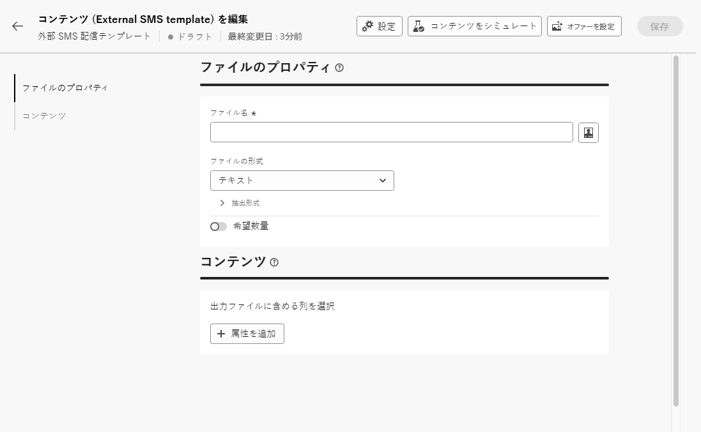
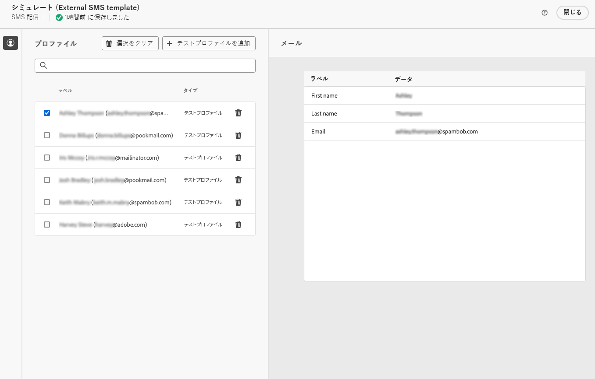

# 外部配信の送信 {#gs-direct-mail}

>[!CONTEXTUALHELP]
>id="acw_homepage_welcome_rn2"
>title="外部配信の作成"
>abstract="Campaign web インターフェイスで外部配信と外部配信テンプレートを定義できるようになりました。このモードでは、外部プロバイダーと共有できる出力ファイルにメッセージをコンパイルできます。デフォルトでは、ダイレクトメールチャネルには外部配信モードが使用されます。"
>additional-url="https://experienceleague.adobe.com/docs/campaign-web/v8/release-notes/release-notes.html?lang=ja" text="リリースノートを参照してください"

Adobe Campaignを使用すると、Campaign の外部で作成した配信を処理して、外部システムを通じてパーソナライズされたメール、SMS メッセージまたはプッシュ通知（iOs およびAndroid）を一括で配信できます。

<!--The supported channels are Email, Mobile (SMS), and Push (iOs and Android).-->

外部配信を作成する場合、Adobe Campaignはすべてのターゲットプロファイルと選択したデータを含む抽出ファイルを自動的に生成します。 このファイルは、選択したサーバーに送信されます。サーバーが送信プロセスを自動的に処理します。

## 専用の外部アカウントを作成 {#routing-external-account}

まず、外部配信で使用する特定の外部アカウントを設定する必要があります。 **[!UICONTROL ルーティング]** タイプである必要があります。

>[!NOTE]
>
>ルーティングタイプの外部アカウントを作成する方法については、[ この節 ](../administration/external-account.md#routing) を参照してください。

例えば、外部アカウントの **[!UICONTROL モバイル（SMS）]** チャネルを選択します。 **[!UICONTROL 外部]** は、デフォルトで **[!UICONTROL 配信モード]** として選択されています。

{zoomable="yes"}

## 外部配信の作成と送信 {#create-external-delivery}

特定の外部アカウントを設定したら、外部配信を作成します。 以下の手順に従います。

1. 配信を作成します。[詳細情報](create-deliveries.md)

   次の 3 つのオプションがあります。

   * **ワークフロー内**：外部チャネルアクティビティ（メール、SMS またはプッシュ）をワークフローに追加します。 ワークフローの設定方法について詳しくは、[こちらのページ](../workflows/gs-workflow-creation.md)を参照してください。
   * **キャンペーンの場合**：キャンペーンを作成したら、メール、SMS またはプッシュチャネルの外部配信を作成できます。 キャンペーンの設定について詳しくは、[こちらのページ](../campaigns/gs-campaigns.md)を参照してください。
   * **スタンドアロン配信**：個々の外部配信で顧客を直接、即座にエンゲージします。 [詳しくは、配信の作成方法を参照してください。](../msg/gs-deliveries.md)

1. 配信または配信テンプレート [ 設定 ](../advanced-settings/delivery-settings.md) で、選択したチャネル用に作成した外部アカウント（この例では SMS チャネル）を選択して、保存します。

   {zoomable="yes"}

   >[!NOTE]
   >
   >配信を作成する場合は、「ルーティング ](delivery-template.md)」タイプの外部アカウントを使用して [ 配信テンプレート **** を選択していることを確認してください。選択していない場合、作成した専用アカウント [ 上記 ](#routing-external-account) を選択することはできません。

1. 「配信 **[!UICONTROL コンテンツ]**」セクションで、「**[!UICONTROL コンテンツを編集]**」をクリックします。

   {zoomable="yes"}

1. 標準配信とは異なり、メッセージ自体のコンテンツをデザインすることはありません。 代わりに、外部システムに送信されるファイルのプロパティと列を定義する必要があります。

   {zoomable="yes"}

   [ ダイレクトメール配信 ](../direct-mail/content-direct-mail.md) で生成された抽出ファイルのコンテンツを設計する場合と同じ手順に従います。

   * 抽出ファイルのプロパティを定義します。 [詳細情報](../direct-mail/content-direct-mail.md#properties)
   * そのファイルにエクスポートする情報を含む列を選択します。 [詳細情報](../direct-mail/content-direct-mail.md#content)

1. ファイルをプレビューして、配達確認 <!--not in UI right now - to check--> を送信できます。 [詳細情報](../direct-mail/send-direct-mail.md#preview-dm)

   {zoomable="yes"}

1. 配信を送信して抽出ファイルを生成します。 [詳細情報](../direct-mail/send-direct-mail.md#send-dm)

配信が送信されると、抽出ファイルが自動的に生成され、配信テンプレートの設定で選択した [ 外部アカウント ](../administration/external-account.md#create-ext-account) で指定した場所に書き出されます。

配信ページで KPI を追跡し、**[!UICONTROL ログ]** メニューでデータを追跡できます。
