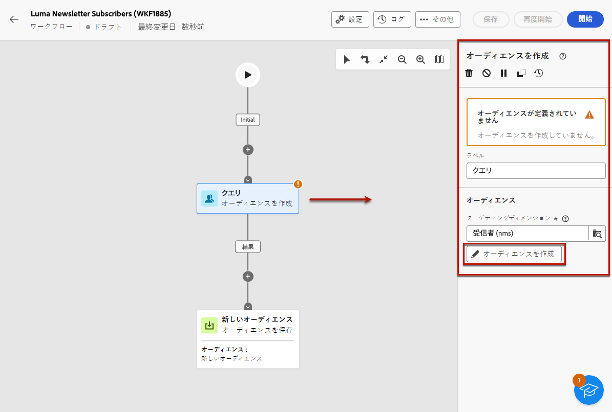
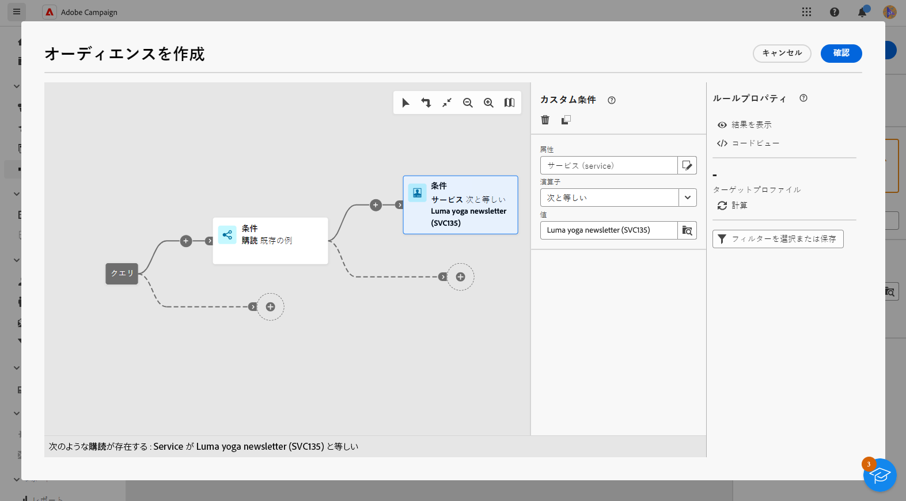
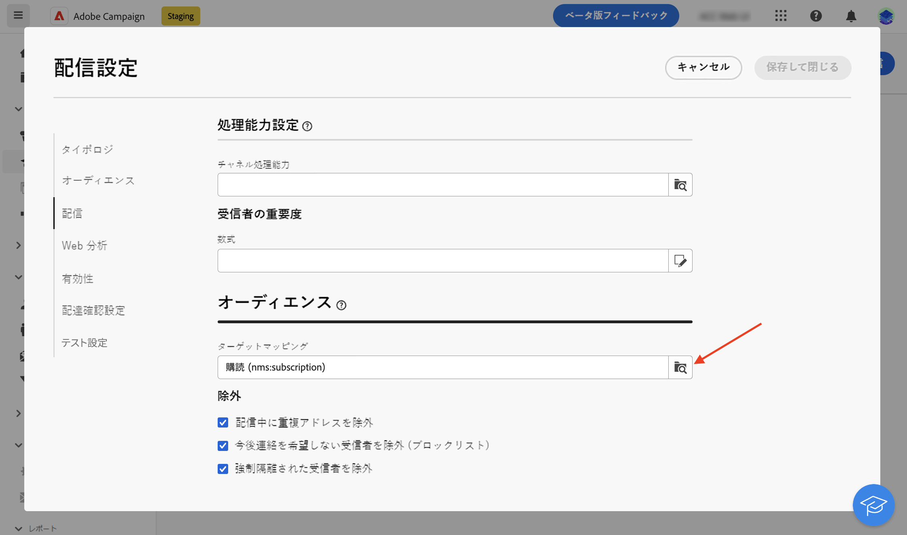
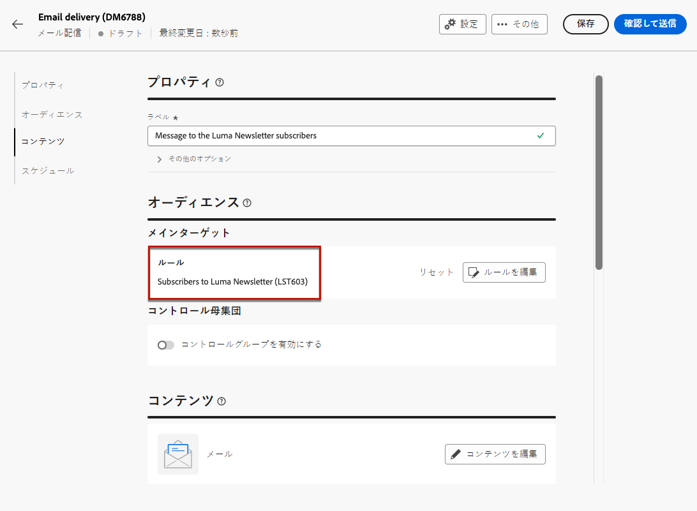
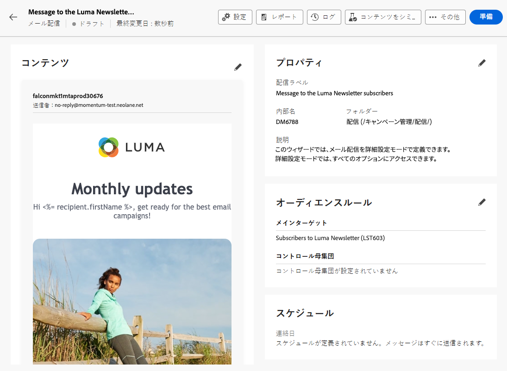

# メッセージをサービスのサブスクライバーに送信 {#send-to-subscribers}

Adobe Campaignで購読サービスを作成し、購読者にメッセージを送信できます。 購読サービスを作成する方法については、[ このページ ](../audience//manage-services.md#create-service) を参照してください。

サブスクライバーにメッセージを送信するには、サブスクライバーを識別する特定のオーディエンスを作成し、以下に説明する方法で配信を作成します。

1. オーディエンスを作成します。新しいワークフローが自動的に作成されます。[詳しくは、オーディエンスを参照してください](../audience/create-audience.md)。

1. 読みやすくするために、ワークフロー設定の「**ラベル**」フィールドでワークフローの名前を変更します。[ ワークフロー設定の設定方法を学ぶ ](../workflows/workflow-settings.md)。

1. 「**[!UICONTROL オーディエンスを作成]**」アクティビティを開き、「**[!UICONTROL オーディエンスを作成]**」を選択します。[ オーディエンスを作成アクティビティの設定方法を学びます ](../workflows/activities/build-audience.md)。

   {zoomable="yes"}

1. オーディエンス作成フローで、次のカスタム条件を選択します。**[!UICONTROL 購読]** が存在する（例：**[!UICONTROL サービス]** は、定義したサービスと等しい。 この例では、「**Luma ヨガニュースレター**」を選択します。

   {zoomable="yes"}

1. 「**[!UICONTROL 確認]**」を選択し、「**[!UICONTROL 開始]**」をクリックしてワークフローを実行します。

1. 配信を作成します。配信の作成手順について詳しくは、[ このページ ](../msg/gs-messages.md#create-delivery) を参照してください。

1. 配信設定を参照し、デフォルトのターゲットマッピングを **購読（nms:subscriptions）** に変更します。

   {zoomable="yes"}

1. 配信の「メインターゲット」セクションで、先ほど作成したオーディエンスを選択します。

   {zoomable="yes"}

1. [ この節 ](../preview-test/preview-test.md) で説明しているように、メッセージコンテンツを作成し、テストして、配信を送信します。

   {zoomable="yes"}

配信は、このサービスのサブスクライバーにのみ送信されます。