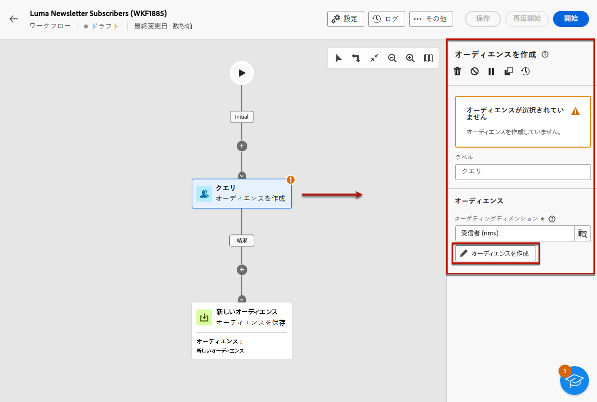

# メッセージをサービスのサブスクライバーに送信 {#send-to-subscribers}

Adobe Campaign でサブスクリプションサービスを作成し、メッセージをサブスクライバーに送信できます。購読サービスの作成方法について詳しくは、[このページ](../audience//manage-services.md#create-service)を参照してください。

サブスクライバーにメッセージを送信するには、サブスクライバーを識別する特定のオーディエンスを作成し、以下に説明する方法で配信を作成します。

1. オーディエンスを作成します。新しいワークフローが自動的に作成されます。[詳しくは、オーディエンスを参照してください](../audience/create-audience.md)。

1. 読みやすくするために、ワークフロー設定の「**ラベル**」フィールドでワークフローの名前を変更します。[詳しくは、ワークフローの設定方法を参照してください](../workflows/workflow-settings.md)。

1. 「**[!UICONTROL オーディエンスを作成]**」アクティビティを開き、「**[!UICONTROL オーディエンスを作成]**」を選択します。[詳しくは、オーディエンスを作成アクティビティの設定方法を参照してください](../workflows/activities/build-audience.md)。

   {zoomable="yes"}

1. オーディエンス作成フローで、**[!UICONTROL サービス]**&#x200B;が定義したサービスと等しいなどの&#x200B;**[!UICONTROL 購読]**&#x200B;が存在するというカスタム条件を選択します。この例では、「**Luma ヨガニュースレター**」を選択します。

   {zoomable="yes"}

1. 「**[!UICONTROL 確認]**」を選択し、「**[!UICONTROL 開始]**」をクリックしてワークフローを実行します。

1. 配信を作成します。配信の作成手順について詳しくは、[このページ](../msg/gs-messages.md#create-delivery)を参照してください。

1. 配信設定を参照し、デフォルトのターゲットマッピングを&#x200B;**サブスクリプション（nms:subscriptions）**&#x200B;に変更します。

   {zoomable="yes"}

1. 配信の「メインターゲット」セクションで、先ほど作成したオーディエンスを選択します。

   {zoomable="yes"}

1. メッセージコンテンツを作成し、配信をテストおよび送信します。詳しくは、[この節](../preview-test/preview-test.md)を参照してください。

   {zoomable="yes"}

配信は、このサービスのサブスクライバーにのみ送信されます。