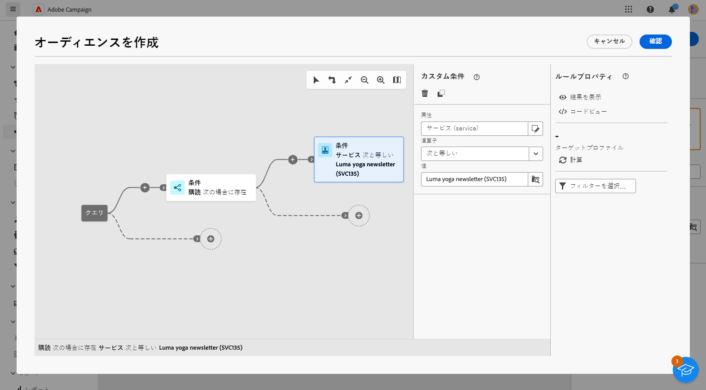

# メッセージをサービスのサブスクライバーに送信

Adobe Campaign でサブスクリプションサービスを作成し、メッセージをサブスクライバーに送信できます。サブスクライバーサービスの作成方法については[このページ](../audience//manage-services.md#create-service)を参照してください。

サブスクライバーにメッセージを送信するには、サブスクライバーを識別する特定のオーディエンスを作成し、以下に説明する方法で配信を作成します。

1. オーディエンスを作成します。オーディエンスについて詳しくは[このページ](../audience/create-audience.md)を参照してください。

1. **[!UICONTROL オーディエンスを作成]**&#x200B;アクティビティで、詳細属性を表示し、**[!UICONTROL 受信者]**／**[!UICONTROL サブスクリプション]**／**[!UICONTROL サービス]**&#x200B;を選択します。

   この例では、**Luma ニュースレター**&#x200B;ラベルの付いたサービスに登録しているユーザーを選択します。

   

1. オーディエンスを保存します。
1. 配信を作成します。配信の作成手順について詳しくは、[このページ](../msg/gs-messages.md#create-delivery)を参照してください。
1. 配信設定を参照し、デフォルトのターゲットマッピングを&#x200B;**サブスクリプション（nms:subscriptions）**&#x200B;に変更します。

   

1. 配信のメインターゲットセクションで、先ほど作成したオーディエンスを選択します。

   

1. メッセージコンテンツを作成し、配信をテストおよび送信します。詳しくは、[この節](../preview-test/preview-test.md)を参照してください。

   

配信は、このサービスのサブスクライバーにのみ送信されます。
