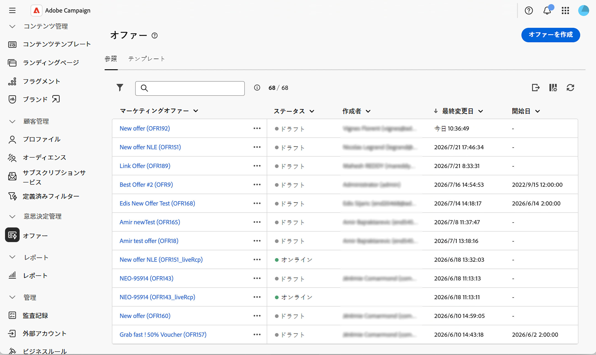
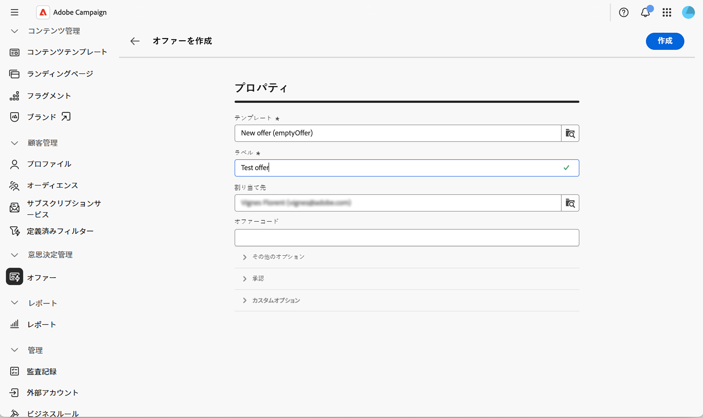
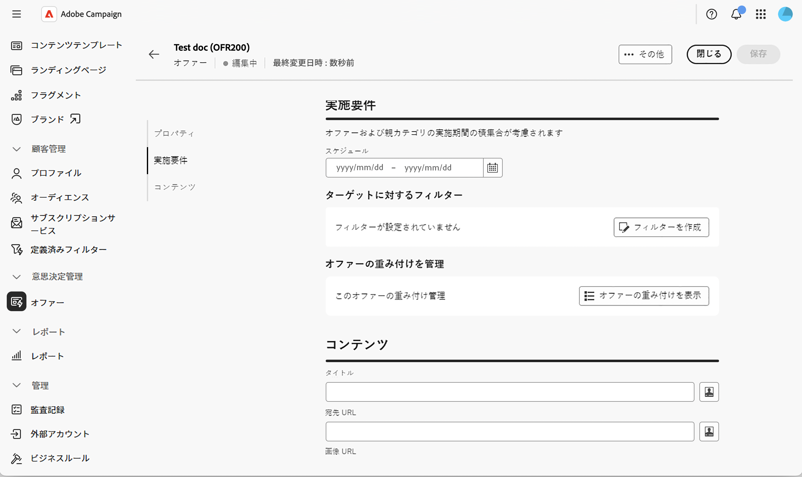
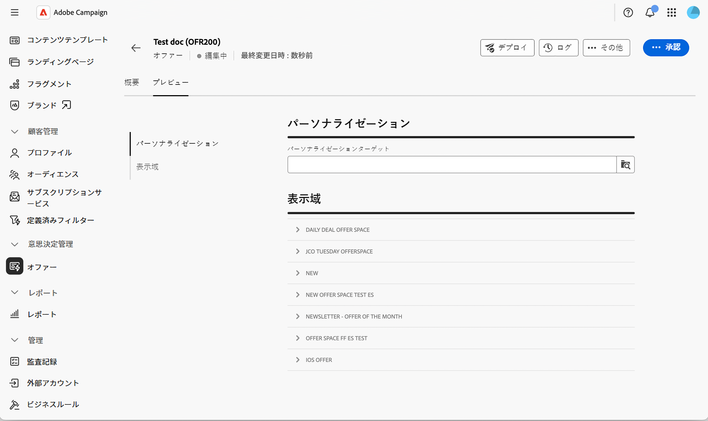
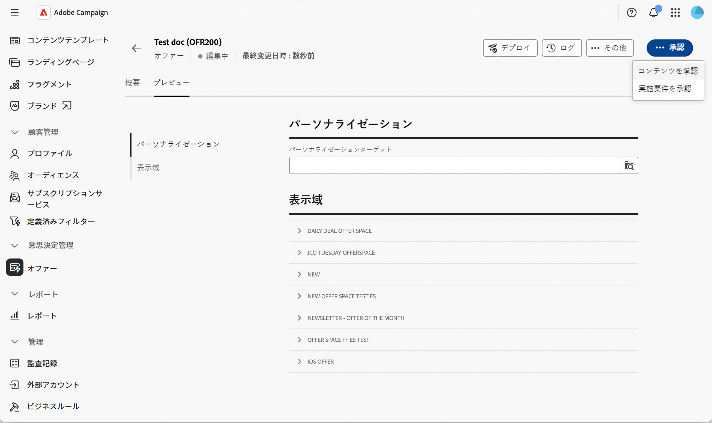
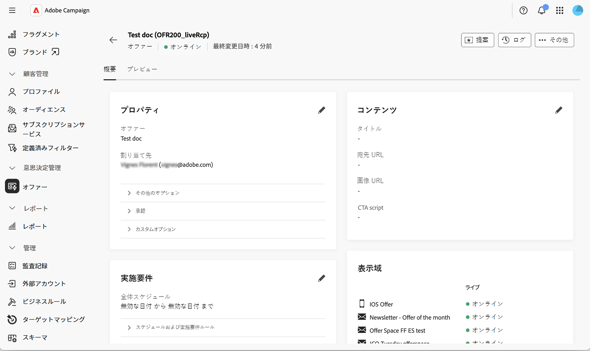

# オファーの作成と公開 {#create-offer}

**オファー**&#x200B;は、独自の実施期間、ターゲットフィルター、重み、およびコンテンツを持つ個別の提案です。 オファーは、**カテゴリー**&#x200B;を通じてオファーカタログに整理され、**オファースペース**&#x200B;を通じて受信者に表示されます。

オファーを作成する前に、オファー環境が設定されており、少なくとも1つのオファースペースが公開されていることを確認します。 詳細については、[&#x200B; オファー環境の設定](offer-environment.md)および[&#x200B; オファースペースの作成と管理](offer-space.md)を参照してください。

## オファーカタログへのアクセス {#access}

オファーを参照して作成するには、左側のナビゲーションパネルから「**[!UICONTROL オファー]**」を選択します。 リストには、既存のオファーが表示されます。 検索フィールド、フォルダーセレクター、または[&#x200B; クエリモデラー](../query/query-modeler-overview.md)を使用して、リストをフィルタリングします。

オファーカタログを示す{zoomable="yes"}

オファー名をクリックして編集用に開くか、オファーの横にある3つのドットを使用して&#x200B;**[!UICONTROL 複製]**&#x200B;または&#x200B;**[!UICONTROL 削除]**&#x200B;します。

## オファーの作成 {#create}

新しいオファーを作成するには：

1. オファーリストから、**[!UICONTROL オファーの作成]**&#x200B;をクリックします。

1. オファーを作成する&#x200B;**[!UICONTROL テンプレート]**&#x200B;を選択します（空白のオファーや匿名のオファーテンプレートなど）。

   オファー作成を示す{zoomable="yes"}

1. **[!UICONTROL ラベル]**&#x200B;を入力し、オプションで、**[!UICONTROL 割り当て先]**&#x200B;を使用してオペレーターにオファーを割り当てるか、**[!UICONTROL オファーコード]**&#x200B;を入力します。

1. **[!UICONTROL 追加オプション]**&#x200B;を展開して、自動生成された&#x200B;**[!UICONTROL 内部名]**&#x200B;を編集するか、オファーが保存されている&#x200B;**[!UICONTROL カテゴリー]**&#x200B;を選択するか、説明を追加します。 この手順はオプションです。

1. **[!UICONTROL 承認]**&#x200B;を展開して、**[!UICONTROL 適格性承認]**&#x200B;および&#x200B;**[!UICONTROL コンテンツ承認]** グループに承認者を割り当てます。 この手順はオプションです。

1. **[!UICONTROL カスタムオプション]**&#x200B;を展開して、組織がオファースキーマに追加した追加フィールドを入力します。 このセクションに表示されるフィールドは、Campaign インスタンスごとに異なります。 この手順はオプションです。

1. 「**[!UICONTROL 作成]**」をクリックします。 フル設定画面が表示されます。

   オファー設定画面を表示している{zoomable="yes"}

### 実施要件の定義 {#eligibility}

このセクションでは、オファーを表示できるタイミングと対象を制御できます。 次のオプションを使用できます。

* **[!UICONTROL スケジュール]** — オファーを提示できる開始日と終了日を設定します。

  >[!NOTE]
  >
  >親カテゴリとの適格性期間の交差は考慮されます。オファーの独自のスケジュールが広い場合でも、オファーは親カテゴリも対象となる間のみ表示されます。

* **[!UICONTROL ターゲット上のフィルター]** – 「**[!UICONTROL フィルターを作成]**」をクリックしてルールビルダーを開き、オファーを特定のオーディエンスに制限します。 環境全体のオーディエンスに対してオファーを適用するには、フィルターを空のままにします。 プラットフォームレベルで宣言された&#x200B;**定義済みフィルター**&#x200B;を再利用するには、[Campaign v8 ドキュメント &#x200B;](https://experienceleague.adobe.com/docs/campaign/campaign-v8/offers/interaction-predefined-filters.html){target="_blank"}を参照してください。 定義済みフィルターは、クライアントコンソールから作成されます。

* **[!UICONTROL オファーの重み付けの管理]** – 「**[!UICONTROL オファーの重み付けを表示]**」をクリックしてから、**[!UICONTROL 重み付けを追加]**」をクリックすると、複数のオファーが同時に実施要件を満たす場合に、オファーの優先順位に影響を与えます。 各ウェイトには、開始日、終了日、オプションのフィルターがあります。

>[!NOTE]
>
>オファーエンジンは、ウェイトを下げて適格なオファーを並べ替え、最初に最も重み付けされた提案を返します。 選択ロジック（**アービトラージ**&#x200B;と呼ばれる）では、親カテゴリと環境で設定された実施要件ルールと重みも考慮されます。 裁定原則について詳しくは、[Campaign v8 ドキュメント &#x200B;](https://experienceleague.adobe.com/docs/campaign/campaign-v8/offers/interaction-best-practices.html?lang=ja){target="_blank"}を参照してください。

### コンテンツの定義 {#content}

オファーから、「**[!UICONTROL コンテンツ]**」タブを選択します。 このタブは、レンダリング関数によって公開される値を定義します。

1. すぐに使用できる属性（**[!UICONTROL タイトル]**、**[!UICONTROL 宛先URL]**、**[!UICONTROL 画像URL]**、およびオファースキーマで宣言された任意のカスタム属性）を入力します。

1. [式エディター](../query/expression-editor.md)を使用して、プロファイルデータ、オファー属性、または提案フィールドを使用して値をパーソナライズします。

1. HTMLとテキストペイロードの場合は、**[!UICONTROL コンテンツを編集]**&#x200B;をクリックしてコンテンツエディターを開きます。 必要に応じて、サンプルテンプレートから始めて、ゼロからコンテンツをデザインしたり、独自のHTMLをコーディングしたり、既存のHTMLを読み込んだりできます。

>[!IMPORTANT]
>
>**[!UICONTROL コンテンツ]** セクションで使用できる属性は、[!DNL nms:offer] スキーマによって異なります。 カスタム属性を公開するには、スキーマを拡張し、**[!UICONTROL オファーコンテンツ]** セクションで選択します。 詳しくは、[&#x200B; スキーマの操作](../administration/schemas.md)を参照してください。

## オファーのプレビュー {#preview}

オファーを送信する前にプレビューできます。

1. オファーから、**[!UICONTROL 概要]**&#x200B;の横にある&#x200B;**[!UICONTROL プレビュー]** タブを選択します。

   オファーのプレビューを示す{zoomable="yes"}

1. ターゲットプロファイルを選択し、該当する場合は、プレビューを実行するオファースペースを指定します。

   オファースペースで定義されたレンダリング関数がオファーコンテンツに適用され、結果の表示域が表示されます。

>[!NOTE]
>
>プレビューでエラーが返されるか、コンテンツが返されない場合は、オファースペースのレンダリング機能、オファーの実施要件ルール、すべての必須コンテンツフィールドが入力されていることを確認します。

## オファーの承認とデプロイ {#approve-deploy}

オファーは、配信ですぐに利用できるわけではありません。承認とデプロイメントサイクルを経ます。

1. オファーの概要から、**[!UICONTROL 承認]**&#x200B;をクリックします。

   オファーの承認を示す{zoomable="yes"}

1. **[!UICONTROL 実施要件]**&#x200B;と&#x200B;**[!UICONTROL コンテンツ]**&#x200B;を承認します。 コンテンツはオファースペースごとに承認できるため、1つのオファースペースを承認しながら、他のオファースペースを保留中にすることができます。

1. 両方の承認が付与されたら、**[!UICONTROL デプロイ]**&#x200B;をクリックして、オファーをライブ環境に公開します。

1. オファービューを更新して、**[!UICONTROL Live]**&#x200B;表示域が最新であることを確認します。

<!--
>[!NOTE]
>
>Once deployed, the design offer's status resets to **[!UICONTROL Being edited]** — its normal draft status, not a sign that someone is actively editing it. This just means the design offer is ready to accept further changes, which would then need to go through a new approval and deployment cycle. The live representation itself remains untouched until that happens.
-->

>[!CAUTION]
>
>オファーの実施要件とコンテンツを承認することは、ふたつの異なるアクションです。 オファーは部分的に承認（コンテンツのみ）でき、適格性の承認も付与されるまで配信できません。

## オファーダッシュボードの監視 {#dashboard}

オファー&#x200B;**[!UICONTROL 概要]** タブには、**[!UICONTROL プロパティ]**、**[!UICONTROL コンテンツ]**、および&#x200B;**[!UICONTROL 実施要件]**&#x200B;のオファーステータスが要約され、それぞれに鉛筆アイコンが表示されてエディションに戻ります。 **[!UICONTROL 表示域]** カードには、オファーがリンクされているすべてのオファースペースと、現在のデザインステータスが一覧表示されます。

オファーダッシュボードを示す{zoomable="yes"}

**[!UICONTROL ログ]**&#x200B;をクリックしてデプロイメントログにアクセスするか、**・・・** （**[!UICONTROL 詳細]**）メニューから&#x200B;**[!UICONTROL オファーを複製]**&#x200B;または&#x200B;**[!UICONTROL 削除]**&#x200B;します。

オファーが公開されると、任意の設定を変更すると、デザインオファーが編集可能な状態に戻ります。 ライブ表現は、次の承認およびデプロイメントサイクルまで変更されません。

## 配信でのオファーの使用 {#use-in-delivery}

オファーがライブになると、一致するオファースペースをターゲットとする任意の配信からオファーを選択できます。 配信でオファーを設定する方法については、[&#x200B; メッセージにオファーを追加する](../msg/offers.md)を参照してください。

エンジン呼び出しの構築方法や、オファーリンクにトラッキングを適用する方法など、完全なアウトバウンドデリバリー統合については、[Campaign v8 ドキュメントのアウトバウンドデリバリーのオファー](https://experienceleague.adobe.com/docs/campaign/campaign-v8/offers/interaction-send-offers.html){target="_blank"}を参照してください。

