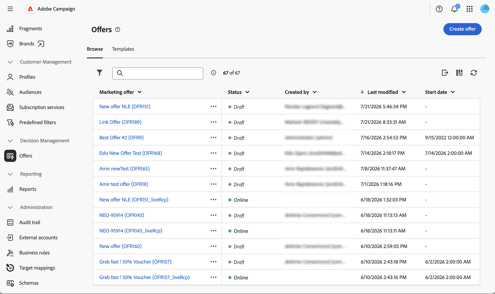

# オファー管理のまとめ {#gs-offer-management}

この機能により、パーソナライズされたオファーを配信に追加し、特定のコンテキストで各プロファイルに最も関連性の高いオファーを提供できます。 オファーは、1つまたは複数の製品に関する簡単なコミュニケーションメッセージやプロモーションです。 オファーエンジンは、適格性ルールと優先度の重みに基づいて、提示する最適な提案を選択します。

Campaign Web ユーザーインターフェイスを使用すると、オファーをエンドツーエンドで管理できます。 オファー環境の作成と設定、オファースペースの設計、オファーカタログの作成、適格性ルールの設定、オファーコンテンツの編集、オファーの公開を行うことができます。

次に、**実施要件ルール**&#x200B;および&#x200B;**優先度の重み**&#x200B;に基づいて、オファーが配信を通じて受信者に提示されるので、特定のコンテキストで各プロファイルに対して最適なオファーが選択されます。

>[!NOTE]
>
>Campaign Web ユーザーインターフェイスは、最も一般的なオファー管理用途に焦点を当てています。 高度な設定は、Campaign クライアントコンソールで引き続き使用できます。 [Campaign v8 ドキュメント &#x200B;](https://experienceleague.adobe.com/docs/campaign/campaign-v8/offers/interaction.html?lang=ja){target="_blank"}を参照してください

<!--
and check the [Campaign Web and client console capability matrix](../get-started/capability-matrix.md#offer-capabilities) for the current scope.
-->

## 主な概念 {#concepts}

オファーの操作を開始する前に、関連する主なオブジェクトについて理解しておきます。

* **オファー環境** — オファーカタログと関連するオファースペースを保持するコンテナ。 オファーを作成および設定する&#x200B;**Design**&#x200B;環境と、配信に使用できる承認済みおよびデプロイ済みのオブジェクトを含む読み取り専用の&#x200B;**[!UICONTROL Live]**&#x200B;環境の2種類があります。 [詳細情報](offer-environment.md)

* **オファースペース** — オファーの公開場所と公開方法（電子メール、ダイレクトメール、SMS、インバウンド webなど）を定義します。 このスペースには、オファーで使用できるコンテンツフィールド、オファー表示域を構築するレンダリング関数、提案ステータスを駆動するストレージ設定が一覧表示されます。 [詳細情報](offer-space.md)

* **オファーカタログとカテゴリ** — オファーは、**カテゴリ**&#x200B;とサブカテゴリの階層カタログに整理されます。 各カテゴリは、実施要件ルール、有効期限、**アプリケーションのテーマ**&#x200B;を共有できます。 すべてのオファーを受け取るには、デフォルトのカテゴリがデザイン環境に用意されています。

<!--
To configure categories in depth — including sub-categories, fallback categories, and theme management — refer to the [Campaign v8 (client console) documentation](https://experienceleague.adobe.com/docs/campaign/campaign-v8/offers/interaction-catalog/interaction-offer-catalog.html){target="_blank"}.
-->

* **オファー** – 独自の実施期間、ターゲットフィルター、重み付け、コンテンツを含む個別オファー。 オファーは、受信者に提示される前に承認され、デプロイされます。 [詳細情報](create-offer.md)

* **オファーの提案** – 特定のスペース（web サイト、電子メール、SMSなどのバナー）で連絡先にオファーを提示した結果。 配信ごとの提案の数は、[配信でオファーを設定する](../msg/offers.md)際に設定されます。

* **アービトラージ** — オファーエンジンが、どのオファーを提示するかを選択するために、優先度によって実施要件のあるオファーをランク付けする原則。 アービトラージでは、カテゴリ、オファーおよびコンテキストオファーで定義された条件を使用します。

## オファー管理フロー {#workflow}

Campaign Web UIの一般的なエンドツーエンドのフローは次のとおりです。

1. **オファー環境設定を確認** — デザイン/ライブマッピング、実施要件、および重み管理設定を確認します。 [詳細情報](offer-environment.md)

1. **オファースペースを作成** — コンテンツフィールド、レンダリング関数、およびチャネルに一致する高度なパラメーターを定義します。 [詳細情報](offer-space.md)

1. **カタログ内のオファーを作成** – 各オファーの実施期間、ターゲットフィルター、重み、コンテンツを設定します。 [詳細情報](create-offer.md)

1. **承認してデプロイ** – 承認のためにオファーを送信し、そのコンテンツと適格性を承認してから、デプロイメントプロセスでライブ環境に公開します。 [詳細情報](create-offer.md#approve-deploy)

1. **配信にオファーを追加** – 電子メール、SMS、プッシュまたはダイレクトメールの配信で、オファースペースと提案を参照します。 [詳細情報](../msg/offers.md)

## Web UIでのオファーへのアクセス {#access}

オファーは、左側の&#x200B;**[!UICONTROL オファー]** メニューから利用できます。 そこから、カタログを参照し、編集用のオファーを開き、承認とデプロイメントのステータスを監視できます。

オファーメニューを示す{zoomable="yes"}

オファー環境とオファースペースには、対応するフォルダーに移動して、**[!UICONTROL Explorer]**&#x200B;からアクセスできます。

## コンソールのみの補完機能 {#console-complements}

一部のオファー機能は、Web ユーザーインターフェイスにまだ公開されていないため、引き続きクライアントコンソールから設定する必要があります。

* **Offer simulation** — オファーの配布を送信前にテストできる&#x200B;**Simulation** モジュール。 [&#x200B; オファーのシミュレーション &#x200B;](https://experienceleague.adobe.com/docs/campaign/campaign-v8/offers/interaction-offer.html?lang=ja#offer-simulation){target="_blank"}を参照してください。

* **定義済みフィルター**&#x200B;管理 – 任意のオファーから参照できる再利用可能なフィルタールール。 [定義済みフィルターの管理](https://experienceleague.adobe.com/docs/campaign/campaign-v8/offers/interaction-predefined-filters.html){target="_blank"}を参照してください。

* **オファートラッキング** – 提案の履歴をフィードするためのオファー提案のトラッキングの設定。 [&#x200B; オファー提案の追跡](https://experienceleague.adobe.com/docs/campaign/campaign-v8/offers/interaction-tracking.html?lang=ja){target="_blank"}を参照してください。

* **オペレーターの役割** — オファーマネージャー/配信マネージャーの権限の割り当て。 インタラクションモジュール [&#128279;](https://experienceleague.adobe.com/docs/campaign/campaign-v8/offers/interaction-operators.html){target="_blank"}の オペレーターを参照してください。

* **操作のベストプラクティスと裁定規則**。 [&#x200B; キャンペーンインタラクションのベストプラクティス &#x200B;](https://experienceleague.adobe.com/docs/campaign/campaign-v8/offers/interaction-best-practices.html?lang=ja){target="_blank"}を参照してください。

* **レポート** – 専用のオファーおよび提案レポートは、Web ユーザーインターフェイスではまだ使用できません。