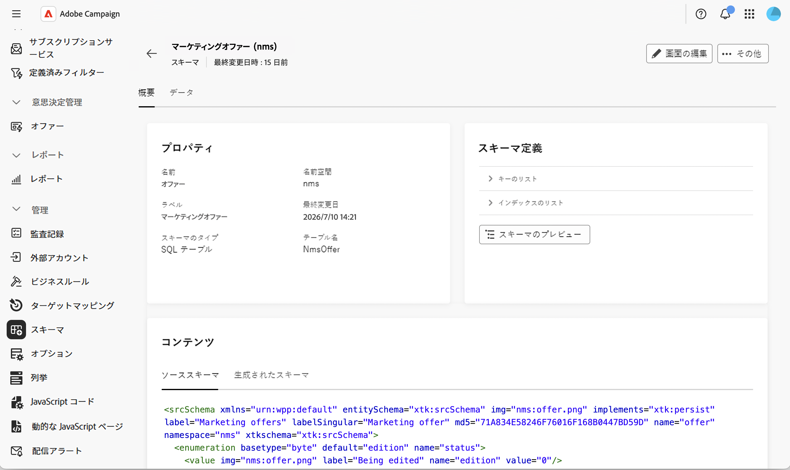
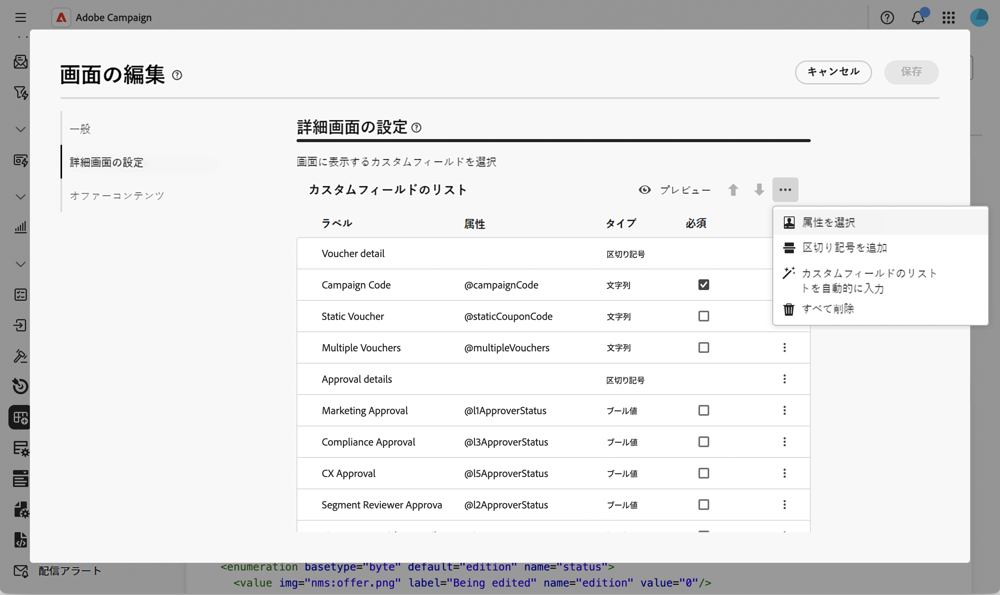
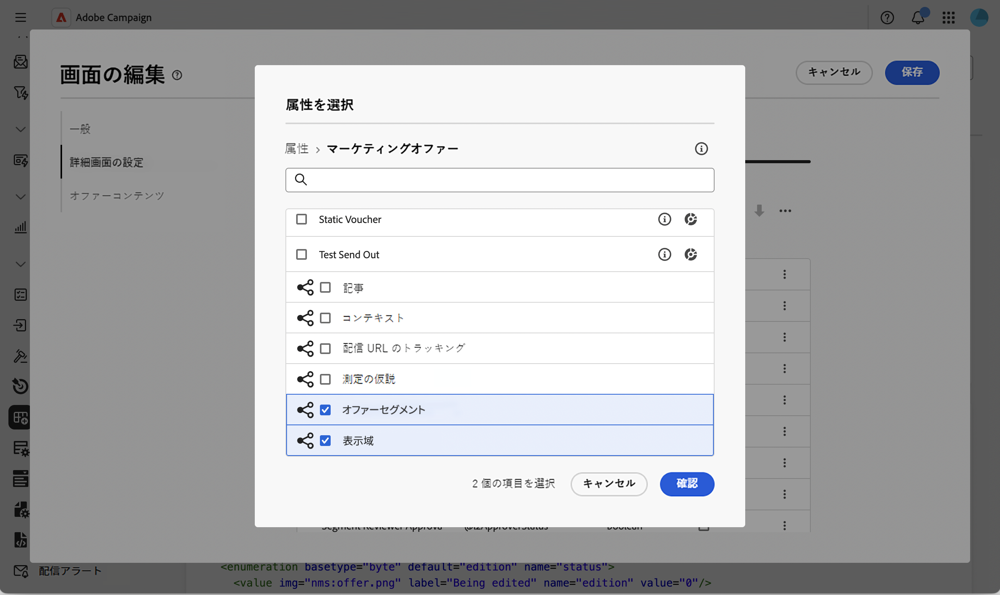
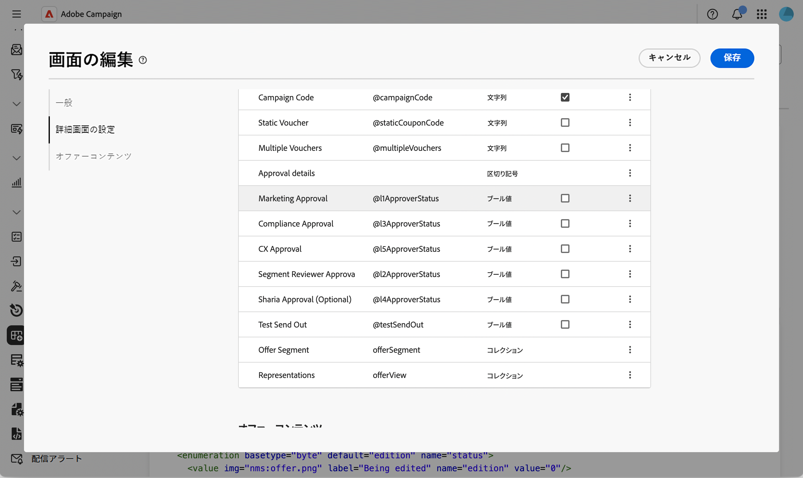
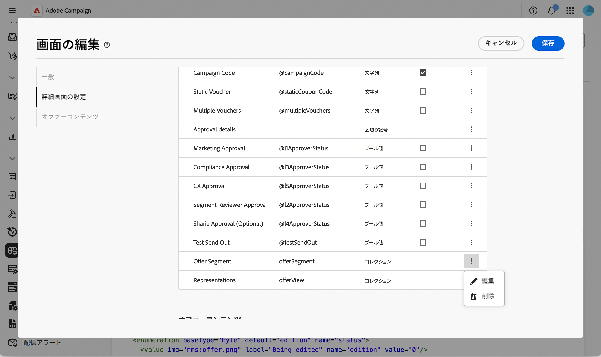
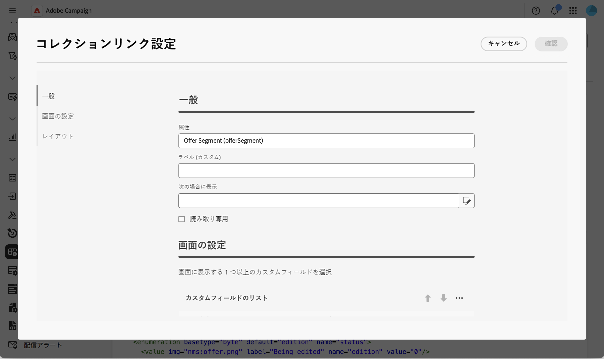
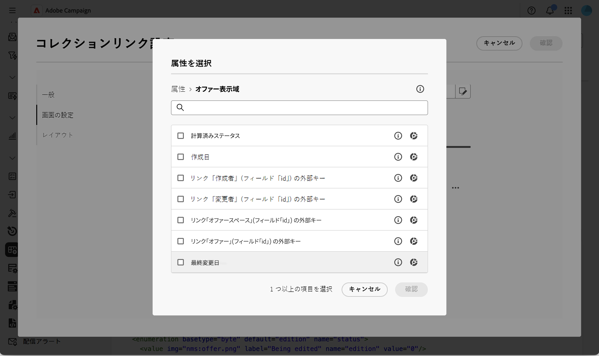
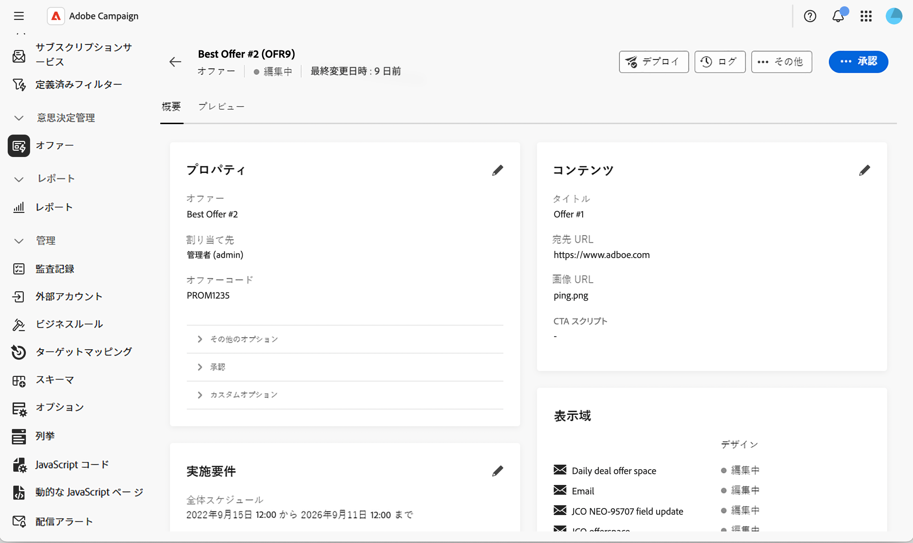
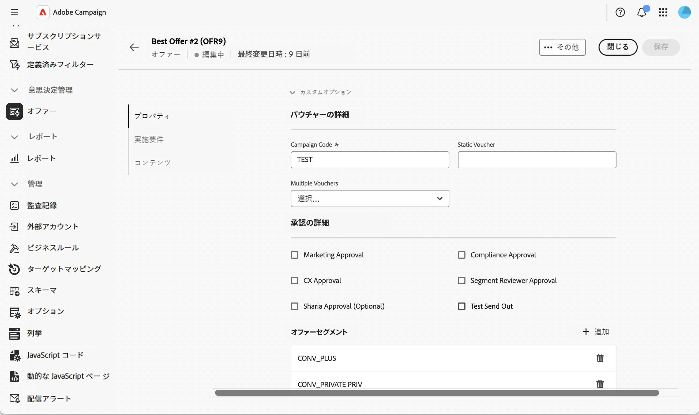

# オファースキーマへの編集可能リストの追加 {#offer-editable-list}

オファーにリンクされた一連のセグメントなど、カスタム収集リンクを使用して[ スキーマ ](../administration/schemas.md)を拡張すると、オファーの&#x200B;**[!UICONTROL カスタムオプション]** セクションで編集可能なリストとして直接公開できます。  [!DNL nms:offer] 別の画面で関連レコードを管理する代わりに、コレクションはオファーの詳細でリストとしてレンダリングされ、専用のダイアログを使用してインラインで新しい関連レコードを作成できます。

>[!NOTE]
>
>この機能は現在、オファースキーマでのみ使用できます。

## コレクションリンクフィールドの追加 {#add-field}

1. カスタムコレクションを使用して[!DNL nms:offer] スキーマを拡張し、**[!UICONTROL スキーマ]** メニューを参照し、**[!UICONTROL マーケティングオファー]** スキーマを開いて、**[!UICONTROL スクリーンエディション]**&#x200B;をクリックします。 [詳細情報](../administration/schemas-browse-access.md#screen-def)。

   {zoomable="yes"}

1. **[!UICONTROL 詳細画面の設定]** セクションで、**[!UICONTROL カスタムフィールドのリスト]** テーブルの上にある省略記号アイコンをクリックし、**[!UICONTROL 属性の選択]**&#x200B;を選択します。 [詳細情報](../administration/schemas-custom-fields.md)。

   {zoomable="yes"}

1. 属性を参照し、コレクションアイコンで識別されるカスタムコレクションリンクを選択します。

   コレクション リンク属性を持つ属性ピッカーを示す{zoomable="yes"}

   >[!NOTE]
   >
   >コレクションリンクフィールドは必須にできず、サブ属性をサポートしていません。 デフォルトでは、フォームの2つの列にまたがっています。

1. 選択を確認します。 コレクションリンクが&#x200B;**[!UICONTROL カスタムフィールドのリスト]** テーブルに追加され、そのタイプは&#x200B;**[!UICONTROL コレクション]**&#x200B;です。

   追加された属性を示す{zoomable="yes"}

## コレクションの編集可能リストを設定する {#configure-list}

1. コレクションフィールドの行の省略記号アイコンをクリックし、**[!UICONTROL 編集]**&#x200B;を選択して、**[!UICONTROL コレクションリンク設定]** ダイアログを開きます。

   {zoomable="yes"}

1. 「**[!UICONTROL 一般]**」タブで、オプションで「**[!UICONTROL 表示可能な場合]**」条件を設定するか、**[!UICONTROL 読み取り専用]**」を有効にします。

   編集画面を表示する{zoomable="yes"}

1. **[!UICONTROL 画面設定]** タブで、**[!UICONTROL 属性を選択]**&#x200B;をクリックし、新しい要素（セグメント名やカスタムフィールドなど）をリストに追加する際に使用する属性を選択します。

   コレクション リンク設定ダイアログの画面設定タブを表示している{zoomable="yes"}

1. 「**[!UICONTROL レイアウト]**」タブで、**[!UICONTROL 2列にまたがる]**&#x200B;を保持またはクリアします。

1. 「**[!UICONTROL 確認]**」をクリックしてから、画面定義を&#x200B;**[!UICONTROL 保存]**&#x200B;します。

## オファーで編集可能リストを使用する {#use-list}

1. 左側のメニューから、**オファー**&#x200B;をクリックし、オファーを開きます。 [詳細情報](create-offer.md#create)

   オファー画面を示す{zoomable="yes"}

1. オファープロパティにアクセスします。 コレクションは、**カスタムオプション** セクションのリストとしてレンダリングされます。

   {zoomable="yes"}

1. **[!UICONTROL 追加]**&#x200B;をクリックして、設定した属性を表示し、入力して、**[!UICONTROL 確認]**&#x200B;をクリックします。 新しい要素がリストに追加されます。

   同じリストに複数の要素を追加することができ、オファーの詳細には複数の編集可能リストを含めることができます。

1. 「**[!UICONTROL 保存]**」をクリックします。

<!--
Each element added through the editable list creates a new related record. For instance, adding a segment to an offer generates the following payload:

```xml
<offer ...>
  <offerSegment segmentName="..." _operation="insert"/>
</offer>
```
-->