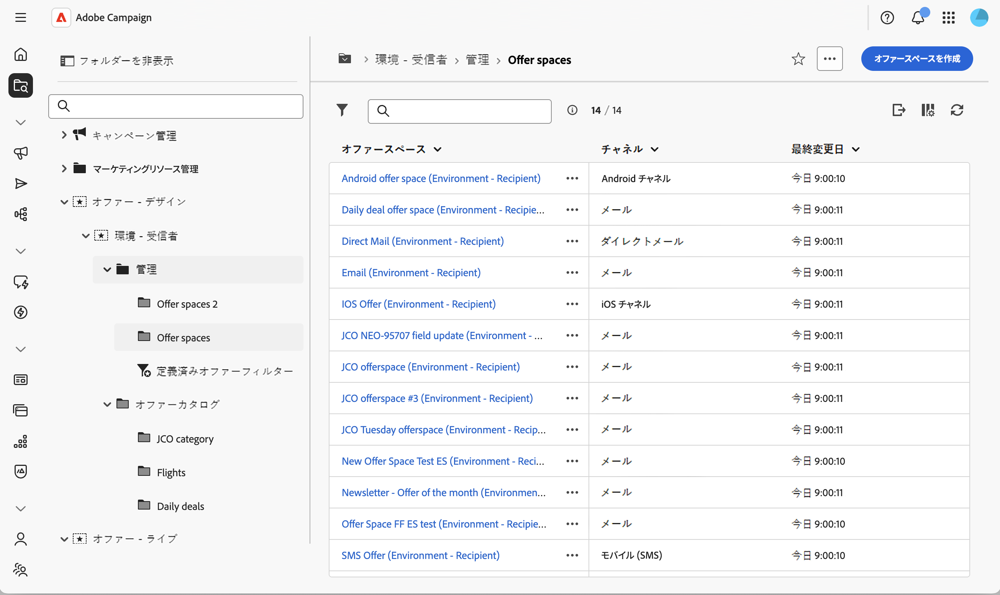
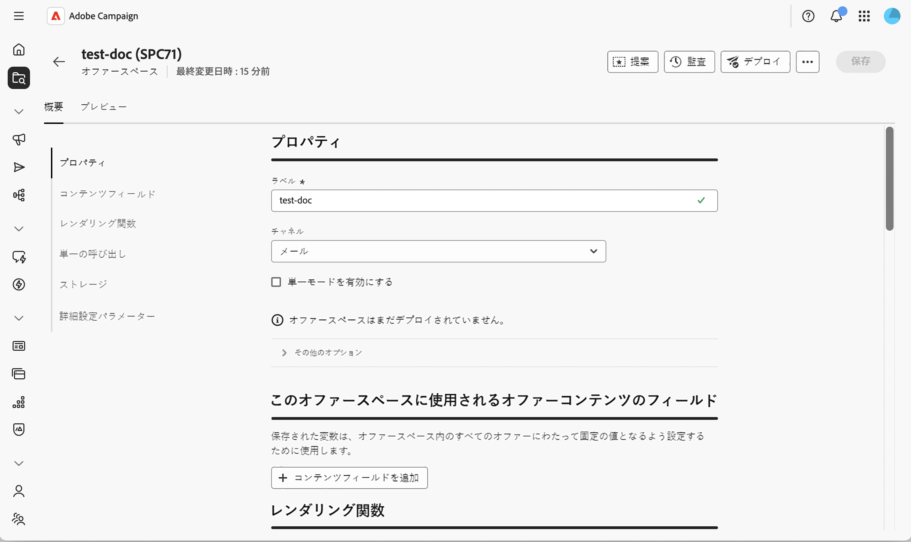
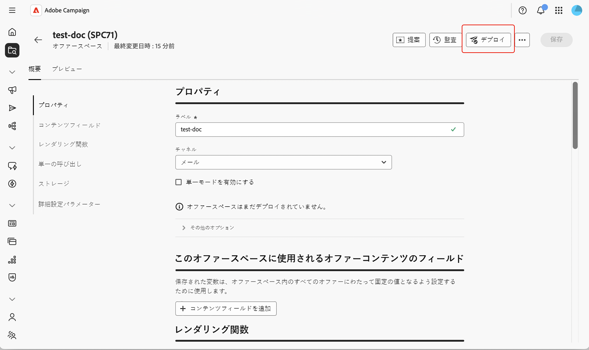
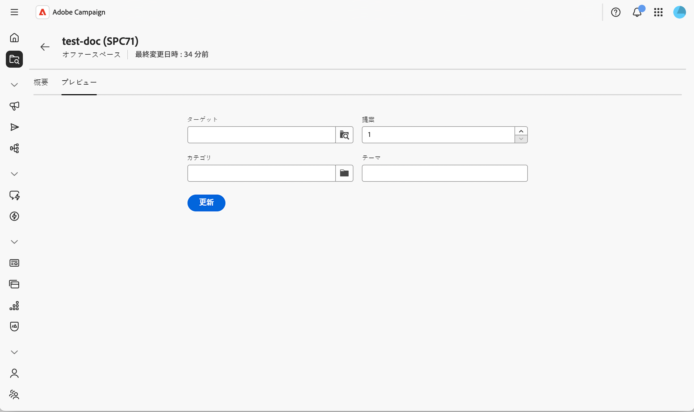

# オファースペースの作成と管理 {#offer-space}

**オファースペース**&#x200B;は、使用するチャネル（電子メール、ダイレクトメール、SMS、インバウンド webなど）、オファーが使用できるコンテンツフィールド、最終表現の構築方法など、オファーが連絡先に公開される場所と方法を定義します。 1つの環境に複数のオファースペースを含めることができます。各エクスポジションポイントに1つずつ含めることができます。

オファースペースは、それ自体がチャネルではありません。 オファーがチャネル上に表示される特定の場所を表します。 同じweb ページ上の2つのバナーは、通常、2つの異なるオファースペースに対応します。 完全な概念モデルについては、[Campaign v8 ドキュメント ](https://experienceleague.adobe.com/docs/campaign/campaign-v8/offers/interaction-offer-spaces.html){target="_blank"}を参照してください。

## オファースペースの作成または変更{#create-offer-space}

オファースペースは、オファー環境フォルダーに保存されます。 プラットフォームで使用可能なオファースペースを参照するには、**[!UICONTROL Explorer]**&#x200B;を開き、オファー環境に移動して、それらを含むサブフォルダーを選択します。

オファー空間リストを示す{zoomable="yes"}

そこから、「**[!UICONTROL オファースペースを作成]**」をクリックして、既存のオファースペースを開くか、新しいオファースペースを作成できます。

オファースペース画面を示す{zoomable="yes"}

### プロパティの定義 {#properties}

このセクションでは、次のことができます。

* オファースペースの&#x200B;**[!UICONTROL Label]**&#x200B;を入力します。
* 公開ポイント（電子メール、ダイレクトメール、SMS、webなど）に一致する&#x200B;**[!UICONTROL チャネル]**&#x200B;を選択します。
* このオファースペースで、一括配信呼び出しに加えて、オファーエンジンへの単一（リアルタイム、シングルオファー）呼び出しもサポートする必要がある場合は、**[!UICONTROL 単一モードを有効にする]**&#x200B;を選択します。

### コンテンツフィールドを定義します {#content-fields}

コンテンツフィールドには、オファーレベルで編集でき、レンダリング関数で再利用できる属性が一覧表示されます。 オファースペースにフィールドを追加する順序は、オファー&#x200B;**[!UICONTROL コンテンツ]** セクションでフィールドが公開される順序を決定します。

デフォルトでは、すべてのオファーには、次のすぐに利用できるコンテンツフィールドが用意されています。**[!UICONTROL タイトル]**、**[!UICONTROL 宛先URL]**、**[!UICONTROL 画像URL]**、**[!UICONTROL HTML コンテンツ]**、および&#x200B;**[!UICONTROL テキストコンテンツ]**。 このリストは、レンダリングに必要な任意のカスタムフィールド（例：**ショートコンテンツ**、**トラッキングされたURL**、スキーマ拡張機能を介して追加された任意の属性）で拡張できます。

「**[!UICONTROL コンテンツフィールドを追加]**」をクリックし、オファースキーマから公開する属性を選択するか、「**[!UICONTROL 式を編集]**」をクリックして、代わりにカスタム式を定義します。

>[!IMPORTANT]
>
>オファー&#x200B;**[!UICONTROL コンテンツ]** セクションからカスタム属性を編集可能にするには、[!DNL nms:offer] スキーマの&#x200B;**[!UICONTROL オファーコンテンツ]** セクションでも属性を宣言する必要があります。 詳しくは、[ スキーマの操作](../administration/schemas.md)を参照してください。

### レンダリング関数の設定 {#rendering}

レンダリング関数は、コンテンツフィールドから最終的なオファー表現を作成します。 デフォルトのレンダリング（コンテンツをそのまま出力）か、フィールドをHTML、XML、テキストと組み合わせるカスタム関数のいずれかを選択できます。

「**[!UICONTROL HTML レンダリング]**、**[!UICONTROL XML レンダリング]**、または&#x200B;**[!UICONTROL テキストレンダリング]**」タブを選択し、**[!UICONTROL レンダリング関数]**&#x200B;をオーバーロードしてアクティブにします。

式エディターを使用して、レンダリング関数を記述します。 スペースで定義されたコンテンツフィールド、オファー属性、および[式エディター](../query/expression-editor.md)の任意の関数を参照できます。

>[!NOTE]
>
>レンダリング関数が定義されていない場合、オファーのコンテンツは、標準属性を使用して、と同じように返されます。 XML レンダリング関数は、オファースペースで&#x200B;**[!UICONTROL 単一モードを有効にする]**&#x200B;が選択されている場合にのみ使用できます。

### ストレージと提案のステータスの設定 {#storage}

このセクションでは、このスペースを通じて生成された提案の永続化方法と、ライフサイクル全体を通じてそのステータスがどのように変化するかを制御できます。

* **[!UICONTROL 提案の挿入を無効にする]** – このオファースペースを通じて生成された提案が提案ストレージテーブルに挿入されるのを防ぎます。

* 提案の&#x200B;**[!UICONTROL ステータス]** — オファーエンジンが提案を返す瞬間に提案に適用されるステータス（通常、アウトバウンド配信の場合は&#x200B;**[!UICONTROL Presented]**）。

* **[!UICONTROL 承認時のステータス]** – 受信者がオファーを操作したときに適用されるステータス（通常は&#x200B;**[!UICONTROL Accepted]**）。

使用可能なステータス値は、クライアントコンソールで使用されるリストと一致します。 詳しくは、コンソールドキュメントの[Campaign v8 ドキュメント ](https://experienceleague.adobe.com/docs/campaign/campaign-v8/offers/interaction-offer-spaces.html#offer-proposition-statuses){target="_blank"}を参照してください。

<!--
>[!NOTE]
>
>Status updates run asynchronously through the tracking workflow. For an outbound delivery containing a tracked link, the status of the proposition is automatically switched to **[!UICONTROL Presented]** when the delivery reaches the **[!UICONTROL Sent]** state. To trigger the **[!UICONTROL Interested]** status from a click, add the `_urlType="11"` attribute to the link. The full **inbound interaction** URL syntax (for example to apply the **[!UICONTROL Rejected]** status from a web app) must be configured in the client console — see [Inbound interaction status update](https://experienceleague.adobe.com/docs/campaign/campaign-v8/offers/interaction-offer-spaces.html#configuring-the-status-when-the-proposition-is-accepted){target="_blank"}.
-->

### 詳細設定 {#advanced}

このセクションでは、**[!UICONTROL ターゲット ID]**&#x200B;を定義できます。 「**[!UICONTROL 追加]**」をクリックし、1つまたは複数の&#x200B;**[!UICONTROL 受信者]**&#x200B;属性を選択するか、「**[!UICONTROL 式を編集]**」をクリックして、代わりにカスタム式を定義します。 この設定は、基本的なオファースペースの場合はオプションです。 完全な参照と動作については、[Campaign v8 ドキュメント ](https://experienceleague.adobe.com/docs/campaign/campaign-v8/offers/interaction-offer-spaces.html){target="_blank"}を参照してください。

**インバウンド web チャネル**&#x200B;で作成されたオファースペースでは、オファーを表示し、オファーエンジンを呼び出すようにweb サイトを設定する必要もあります。 この統合はクライアントコンソールで実行されます。Campaign v8 ドキュメントの「[ リアルタイムでオファーを表示](https://experienceleague.adobe.com/docs/campaign/campaign-v8/offers/interaction-present-offers.html){target="_blank"}」および「[ オファーエンジン統合を設定](https://experienceleague.adobe.com/docs/campaign/campaign-v8/offers/interaction-integration.html){target="_blank"}」を参照してください。

## オファースペースのデプロイ {#deploy}

配信でオファースペースを使用する前に、オファースペースをデプロイする必要があります。 オファースペースを保存し、**デプロイ**&#x200B;をクリックします。 デプロイメントのステータスは、オファースペースに反映されます。

オファーのデプロイを示す{zoomable="yes"}

## オファースペースのプレビュー {#preview}

プレビューでは、特定のターゲットに対するオファーの選択とレンダリング方法をシミュレートできます。

1. オファースペースから、**[!UICONTROL 概要]**&#x200B;の横にある「**[!UICONTROL プレビュー]**」タブを選択します。

   オファーのプレビューを示す{zoomable="yes"}

1. ターゲットプロファイルを選択し、プレビューを実行します。 一致するオファーは、レンダリング関数によって生成された表現で返されます。

>[!NOTE]
>
>提案が返されない場合は、オファーの実施要件ルールとスペースの設定を確認します。

次に、[ カタログでオファー](create-offer.md)を作成し、このスペースに割り当てます。
