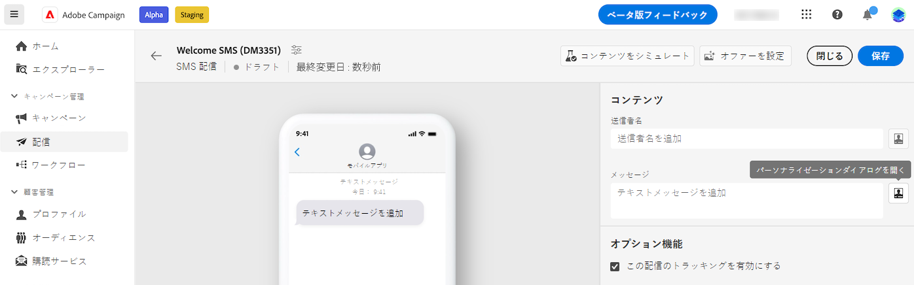

# 条件付きコンテンツの作成{#add-conditions}

>[!CONTEXTUALHELP]
>id="acw_homepage_card3"
>title="条件付きコンテンツの作成"
>abstract="条件付きコンテンツを作成して、受信者のプロファイルに基づいて動的パーソナライゼーションを定義し、特定の条件が満たされた場合にテキストブロックや画像を自動的に置き換えます。 この機能を使用すると、キャンペーンを新たな高みに導き、ターゲットを絞り、パーソナライズされたエクスペリエンスをオーディエンスに提供できます。"


条件付きコンテンツは、受信者のプロファイルに基づいて動的パーソナライゼーションを作成し、特定の条件が満たされた場合にテキストブロックや画像を自動的に置き換える強力な機能です。 この機能を使用すると、キャンペーンを新たな高みに導き、ターゲットを絞り、パーソナライズされたエクスペリエンスをオーディエンスに提供できます。

条件付きコンテンツフィールドを設定すると、例えば受信者のプロファイルに基づいて高度な動的パーソナライゼーションを作成できます。 特定の条件が満たされた場合、メッセージコンテンツ内のテキストブロック、リンク、件名、画像が置き換えられます。 例えば、Adobe Campaignデータベースの「性別」フィールドの値に応じて「Mr」または「Mrs」を表示したり、受信者の優先言語に基づいて異なるリンクを含めたりできます。

## パーソナライゼーション構文{#perso-syntax}


## パーソナライゼーションエディターでの条件の操作{#condition-perso-editor}

配信の条件付きコンテンツを定義するには：

1. 配信を開き、コンテンツを編集します。
1. 次をクリック： **[!UICONTROL パーソナライゼーションダイアログを開く]** アイコン（SMS の場合は「メッセージ」フィールドの右側）

   

1. パーソナライゼーションエディターで、を参照します。 **[!UICONTROL ヘルパー関数]**.
1. 横の「+」アイコンをクリックします。 **If** 関数に置き換えます。 中央の画面に次の行が追加されます。
   `<% if (<FIELD>==<VALUE>) { %>Insert content here<% } %>`
1. 置換 `<FIELD>` パーソナライゼーションフィールド別。 例えば、受信者の会社の場合、 `recipient.company`.
1. 置換 `<VALUE>` を満たす値で指定します。 例： `ADOBE`.


## サンプル：条件付き SMS 件名行{#condition-subject-line}

SMS メッセージの条件付き件名行を作成するには、次の手順に従います。

1. 配信を開き、コンテンツを編集します。
1. 件名行の右側にある「パーソナライゼーションダイアログを開く」アイコンをクリックします。
1. パーソナライゼーションエディターで、を参照します。


```sql
<% if 
(recipient.email == 'recipient@domain.com' ) 
{ % >
<table>
    <tr>
        <td>variant A</td>
    </tr>
</table>
< % } 
else 
{ % >
<table>
    <tr>
        <td>variant B< td>
    </tr>
</table>
< % } 
%>
```
