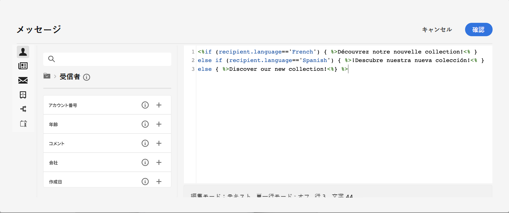

# 条件付きコンテンツの作成{#add-conditions}

>[!CONTEXTUALHELP]
>id="acw_homepage_card3"
>title="条件付きコンテンツの作成"
>abstract="条件付きコンテンツを作成して、受信者のプロファイルに基づいて動的パーソナライゼーションを定義し、特定の条件が満たされた場合にテキストブロックや画像を自動的に置き換えます。 この機能を使用すると、キャンペーンを新たな高みに導き、ターゲットを絞り、パーソナライズされたエクスペリエンスをオーディエンスに提供できます。"

条件付きコンテンツは、受信者のプロファイルに基づいて動的パーソナライゼーションを作成し、特定の条件が満たされた場合にテキストブロックや画像を自動的に置き換える強力な機能です。 この機能を使用すると、キャンペーンを新たな高みに導き、ターゲットを絞り、パーソナライズされたエクスペリエンスをオーディエンスに提供できます。

条件付きコンテンツフィールドを設定すると、例えば受信者のプロファイルに基づいて高度な動的パーソナライゼーションを作成できます。 特定の条件が満たされた場合、メッセージコンテンツ内のテキストブロック、リンク、件名、画像が置き換えられます。 例えば、Adobe Campaignデータベースの「性別」フィールドの値に応じて「Mr」または「Mrs」を表示したり、受信者の優先言語に基づいて異なるリンクを含めたりできます。

## 条件付きコンテンツの作成方法

条件付きコンテンツを作成するには、式エディターで特定のヘルパー関数を使用して条件を作成する必要があります。 この方法は、すべての配信チャネルに対して、件名行フィールド、E メールリンク、テキスト/ボタンコンテンツコンポーネントなど、式エディターにアクセスできる任意のフィールドで使用できます。 [動的コンテンツの追加場所を説明します](gs-personalization.md/#access)

式エディターに加えて、専用の条件付きコンテンツビルダーを利用して、プロファイル属性を使用して条件を作成できる E メールをデザインできます。

## 式エディターでの条件の作成 {#condition-perso-editor}

配信の条件付きコンテンツを定義するには、次の手順に従います。 この例では、受信者の言語（フランス語または英語）に基づく条件付きコンテンツを作成します。

1. 配信を開き、コンテンツを編集します。

1. 条件付きコンテンツを追加するフィールドを見つけ、 **[!UICONTROL パーソナライゼーションダイアログを開く]** アイコンをクリックして式エディターを開きます。 この例では、SMS メッセージに条件付きコンテンツを追加します。

   

1. パーソナライゼーションエディターで、 **[!UICONTROL ヘルパー関数]** 左メニュー

1. 横の「+」アイコンをクリックします。 **If** 関数を使用して、条件を開始します。 中央の画面に次の行が追加されます。
   `<% if (<FIELD>==<VALUE>) { %>Insert content here<% } %>`

   * 置換 `<FIELD>` パーソナライゼーションフィールド別。 受信者の言語の例： `recipient.language`.
   * 置換 `<VALUE>` を満たす値で指定します。 例： `'French'`.
   * 置換 `Ìnsert content here` 上記の条件を満たすプロファイルに表示するコンテンツを基準とします。

     

1. 受信者が条件を満たさない場合に表示するコンテンツを指定します。 手順は次のとおりです。

   1. を追加します。 **else** ヘルパー関数：式の終了タグの前にカーソルを置きます。 `%>` をクリックし、 `+` の横 **Else** 関数に置き換えます。

      >[!NOTE]
      >
      >ヘルパー関数が追加されるたびに、`<%`) および終了 (`%>`) タグは、関数の前後に自動的に追加されます。 式内に「Else」ヘルパー関数を追加した後の例を次に示します。
      >
      >`<% if (<FIELD>==<VALUE>) { %>Insert content here<% } <% else { %> Insert content here<% } %>%>`
      >
      >構文エラーを避けるために、これらのタグを必ず削除してください。 この例では、 **Else** 関数タグは次のとおりです。
      >
      >`<% if (<FIELD>==<VALUE>) { %>Insert content here<% } else { %> Insert content here<% } %>`

   1. 置換 `Ìnsert content here` 条件を満たさないプロファイルに表示するコンテンツを基準にします。

      

   また、 **else if** 複数のコンテンツバリアントを使用して条件を作成するヘルパー関数。 例えば、以下の式は、受信者の言語に応じて、メッセージの 3 つのバリエーションを表示します。

   

1. 条件の準備が整ったら、コンテンツを保存し、コンテンツをシミュレートしてそのレンダリングを確認できます。

## メールでの条件付きコンテンツの作成  {#condition-condition-builder}

条件付きコンテンツを E メールで作成するには、次の 2 つの方法があります。
* 式エディターで、ヘルパー関数を使用して条件を作成すると、
* E メールのデザイン時にアクセス可能な、専用の条件付きコンテンツビルダー。

式エディターを使用した条件の作成方法に関する詳細情報を利用できます [ここ](#condition-perso-editor).

以下の節では、E メールデザイナーの条件付きコンテンツビルダーを使用して条件を作成する手順を説明します。 この例では、受信者の言語に応じて複数のバリアントを持つ E メールメッセージを作成します。 これを行うには、次の手順に従います。

1. E メール配信を作成または開き、コンテンツを編集して、 **[!UICONTROL メール本文を編集]** ボタンをクリックして、e メールデザインワークスペースを開きます。

1. コンテンツコンポーネントを選択し、 **[!UICONTROL 条件付きコンテンツを有効にする]**.

   

1. この **[!UICONTROL 条件付きコンテンツ]** 画面の左側にパネルが開きます。 このペインでは、条件を使用して、選択したコンテンツコンポーネントの複数のバリエーションを作成できます。

1. 最初のバリアントを設定します。 これをおこなうには、 **[!UICONTROL バリアント — 1]** 内 **[!UICONTROL 条件付きコンテンツ]** ウィンドウを開き、 **[!UICONTROL 条件を追加]** アイコン

1. ルールビルダーが表示されます。 プロファイル属性を使用して、メッセージの最初のバリアントの条件を作成し、 **[!UICONTROL 確認]**. この例では、言語が「フランス語」の受信者をターゲットにしたルールを作成します。

   

1. ルールがバリアントに関連付けられました。 可読性を高めるために、楕円メニューをクリックしてバリアントの名前を変更することをお勧めします。

   次に、メッセージの送信時にルールが満たされた場合のコンポーネントの表示方法を設定します。 この例では、受信者の優先言語の場合はフランス語でテキストを表示します。

   

1. コンテンツコンポーネントに必要な数だけバリアントを追加します。 様々なバリエーションをいつでも切り替えて、条件付きルールに応じてコンテンツコンポーネントの表示方法を確認できます。

   >[!NOTE]
   >メッセージの送信時にバリエーションで定義されたルールがいずれも満たされない場合、コンテンツコンポーネントは、 **[!UICONTROL デフォルトのバリアント]** から **[!UICONTROL 条件付きコンテンツ]** ウィンドウ
